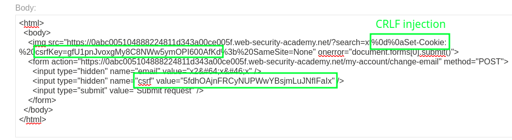

# Lab: CSRF Token Tied to Non-session Cookie

Some applications may validate CSRF values independently of session state.

Consider an application that uses `csrfKey:csrf` pairs and sets the `csrfKey` via a header like this:

```http
Set-Cookie: csrfKey=Tri2m7v3MTeOmkpVJyQBKFOqe3m4lAwT; Secure; HttpOnly; SameSite=None
```

If the server validates POST actions using the CSRF key:value pair independently of the session cookie, an attacker can use _any_ valid `csrfKey`:`csrf` pair, bypassing the protection. However, this is assuming the attacker is also able to set the `csrfKey` cookie on the target. The following exploit uses a CRLF header injection vulnerability to set an attacker-controlled value for `csrfKey`, allowing its matching `csrf` value to work on the victim.



Note that `SameSite=None` is required for the cookie to be properly sent via the POST request, as modern browsers default to `SameSite=Lax` which breaks the request. However, in some circumstances the [SameSite=Lax restriction can be bypassed](lab-samesite-lax-bypass-20250603.md).

Reference: <https://portswigger.net/web-security/csrf/bypassing-token-validation/lab-token-tied-to-non-session-cookie>