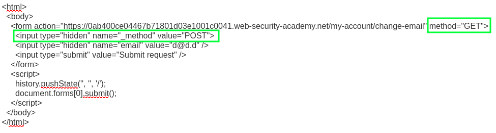

# Lab: `SameSite=Lax` Bypass via Method Override

Modern browsers default to `SameSite=Lax` for cookies, making some [CSRF exploits](lab-csrf-token-tied-to-non-session-cookie-20250603.md) more difficult.

This exploit uses request-method confusion to allow the cookie to be sent via GET while still appearing as a POST request to the handler:

o

This is dependent on the target framework allowing the request-type override inside of the form.

Reference: <https://portswigger.net/web-security/csrf/bypassing-samesite-restrictions/lab-samesite-lax-bypass-via-method-override>