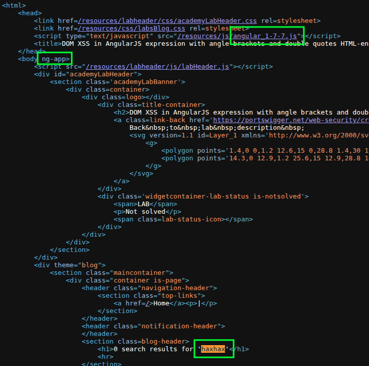
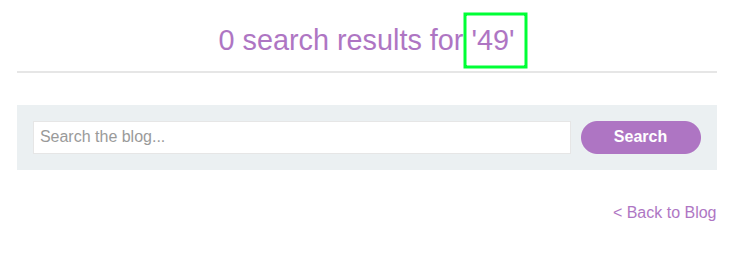

# [DOM XSS: AngularJS Expression with Angle Brackets and Double Quotes HTML-encoded](https://portswigger.net/web-security/cross-site-scripting/dom-based/lab-angularjs-expression)

Testing `/?search=haxhax`:

It's a vulnerable version of Angular, the body uses the `ng-app` attribute, and I have an injection point. I can verify this works with: `/?search={{7*7}}`:

Unfortunately I can't just pass `alert()` or `print()` because it runs inside of a restricted sandbox.

However, I _can_ access function constructors to craft a payload that executes inside the sandbox:

`/?search={{$new.constructor('alert()')()}}`

Credit: [Jarno Timmermans](https://youtu.be/P7_JPsX1ses)