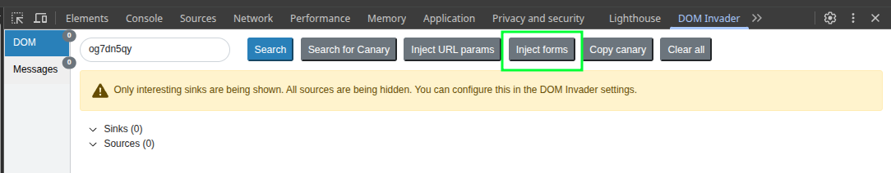
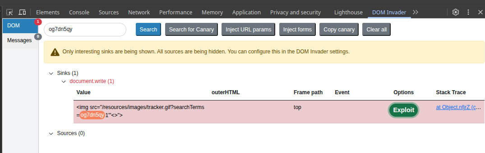

# [DOM XSS: `document.write` Sink Using Source `location.search`](https://portswigger.net/web-security/cross-site-scripting/dom-based/lab-document-write-sink)

Vulnerable snippet:

```html
<script>
  function trackSearch(query) {
    document.write('');
  }
  var query = (new URLSearchParams(window.location.search)).get('search');
  if(query) {
    trackSearch(query);
  }
</script>
```

[DOM Invader](https://portswigger.net/burp/documentation/desktop/tools/dom-invader) solves this one in a few seconds:





Clicking "Exploit" solves the lab.