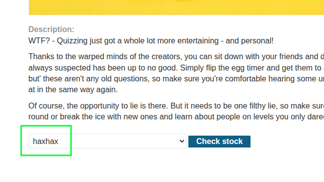
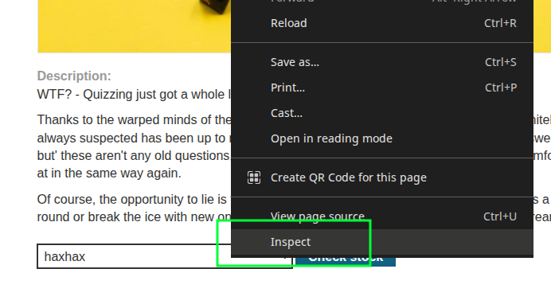
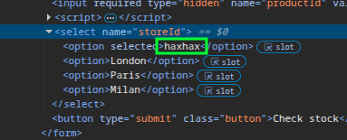
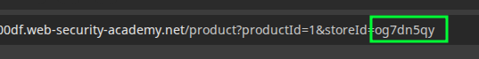
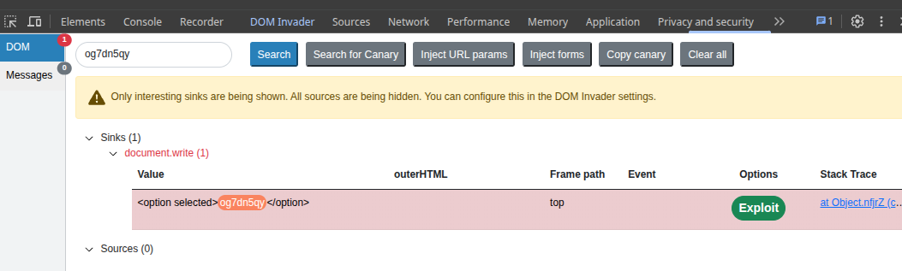

# [DOM XSS: `document.write` Sink Using Source `location.search` Inside a Select Element](https://portswigger.net/web-security/cross-site-scripting/dom-based/lab-document-write-sink-inside-select-element)

## Vulnerable Code

From `product?productId=1`, `document.write` takes input from `windows.location.search`:

```javascript
var stores = ["London","Paris","Milan"];
var store = (new URLSearchParams(window.location.search)).get('storeId');
document.write('<select name="storeId">');
if(store) {
  document.write('<option selected>'+store+'</option>');
}
for(var i=0;i<stores.length;i++) {
  if(stores[i] === store) {
    continue;
  }
  document.write('<option>'+stores[i]+'</option>');
}
document.write('</select>');
```

And `/resources/js/stockCheck.js` :

```javascript
document.getElementById("stockCheckForm").addEventListener("submit", function(e) {
    checkStock(this.getAttribute("method"), this.getAttribute("action"), new FormData(this));
    e.preventDefault();
});

function checkStock(method, path, data) {
    const retry = (tries) => tries == 0
        ? null
        : fetch(
            path,
            {
                method,
                headers: { 'Content-Type': window.contentType },
                body: payload(data)
            }
          )
            .then(res => res.status === 200
                ? res.text().then(t => isNaN(t) ? t : t + " units")
                : "Could not fetch stock levels!"
            )
            .then(res => document.getElementById("stockCheckResult").innerHTML = res)
            .catch(e => retry(tries - 1));

    retry(3);
}
```

## Exploit

`/product?productId=1&storeId=haxhax` renders `haxhax` on the page:



Inspect the element to see how it's rendered in HTML:





Use `"` to inject a closing tag and the payload. Remember that `innerHTML` doesn't accept `script` tags so `img` or `iframe` is needed:

```text
/product?productId=1&storeId=haxhax"></select>
```

## Using DOM Invader

Copy the canary string from DOM Invader and put it into the `storeId` parameter:



The canary should show up under Sinks:



Click "Exploit" to complete the lab.